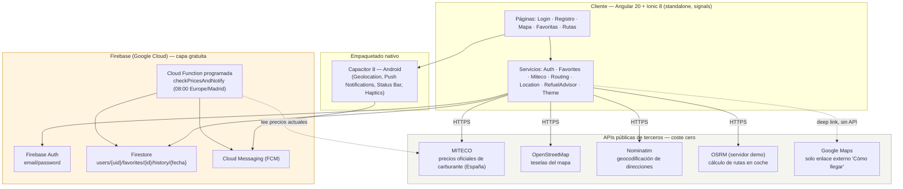

# 📘 Cheeky Oil — Documentación Técnica del Proyecto

> **Rol:** [ARQUITECTO] · **Tipo de documento:** Visión general técnica y funcional del proyecto
> **Fuente:** Análisis directo del código fuente (`src/`, `functions/`, `android/`) y síntesis de los informes de diseño/auditoría ya registrados en [`docs/features/`](docs/features) (01 a 12) y [`requisitos-iniciales.md`](requisitos-iniciales.md)
> **Última actualización:** 2026-07-18

---

## Índice

1. [Resumen ejecutivo](#1-resumen-ejecutivo)
2. [Stack tecnológico detallado](#2-stack-tecnológico-detallado)
3. [Servicios y APIs de terceros utilizados](#3-servicios-y-apis-de-terceros-utilizados)
4. [Requisitos funcionales](#4-requisitos-funcionales)
5. [Requisitos no funcionales](#5-requisitos-no-funcionales)
6. [Limitaciones actuales de la aplicación](#6-limitaciones-actuales-de-la-aplicación)

---

## 1. Resumen ejecutivo

**Cheeky Oil** es una aplicación móvil de **uso personal y familiar** (no comercial, sin publicidad, sin monetización) para **monitorizar, comparar y anticipar el precio de los carburantes en España** (Gasolina 95, Gasolina 98 y Diésel).

La app resuelve un problema concreto y acotado — "¿dónde repostar más barato cerca de mí o de mi ruta, y es buen momento para hacerlo?" — apoyándose exclusivamente en **datos abiertos y servicios gratuitos**: los precios oficiales del Ministerio para la Transición Ecológica (MITECO), cartografía de OpenStreetMap y un backend Firebase dentro de su capa gratuita.

| | |
|---|---|
| 🗺️ **Mapa en vivo** | Gasolineras cercanas a tu ubicación real (GPS), filtrables por combustible y por radio |
| ⭐ **Favoritas** | Hasta 10 gasolineras guardadas por familia, con histórico diario de precio |
| 📈 **Evolución de precio** | Gráficas individuales y agregadas de hasta 30 días, con paleta validada para daltonismo |
| 🚦 **Semáforo de repostaje** | Recomendación automática (verde/ámbar/rojo) según el histórico de tus favoritas |
| 🧭 **Planificador de rutas** | Ruta en coche entre origen y destino, con gasolineras a lo largo del trayecto |
| 🔔 **Notificaciones push** | Aviso diario si el precio de alguna favorita ha cambiado |
| 🌗 **Tema claro/oscuro** | Manual o siguiendo al sistema operativo |
| 🔐 **Acceso familiar controlado** | Registro solo posible con un "Código Familiar" compartido |

**Estado del proyecto:** núcleo funcional implementado, documentado y auditado de forma incremental (feature a feature, con revisión [REVIEWER] obligatoria antes de cada commit, ver [`CLAUDE.md`](CLAUDE.md)). La app está **empaquetada como aplicación nativa Android** (vía Capacitor) además de funcionar como aplicación web.

### Arquitectura de alto nivel

---

## 2. Stack tecnológico detallado

### 2.1. Frontend / aplicación cliente

| Tecnología | Versión | Rol en el proyecto |
|---|---|---|
| **Angular** | `20.3.25` | Framework principal. Componentes **standalone** (sin `NgModule`), `Signal`/`computed`/`effect` como modelo de estado reactivo por defecto en vez de RxJS a mano. |
| **Ionic Framework** | `@ionic/angular ^8.0.0` | Componentes de UI (`ion-*`), navegación adaptada a móvil, gestión de tema claro/oscuro. |
| **TypeScript** | `~5.9.0` | Tipado estricto en todo `src/`. |
| **RxJS** | `~7.8.0` | Streams de datos asíncronos (HTTP, listeners de Firestore, geolocalización). |
| **Angular Router** | incluido en Angular 20 | Enrutado con `loadComponent` (lazy loading por página) y guards funcionales (`authGuard`). |
| **Angular CDK** | `^20.2.14` | Utilidades de UI de bajo nivel (usadas por Ionic internamente). |
| **Leaflet** | `^1.9.4` | Motor de mapa interactivo (cliente puro, sin backend propio). |
| **Chart.js** + **ng2-charts** | `^4.5.1` / `^9.0.0` | Gráficas de evolución de precio (líneas, multi-serie). |
| **@turf/turf** | `^7.3.5` | Geometría/geoespacial en cliente: distancia punto-línea, simplificación de rutas, *bounding boxes* para filtrar gasolineras cercanas a una ruta. |
| **Ionicons** | `^7.0.0` | Iconografía. |
| **Zone.js** | `~0.15.0` | Detección de cambios de Angular (requerido por la versión actual del framework). |

### 2.2. Empaquetado nativo (móvil)

| Tecnología | Versión | Rol |
|---|---|---|
| **Capacitor Core** | `8.4.1` | Puente entre el bundle web de Angular y las APIs nativas del dispositivo. |
| **@capacitor/android** | `^8.4.2` | Plataforma Android (proyecto Gradle generado en `android/`). |
| **@capacitor/geolocation** | `^8.2.0` | GPS nativo (con gestión real del diálogo de permisos del SO — sustituye a `navigator.geolocation` en Android). |
| **@capacitor/push-notifications** | `^8.1.2` | Registro de token de Firebase Cloud Messaging y recepción de notificaciones push nativas. |
| **@capacitor/app**, **@capacitor/status-bar**, **@capacitor/haptics**, **@capacitor/keyboard** | `8.x` | Ciclo de vida de la app, barra de estado, retroalimentación háptica e interacción con el teclado nativo. |
| **@capacitor/assets** | `^3.0.5` (dev) | Generación de iconos/*splash screens* para todas las densidades de pantalla Android. |

> **Nota:** la plataforma nativa empaquetada es **Android** (`android/`).

### 2.3. Backend / BaaS (Firebase — Google Cloud)

| Servicio | Uso |
|---|---|
| **Firebase Authentication** (`@angular/fire ^20.0.1`, `firebase ^11.10.0`) | Cuentas de email/contraseña, sesión persistente. |
| **Cloud Firestore** | Base de datos NoSQL: subcolecciones `users/{uid}/favorites/{id}/history/{fecha}` y documento singleton `config/security` (código familiar). Protegida con `firestore.rules` basadas en propiedad por `uid`. |
| **Cloud Functions (2ª generación)** | `functions/src/index.ts` — función programada `checkPricesAndNotify` (Node `24`, `onSchedule`, cron diario). |
| **Firebase Cloud Messaging (FCM)** | Envío de notificaciones push a los dispositivos Android registrados. |
| **Cloud Scheduler** | Dispara la Cloud Function programada (requiere plan **Blaze**, pago por uso — ver limitaciones). |

### 2.4. Calidad, build y herramientas de desarrollo

| Herramienta | Uso |
|---|---|
| **Angular CLI** | `20.3.28` — build (`ng build`), *dev server* (`ng serve`), *linting* (`ng lint`). |
| **ESLint** (`@angular-eslint`, `@typescript-eslint`) | Reglas de calidad de código para TypeScript y plantillas Angular. |
| **Karma + Jasmine** | *Scaffold* de test unitario de Angular CLI (`ng test`). |
| **Playwright** (`^1.61.1`, devDependency) | No forma parte del bundle de producción — se usa como herramienta de **verificación manual end-to-end** durante las auditorías [REVIEWER] documentadas en `docs/features/` (navegación real, medición de layout, pruebas contra el proyecto Firebase real con cuentas desechables). |
| **@capacitor/cli** | Generación/sincronización de la plataforma Android (`npx cap sync`). |

---

## 3. Servicios y APIs de terceros utilizados

Principio de diseño transversal del proyecto (`CLAUDE.md`, sección 3): **coste cero, sin APIs de pago**. La siguiente tabla es el inventario completo de todo servicio externo que la app consume:

| Servicio | Proveedor | Para qué se usa | Autenticación / coste | Alcance |
|---|---|---|---|---|
| **API de Precios de Carburantes** | Ministerio para la Transición Ecológica y el Reto Demográfico (Gobierno de España) | Precios y ubicación de **todas** las gasolineras de España (~11.500 estaciones por consulta) | Pública, sin API key, sin cuota documentada para uso no masivo | 🇪🇸 Solo España |
| **OpenStreetMap (teselas)** | OpenStreetMap Foundation | Renderizado visual del mapa base (Leaflet) | Pública y gratuita, sujeta a su *Tile Usage Policy* (uso no masivo/automatizado) | Mundial (la app solo la usa sobre España) |
| **Nominatim** | OpenStreetMap Foundation | Geocodificación: convierte una dirección en texto (origen/destino del planificador de rutas) en coordenadas | Pública, sin API key, con normas de uso explícitas (sin autocompletado en cada pulsación, `User-Agent` gestionado por el propio navegador) | Mundial |
| **OSRM** (`router.project-osrm.org`) | Proyecto OSRM (servidor de demostración público) | Cálculo de rutas en coche entre origen y destino | Pública, sin API key. **Servidor de demostración, no pensado para tráfico de producción** (ver limitaciones) | Mundial |
| **Google Maps** | Google | **Únicamente** como enlace externo "Cómo llegar" (`https://www.google.com/maps/dir/?api=1&destination=...`) que abre la app/web de Google Maps del dispositivo | Sin API key, sin SDK embebido, sin facturación — es una URL de intención (*deep link*), no una integración de mapa | N/A |
| **Firebase Authentication** | Google Cloud | Autenticación de usuarios (email/contraseña) | Gratuita en el plan Spark; `apiKey` cliente pública por diseño (no es un secreto, ver [sección 6](#6-limitaciones-actuales-de-la-aplicación)) | — |
| **Cloud Firestore** | Google Cloud | Persistencia de favoritos, histórico de precios y configuración del código familiar | Gratuita hasta el límite del plan Spark (50k lecturas/día) | — |
| **Firebase Cloud Messaging** | Google Cloud | Entrega de notificaciones push a dispositivos Android | Gratuita, sin límite de mensajes para este volumen de uso | — |
| **Cloud Functions + Cloud Scheduler** | Google Cloud | Ejecución diaria programada de `checkPricesAndNotify` | Requiere el plan **Blaze** (pago por uso) — el uso real queda muy por debajo de cualquier umbral de facturación a este volumen | — |

> Ninguno de estos servicios requiere una cuenta de facturación activa de terceros ajena a Firebase, ni una clave de API de pago. La única pieza que exige el plan Blaze de Firebase es la ejecución programada (`Cloud Scheduler`), una restricción de la plataforma y no un coste real esperado.

---

## 4. Requisitos funcionales

Listado exhaustivo de lo que la aplicación hace **hoy**, verificado directamente contra el código real:

| ID | Funcionalidad | Detalle |
|---|---|---|
| **RF-01** | Mapa base y localización | Mapa Leaflet + OpenStreetMap centrado en la ubicación GPS real del usuario (`@capacitor/geolocation`, con permiso nativo gestionado en Android). Si el usuario deniega el permiso, el mapa sigue siendo utilizable centrado en Madrid por defecto. |
| **RF-02** | Capa de estaciones de servicio | Marcadores en el mapa con marca, precio del combustible seleccionado y municipio; popup con detalle al pulsar. Datos de la API pública de MITECO. |
| **RF-03** | Filtros activos de combustible | Selector Gasolina 95 / Gasolina 98 / Diésel: redibuja el mapa mostrando solo estaciones que venden ese combustible, ordenadas por cercanía real (no recorta antes de filtrar). |
| **RF-04** | Gasolineras guardadas (favoritas) | Hasta **10** gasolineras guardadas por cuenta (`users/{uid}/favorites`), marcador destacado en el mapa, y registro automático diario de precio (histórico, hasta 30 días visibles en gráfica). |
| **RF-05** | Radar de cercanía | Filtro por **radio configurable** en el mapa principal (5/10/15/25/50/100 km o sin límite), mostrando las estaciones más cercanas dentro de ese radio para el combustible elegido. El planificador de rutas complementa esto encontrando gasolineras a lo largo de un trayecto completo (ver más abajo). |
| **RF-06** | Notificaciones push | Cloud Function programada (`checkPricesAndNotify`, 08:00 hora de Madrid) que envía una notificación push si el precio de alguna gasolinera favorita cambió respecto al día anterior. |
| **RF-09** | Semáforo de repostaje | `RefuelAdvisorService` calcula un indicador **Verde / Ámbar / Rojo** comparando el precio medio de hoy de tus favoritas contra su media histórica (14 días) y el mínimo del mes, con un mensaje ya redactado. Integrado visualmente en el panel de favoritos (`/favoritos`). |
| **RF-10** | Registro seguro (Código Familiar) | El alta de una cuenta nueva exige, además de email/contraseña, un **Código Familiar** que se valida contra Firestore antes de crear el usuario en Firebase Auth. |

### Otras funcionalidades implementadas (transversales a los RF originales)

- **Sesión protegida por rutas** (`authGuard`): `/home`, `/favoritos` y `/rutas` exigen sesión iniciada; `/login` y `/register` son accesibles sin ella.
- **Planificador de rutas** (`/rutas`): geocodificación de origen/destino (o "usar mi ubicación"), cálculo de ruta en coche (OSRM), y filtrado de gasolineras favoritas-compatibles a lo largo del trayecto (desvío máximo configurable: 1/3/5 km) mediante distancia punto-línea real (Turf.js).
- **Gráficas de evolución de precio**: individual (una gasolinera) o general (todas las favoritas a la vez, hasta 8 series con codificación de color + trazo para accesibilidad), con eje de fechas continuo (huecos visibles si falta un día de dato).
- **Botón "Cómo llegar"**: enlace directo a Google Maps (navegación) desde el popup de cualquier gasolinera.
- **Tema claro / oscuro / sistema**: alternable manualmente desde el mapa, persistido en el dispositivo.
- **Gestión de errores accesible**: mensajes de error visibles y anunciados por lectores de pantalla (`role="alert"`) en geolocalización, carga de datos y operaciones de favoritos — nunca una pantalla en blanco o un error técnico sin traducir.

---

## 5. Requisitos no funcionales

| ID | Categoría | Requisito | Estado / cómo se cumple |
|---|---|---|---|
| **RNF-01** | Tecnología frontend | Angular + Ionic, base de código única para web y móvil | ✅ Un único `src/` compilado tanto para el navegador como para el paquete Android vía Capacitor |
| **RNF-02** | Tecnología backend | Firebase en capa gratuita (Firestore + Auth + Cloud Functions) | ✅ Ver [sección 3](#3-servicios-y-apis-de-terceros-utilizados) |
| **RNF-03** | Interfaz e intuición | UI minimalista, precios legibles, sin sobrecarga visual | ✅ Componentes Ionic estándar, paleta categórica validada, jerarquía tipográfica consistente en toda la app |
| **RNF-04** | Accesibilidad | Fuentes dinámicas, alto contraste, compatibilidad con lectores de pantalla | ✅ `role="alert"` en errores, `aria-label`/`aria-pressed` en controles interactivos, paleta de gráficas validada contra visión con daltonismo, títulos que envuelven en vez de truncarse en móvil |
| **RNF-05** | Modos de visualización | Alternar Claro/Oscuro manualmente + seguir al sistema por defecto | ✅ `ThemeService` (`localStorage`, sin backend), 3 modos (`light`/`dark`/`system`) |
| **RNF-06** | Privacidad y GDPR | Ubicación procesada en el dispositivo, sin ceder datos a terceros, aviso de privacidad | ✅ Ubicación GPS procesada en local (ver [sección 6](#6-limitaciones-actuales-de-la-aplicación)); política de privacidad redactada en [`docs/legal/privacy-policy.md`](docs/legal/privacy-policy.md), con responsable y contacto (Carlos García Arenal, cgarciaarenal@gmail.com) |
| **RNF-07** | Seguridad (Firestore Rules) | Bloquear acceso público; solo el propio usuario autenticado lee/escribe sus datos | ✅ `firestore.rules` basadas en propiedad por `uid` (`request.auth.uid == userId`), historial de precios inmutable tras su creación |
| **RNF-08** | Registro controlado por código familiar | El alta de cuentas exige un código validado contra Firestore | ✅ Implementado (RF-10). Documentado explícitamente como **filtro disuasorio de cliente**, no como límite de acceso a datos — ver [sección 6](#6-limitaciones-actuales-de-la-aplicación) |

### Rendimiento y recursos (no numerados en el encargo original, verificados en el código)

- **Presupuesto de build** (`angular.json`): bundle inicial con aviso a partir de **2 MB** y error a partir de **5 MB**; estilos por componente con aviso a partir de **6 KB** y error a partir de **8 KB** — límites activos en cada `ng build` de producción.
- **Límite de coste Firebase por usuario**: máximo 10 gasolineras favoritas (`MAX_GASOLINERAS_GUARDADAS`), consultas de conteo con `getCountFromServer` (1 lectura, no una por documento), historial acotado a 30 días leídos por consulta.
- **Recorte del mapa a 50 estaciones dibujadas** (`MAX_ESTACIONES_EN_MAPA`) sobre las ~11.500 que devuelve la API — evita saturar la memoria del dispositivo con miles de marcadores DOM.
- **Destrucción explícita de recursos**: mapas Leaflet, listeners de GPS, `ResizeObserver` y suscripciones Firestore se liberan siempre en `ngOnDestroy`/`takeUntilDestroyed` (regla estricta del proyecto, auditada en cada feature).
- **Plataforma nativa**: Android (`@capacitor/android ^8.4.2`).

---

## 6. Limitaciones actuales de la aplicación

> Sección de lectura obligatoria antes de considerar la app lista para un uso familiar real sin supervisión técnica.

### 💶 Coste cero: una restricción de diseño, no solo un ahorro

Toda decisión de arquitectura del proyecto está subordinada a la regla de **coste cero** (`CLAUDE.md`, sección 3): sin APIs de pago, límite duro de 10 gasolineras guardadas por cuenta, minimización explícita de lecturas/escrituras de Firestore en cada feature. Esto tiene contrapartidas reales:

- El **servidor de rutas (OSRM)** usado es la instancia de **demostración pública** del propio proyecto OSRM (`router.project-osrm.org`), cuya documentación advierte explícitamente que **no está pensada para tráfico de producción** — sin garantía de disponibilidad ni límite de peticiones documentado. Si el uso creciera más allá de lo personal/familiar, la migración natural sería una instancia OSRM autoalojada (sigue siendo coste cero de licencia, pero exige infraestructura propia).
- Las **teselas del mapa (OpenStreetMap)** están sujetas a su *Tile Usage Policy*, que prohíbe uso masivo o automatizado — aceptable para el volumen de esta app, pero un límite de escalabilidad a vigilar si el número de usuarios creciera de forma significativa.
- **Cloud Scheduler** (para la notificación push diaria) exige el plan **Blaze** de Firebase (pago por uso) — el uso real cae muy por debajo de cualquier umbral de facturación a este volumen, pero implica que el proyecto Firebase **no puede permanecer en el plan Spark (100% gratuito)** si se quiere mantener esa funcionalidad activa.

### 🔑 "Código secreto" de registro: filtro disuasorio, no un límite de seguridad real

El alta de nuevas cuentas exige un **Código Familiar** (`config/security` en Firestore, campo `familyCode`) que se compara contra el que introduce quien se registra. Esto **no es una barrera de seguridad robusta**, por dos razones estructurales, documentadas explícitamente en `docs/features/05b-registro-seguro.md`:

1. **El código es técnicamente público.** Para poder leerse antes de que exista una sesión (el usuario aún no tiene cuenta en el momento de comprobarlo), la regla de Firestore que lo protege tiene que permitir lectura sin autenticar (`allow get: if true`) — cualquiera que sepa consultar Firestore directamente (con la `apiKey` del proyecto, pública por diseño en cualquier app cliente de Firebase) puede leer el código, no solo quien pase por el formulario de la app.
2. **La comprobación ocurre en el cliente (JavaScript), no en el servidor.** Nada impide técnicamente a alguien con conocimientos técnicos llamar directamente a la API de Firebase Auth (`createUserWithEmailAndPassword`) saltándose por completo la validación del código.

**La protección real de los datos** no depende de este código, sino de las **Firestore Security Rules basadas en `uid`**: aunque alguien creara una cuenta saltándose la comprobación, esa cuenta no podría leer ni escribir los datos de ningún otro usuario. El código familiar es, por diseño, un filtro para evitar altas accidentales o casuales, no un control de acceso a datos. Una protección real (Cloud Function *callable* que valide el código server-side) queda documentada como mejora futura, pendiente de mover el proyecto al plan Blaze.

### 🇪🇸 Alcance geográfico: solo gasolineras de España

Toda la capa de datos de precios (`MitecoService`) consume exclusivamente la API del Ministerio para la Transición Ecológica del Gobierno de España. La app **no tiene ninguna fuente de datos de carburante para ningún otro país** — usarla fuera de España (mapa, favoritos, rutas) no mostrará ninguna gasolinera, con independencia de la ubicación GPS real del dispositivo.

### 🗺️ Google Maps: solo un enlace externo, nunca un mapa embebido

El mapa interactivo de la app (renderizado, marcadores, cálculo de rutas) se implementa íntegramente con **Leaflet + OpenStreetMap**, deliberadamente para evitar la Google Maps Platform (que factura por carga de mapa y por petición a sus APIs más allá de una cuota gratuita mensual). La **única** presencia de Google Maps en el proyecto es el botón **"Cómo llegar"**, que construye una URL de intención (`https://www.google.com/maps/dir/?api=1&destination=...`) para abrir la app/web de Google Maps del propio dispositivo del usuario — no hay ninguna API key de Google Maps, ningún SDK embebido, ningún dato enviado a Google desde dentro de la propia app.

---

*Documento generado como parte del rol [ARQUITECTO] definido en [`CLAUDE.md`](CLAUDE.md), a partir del análisis del código fuente real del proyecto y de los informes de diseño/auditoría ya registrados en [`docs/features/`](docs/features).*

