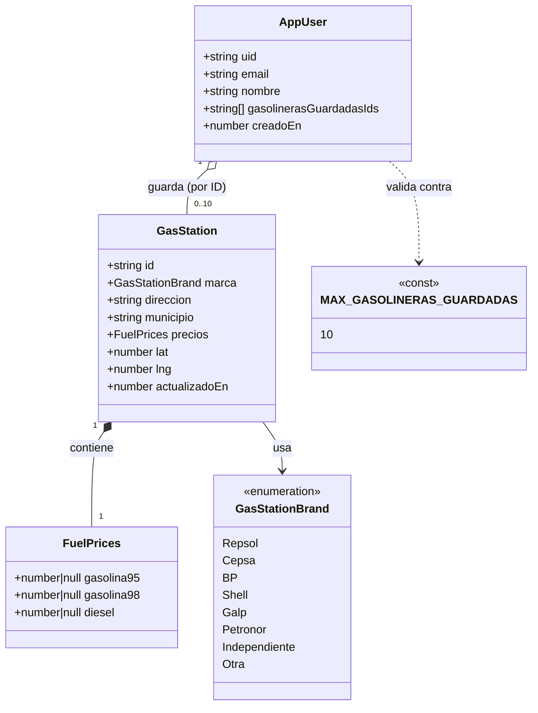
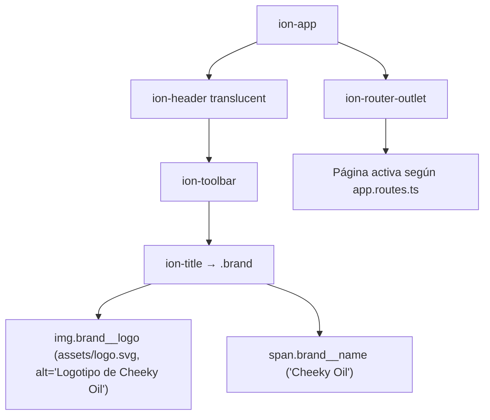

# 01 - Modelos de Datos Base

**Rol:** [ARQUITECTO]
**Estado:** Diseño inicial
**Archivos generados:**
- `src/app/core/models/gas-station.model.ts`
- `src/app/core/models/user.model.ts`

## Diagrama de Clases (Mermaid)

## Justificación de Diseño (enfoque Coste Cero)

1. **`AppUser.gasolinerasGuardadasIds` es un array de `string`, no un array de objetos `GasStation`.**
   Evita la duplicación de datos (precios, coordenadas, etc.) dentro del documento de usuario. Si guardáramos objetos completos, cada actualización de precio de una gasolinera obligaría a reescribir el documento de todos los usuarios que la tengan guardada — multiplicando escrituras innecesariamente. Con solo IDs, los precios se leen bajo demanda desde la colección `gasStations`, y la escritura en `users` ocurre únicamente cuando el usuario añade/quita una estación.

2. **`MAX_GASOLINERAS_GUARDADAS = 10` como constante exportada.**
   Se referencia desde el cliente (validación de UI) y debe replicarse en las Firestore Security Rules (`request.resource.data.gasolinerasGuardadasIds.size() <= 10`). Un límite duro y centralizado evita que el tamaño del documento de usuario crezca sin control y mantiene predecible el coste de lecturas (nunca más de 10 documentos de `gasStations` por consulta de "mis gasolineras").

3. **`GasStation.id` usa el ID oficial de la fuente de datos (API del Ministerio), no un ID autogenerado de Firestore.**
   Permite hacer *upsert* determinista (`setDoc` con merge) en lugar de tener que consultar primero si el documento ya existe. Esto reduce operaciones de lectura durante la sincronización periódica de precios (1 escritura por estación actualizada, 0 lecturas previas).

4. **`FuelPrices` como sub-objeto embebido (no subcolección).**
   Al ser solo 3 campos numéricos y no crecer en el tiempo (no es un historial), embeberlo evita el coste de una lectura adicional de subcolección. Si en el futuro se necesita un histórico de precios para predicción, ese histórico debería vivir en una subcolección o colección aparte (`priceHistory`), nunca en este documento, para no inflar las lecturas del documento principal en cada consulta del mapa.

5. **Sin llamadas a APIs de pago.**
   Los modelos están diseñados para alimentarse de fuentes gratuitas (API pública de precios de carburantes de España). No se han incluido campos que dependan de servicios de geocodificación o mapas de pago; `lat`/`lng` se asumen provistos directamente por la fuente de datos oficial.

---

## Layout Principal de la App

**Rol:** [UI-DEV]
**Archivos modificados:**
- `src/app/app.component.html`
- `src/app/app.component.ts`
- `src/app/app.component.scss`

### Diagrama de Flujo (Mermaid)

### Justificación de Diseño (UI-DEV)

1. **Se eliminó el contenido de ejemplo por defecto de Ionic**, dejando `ion-app` como único contenedor raíz con dos hijos directos: la cabecera fija (`ion-header`) y el `ion-router-outlet` donde se montarán las futuras páginas (mapa, ajustes, favoritos).
2. **`ion-header [translucent]="true"`** sigue el patrón estándar de Ionic para cabeceras que se difuminan con el contenido al hacer scroll, sin coste adicional y compatible con modo claro/oscuro out-of-the-box (usa las variables CSS de Ionic, no colores fijos).
3. **Logo + nombre dentro de `ion-title`** en vez de un `ion-buttons`/slot personalizado: mantiene la semántica de cabecera de página, se centra automáticamente según la plataforma (iOS/MD) y no requiere CSS adicional de posicionamiento.
4. **Accesibilidad (a11y):** el logo lleva `alt="Logotipo de Cheeky Oil"` y `width`/`height` explícitos para evitar *layout shift*; el nombre de la app se mantiene como texto real (no solo dentro del SVG) para que sea legible por lectores de pantalla y indexable.
5. **`ion-router-outlet` fuera de `ion-header`**, como hermano directo dentro de `ion-app`, siguiendo el patrón oficial de Ionic/Angular para que cada página futura controle su propio `ion-content` sin quedar anidada dentro de la cabecera global.

---

## Auditoría de Seguridad y Costes [REVIEWER]

**Rol:** [REVIEWER]
**Archivos auditados:**
- `src/app/core/models/gas-station.model.ts`
- `src/app/core/models/user.model.ts`
- `src/app/app.component.ts`
- `src/app/app.component.html`
- `src/app/app.component.scss`

### Checklist

- [x] **Límite de coste (10 gasolineras/usuario) documentado y centralizado.** `MAX_GASOLINERAS_GUARDADAS = 10` está exportado como constante única en `user.model.ts`, evitando "números mágicos" duplicados entre cliente y backend.
- [ ] ⚠️ **Límite de coste NO enforced todavía a nivel de tipo ni de runtime.** TypeScript no puede restringir la longitud de un `string[]` en tiempo de compilación, y aún no existe ni un servicio (`GasStationService`/`UserService`) ni `firestore.rules` que validen `gasolinerasGuardadasIds.length <= MAX_GASOLINERAS_GUARDADAS` antes de escribir en Firestore. **Bloqueante para la feature de "guardar gasolinera"**, no para este commit de solo-modelos: se registra como TODO obligatorio antes de implementar el servicio de guardado.
- [x] **`gasolinerasGuardadasIds` almacena solo IDs, no objetos completos.** Cumple el diseño de minimizar tamaño de documento y evitar escrituras en cascada al actualizar precios (ver justificación en sección de Arquitecto, punto 1).
- [x] **`GasStation.id` reutiliza el ID oficial de la fuente de datos.** Permite `setDoc` con merge sin lectura previa, alineado con el objetivo de coste cero.
- [x] **Sin llamadas a APIs de pago ni SDKs de mapas/geocodificación de pago** en los archivos revisados.
- [x] **Etiquetas Ionic/Angular correctas y actuales.** Se usan componentes standalone de `@ionic/angular/standalone` (`IonApp`, `IonHeader`, `IonToolbar`, `IonTitle`, `IonRouterOutlet`), importados explícitamente en el array `imports` del `@Component` — no se usa `IonicModule` completo (evita bundle innecesario).
- [x] **Jerarquía de plantilla válida:** `ion-header` y `ion-router-outlet` son hijos directos de `ion-app`, sin anidar el outlet dentro de la cabecera (patrón oficial Ionic/Angular).
- [x] **Accesibilidad (a11y):** el logo (``) incluye `alt` descriptivo y `width`/`height` explícitos (evita *layout shift* / CLS); el nombre "Cheeky Oil" es texto real, no solo parte del SVG.
- [x] **Modo claro/oscuro:** no se han introducido colores fijos (`#hex`) en `app.component.scss`; el `ion-toolbar` usa las variables CSS nativas de Ionic, que ya soportan ambos modos.
- [x] **Sin fugas de memoria:** `AppComponent` no declara suscripciones RxJS, listeners de GPS ni watchers de mapa en este cambio, por lo que no aplica `ngOnDestroy` / `takeUntilDestroyed` todavía. Se deberá revisar de nuevo en cuanto se añadan páginas con Firestore o geolocalización.
- [x] **Ruta del asset verificada.** `src/assets/logo.svg` está cubierto por el glob `"input": "src/assets", "output": "assets"` en `angular.json`, por lo que `src="assets/logo.svg"` resolverá correctamente en build.
- [x] **`npm run lint` ejecutado tras los cambios: sin errores.**

### Veredicto

**Aprobado para commit**, con una condición registrada (no bloqueante para este alcance): antes de implementar el servicio que escriba `gasolinerasGuardadasIds` en Firestore, debe añadirse validación explícita del límite de 10 tanto en el servicio Angular como en `firestore.rules` (actualmente inexistente en el repo).

