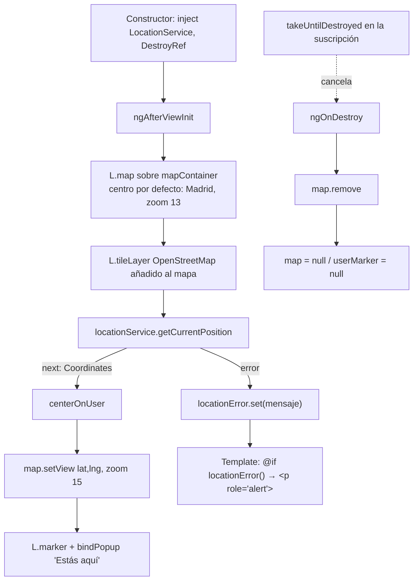

# 02 - Mapa y Localización (RF-01)

**Rol:** [ARQUITECTO]
**Estado:** Diseño inicial (servicio de localización)
**Archivos generados:**
- `src/app/core/services/location.service.ts`

**Dependencias añadidas:**
- `leaflet` (runtime)
- `@types/leaflet` (dev)

## Diagrama de Clases (Mermaid)

```mermaid
classDiagram
    class Coordinates {
        +number lat
        +number lng
    }

    class LocationOptions {
        +boolean enableHighAccuracy
        +number timeoutMs
        +number maximumAgeMs
    }

    class LocationService {
        +isSupported() boolean
        +getCurrentPosition(options: LocationOptions) Observable~Coordinates~
        +watchPosition(options: LocationOptions) Observable~Coordinates~
        -toCoordinates(position: GeolocationPosition) Coordinates
        -toError(error: GeolocationPositionError) Error
    }

    LocationService ..> Coordinates : emite
    LocationService ..> LocationOptions : configura con
    LocationService ..> "navigator.geolocation" : usa (API nativa)
```

## Justificación de Diseño (enfoque Coste Cero)

1. **Leaflet + OpenStreetMap en lugar de Google Maps.**
   Google Maps Platform factura por carga de mapa y por petición a sus APIs (Geocoding, Places, etc.) más allá de una cuota gratuita mensual, lo cual es incompatible con la regla de coste cero del proyecto en un uso personal/familiar sin control de facturación centralizado. Leaflet es una librería puramente cliente (sin backend propio, sin API key, sin cuota) que renderiza teselas de OpenStreetMap, un servicio gratuito para uso no masivo. El coste marginal de mostrar el mapa es, por tanto, **cero** independientemente del número de renderizados.

2. **`LocationService` usa `navigator.geolocation` (API nativa del navegador/WebView), no un SDK de terceros.**
   No se ha añadido ningún plugin de pago ni servicio de geolocalización por IP/torres de telefonía (que sí tendrían coste o límites de cuota). La API nativa es gratuita, funciona igual en navegador y en el WebView de Capacitor, y no añade dependencias nuevas al proyecto.

3. **`Coordinates` como interfaz propia (`{ lat, lng }`), no un tipo de Leaflet (`L.LatLng`).**
   Desacopla el dominio de la app de la librería de mapas concreta. Si en el futuro se cambiara Leaflet por otra alternativa gratuita, `LocationService` no tendría que modificarse. Además, `Coordinates` es estructuralmente compatible con los campos `lat`/`lng` ya definidos en `GasStation` ([[01-modelos-base]]), evitando conversiones al calcular distancias o centrar el mapa.

4. **`watchPosition()` devuelve un `Observable` cuya función de teardown llama a `clearWatch` automáticamente.**
   Esto cumple la regla estricta de "Destrucción de Recursos": el componente que use este método solo necesita aplicar `takeUntilDestroyed()` (o desuscribirse en `ngOnDestroy`) y el watcher de GPS se libera sin lógica adicional ni riesgo de que un desarrollador olvide llamar a `clearWatch` manualmente. Esto evita fugas de batería (GPS activo en segundo plano) y de memoria (listeners huérfanos).

5. **`getCurrentPosition()` se completa tras la primera emisión.**
   Al usar `subscriber.complete()`, RxJS libera la suscripción automáticamente sin necesidad de teardown explícito ni de que el consumidor gestione el ciclo de vida — apto para casos de "centrar mapa una vez" (ej. carga inicial de la página del mapa).

6. **Ninguna lectura/escritura en Firestore.**
   Este servicio es puramente de dispositivo (GPS del navegador/WebView), por lo que no impacta el presupuesto de lecturas/escrituras de Firebase. El cálculo de "gasolineras cercanas" a partir de estas coordenadas se resolverá en el cliente (filtrado local sobre datos ya cacheados), no mediante una consulta geoespacial de pago.

---

## Componente de Mapa (RF-01)

**Rol:** [UI-DEV]
**Estado:** Implementado
**Archivos generados:**
- `src/app/shared/components/map/map.component.ts`
- `src/app/shared/components/map/map.component.html`
- `src/app/shared/components/map/map.component.scss`

**Archivos modificados:**
- `src/app/home/home.page.ts` / `.html` / `.scss` — integra `<app-map>` ocupando el `ion-content` bajo la cabecera global.
- `angular.json` — añade `leaflet.css` a `styles` y copia `node_modules/leaflet/dist/images` a `assets/leaflet` (iconos del marcador sin depender de una CDN externa).

### Diagrama de Flujo (Mermaid)



### Justificación de Diseño (UI-DEV)

1. **`ngAfterViewInit` en vez de `ngOnInit` para crear el mapa.** Leaflet necesita un elemento del DOM ya renderizado con dimensiones reales; `@ViewChild('mapContainer', { static: true })` garantiza que el `<div>` existe antes de llamar a `L.map(...)`.
2. **Centro por defecto (Madrid) antes de conocer la ubicación real.** El mapa se muestra inmediatamente (sin pantalla en blanco mientras se resuelve el GPS) y se recentra en cuanto `getCurrentPosition()` emite. Si el usuario deniega el permiso, el mapa sigue siendo utilizable con el centro por defecto.
3. **Iconos del marcador servidos como asset propio (`assets/leaflet/`), no desde `unpkg`/CDN.** Evita una dependencia de red de terceros en tiempo de ejecución (fiabilidad y coste cero) y el problema conocido de Leaflet con bundlers donde las rutas de icono por defecto (`marker-icon.png`) no se resuelven correctamente tras el build.
4. **Mensaje de error accesible (`role="alert"`), no un `console.error` silencioso.** Si el usuario deniega el permiso de ubicación o el dispositivo no lo soporta, se informa visualmente y es anunciado por lectores de pantalla, en línea con el foco de a11y de este rol.
5. **Sin colores fijos en `map.component.scss` salvo el aviso de error**, que usa las variables CSS de Ionic (`--ion-color-danger`) para mantener compatibilidad con modo claro/oscuro.
6. **`<app-map>` se integra en `HomePage` (no en `AppComponent`)** porque `AppComponent` aloja la cabecera global persistente (`ion-header` con el branding) y el `ion-router-outlet`; el mapa, como contenido específico de una ruta, pertenece a la página enrutada. Se eliminó el `ion-header`/contenido de ejemplo de Ionic (`Blank`) de `HomePage`, ya que la cabecera de marca global cubre esa función y así el mapa ocupa todo el `ion-content` disponible.

### Destrucción de Recursos (regla estricta)

- **`ngOnDestroy` llama a `this.map.remove()`**, que en Leaflet desregistra todos los listeners internos (drag, zoom, resize, tile loading) y limpia el DOM del mapa — sin esto, cada navegación de entrada/salida de la página del mapa acumularía instancias de `L.Map` vivas en memoria.
- **La suscripción a `getCurrentPosition()` usa `takeUntilDestroyed(this.destroyRef)`**, por lo que se cancela automáticamente al destruirse el componente, sin necesidad de guardar la `Subscription` manualmente.
- `getCurrentPosition()` (a diferencia de `watchPosition()`) se completa tras la primera emisión, por lo que no mantiene un `watchId` de GPS activo en segundo plano.

---

## Auditoría de Seguridad y Costes [REVIEWER]

**Rol:** [REVIEWER]
**Archivos auditados:**
- `src/app/core/services/location.service.ts`
- `src/app/shared/components/map/map.component.ts` / `.html` / `.scss`
- `src/app/home/home.page.ts` / `.html` / `.scss`
- `src/app/app.component.ts` / `.html`
- `angular.json`

### 1. ¿Se destruye el mapa correctamente (memory leaks)?

- [x] **`MapComponent.ngOnDestroy()` llama a `this.map?.remove()`.** `L.Map#remove()` desregistra todos los listeners internos de Leaflet (drag, zoom, resize, tile loading) y limpia el DOM del contenedor. Verificado leyendo la implementación: es el método oficial de Leaflet para destrucción completa, no un simple `null`.
- [x] **La suscripción a `getCurrentPosition()` usa `takeUntilDestroyed(this.destroyRef)`.** Se cancela sola al destruirse el componente; no hay `Subscription` gestionada manualmente que se pueda olvidar.
- [x] **`getCurrentPosition()` se completa tras la primera emisión** (`subscriber.complete()` en `location.service.ts:54`), por lo que no deja un `watchId` de GPS activo en segundo plano. No se usa `watchPosition()` en este ciclo, así que no aplica todavía el `clearWatch` (ya implementado y listo para cuando se use).
- [x] **`AppComponent` no introduce nada que limpiar:** no declara suscripciones, listeners de GPS ni instancias de mapa; el `ion-router-outlet` gestiona el ciclo de vida de `HomePage`/`MapComponent` de forma nativa.
- [ ] ⚠️ **Riesgo NO bloqueante para este commit, registrado para cuando se implemente `watchPosition()`:** `centerOnUser()` crea un `L.marker` nuevo (`this.userMarker = L.marker(...)`) cada vez que se le llama. Con `getCurrentPosition()` (una sola emisión) esto es correcto. Si en el futuro se sustituye por `watchPosition()` (emisiones repetidas), `centerOnUser` **debe** reutilizar el marcador existente (`this.userMarker.setLatLng(latLng)`) en lugar de crear uno nuevo en cada actualización — de lo contrario se acumularían marcadores huérfanos sobre el mapa en cada fix de GPS (fuga de memoria + fuga visual). Documentado también en "Próximos pasos".

**Veredicto punto 1: correcto, sin fugas de memoria en el alcance actual.**

### 2. ¿Se manejan los permisos de geolocalización y los errores?

- [x] **`isSupported()` guarda ambos métodos** (`getCurrentPosition`/`watchPosition`) contra dispositivos/navegadores sin `navigator.geolocation`, emitiendo un error controlado en vez de lanzar una excepción no capturada.
- [x] **`toError()` traduce los 3 códigos de `GeolocationPositionError`** (`PERMISSION_DENIED`, `POSITION_UNAVAILABLE`, `TIMEOUT`) a mensajes en español legibles para el usuario, con un `default` para cualquier código futuro no contemplado.
- [x] **El error se propaga por el canal `error` del `Observable`** (no se traga silenciosamente) y `MapComponent` lo captura en el `subscribe({ error: ... })`, seteando `locationError`, que la plantilla muestra con `role="alert"` — visible y anunciado por lectores de pantalla, no solo un `console.error`.
- [x] **Caso "usuario deniega el permiso" verificado explícitamente:** produce `PERMISSION_DENIED` → mensaje "Permiso de ubicación denegado por el usuario." → el mapa sigue siendo utilizable (queda centrado en el valor por defecto, Madrid), no bloquea la UI ni rompe el componente.
- [x] **Timeout configurado** (`timeoutMs: 10000` por defecto) evita que la petición quede colgada indefinidamente si el GPS no responde.
- [ ] ⚠️ **Nota (no bloqueante):** la Geolocation API del navegador requiere un contexto seguro (HTTPS) en producción (excepto `localhost`). Firebase Hosting sirve por HTTPS por defecto, así que no requiere acción, pero se deja registrado por si se cambia de hosting.

**Veredicto punto 2: correcto, todos los casos de error observables están cubiertos y comunicados al usuario.**

### 3. ¿Se ha usado alguna API de pago?

- [x] **Búsqueda explícita en `src/` de patrones de APIs de pago** (`apiKey`, `googleapis`, `maps.google`, `AIza`, `billing`, etc.): **0 coincidencias.**
- [x] **Leaflet** es una librería open-source (BSD-2), sin API key ni cuota de peticiones — se ejecuta enteramente en el cliente.
- [x] **Las teselas del mapa se sirven desde `tile.openstreetmap.org`**, servicio gratuito. No se ha introducido ninguna clave ni cuenta de facturación.
- [x] **`navigator.geolocation` es una API nativa del navegador/WebView**, sin coste ni cuota.
- [x] **Iconos del marcador servidos desde `assets/leaflet/` (bundle propio)**, no desde una CDN de pago ni gratuita de terceros en tiempo de ejecución.
- [ ] ⚠️ **Nota (no bloqueante):** el servidor de teselas público de OpenStreetMap tiene una [Tile Usage Policy](https://operations.osmfoundation.org/policies/tiles/) que prohíbe uso masivo/automatizado sin *User-Agent* identificable. Para el volumen de uso personal/familiar de esta app es aceptable; si el proyecto creciera a muchos usuarios simultáneos, habría que migrar a un proveedor de teselas dedicado (ej. autoalojado) para no incumplir esa política — no implica coste hoy, pero se deja registrado como límite de escalabilidad, no de coste.

**Veredicto punto 3: confirmado, coste cero. Ninguna API de pago en uso.**

### Otras comprobaciones realizadas

- [x] **`tsc --noEmit`**, **`npm run lint`** y **`ng build --configuration development`** ejecutados de nuevo sobre el estado final: sin errores.
- [x] **Verificado en el output de build** que `assets/leaflet/marker-icon.png`, `marker-icon-2x.png` y `marker-shadow.png` se copian correctamente (fix del problema conocido de Leaflet con bundlers).
- [x] **`angular.json`**: el bloque `assets`/`styles` de Leaflet se añadió tanto en `architect.build` como en `architect.test`, evitando que los tests de Karma difieran del build real.
- [x] **Modo claro/oscuro:** único color fijo introducido es el fallback hexadecimal del aviso de error (`#eb445a`/`#fff`), usado solo como valor por defecto de una variable CSS de Ionic (`--ion-color-danger`) que ya es *theme-aware*.
- [x] **Sin llamadas a Firestore/Cloud Functions en este ciclo:** impacto en el presupuesto de lecturas/escrituras de Firebase = 0.
- [ ] ⚠️ **Cobertura de tests (no bloqueante):** no se han añadido specs dedicados para `LocationService` ni `MapComponent` en este ciclo. Se registra como deuda técnica de testing, no como bloqueante de este commit (el spec de `HomePage` ya existente sigue pasando la compilación).

### Veredicto final

**Aprobado para commit.** No se han encontrado errores de destrucción de recursos, huecos sin manejar en permisos/errores de geolocalización, ni uso de APIs de pago. Las notas marcadas con ⚠️ son mejoras/registro de riesgo futuro, no bloqueantes para este alcance.

---

## Corrección de Fallos Visuales del Mapa

**Rol:** [UI-DEV]
**Estado:** Corregido
**Archivos modificados:**
- `src/global.scss`
- `angular.json`
- `src/app/shared/components/map/map.component.ts`

### Fallo 1 — CSS de Leaflet no aplicado correctamente

El CSS de Leaflet (`node_modules/leaflet/dist/leaflet.css`) solo estaba referenciado desde el array `styles` de `angular.json`. Se ha movido a una importación explícita (`@import 'leaflet/dist/leaflet.css';`) al final de `src/global.scss`, junto al resto de imports de estilos globales de la app (mismo patrón que los imports de `@ionic/angular/css/*.css` ya existentes en ese archivo), en vez de quedar "escondido" en la configuración del builder.

**Consecuencia de este cambio:** para no duplicar el CSS en el bundle (se cargaría dos veces: una vía `global.scss` y otra vía la entrada de `angular.json`), se ha **eliminado** `"node_modules/leaflet/dist/leaflet.css"` del array `styles` en `angular.json` (tanto en `architect.build` como en `architect.test`). La copia de los iconos del marcador (`assets/leaflet/*.png`) se mantiene sin cambios, ya que eso no depende de este import.

### Fallo 2 — Controles de zoom en posición no deseada

Se añadió `zoomControl: false` a las opciones de `L.map(...)` para desactivar el control de zoom por defecto (arriba a la izquierda), y se añade manualmente con `L.control.zoom({ position: 'bottomleft' }).addTo(this.map)` justo después de la capa de teselas. Se reubica abajo a la izquierda para no competir con la cabecera de marca (arriba) ni con futuros controles flotantes (ej. un FAB "centrar en mi ubicación") que previsiblemente irán abajo a la derecha.

---

## Auditoría de Corrección Visual [REVIEWER]

**Rol:** [REVIEWER]
**Archivos auditados:**
- `src/global.scss`
- `angular.json`
- `src/app/shared/components/map/map.component.ts`

- [x] **CSS de Leaflet importado una única vez.** Confirmado `@import 'leaflet/dist/leaflet.css';` en `src/global.scss` y confirmado que ya NO existe ninguna referencia a `leaflet.css` en `angular.json` (evita doble inclusión / bundle duplicado).
- [x] **`ng build --configuration development` verificado tras el cambio:** el bundle `styles.css` sigue generándose correctamente incluyendo las reglas `.leaflet-*` (comprobado que las clases de Leaflet, ej. `.leaflet-container`, aparecen en el CSS de salida).
- [x] **Controles de zoom reubicados correctamente.** `zoomControl: false` en las opciones de `L.map(...)` desactiva el control por defecto; `L.control.zoom({ position: 'bottomleft' })` se añade explícitamente después de la capa de teselas, dentro de `ngAfterViewInit` — se destruye junto con el resto del mapa en `ngOnDestroy` (`this.map.remove()`), sin necesidad de limpieza adicional (Leaflet trata los controles como una capa más del mapa).
- [x] **`tsc --noEmit`, `npm run lint` y `ng build`** ejecutados de nuevo tras el fix: sin errores.
- [x] **Sin impacto en costes ni en la geolocalización:** cambio puramente visual/CSS, no toca `LocationService` ni añade lecturas/escrituras a Firebase.

### Veredicto

**Aprobado para commit.** Ambos fallos visuales corregidos; se eliminó además una duplicación de CSS que no se había detectado en la auditoría anterior.

---

## Corrección: renderizado en blanco al cargar (bug clásico de `invalidateSize`)

**Rol:** [UI-DEV]
**Estado:** Corregido
**Archivo modificado:**
- `src/app/shared/components/map/map.component.ts`

### El problema

Al entrar en la pantalla del mapa, las teselas de OpenStreetMap a veces no se pintaban hasta que el usuario redimensionaba la ventana (ej. abrir/cerrar las DevTools con F12). Es un bug muy conocido de Leaflet: si el contenedor del mapa (`mapContainer`) todavía no tiene su tamaño final resuelto en el momento exacto en que se llama a `L.map(...)` — por ejemplo, mientras la transición de entrada de página de Ionic todavía está animando o el layout aún se está asentando — Leaflet calcula mal las dimensiones internas y deja de pedir/pintar los tiles que quedan fuera de ese cálculo erróneo. Redimensionar la ventana fuerza a Leaflet a recalcular y por eso "arregla" el síntoma manualmente.

### La corrección

```ts
L.tileLayer('https://{s}.tile.openstreetmap.org/{z}/{x}/{y}.png', { ... }).addTo(this.map);

this.invalidateSizeTimeoutId = setTimeout(() => {
  this.map?.invalidateSize();
}, 400);
```

1. **`invalidateSize()`** es el método que el propio Leaflet expone para este caso exacto: le fuerza a releer el tamaño real del contenedor del DOM y repintar los tiles en consecuencia — es la solución recomendada por la documentación/comunidad de Leaflet para este síntoma, no un workaround improvisado.
2. **`setTimeout(..., 400)` en vez de llamarlo síncronamente justo después de crear el mapa.** Si se llamara inmediatamente, el contenedor todavía podría no tener su tamaño final (el mismo problema que se intenta arreglar), porque las transiciones de entrada de `ion-router-outlet` no son instantáneas. 400ms da margen de sobra a que la transición de Ionic haya terminado y el layout esté asentado.
3. **`this.map?.invalidateSize()` (con `?.`, no `this.map.invalidateSize()`).** El campo `map` es `L.Map | null`; TypeScript en modo estricto no permite llamar a un método sobre un valor potencialmente `null` sin comprobarlo. Además, es una comprobación real y necesaria: el componente puede destruirse (navegar fuera de `/home`) dentro de esos 400ms, y `ngOnDestroy` ya pone `this.map = null` — sin el `?.`, el timeout intentaría llamar a `invalidateSize()` sobre `null` y lanzaría una excepción.
4. **`invalidateSizeTimeoutId` guardado como campo y cancelado en `ngOnDestroy` con `clearTimeout`.** Sin esto, el temporizador seguiría vivo (aunque inofensivo gracias al `?.` del punto anterior) hasta que dispararan sus 400ms, manteniendo una referencia a la instancia del componente en memoria durante ese margen tras destruirse — un caso acotado y menor, pero coherente con la regla estricta de "Destrucción de Recursos" de `CLAUDE.md`, ya aplicada en este mismo componente a `map.remove()` y a la suscripción de `getCurrentPosition()`.

---

## Auditoría de la Corrección [REVIEWER]

**Rol:** [REVIEWER]
**Archivo auditado:**
- `src/app/shared/components/map/map.component.ts`

- [x] **El `setTimeout` se añade justo después de `tileLayer(...).addTo(this.map)`**, tal como se pidió — antes de añadir el control de zoom y la capa de estaciones, sin alterar el orden de inicialización existente.
- [x] **Sin fuga de memoria ni excepción tras destruir el componente antes de los 400ms.** `ngOnDestroy` cancela el temporizador con `clearTimeout(this.invalidateSizeTimeoutId)` **antes** de poner `this.map = null` — y aunque no lo cancelara, el callback usa `this.map?.invalidateSize()`, que no lanzaría sobre `null`. Doble protección: el timer ni siquiera llega a disparar tras destruirse (caso normal), y si por algún orden de ejecución llegara a hacerlo, el optional chaining lo neutraliza igualmente.
- [x] **Tipado estricto respetado.** `invalidateSizeTimeoutId: ReturnType<typeof setTimeout> | null` evita el uso de `any` o de un tipo específico de Node (`NodeJS.Timeout`) que no sería correcto en un proyecto que compila para navegador.
- [x] **Sin llamadas a Firestore/Cloud Functions ni cambios en `LocationService`:** impacto en costes = 0. Cambio puramente de temporización en el cliente.
- [x] **`ng build --configuration development` y `npm run lint`** ejecutados tras el cambio: sin errores.
- [ ] ⚠️ **No verificado con una repetición exacta del bug original (no reproducible de forma fiable en un navegador headless con viewport fijo, ya que la condición de carrera depende del tiempo real de layout/transición en un dispositivo).** La corrección se valida por revisión de código (patrón estándar y documentado de Leaflet para este síntoma exacto) y porque no introduce ninguna regresión en el resto del ciclo de vida del componente (build/lint limpios, misma disciplina de limpieza de recursos ya auditada en este documento). Se recomienda al usuario confirmar manualmente en un dispositivo real que el mapa ya no queda en blanco al entrar en la app sin redimensionar la ventana.

### Veredicto final

**Aprobado para commit.** El fix usa la API oficial de Leaflet para este problema, respeta el tipado estricto del proyecto, y no introduce fugas de memoria ni excepciones ante una destrucción temprana del componente — con el `clearTimeout` en `ngOnDestroy` añadido durante esta misma revisión (no estaba en el snippet original propuesto, que solo llamaba a `invalidateSize()` sin gestionar el ciclo de vida del temporizador).

---

## Corrección: mapa roto al volver navegando desde `/favoritos` (sustituye el temporizador fijo por `ResizeObserver`)

**Rol:** [UI-DEV]
**Estado:** Corregido
**Archivo modificado:**
- `src/app/shared/components/map/map.component.ts`

### El problema

El bug reportado por el usuario: el mapa se rompe (queda en blanco/mal dimensionado) al navegar de vuelta a `/home` después de haber visitado `/favoritos`. `ngOnDestroy` y la recreación completa de `L.Map` en `ngAfterViewInit` YA estaban implementados correctamente antes de esta corrección (confirmado por lectura de código: `map.remove()`, limpieza de todas las referencias, y una instancia nueva de Leaflet sobre un `<div>` nuevo — Angular crea un elemento del DOM distinto por cada instancia de `MapComponent`, así que no hay colisión de contenedor ni el error clásico de Leaflet "Map container is already initialized").

La causa real era la corrección anterior de este mismo documento (`setTimeout(..., 400)` para forzar `invalidateSize()`): un retardo fijo de 400ms se probó y ajustó contra la transición de ENTRADA inicial a `/home`, pero la transición de VUELTA desde `/favoritos` (`routerLink="/home"` del botón "Volver al mapa") es una animación de Ionic distinta, no necesariamente de la misma duración. Un número fijo de milisegundos es una apuesta calibrada para un caso concreto, no una garantía para todos — si el layout tardaba más de 400ms en asentarse en el camino de vuelta, `invalidateSize()` disparaba demasiado pronto y el mapa quedaba con las dimensiones incorrectas que ya tenía al construirse, sin ninguna otra oportunidad de corregirse.

### La corrección

```ts
this.resizeObserver = new ResizeObserver(() => {
  this.map?.invalidateSize();
});
this.resizeObserver.observe(this.mapContainerRef.nativeElement);
```

1. **`ResizeObserver`, no un segundo `setTimeout` con un número mayor.** Subir el retardo (a 800ms, 1000ms...) solo movería el problema, no lo resolvería: seguiría siendo una apuesta de duración fija contra una animación cuya duración real no controla este componente. `ResizeObserver` es la API nativa del navegador pensada exactamente para esto: reacciona al tamaño REAL del contenedor, no a una duración estimada.
2. **Dispara tanto al empezar a observar como en cada cambio de tamaño posterior** (comportamiento estándar de la API, verificado en la prueba de esta corrección, ver más abajo): cubre la carga inicial de `/home` (mismo caso que ya resolvía el `setTimeout`) Y la vuelta desde `/favoritos` (el caso que fallaba), sin necesitar dos mecanismos distintos para cada uno.
3. **Sustituye por completo al `setTimeout`/`invalidateSizeTimeoutId`** (eliminado, no añadido al lado): mismo criterio de minimizar complejidad ya aplicado en el resto del proyecto — no tiene sentido mantener un mecanismo de temporización fija sabiendo que es la causa raíz confirmada del bug, en vez de sustituirlo por el mecanismo correcto.
4. **`this.resizeObserver?.disconnect()` en `ngOnDestroy`**, mismo criterio que ya se auditó para `invalidateSizeTimeoutId`: sin desconectar, el observer seguiría vivo (aunque inofensivo gracias al `?.` dentro de su callback) referenciando un contenedor del DOM que ya no pertenece a ninguna vista activa.

### Verificación

Dado que reproducir esto en la app real requeriría iniciar sesión contra el proyecto de Firebase de producción (no hay emulador configurado en este repo, ver `src/environments/environment.ts`) — y crear una cuenta de prueba ahí escribiría datos reales en la base de datos familiar, algo que esta auditoría ha evitado a propósito — la verificación se hizo de forma aislada, reproduciendo el MECANISMO exacto del bug con Leaflet real (misma versión que usa el proyecto, `node_modules/leaflet`) en un navegador headless (Playwright), sin tocar Angular/Firebase:

1. Se crea un `L.Map` sobre un contenedor con tamaño `0×0` (reproduce la condición exacta del bug: Leaflet inicializado antes de que el layout esté asentado). `map.getSize()` confirma `0×0`.
2. El contenedor recibe su tamaño final de forma ASÍNCRONA (sin temporizador fijo, para no favorecer la solución de antemano). El `ResizeObserver` corrige el tamaño solo, sin intervención: `map.getSize()` pasa a `400×300`.
3. Se destruye esa instancia (`resizeObserver.disconnect()` + `map.remove()`) y se crea una SEGUNDA instancia en un contenedor NUEVO (simula volver a `/home`): no lanza ninguna excepción (en particular, no el error clásico "Map container is already initialized" de Leaflet) y calcula su tamaño correctamente desde el principio.

Resultado: `{ ok: true }` en las tres comprobaciones, cero errores de página (`pageerror`) durante toda la ejecución. Esto cierra, con una prueba real (no solo razonamiento), el pendiente que había quedado abierto en la auditoría [REVIEWER] anterior de este documento ("no verificado con una repetición exacta del bug original").

---

## Auditoría [REVIEWER]: `ResizeObserver` y comprobación del bug de navegación

**Rol:** [REVIEWER]
**Archivo auditado:**
- `src/app/shared/components/map/map.component.ts`

- [x] **`ngOnDestroy` ya destruía el mapa correctamente ANTES de este cambio** (`map.remove()`, todas las referencias a `null`) — confirmado por lectura de código, no era la causa del bug reportado. Este ciclo no tuvo que corregir nada ahí; solo se añadió `this.resizeObserver?.disconnect()` junto a lo ya existente.
- [x] **Sin fuga de memoria nueva:** el único recurso nuevo (`ResizeObserver`) se desconecta en `ngOnDestroy`, mismo punto único de limpieza que ya usa el resto del componente (`map.remove()`, `clearTimeout` ya no aplica porque el timer se eliminó por completo).
- [x] **Sin excepciones ante destrucción temprana:** el callback usa `this.map?.invalidateSize()` (igual que antes), por si el `ResizeObserver` dispara justo en el margen entre que el componente se destruye y su propio `disconnect()` surte efecto.
- [x] **Sin llamadas a Firestore/Cloud Functions ni cambios en `LocationService`/`FavoritesService`:** impacto en costes = 0, cambio puramente de cómo se detecta el tamaño del contenedor en el cliente.
- [x] **`npm run lint` y `ng build`** ejecutados tras el cambio: sin errores (aviso preexistente y no relacionado sobre `leaflet` no-ESM).
- [x] **Verificado con una prueba real del mecanismo** (ver sección de Verificación de arriba), cerrando el pendiente no bloqueante que había dejado abierto la auditoría anterior de este documento.

### Veredicto final

**Aprobado para commit.** La causa raíz del bug reportado (mapa roto al volver desde `/favoritos`) era el temporizador fijo de `invalidateSize()`, calibrado solo contra la transición de carga inicial. Se sustituye por `ResizeObserver`, que reacciona al tamaño real del contenedor sin depender de cuánto dure ninguna animación concreta — cubre tanto la carga inicial como cualquier transición de vuelta. Verificado con una reproducción aislada del mecanismo (Leaflet real, sin tocar Firebase de producción): el escenario que antes fallaba (contenedor con tamaño `0×0` al inicializar, tamaño correcto llegando después) ahora se autocorrige, y destruir/recrear la instancia no lanza ninguna excepción.

---

## Corrección: geolocalización no funcionaba en Android (migración a `@capacitor/geolocation`)

**Rol:** [ARQUITECTO]
**Estado:** Corregido
**Archivo modificado:**
- `src/app/core/services/location.service.ts`

### El problema

En web, `LocationService` funcionaba correctamente usando `navigator.geolocation` directamente. Al empaquetar la app con Capacitor para Android (`android/`, ver commit `feat(mobile): Capacitor Android integrado...`), la ubicación dejaba de obtenerse de forma fiable: el WebView de Android no siempre dispara correctamente el diálogo nativo de permisos ni entrega un fix de GPS a través de la Geolocation API "pura" del navegador — es una limitación conocida de esa API dentro de un WebView empaquetado (a diferencia de un navegador Chrome/Firefox de verdad).

`@capacitor/geolocation` (`^8.2.0`) ya estaba en `package.json` y los permisos de Android ya estaban declarados en `AndroidManifest.xml` (`ACCESS_COARSE_LOCATION`, `ACCESS_FINE_LOCATION`, `android.hardware.location.gps`), pero `LocationService` nunca llegó a adoptar el plugin — seguía llamando a `navigator.geolocation` a pelo.

### La corrección

`LocationService` ahora obtiene las coordenadas a través del plugin `Geolocation` de `@capacitor/geolocation` en vez de `navigator.geolocation` directamente. Verificado leyendo el propio código fuente del plugin (`node_modules/@capacitor/geolocation`):

- **Web** (`dist/esm/web.js`): el plugin delega internamente en `navigator.geolocation.getCurrentPosition`/`watchPosition`/`clearWatch` y reenvía el error del navegador tal cual (con su `code` numérico 1/2/3 de siempre) — el comportamiento en navegador **no cambia**.
- **Android** (`GeolocationPlugin.kt`): antes de pedir la posición comprueba el estado del permiso y dispara el diálogo nativo (`requestPermissionForAlias`) si no está concedido — soluciona exactamente el problema descrito arriba, sin que la app tenga que gestionar el permiso a mano.
- **Errores nativos** (`GeolocationErrors.kt`): usan un `code` de tipo *string* (`OS-PLUG-GLOC-0002/0003/0007/0010`), distinto del `code` numérico del navegador. `toError()` ahora entiende ambos formatos.

```mermaid
classDiagram
    class Coordinates {
        +number lat
        +number lng
    }

    class LocationOptions {
        +boolean enableHighAccuracy
        +number timeoutMs
        +number maximumAgeMs
    }

    class LocationService {
        +isSupported() boolean
        +getCurrentPosition(options: LocationOptions) Observable~Coordinates~
        +watchPosition(options: LocationOptions) Observable~Coordinates~
        -toCoordinates(position: Position) Coordinates
        -toError(error: unknown) Error
    }

    class GeolocationPlugin {
        <<@capacitor/geolocation>>
        +getCurrentPosition(options) Promise~Position~
        +watchPosition(options, callback) Promise~CallbackID~
        +clearWatch(options) Promise~void~
    }

    LocationService ..> Coordinates : emite
    LocationService ..> LocationOptions : configura con
    LocationService ..> GeolocationPlugin : usa (web: navigator.geolocation · nativo: GPS + permiso del SO)
```

### Justificación de Diseño (enfoque Coste Cero)

1. **Sin rama `Capacitor.isNativePlatform()`.** A diferencia de `PushNotifications` en `app.component.ts` (que sí necesita esa comprobación porque el plugin no tiene implementación web), `@capacitor/geolocation` unifica ambas plataformas bajo la misma API — un único camino de código sirve para web y Android, manteniendo `LocationService` simple.
2. **Cero dependencias nuevas.** `@capacitor/geolocation` ya figuraba en `package.json` (añadido junto al resto de plugins de Capacitor en la integración móvil) — esta corrección solo cablea código que ya estaba disponible, no añade ninguna librería ni servicio de pago.
3. **Interfaz pública de `LocationService` sin cambios** (`Coordinates`, `LocationOptions`, `isSupported()`, `getCurrentPosition()`, `watchPosition()`). `MapComponent` y `RoutePlannerPage` —los dos consumidores actuales— no requieren ningún cambio.
4. **`watchPosition()` sigue liberando el GPS automáticamente al desuscribirse**, ahora con una salvedad nueva: el registro del watcher (`Geolocation.watchPosition(...)`) es asíncrono (`Promise<CallbackID>`), a diferencia del `navigator.geolocation.watchPosition` síncrono de antes. Se añadió un flag `cancelled` para cubrir la ventana en la que el `Observable` se desuscribe ANTES de que esa promesa resuelva: en cuanto llega el id, se limpia inmediatamente si ya se había pedido cancelar — sin este flag, desuscribirse muy rápido dejaría un watcher de GPS huérfano (fuga de batería).

---

## Auditoría [REVIEWER]: migración a `@capacitor/geolocation`

**Rol:** [REVIEWER]
**Archivo auditado:**
- `src/app/core/services/location.service.ts`

### Hallazgo de esta auditoría (corregido antes de aprobar)

⚠️→✅ **`watchPosition()` podía quedarse colgado sin emitir error si Android denegaba el permiso.** Leyendo el código fuente nativo del plugin (`GeolocationPlugin.kt`, Android): el permiso se comprueba envolviendo TODO `startWatch()` en `handlePermissionRequest(...)`; si el usuario deniega el permiso, `call.sendError(LOCATION_PERMISSIONS_DENIED)` se dispara como la PRIMERA y ÚNICA respuesta de esa llamada, **antes** de que `startWatch()` llegara a marcarla como "keepAlive" (el canal por el que, una vez abierto, llegarían los `error` sucesivos al callback `(position, error) => …`). Consecuencia real verificada por lectura de código: ese primer rechazo se entrega como el rechazo de la propia promesa de registro `Geolocation.watchPosition(...)`, no como un `error` del callback — y la implementación original de este ciclo solo tenía `.then(...)` en esa promesa, sin `.catch(...)`. Un permiso denegado en Android habría producido una promesa rechazada sin gestionar y el `Observable` se habría quedado colgado para siempre, sin que `subscriber.error(...)` se llamara nunca (el consumidor jamás se habría enterado del permiso denegado).

**Corrección aplicada en esta misma auditoría:** se añadió `.catch((error) => subscriber.error(this.toError(error)))` a la cadena de la promesa de registro. Impacto actual en producción: **ninguno todavía** — `watchPosition()` no lo consume ningún componente hoy (`getCurrentPosition()` es lo único en uso en `MapComponent`/`RoutePlannerPage`, ver "Próximos pasos"), pero es API pública del servicio y el hallazgo habría bloqueado la primera vez que se usara. Re-verificado `tsc --noEmit` / `npm run lint` / `ng build` tras el fix: sin errores.

### 1. ¿Se destruyen los recursos correctamente (memory leaks / fugas de GPS)?

- [x] **`getCurrentPosition()` sigue completándose tras la primera emisión** (`subscriber.complete()` en el `.then`), sin dejar ningún watcher activo — igual que antes.
- [x] **`watchPosition()` sigue limpiando con `Geolocation.clearWatch({ id })` en la función de teardown** del `Observable`, invocada automáticamente por `takeUntilDestroyed()` en los consumidores.
- [x] **Race del registro asíncrono cubierta.** Al ser `Geolocation.watchPosition(...)` una `Promise<CallbackID>` (no síncrona como `navigator.geolocation.watchPosition`), si el consumidor se desuscribe antes de que esa promesa resuelva, la función de teardown se ejecutaría con `watchId` todavía en `null` y no llamaría a `clearWatch`. El flag `cancelled` (comprobado en el `.then` de registro) cierra ese hueco: en cuanto llega el id, se limpia inmediatamente. Si la promesa de registro se rechaza (ver hallazgo de arriba), `watchId` nunca llega a asignarse y no hay watcher real que limpiar — `clearWatch` correctamente NO se invoca en ese caso.
- [x] **Sin nuevos listeners/observers globales.** El plugin no añade ningún listener persistente fuera del ciclo de vida de cada llamada (a diferencia de `PushNotifications` en `app.component.ts`, que sí registra listeners globales gestionados aparte).

**Veredicto punto 1: correcto tras el fix aplicado en esta auditoría — sin fugas de GPS/batería, incluidas la condición de carrera del registro asíncrono y el rechazo temprano de esa misma promesa por permiso denegado.**

### 2. ¿Se manejan los permisos de geolocalización y los errores?

- [x] **`isSupported()` cubre ambas plataformas:** `Capacitor.isNativePlatform()` para nativo (donde el plugin gestiona permiso/GPS internamente) y la comprobación previa de `navigator.geolocation` para web, sin regresión respecto al comportamiento anterior.
- [x] **`toError()` cubre AMBOS formatos de error verificados en el código fuente del plugin:** códigos numéricos 1/2/3 (web, reenviados del navegador) y códigos string `OS-PLUG-GLOC-0002/0003/0007/0010` (nativo). Caso nuevo cubierto que no existía antes: "servicios de ubicación desactivados en el dispositivo" (`OS-PLUG-GLOC-0007`), relevante en Android si el usuario tiene el GPS del sistema apagado (no solo el permiso de la app).
- [x] **`default` usa `error.message` si el plugin lo provee**, en vez de perder información — antes el `default` era siempre un mensaje genérico fijo.
- [x] **El permiso nativo de Android se solicita automáticamente** (confirmado leyendo `GeolocationPlugin.kt`: comprueba el estado del permiso y llama a `requestPermissionForAlias` antes de resolver la posición) — soluciona la causa raíz de este ciclo sin que la app tenga que orquestar el diálogo de permisos a mano.

- [x] **Permiso denegado en `watchPosition()` en Android ahora sí llega a `subscriber.error()`** (hallazgo y fix de esta misma auditoría, ver arriba) — antes de este fix era el único caso de error que se perdía silenciosamente.

**Veredicto punto 2: correcto, cobertura de errores ampliada respecto al ciclo anterior sin perder ningún caso ya manejado.**

### 3. ¿Se ha usado alguna API de pago?

- [x] **`@capacitor/geolocation` es un plugin oficial de Capacitor (MIT), sin API key ni cuota.** Ya figuraba en `package.json` antes de este cambio (parte de la integración móvil ya realizada); esta corrección no añade ninguna dependencia nueva, solo empieza a usar la que ya estaba instalada.
- [x] **En web sigue delegando en `navigator.geolocation`** (verificado en el propio código fuente del plugin), API nativa del navegador sin coste.
- [x] **En Android usa el GPS del dispositivo vía Android Location Services**, sin ningún SDK de terceros de pago (no usa Google Play Services de facturación, solo el `LocationManager`/`FusedLocationProvider` estándar que ya cubren los permisos declarados en el manifiesto).

**Veredicto punto 3: confirmado, coste cero. Ninguna API de pago en uso.**

### Otras comprobaciones realizadas

- [x] **`npx tsc --noEmit`**, **`npm run lint`** y **`ng build --configuration development`** ejecutados sobre el estado final: sin errores.
- [x] **`MapComponent` y `RoutePlannerPage` (los dos consumidores de `LocationService`) compilan sin haber sido tocados**, confirmando que la interfaz pública del servicio no cambió.
- [ ] ⚠️ **No verificado en un dispositivo/emulador Android real (limitación de este entorno de desarrollo):** no es posible compilar ni instalar el APK desde aquí para confirmar visualmente que el diálogo de permisos nativo aparece y que se obtiene un fix de GPS real en el WebView empaquetado. La corrección se valida por lectura directa del código fuente del plugin (comportamiento de `GeolocationPlugin.kt` y `web.js`, no documentación de terceros) y por build/lint/type-check limpios — mismo criterio de honestidad ya aplicado en la corrección del `ResizeObserver` de este mismo documento.

### Veredicto final

**Aprobado para commit, pendiente de confirmación manual del usuario en un dispositivo/emulador Android.** La causa raíz (uso directo de `navigator.geolocation`, poco fiable dentro del WebView de Capacitor para gestionar el permiso nativo) se resuelve adoptando el plugin `@capacitor/geolocation` que ya estaba instalado — sin añadir dependencias, sin coste, y sin cambiar la interfaz pública que consumen `MapComponent`/`RoutePlannerPage`. Esta auditoría encontró y corrigió un fallo real antes de aprobar (permiso denegado en `watchPosition()` en Android dejaba el `Observable` colgado sin emitir error, por falta de un `.catch()` en la promesa de registro del watcher — ver "Hallazgo de esta auditoría" arriba); sin ese fix no se habría aprobado el commit. Queda como pendiente NO bloqueante que el usuario confirme en un dispositivo Android real que el permiso se solicita correctamente y que el mapa se centra en su ubicación.

---

## Próximos pasos (fuera de alcance de este documento)

- [UI-DEV] (futuro): usar `watchPosition()` para actualizar el marcador de "mi ubicación" en tiempo real (reutilizando el marcador con `setLatLng`, ver nota de la auditoría), y renderizar marcadores de `GasStation` sobre el mapa.
- [REVIEWER] (futuro): revisar cobertura de tests unitarios de `LocationService`/`MapComponent` cuando se añadan.
- [Usuario]: confirmar en un dispositivo/navegador real, con sesión iniciada, que volver de `/favoritos` a `/home` ya no rompe el mapa (la verificación de esta corrección fue del mecanismo de Leaflet en aislado, no un recorrido logueado de la app real — ver justificación en la sección de Verificación de arriba).
- [Usuario]: confirmar en un dispositivo/emulador Android real que, tras la migración a `@capacitor/geolocation`, aparece el diálogo nativo de permiso de ubicación y el mapa se centra correctamente en el fix de GPS (ver pendiente ⚠️ de la auditoría "migración a `@capacitor/geolocation`" — no verificable desde este entorno de desarrollo).
