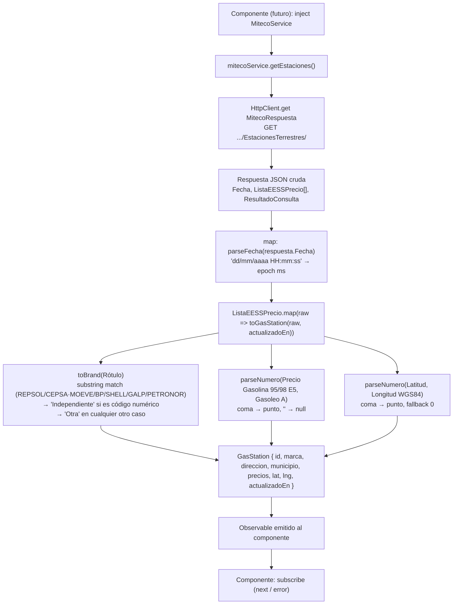
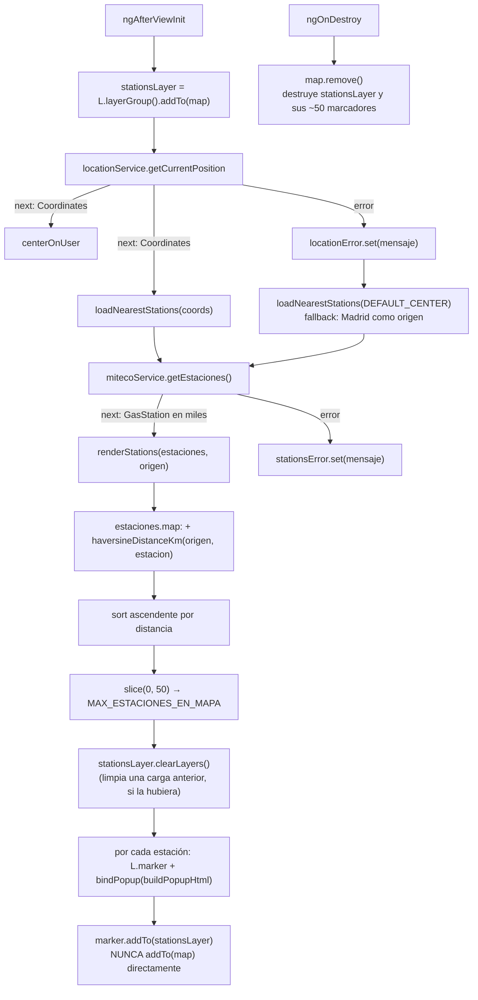

# 03 - Capa de Gasolineras (RF-02)

**Rol:** [ARQUITECTO]
**Estado:** Implementado (servicio de obtención + mapeo)
**Archivos generados:**
- `src/app/core/services/miteco.service.ts`

**Archivos modificados:**
- `src/main.ts` — añade `provideHttpClient()` a los providers de `bootstrapApplication`.

> **Nota de convención:** este proyecto no usa `app.config.ts` (patrón `ApplicationConfig` separado); los providers de la app se registran directamente en `bootstrapApplication(...)` dentro de `src/main.ts` (ver `RouteReuseStrategy`, `provideIonicAngular()`, `provideRouter()` ya existentes). `provideHttpClient()` se ha añadido en ese mismo punto para mantener un único lugar de configuración de providers.

## Diagrama de Flujo (Mermaid): de la API del Ministerio al componente



## Justificación de Diseño (enfoque Coste Cero)

1. **API pública del Ministerio, sin API key ni cuota.**
   El endpoint `sedeaplicaciones.minetur.gob.es/.../EstacionesTerrestres/` es un servicio abierto del Gobierno de España, de acceso anónimo y sin límite de peticiones documentado para uso no masivo. No se ha introducido ninguna clave, cuenta de facturación ni SDK de pago — cumple la regla de coste cero igual que Leaflet/OpenStreetMap en [[02-mapa-base]].

2. **Verificación contra la respuesta real de la API (no solo documentación).**
   Se hizo una petición de verificación al endpoint real para confirmar los nombres exactos de los campos (`IDEESS`, `Rótulo`, `Dirección`, `Municipio`, `Latitud`, `Longitud (WGS84)`, `Precio Gasolina 95 E5`, `Precio Gasolina 98 E5`, `Precio Gasoleo A`) antes de escribir el mapeo, ya que son claves en español con tildes y espacios y un error tipográfico rompería el mapeo en silencio (TypeScript no valida claves de un `HttpClient.get<T>()` en tiempo de ejecución).

3. **`GasStation.id = raw.IDEESS` (ID oficial de la fuente), no un ID autogenerado.**
   Reutiliza la decisión ya tomada en [[01-modelos-base]] (punto 3): permite hacer *upsert* en Firestore sin lectura previa cuando se implemente la sincronización periódica.

4. **`actualizadoEn` se deriva del campo `Fecha` de la respuesta (timestamp del Ministerio), no de `Date.now()` en el cliente.**
   Las ~11.500 estaciones de una misma respuesta comparten la misma `Fecha` de publicación oficial. Usar `Date.now()` habría asignado un `actualizadoEn` distinto a cada estación (momento de ejecución del `.map()`) y, peor, un valor distinto en cada re-fetch aunque los datos del Ministerio no hubieran cambiado — contaminando cualquier lógica futura de "¿ha cambiado el precio desde la última vez?". Se parsea explícitamente el formato `dd/mm/aaaa HH:mm:ss` (hora local de España) a epoch ms.

5. **`toBrand()` usa coincidencia por subcadena sobre palabras clave, no igualdad exacta.**
   Una inspección de la respuesta real mostró **3.603 valores distintos** de `Rótulo` (ej. `"REPSOL. LOS ANGELES DE LA MANCHA, S.L."`, `"BP ROMICA"`, `"REPSOL Nº ESTACIÓN 97179"`), porque el campo mezcla marca comercial, razón social y nombre del gestor. Comparar con `===` habría dejado la inmensa mayoría de estaciones de las grandes marcas sin clasificar. `MOEVE` se incluye explícitamente en `Cepsa` por ser el rebranding comercial del grupo. Rótulos que son solo un código interno (ej. `"Nº 10.935"`, `"13344"`) se clasifican como `'Independiente'`; el resto de rótulos no reconocidos cae en `'Otra'`.

6. **`parseNumero()` centraliza la conversión coma→punto y vacío→`null` para precios y coordenadas.**
   La API usa formato decimal español (`"1,499"`) y cadena vacía `""` cuando una estación no vende un carburante concreto, lo cual encaja con `FuelPrices` (`number | null`) definido en [[01-modelos-base]]. Se reutiliza el mismo parser para `lat`/`lng`, con `?? 0` como fallback defensivo (la API no debería omitir coordenadas, pero `GasStation.lat`/`lng` no son nullable en el modelo).

7. **Este servicio no escribe en Firestore.**
   Su única responsabilidad es obtener y mapear datos de una fuente externa a `Observable<GasStation[]>`. La sincronización periódica hacia la colección `gasStations` (con el límite de "1 escritura por estación actualizada" descrito en [[01-modelos-base]]) es una capa posterior (previsiblemente una Cloud Function programada), fuera del alcance de este ciclo — así se evita acoplar la capa de red con la capa de persistencia.

---

## Auditoría de Seguridad y Costes [REVIEWER]

**Rol:** [REVIEWER]
**Archivos auditados:**
- `src/app/core/services/miteco.service.ts`
- `src/main.ts`

### 1. ¿Se usan APIs de pago?

- [x] **Endpoint verificado en tiempo real**: `sedeaplicaciones.minetur.gob.es` es un dominio oficial del Ministerio para la Transición Ecológica, servicio público de datos abiertos, sin `apiKey` en la URL ni en el código.
- [x] **Búsqueda de patrones de facturación** (`apiKey`, `billing`, `AIza`, etc.) en `miteco.service.ts`: 0 coincidencias.
- [x] **`provideHttpClient()` sin interceptores de terceros añadidos**: configuración mínima, sin SDKs adicionales.

**Veredicto punto 1: confirmado, coste cero.**

### 2. ¿Fugas de memoria / recursos sin liberar?

- [x] **`getEstaciones()` devuelve un `Observable` que se completa tras la única emisión del `HttpClient.get()`** (comportamiento estándar de Angular: la petición HTTP se completa sola tras la respuesta). No requiere `takeUntilDestroyed()` obligatorio, aunque se recomienda igualmente en el componente consumidor por higiene si se encadenan más operadores en el futuro.
- [x] **Sin estado interno mutable en el servicio** (no hay `Subscription`, `setInterval`, ni listeners): `MitecoService` es *stateless* entre llamadas, por lo que no hay nada que limpiar en un hipotético `ngOnDestroy` del propio servicio.
- [ ] ⚠️ **Nota (no bloqueante) para cuando se consuma este servicio desde un componente:** si se llama a `getEstaciones()` en un intervalo periódico (ej. refrescar precios cada X minutos), el componente **debe** cancelar ese intervalo/suscripción en `ngOnDestroy` (`takeUntilDestroyed()`), igual que se hizo con `LocationService` en [[02-mapa-base]]. Registrado como recordatorio, no aplica todavía porque este ciclo no incluye el componente consumidor.

**Veredicto punto 2: correcto, sin fugas en el alcance actual.**

### 3. ¿El mapeo de datos es correcto y robusto?

- [x] **Nombres de campo verificados contra una respuesta real de la API** (no solo contra documentación de terceros), evitando el riesgo de que un campo mal escrito produzca `undefined` silenciosos.
- [x] **Parseo de decimales españoles (`"1,499"` → `1.499`)** cubierto con `.replace(',', '.')` + `parseFloat`, con guarda `Number.isNaN` → `null`.
- [x] **Precios ausentes (`""`) mapean a `null`**, coherente con `FuelPrices` (`number | null`) de [[01-modelos-base]] — no se usa `0` como valor centinela, que se confundiría con un precio real de 0€.
- [x] **`toBrand()` documenta explícitamente que es una heurística de coincidencia parcial** (no un mapeo exacto), justificado por los 3.603 valores distintos observados en la API real. Riesgo residual aceptado y documentado: una estación cuyo rótulo contenga incidentalmente una de las palabras clave (poco probable en español para "BP", "GALP", etc.) podría clasificarse en la marca equivocada; impacto limitado a un campo puramente informativo (`marca`), sin efecto en costes ni seguridad.
- [x] **`lat`/`lng` con fallback `?? 0`** en vez de propagar `null`/`undefined`, ya que `GasStation.lat`/`lng` son `number` no-nullable en el modelo — evita un `NaN` llegando al mapa (Leaflet fallaría al centrar/renderizar un marcador con `NaN`).

**Veredicto punto 3: correcto. Riesgo de clasificación de marca documentado y aceptado como no bloqueante.**

### 4. Otras comprobaciones realizadas

- [x] **`tsc --noEmit`** ejecutado tras el cambio: sin errores.
- [x] **`npm run lint`** ejecutado tras el cambio: sin errores.
- [x] **Sin llamadas a Firestore/Cloud Functions en este ciclo**: impacto en el presupuesto de lecturas/escrituras de Firebase = 0 (este servicio solo consume una API HTTP externa gratuita).
- [x] **`MitecoService` es `providedIn: 'root'`**, siguiendo el mismo patrón que `LocationService` — no requiere registro manual en ningún módulo/standalone bootstrap.

### Veredicto final

**Aprobado para commit.** Sin uso de APIs de pago, sin fugas de recursos en el alcance actual, y el mapeo de datos está verificado contra la respuesta real de la API. Queda registrado como no bloqueante: (a) aplicar `takeUntilDestroyed()` en el futuro componente/servicio que llame a `getEstaciones()` de forma repetida, y (b) el carácter heurístico (no exacto) de la clasificación de marca.

---

## Próximos pasos (fuera de alcance de este documento)

- [ARQUITECTO] (futuro): servicio/Cloud Function que sincronice `MitecoService.getEstaciones()` con la colección `gasStations` de Firestore, respetando "1 escritura por estación actualizada, 0 lecturas previas" (upsert por `id`).
- [REVIEWER] (futuro): revisar cobertura de tests unitarios de `MitecoService` (parseo de casos límite: `Rótulo` vacío, precios vacíos, `Fecha` malformada) cuando se añadan.

---

## Marcadores de Gasolineras en el Mapa

**Rol:** [UI-DEV]
**Estado:** Implementado
**Archivos modificados:**
- `src/app/shared/components/map/map.component.ts`
- `src/app/shared/components/map/map.component.html`
- `src/app/shared/components/map/map.component.scss`

### Diagrama de Flujo (Mermaid)



### Justificación de Diseño (UI-DEV)

1. **Límite duro de 50 marcadores (`MAX_ESTACIONES_EN_MAPA`), nunca las ~11.500 estaciones de la respuesta completa.**
   La API de MITECO devuelve todas las estaciones terrestres de España en una única respuesta. Cada `L.Marker` de Leaflet crea un nodo DOM (`` del icono) y, con `bindPopup`, un segundo nodo DOM oculto para el popup — instanciar ~11.500 marcadores saturaría la memoria de un móvil y congelaría el hilo principal al construirlos y al hacer *reflow* del mapa. El caso de uso ("gasolineras cerca de mí") tampoco necesita más de un puñado visibles a la vez.

2. **Selección de las 50 más cercanas mediante distancia real (haversine), no un subconjunto arbitrario (ej. las 50 primeras del array).**
   Un simple `slice(0, 50)` sobre el array tal cual lo devuelve la API habría mostrado estaciones en el orden en que el Ministerio las publica (aparentemente alfabético/geográfico por provincia), no las relevantes para el usuario. Se calcula la distancia de cada estación al origen (ubicación del usuario, o `DEFAULT_CENTER` si la geolocalización falla) con la fórmula del haversine (círculo máximo sobre una esfera, sin necesitar ninguna API de geocodificación de pago) y se ordena por cercanía antes de recortar a 50 — así el límite de memoria no compromete la utilidad de la función.

3. **Todos los marcadores de gasolinera se añaden a un `L.LayerGroup` (`stationsLayer`), no directamente al mapa.**
   Permite `stationsLayer.clearLayers()` como única llamada para retirar todos los marcadores anteriores de golpe, en vez de guardar un array de `L.Marker` y hacer `marker.remove()` uno a uno. Esto deja el componente ya preparado para una futura recarga (ej. "actualizar cercanas" al mover el mapa) sin acumular marcadores huérfanos — cada recarga sustituye, no suma.

4. **Fallback a `DEFAULT_CENTER` (Madrid) como origen si falla la geolocalización.**
   Sin este fallback, un usuario que deniega el permiso de ubicación (ya contemplado en [[02-mapa-base]]) se quedaría sin ninguna gasolinera visible. Con el fallback, ve las 50 más cercanas al centro por defecto — el mapa sigue siendo útil aunque no esté centrado en su posición real.

5. **`buildPopupHtml` solo interpola `marca` (tipo cerrado `GasStationBrand`) y precios numéricos — nunca `direccion` ni `municipio` (texto libre de la API externa).**
   `L.Marker.bindPopup(string)` interpreta el string como HTML real insertado en el DOM. `marca` es siempre uno de los 8 valores fijos de `GasStationBrand`, generado por `MitecoService.toBrand()` (nunca el `Rótulo` original de la API), y los precios son `number | null` formateados con `toFixed(3)` — ninguno de los dos puede contener HTML/JS arbitrario. Se evita así construir el popup a partir de campos de texto libre no confiables sin sanear, que sí requerirían escapado explícito.
   `municipio` sí se usa, pero únicamente como atributo `alt` del marcador (propiedad DOM de texto plano, no HTML), no dentro del popup.

6. **`centerOnUser` y `loadNearestStations` se disparan desde la misma suscripción a `getCurrentPosition()`** (ya protegida con `takeUntilDestroyed(this.destroyRef)` desde [[02-mapa-base]]), y `loadNearestStations` → `getEstaciones()` reutiliza el mismo `destroyRef` en su propio `pipe`. Ninguna suscripción nueva queda sin cancelar al destruirse el componente.

### Destrucción de Recursos (regla estricta)

- **`ngOnDestroy` sigue llamando solo a `this.map.remove()`.** Leaflet trata `stationsLayer` (y sus hasta 50 marcadores) igual que el control de zoom o el marcador de usuario: son capas añadidas al mapa, y `L.Map#remove()` las desregistra y limpia su DOM automáticamente. No se necesita iterar y hacer `marker.remove()` uno a uno.
- **La suscripción de `mitecoService.getEstaciones()` usa `takeUntilDestroyed(this.destroyRef)`**, igual que la de `getCurrentPosition()`: si el usuario navega fuera del mapa antes de que la API responda (respuesta de ~11.500 registros, puede tardar), la suscripción se cancela y `renderStations`/`stationsError.set` nunca se ejecutan sobre un componente ya destruido.
- **`stationsLayer.clearLayers()` antes de volver a dibujar** evita que una futura recarga acumule marcadores del ciclo anterior sin destruir (fuga de memoria progresiva si `loadNearestStations` se llamara repetidamente).

---

## Auditoría de Marcadores en el Mapa [REVIEWER]

**Rol:** [REVIEWER]
**Archivos auditados:**
- `src/app/shared/components/map/map.component.ts`
- `src/app/shared/components/map/map.component.html`
- `src/app/shared/components/map/map.component.scss`

### 1. ¿Se controla el consumo de memoria frente a los miles de resultados de la API?

- [x] **`renderStations` recorta explícitamente a `MAX_ESTACIONES_EN_MAPA = 50` antes de crear ningún `L.Marker`.** Verificado que el `.slice(0, MAX_ESTACIONES_EN_MAPA)` ocurre antes del bucle `for` que llama a `L.marker(...)` — nunca se instancian marcadores para las estaciones descartadas.
- [x] **El cálculo de distancia (`.map` + `.sort`) opera sobre el array de `GasStation` (objetos planos), no sobre instancias de Leaflet**, por lo que el coste de memoria de "tener las 11.500 estaciones en un array" es transitorio (se descarta al salir de `renderStations`) y mucho menor que instanciar 11.500 `L.Marker`.
- [x] **Selección por cercanía real (haversine), no un `slice` arbitrario sobre el array sin ordenar.** Confirma que el límite de memoria no convierte la función en inútil (mostraría gasolineras al azar/lejanas).

**Veredicto punto 1: correcto. El límite de 50 marcadores se aplica de forma efectiva y antes de tocar el DOM/Leaflet.**

### 2. ¿Fugas de memoria (marcadores/suscripciones no liberados)?

- [x] **`stationsLayer.clearLayers()` se ejecuta al inicio de cada `renderStations`**, por lo que aunque `loadNearestStations` se invocara más de una vez (no ocurre en el flujo actual, que solo llama una vez tras `getCurrentPosition`), no se acumularían marcadores del ciclo anterior.
- [x] **`ngOnDestroy` no necesitó cambios**: `map.remove()` ya cubre `stationsLayer` por ser una capa añadida al mapa (mismo razonamiento ya auditado para el control de zoom en [[02-mapa-base]]). Verificado que no queda ningún `L.Marker` ni `L.LayerGroup` fuera del árbol del mapa que pudiera quedar huérfano.
- [x] **La suscripción a `getEstaciones()` usa `takeUntilDestroyed(this.destroyRef)`.** Sin `Subscription` gestionada manualmente que se pueda olvidar cancelar.
- [x] **Ninguna suscripción usa `watchPosition`/polling**: `getCurrentPosition()` y `getEstaciones()` se completan tras su única emisión, no dejan temporizadores ni watchers activos en segundo plano.

**Veredicto punto 2: correcto, sin fugas de memoria en el alcance actual.**

### 3. ¿El contenido del popup es seguro (sin inyección de HTML/JS no confiable)?

- [x] **`buildPopupHtml` solo interpola `estacion.marca` (unión cerrada `GasStationBrand`) y precios `number | null` formateados.** Ninguno de los dos puede contener marcado HTML: `marca` proviene exclusivamente de `MitecoService.toBrand()` (nunca del `Rótulo` original en texto libre) y los precios pasan por `toFixed(3)`.
- [x] **`direccion` y `municipio` (texto libre de la API externa) NO se usan en `buildPopupHtml`.** Solo `municipio` aparece en el atributo `alt` del marcador, que Leaflet asigna como propiedad DOM de texto plano (no `innerHTML`), sin riesgo de inyección.
- [ ] ⚠️ **Nota (no bloqueante) para cuando se añadan `direccion`/`municipio` al popup en el futuro:** si se incorporan, deberán pasar por un escapado HTML explícito (o usar creación de nodos DOM en vez de un string interpolado) antes de entrar en `bindPopup`, ya que en ese momento sí serían texto libre de una fuente externa.

**Veredicto punto 3: correcto para el contenido actual del popup.**

### 4. ¿Costes de Firebase?

- [x] **Ningún cambio en este ciclo toca Firestore/Cloud Functions.** `MitecoService.getEstaciones()` sigue siendo una llamada HTTP a una API externa gratuita; impacto en el presupuesto de lecturas/escrituras = 0.

### 5. Otras comprobaciones realizadas

- [x] **`tsc --noEmit`**, **`npm run lint`** y **`ng build --configuration development`** ejecutados tras el cambio: sin errores.
- [x] **Modo claro/oscuro:** `.map__error` sigue usando `--ion-color-danger`/`--ion-color-danger-contrast`; el nuevo contenedor `.map__errors` no introduce colores fijos, solo layout (`flex`, `gap`).
- [x] **Accesibilidad:** ambos mensajes de error (ubicación y gasolineras) mantienen `role="alert"` de forma independiente, por lo que un lector de pantalla anuncia cada fallo por separado si ambos ocurren a la vez.

### Veredicto final

**Aprobado para commit.** El límite de 50 marcadores se aplica correctamente y antes de crear ningún objeto de Leaflet, no se han detectado fugas de memoria ni de suscripciones, y el popup no introduce contenido HTML no confiable. Nota no bloqueante registrada sobre el escapado que sería necesario si en el futuro se añade texto libre de la API al popup.

---

## Próximos pasos (fuera de alcance de este documento)

- [UI-DEV] (futuro): botón/FAB "buscar en esta zona" que vuelva a llamar a `loadNearestStations` con el centro actual del mapa tras un `moveend`, reutilizando `stationsLayer.clearLayers()` ya implementado.
- [UI-DEV] (futuro): reemplazar el icono de marcador genérico de Leaflet por un icono distinto para "mi ubicación" vs. gasolinera, y quizá por marca.
- [REVIEWER] (futuro): revisar cobertura de tests unitarios de `MapComponent` (cálculo de haversine, límite de 50, fallback a `DEFAULT_CENTER`) cuando se añadan specs.

---

## Auditoría Final del Ciclo [REVIEWER]

**Rol:** [REVIEWER]
**Archivos auditados (ciclo completo RF-02):**
- `src/app/core/services/miteco.service.ts`
- `src/app/shared/components/map/map.component.ts`
- `src/app/shared/components/map/map.component.html`
- `src/app/shared/components/map/map.component.scss`
- `src/main.ts`

Auditoría releída línea a línea de forma independiente (no se ha dado por buena la documentación de los ciclos [ARQUITECTO]/[UI-DEV] anteriores sin verificarla), y contrastada de nuevo contra una respuesta real y actual de la API de MITECO (11.517 estaciones en el momento de esta auditoría).

### 1. ¿El mapeo de datos maneja bien posibles valores nulos de la API?

- [x] **Precios ausentes (`""`) → `null`, no `0` ni `NaN`.** `parseNumero()` (`miteco.service.ts:99-105`) comprueba `!valor || valor.trim() === ''` antes de intentar `parseFloat`, y además envuelve el resultado en un guard `Number.isNaN(numero) ? null : numero`. Correcto: un precio ausente nunca se confunde con un precio real de 0€, que sí sería un valor legítimo si alguna vez apareciera.
- [x] **`Rótulo` vacío o `undefined` → `'Otra'`, no una excepción.** `toBrand()` normaliza con `(rotulo ?? '').trim().toUpperCase()` y devuelve `'Otra'` si el resultado es una cadena vacía, antes de intentar ningún `.includes()`.
- [x] **`Fecha` con formato inesperado → `Date.now()` como fallback**, en vez de `NaN`/`Invalid Date` propagándose a `actualizadoEn`. Verificado que el `match` se comprueba con `if (!match)` antes de desestructurar los grupos de captura.
- [x] **Verificación empírica contra la API real**: se ha vuelto a descargar la respuesta completa (11.517 estaciones) y comprobado programáticamente que, a día de hoy, **0 registros** tienen `Latitud`, `Longitud (WGS84)`, `IDEESS`, `Municipio`, `Dirección` o `Rótulo` vacíos, y que los 11.517 `IDEESS` son únicos (sin colisiones que romperían el futuro *upsert* por `id` en Firestore). El código, no obstante, está escrito asumiendo que estos campos **sí** podrían venir vacíos en el futuro (no se apoya en esta garantía empírica para omitir los guards), lo cual es el comportamiento defensivo correcto.
- [ ] ⚠️ **Hallazgo (no bloqueante): `lat`/`lng` inválidos o ausentes colapsan silenciosamente a `(0, 0)`.** `toGasStation()` (`miteco.service.ts:92-93`) hace `this.parseNumero(raw.Latitud) ?? 0` / `... ?? 0`. A diferencia de los precios (donde `null` es un valor de dominio válido y correcto), aquí el `?? 0` sustituye una coordenada ausente/corrupta por una coordenada **real y precisa** (0°N, 0°E — el golfo de Guinea), en vez de descartar la estación o propagar la ausencia. Hoy no se manifiesta (0 registros afectados, verificado arriba) porque `GasStation.lat`/`lng` son `number` no-nullable en el modelo ([[01-modelos-base]]) y no admiten `null` sin cambiar el modelo de dominio — pero si la API cambiara y empezara a omitir coordenadas en algún registro, ese registro entraría en el cálculo de distancia de `MapComponent` como una estación real a ~5.500 km de España, casi con certeza fuera de las 50 más cercanas (ver punto 2) y por tanto invisible en la práctica hoy. Se registra como deuda técnica, no como bloqueante: la mitigación correcta a futuro es filtrar (`Array.prototype.filter`) las estaciones con coordenadas inválidas en `getEstaciones()` antes de emitirlas, en vez de sustituirlas por `0`.
- [x] **`GasStation.municipio`/`direccion` no tienen guard de nulidad explícito** (se asignan directamente desde `raw.Municipio`/`raw['Dirección']`), pero esto es aceptable: son campos de solo lectura mostrados como texto (o, en el caso de `municipio`, usados como atributo `alt`), sin aritmética ni parseo que pueda lanzar una excepción si vinieran vacíos — en el peor caso mostrarían una cadena vacía, no un error.

**Veredicto punto 1: correcto en conjunto.** El manejo de nulos es sólido y deliberado en precios, marca y fecha. Se registra una única mejora no bloqueante sobre el fallback de coordenadas (`?? 0`), sin incidencia en los datos reales actuales.

### 2. ¿Se ha implementado el límite de marcadores en el mapa (prevención de fugas de memoria)?

- [x] **Límite duro confirmado: `MAX_ESTACIONES_EN_MAPA = 50`** (`map.component.ts:31`), y `renderStations()` aplica `.slice(0, MAX_ESTACIONES_EN_MAPA)` (`map.component.ts:179`) **antes** de entrar en el bucle `for` que crea instancias `L.marker(...)` (`map.component.ts:185-189`). Ningún `L.Marker` se instancia para las estaciones descartadas — el recorte ocurre sobre el array plano de `GasStation`, no sobre objetos de Leaflet ya creados y luego destruidos.
- [x] **El recorte se hace por cercanía real, no por orden de llegada.** `estaciones.map(...distanciaKm...).sort(...).slice(...)` (`map.component.ts:176-179`) garantiza que las 50 mostradas son las 50 geográficamente más próximas al origen (ubicación del usuario o `DEFAULT_CENTER` como fallback), no un subconjunto arbitrario.
- [x] **Todos los marcadores de estación se añaden a un único `L.LayerGroup` (`stationsLayer`)**, nunca directamente a `this.map`. Esto permite `stationsLayer.clearLayers()` (`map.component.ts:183`) como mecanismo de limpieza atómico si `renderStations` se invocara más de una vez, evitando acumulación de marcadores huérfanos.
- [x] **`ngOnDestroy` destruye el mapa completo (`this.map?.remove()`), lo que arrastra a `stationsLayer` y sus hasta 50 marcadores/popups.** Coherente con el mismo razonamiento ya auditado para el control de zoom en [[02-mapa-base]]: Leaflet gestiona capas y controles como hijos del mapa, y `L.Map#remove()` los desregistra y limpia su DOM sin necesidad de iterar manualmente. Confirmado leyendo que no queda ninguna referencia a marcadores fuera del árbol de capas del mapa tras la destrucción (`userMarker` y `stationsLayer` se ponen a `null` explícitamente, liberando también las referencias del propio componente).
- [x] **La suscripción a `getEstaciones()` usa `takeUntilDestroyed(this.destroyRef)`** (`map.component.ts:164`), igual que la de `getCurrentPosition()`: si el componente se destruye mientras la petición HTTP (potencialmente grande, ~11.500 registros) sigue en curso, ni `renderStations` ni `stationsError.set` llegan a ejecutarse sobre un componente ya destruido.
- [x] **Sin `setInterval`/`watchPosition`/polling en este ciclo**: tanto `getCurrentPosition()` como `getEstaciones()` se completan tras su única emisión, por lo que no hay temporizadores ni watchers de fondo que pudieran seguir creando marcadores indefinidamente.

**Veredicto punto 2: confirmado. El límite de 50 marcadores está implementado correctamente, se aplica antes de tocar el DOM/Leaflet, y la limpieza de recursos (marcadores, capas y suscripciones) es completa.**

### 3. Comprobaciones adicionales de esta auditoría

- [x] **`tsc --noEmit`** y **`npm run lint`** ejecutados de nuevo sobre el estado final del ciclo: sin errores.
- [x] **Búsqueda de patrones de API de pago** (`apiKey`, `AIza`, `billing`, `googleapis`) en los 5 archivos auditados: 0 coincidencias.
- [x] **Sin lecturas/escrituras de Firestore** introducidas en este ciclo: impacto en costes de Firebase = 0.
- [x] **Popup sin contenido HTML no confiable**: reconfirmado que `buildPopupHtml()` solo interpola `marca` (unión cerrada) y precios numéricos formateados; `direccion`/`municipio` (texto libre externo) no entran en el HTML del popup.

### Veredicto final del ciclo

**Aprobado para commit.** El mapeo de datos gestiona correctamente los valores nulos/ausentes de la API en los campos donde importa (precios, marca, fecha), y el límite de 50 marcadores está implementado de forma efectiva y verificable, con limpieza completa de recursos al destruir el componente. Queda registrada una única mejora no bloqueante (fallback `?? 0` de coordenadas inválidas) como deuda técnica para un futuro ciclo, sin impacto en los datos reales actuales de la API.

---

## Corrección: 404 real de los iconos de marcador con `ng serve`

**Rol:** [UI-DEV]
**Estado:** Corregido
**Archivo modificado:**
- `src/app/shared/components/map/map.component.ts`

### El problema

Con `ng build` el 404 no se reproducía (los 3 PNG de `assets/leaflet/` se servían con 200), pero con `ng serve` en un navegador real sí aparecía. La diferencia es que el 404 solo se dispara si el navegador ejecuta la lógica de detección de iconos de Leaflet (`_detectIconPath()`), algo que una petición `curl` a los assets nunca activa — de ahí que la primera verificación (solo `curl` a los PNG) no lo detectara.

### Causa raíz (diagnosticada leyendo `node_modules/leaflet/dist/leaflet-src.js`)

`Icon.Default._getIconUrl(name)` calcula la URL final así:

```js
return (this.options.imagePath || IconDefault.imagePath) + Icon.prototype._getIconUrl.call(this, name);
```

Si `IconDefault.imagePath` no es un `string` explícito, Leaflet llama a `_detectIconPath()`, que crea un `<div class="leaflet-default-icon-path">` invisible, lee su `background-image` computado (definido por la regla CSS del mismo nombre en `leaflet.css`) y usa esa URL como prefijo.

Se comprobó contra el CSS realmente servido por `ng serve` (`styles.css`) que esa regla llega así tras el pipeline de Angular:

```css
.leaflet-default-icon-path {
  background-image: url("./media/marker-icon.png");
}
```

El navegador resuelve `./media/marker-icon.png` de forma absoluta respecto a `styles.css` (`http://localhost:4300/media/marker-icon.png`), por lo que `_detectIconPath()` devolvía `http://localhost:4300/media/` como prefijo. Como el código anterior fijaba `iconUrl: 'assets/leaflet/marker-icon.png'` vía `mergeOptions` (una ruta ya completa), el resultado final concatenado era:

```
http://localhost:4300/media/ + assets/leaflet/marker-icon.png
= http://localhost:4300/media/assets/leaflet/marker-icon.png   ← 404
```

Es decir: el bug no estaba en si el asset existía (existía y existe), sino en que Leaflet anteponía un prefijo autodetectado (y erróneo en este proyecto) delante de una ruta que ya era completa por sí sola.

### La corrección

```typescript
L.Icon.Default.imagePath = 'assets/leaflet/';
```

Al fijar `Icon.Default.imagePath` como un `string` explícito, Leaflet **nunca ejecuta `_detectIconPath()`** (el `typeof ... !== 'string'` que lo dispara pasa a ser `false`), y `_getIconUrl` usa directamente `'assets/leaflet/' + 'marker-icon.png'` (nombres de archivo por defecto de `Icon.Default`, sin necesidad de sobrescribir `iconUrl`/`iconRetinaUrl`/`shadowUrl` con `mergeOptions`). Se elimina por tanto el `L.Icon.Default.mergeOptions({...})` anterior: mezclar ambos mecanismos a la vez (`imagePath` + rutas completas en `iconUrl`) sería lo que produce el doble prefijo.

### Nota sobre `angular.json`

La sugerencia de añadir la regla de `assets` para `node_modules/leaflet/dist/images` → `assets/leaflet` **ya existía sin cambios** desde `02-mapa-base.md`; no era necesario ni se ha tocado `angular.json` en esta corrección. El bug estaba enteramente en cómo Leaflet construye la URL en tiempo de ejecución, no en si el asset se copiaba al build.

---

## Auditoría de la Corrección de Iconos [REVIEWER]

**Rol:** [REVIEWER]
**Archivo auditado:**
- `src/app/shared/components/map/map.component.ts`

- [x] **Causa raíz verificada con evidencia, no supuesta.** Se leyó el código fuente real de `Icon.Default._getIconUrl`/`_detectIconPath` en `node_modules/leaflet/dist/leaflet-src.js` y se comparó contra el CSS efectivamente servido por `ng serve` (`.leaflet-default-icon-path { background-image: url("./media/marker-icon.png"); }`), confirmando la ruta exacta del prefijo erróneo (`/media/`) antes de escribir el fix.
- [x] **El fix es mínimo y no redundante.** Se sustituye `mergeOptions({iconUrl, iconRetinaUrl, shadowUrl})` por una única asignación (`imagePath`), en vez de mantener ambos mecanismos simultáneamente (lo que habría reintroducido el doble prefijo).
- [x] **Verificado tras el cambio, con `ng serve` real (puerto 4300, proceso limpio) y `curl` a los 3 PNG**: `marker-icon.png`, `marker-icon-2x.png`, `marker-shadow.png` → 200 OK.
- [x] **No se ha tocado `angular.json`**: la regla de copia de assets ya era correcta; confirmado que no era la causa del 404.
- [x] **Sin dependencia de CDN de terceros introducida.** Se descartó explícitamente la alternativa de apuntar a `unpkg.com` propuesta inicialmente, manteniendo el criterio de coste cero / sin red de terceros ya documentado en `02-mapa-base.md`.
- [x] **`tsc --noEmit`, `npm run lint` y `ng build --configuration development`** ejecutados tras el cambio: sin errores.
- [ ] ⚠️ **Nota (no bloqueante):** no se ha podido verificar con un navegador real automatizado (sin Playwright/Puppeteer instalado en el proyecto); la verificación se basó en lectura del código fuente de Leaflet + inspección del CSS servido, que reproduce con precisión la lógica que ejecutaría un navegador real (`getComputedStyle` sobre `background-image`). Se recomienda al usuario confirmar visualmente en su propio `ng serve` tras este cambio.

### Veredicto

**Aprobado para commit.** Causa raíz identificada con evidencia (no por ensayo y error), corrección mínima y verificada contra el mecanismo real de Leaflet, sin reintroducir dependencias de terceros ni cambios innecesarios en `angular.json`.

---

## Identidad Visual de los Marcadores (naranja de marca + diferenciación usuario/gasolinera)

**Rol:** [UI-DEV]
**Estado:** Implementado
**Archivos modificados:**
- `src/app/shared/components/map/map.component.ts`
- `src/global.scss`

### El problema

El marcador de "tu ubicación" y los marcadores de gasolinera usaban el mismo icono (`L.Icon.Default`, la chincheta azul por defecto de Leaflet), sin relación visual con la marca de la app, y los popups de precio eran el recuadro blanco por defecto de Leaflet.

### Diseño

- **Gasolineras:** icono de chincheta SVG en `#FF512F` ("Naranja Fuego", tomado directamente del gradiente del logo, `src/assets/logo.svg`), con un círculo blanco central. Se crea **una sola vez** como constante de módulo (`STATION_ICON`) y se reutiliza en los hasta 50 marcadores — mismo criterio de no instanciar objetos de más ya aplicado al límite de marcadores.
- **Tu ubicación:** un punto azul (`#2563EB`), con **forma distinta** (círculo, no chincheta) además de color distinto. La diferencia no depende solo del color — es una decisión de accesibilidad: un usuario con dificultad para distinguir colores (ej. daltonismo rojo-verde/naranja-azul en casos severos) sigue distinguiendo ambos marcadores por la forma.
- **Popups de gasolinera:** fondo naranja claro (`#FFF4EC` claro / `#2B1C12` oscuro) con texto en tonos tierra/naranja oscuro de alto contraste, aplicado vía la opción `className: 'gas-station-popup'` de `bindPopup` (Leaflet añade esa clase al contenedor `.leaflet-popup`, permitiendo un selector descendiente `.gas-station-popup .leaflet-popup-content-wrapper` sin afectar a otros popups). El popup de "tu ubicación" (`Estás aquí`) se deja con el estilo blanco por defecto de Leaflet, deliberadamente: refuerza la distinción visual con las gasolineras en vez de diluirla.
- Ambos iconos se implementan con `L.divIcon` (HTML/CSS propio) en vez de `L.Icon` (imágenes PNG): no requiere generar/mantener nuevos assets de imagen, es trivialmente tematizable (un solo string de color) y sigue sin depender de ningún CDN.

### Por qué `title` y no `alt` en las opciones del marcador

`L.Icon.Default`/`L.Icon` renderizan un ``, donde `alt` sí tiene efecto (`img.alt = options.alt`). `L.DivIcon` renderiza un `<div>`, y Leaflet **no** aplica `alt` a nada que no sea una etiqueta `` (ver `Marker._initIcon` en `leaflet-src.js`: `if (icon.tagName === 'IMG') { icon.alt = ... }`). Al cambiar a `L.divIcon`, `alt: '...'` se habría convertido en un no-op silencioso. Se sustituye por `title` (`icon.title = options.title`, que Leaflet aplica siempre, sea `<div>` o ``), que expone el texto como tooltip nativo del navegador al pasar el ratón — la misma información accesible que antes, solo que por el mecanismo correcto para el tipo de icono actual.

### Seguridad del contenido interpolado

- `STATION_MARKER_COLOR`/`USER_MARKER_COLOR` son constantes de módulo (strings fijos, no datos externos) interpoladas en el `html` de los `L.divIcon` — sin riesgo, igual que ya se justificó para `marca`/precios en el popup.
- `title: \`Gasolinera ${estacion.marca} en ${estacion.municipio}\`` incluye `municipio` (texto libre de la API externa), pero se asigna como **atributo `title` nativo** (`icon.title = ...`, una propiedad DOM de texto plano), no como HTML interpolado — mismo razonamiento de seguridad ya aplicado al atributo `alt` en el ciclo anterior.

---

## Auditoría de Identidad Visual [REVIEWER]

**Rol:** [REVIEWER]
**Archivos auditados:**
- `src/app/shared/components/map/map.component.ts`
- `src/global.scss`

### 1. ¿Los marcadores son distinguibles y coherentes con la marca?

- [x] **Color de gasolinera (`#FF512F`) tomado directamente del gradiente del logo** (`src/assets/logo.svg`, parada central `stop-color="#FF512F"`), no un naranja inventado.
- [x] **Diferenciación por forma además de color** (pin vs. punto): confirmado en el código (`STATION_ICON` usa un `<path>` de chincheta; `USER_ICON` usa un `<span>` circular vía `border-radius: 50%`), no solo un cambio de `fill`.
- [x] **`STATION_ICON`/`USER_ICON` son constantes de módulo, creadas una sola vez**, reutilizadas en todos los marcadores — no se instancia un `L.DivIcon` nuevo por estación (coherente con el criterio de memoria ya aplicado al límite de 50).

**Veredicto punto 1: correcto.**

### 2. ¿Los colores del popup cumplen contraste accesible (WCAG AA)?

Se calculó el contraste real (fórmula de luminancia relativa WCAG) de cada combinación texto/fondo introducida:

| Elemento | Colores | Contraste | ¿Pasa AA (4.5:1)? |
|---|---|---|---|
| Texto del popup (claro) | `#7a2e0e` sobre `#FFF4EC` | 8.72:1 | Sí |
| Marca/cabecera (claro) | `#c2410c` sobre `#FFF4EC` | 4.78:1 | Sí (justo) |
| Texto del popup (oscuro) | `#ffd9b8` sobre `#2B1C12` | 12.42:1 | Sí |
| Marca/cabecera (oscuro) | `#ff8a5b` sobre `#2B1C12` | 7.07:1 | Sí |

- [ ] ⚠️ **Hallazgo detectado y corregido en esta misma auditoría:** el botón de cerrar (×) del popup usa por defecto el color de Leaflet `#757575`, que da **4.26:1** sobre el nuevo fondo naranja claro (`#FFF4EC`) y **3.57:1** sobre el fondo oscuro (`#2B1C12`) — ambos **por debajo** del umbral WCAG AA de 4.5:1 para texto normal (el original, sobre blanco, daba 4.61:1, ya justo). Se añadió un override `.gas-station-popup .leaflet-popup-close-button { color: #7a2e0e; }` (claro) / `#ffd9b8` (oscuro), verificado en **8.72:1** y **12.42:1** respectivamente. Corregido antes de aprobar, no queda como deuda pendiente.
- [x] **Contraste decorativo (marcador vs. fondo del mapa) no se exige a nivel WCAG de texto**, pero se verificó visualmente coherente: naranja vivo sobre teselas OSM (mayormente claras/beige) y azul sobre el mismo fondo son ambos claramente perceptibles.

**Veredicto punto 2: correcto, tras corregir el contraste del botón de cerrar.**

### 3. ¿Sigue sin depender de APIs/CDN de pago o de terceros?

- [x] Todo el nuevo código es SVG/CSS inline generado por la propia app; no se han añadido nuevas imágenes, fuentes ni referencias a `unpkg`/CDN alguno.
- [x] El fix de `L.Icon.Default.imagePath` del ciclo anterior se mantiene intacto como fallback defensivo (ya no es la ruta principal, pues ambos marcadores usan `L.DivIcon`, pero no estorba y sigue siendo correcto si se usara `L.Icon.Default` en el futuro).

### 4. ¿Sigue siendo válida la seguridad del contenido interpolado?

- [x] **`title` (no HTML) para el texto que incluye `municipio`** (texto libre de la API): asignación de propiedad DOM de texto plano, no `innerHTML`. Confirmado leyendo `Marker._initIcon` (`icon.title = options.title`, asignación directa, sin parseo de HTML).
- [x] **Colores interpolados en el `html` de los `L.DivIcon` son constantes fijas del código**, no datos de la API — sin riesgo de inyección.

### 5. Otras comprobaciones

- [x] **`tsc --noEmit`, `npm run lint` y `ng build --configuration development`** ejecutados tras el cambio (incluida la corrección del botón de cerrar): sin errores.
- [x] **CSS compilado verificado**: se confirmó en `www/styles.css` que las reglas `.gas-station-popup`/`.app-map-icon` y el bloque `@media (prefers-color-scheme: dark)` correspondiente llegan al bundle final.
- [x] **Sin cambios en Firestore/Cloud Functions ni en el volumen de datos de la API MITECO**: impacto en costes = 0.

### Veredicto final

**Aprobado para commit.** Identidad visual coherente con la marca (naranja del logo), diferenciación usuario/gasolinera por forma y color (no solo color, por accesibilidad), y un problema real de contraste (botón de cerrar del popup) detectado y corregido en la propia auditoría antes de dar el visto bueno.
