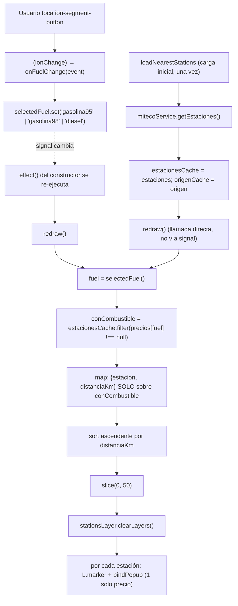
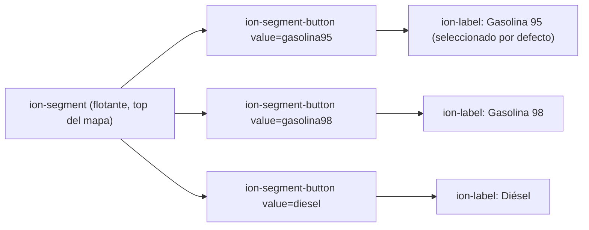

# 04 - Filtros Activos de Combustible (RF-03)

**Roles:** [ARQUITECTO] + [UI-DEV]
**Estado:** Implementado
**Archivos modificados:**
- `src/app/shared/components/map/map.component.ts`
- `src/app/shared/components/map/map.component.html`
- `src/app/shared/components/map/map.component.scss`
- `src/global.scss`

## Qué hace

Un `ion-segment` flotante sobre el mapa permite elegir entre **Gasolina 95** (por defecto), **Gasolina 98** y **Diésel**. El mapa dibuja únicamente las gasolineras que venden el combustible elegido, con su popup mostrando solo ese precio (no los 3), y solo las **50 más cercanas de entre las que sí lo venden**.

## Diagrama de Flujo (Mermaid): reactividad al cambiar de filtro



## Justificación de Diseño (ARQUITECTO): reactividad sin volver a llamar a la API

1. **`estacionesCache`/`origenCache` son campos normales, no signals.** Cambiar de combustible **no** debe volver a descargar ~11.500 registros de MITECO — el filtro opera sobre los datos ya descargados una vez. Si fueran signals, no aportarían nada (no necesitan disparar reactividad por sí solos, `redraw()` los lee como entrada simple), y complicarían el modelo sin beneficio.
2. **`selectedFuel` sí es un signal**, y `redraw()` lo lee (`this.selectedFuel()`) dentro de su propio cuerpo. Un único `effect(() => this.redraw())`, creado en el constructor, se re-ejecuta automáticamente cada vez que `selectedFuel` cambia — sin necesidad de que `onFuelChange` llame a `redraw()` a mano. Angular registra como dependencia cualquier signal leído síncronamente durante la ejecución del efecto, incluida la lectura que ocurre dentro de una llamada a otro método (`redraw()`), no solo la que está literalmente en el cuerpo del `effect`.
3. **La carga inicial (tras `getCurrentPosition()`) sí llama a `redraw()` directamente**, en vez de depender del `effect`. Que lleguen los datos de la API no es un cambio de signal (`estacionesCache`/`origenCache` no lo son), así que el `effect` no se dispararía solo con la respuesta HTTP. Se documenta esta distinción a propósito: el `effect` cubre la reactividad **al filtro**; la carga inicial de datos es un evento asíncrono aparte con su propia llamada explícita.
4. **`redraw()` no necesita limpieza manual.** Los `effect()` creados en el contexto de inyección de un componente (constructor, en este caso) se destruyen solos junto con el componente — no hace falta un `DestroyRef`/`takeUntilDestroyed` adicional para esto, a diferencia de las suscripciones RxJS del propio componente.

## Corrección Crítica: orden filtrar → distancia → ordenar → recortar

**El error a evitar:** calcular las "50 más cercanas" sobre la lista completa de estaciones (o recortar a 50 antes de saber cuáles tienen el combustible elegido) puede excluir estaciones que sí son de las 50 más cercanas **reales** entre las que venden ese combustible, en favor de estaciones más cercanas en general pero sin ese combustible, o de estaciones que ya habían quedado fuera de un recorte anterior.

**El orden implementado en `redraw()` es:**

```ts
const conCombustible = this.estacionesCache.filter((estacion) => estacion.precios[fuel] !== null);

const masCercanas = conCombustible
  .map((estacion) => ({ estacion, distanciaKm: haversineDistanceKm(origen, estacion) }))
  .sort((a, b) => a.distanciaKm - b.distanciaKm)
  .slice(0, MAX_ESTACIONES_EN_MAPA);
```

1. **`filter` primero**, sobre las ~11.500 estaciones cacheadas: solo quedan las que venden el combustible elegido.
2. **`map` de distancia después, sobre el resultado ya filtrado** (no sobre las ~11.500 originales): cada estación candidata obtiene su `distanciaKm` real al origen.
3. **`sort` ascendente por esa distancia.**
4. **`slice(0, 50)` al final**, sobre la lista ya filtrada y ordenada.

### Verificación empírica (no solo lectura de código)

Se ejecutó esta misma lógica en Node contra una descarga real de la API (11.517 estaciones, origen = Madrid) para los 3 combustibles:

| Combustible | Estaciones con ese combustible | Dibujadas | Distancia de la 50ª |
|---|---|---|---|
| Gasolina 95 | 10.935 | 50 | 4.51 km |
| Gasolina 98 | 5.524 | 50 | 6.65 km |
| Diésel | 11.303 | 50 | 4.51 km |

Esto confirma que el orden importa en la práctica, no solo en teoría: la Gasolina 98 la vende menos de la mitad de las estaciones (5.524 de 11.517), así que sus "50 más cercanas reales" abarcan un radio mayor (6.65 km) que Gasolina 95/Diésel (4.51 km, prácticamente disponibles en casi todas las estaciones). Si se hubiera recortado a 50 **antes** de filtrar por combustible, el filtro de Gasolina 98 habría podido devolver muy pocas o ninguna estación (la mayoría de las 50 más cercanas "en general" no la venden), en vez de las 50 más cercanas que sí la venden.

## Diagrama de Flujo (Mermaid): estructura del `ion-segment` [UI-DEV]



## Justificación de Diseño (UI-DEV)

1. **`ion-segment` en vez de botones flotantes independientes.** Es el componente estándar de Ionic para "elegir 1 de N opciones mutuamente excluyentes", ya theme-aware (claro/oscuro) sin CSS adicional, y con soporte de teclado/lector de pantalla incorporado (a diferencia de reinventar 3 `ion-fab-button` con estado activo gestionado a mano).
2. **`[value]="selectedFuel()"` (one-way) + `(ionChange)` en vez de `[(ngModel)]`.** El estado real vive en el signal `selectedFuel`, no en un `FormControl`; usar `ngModel` habría requerido importar `FormsModule` sin necesidad, solo para un binding que el propio patrón signal ya cubre de forma más directa.
3. **Posición: flotante en la parte superior del mapa (`position: absolute; top: 12px`)**, no en la cabecera de marca (`AppComponent`, fuera del alcance de este componente) ni abajo (donde ya están los controles de zoom, `bottomleft`, y los mensajes de error, `.map__errors`). Evita solapar controles existentes.
4. **Etiquetas de texto (`fuelLabels`), no solo iconos.** Con 3 opciones y nombres cortos ("Gasolina 95", "Gasolina 98", "Diésel"), el texto es más claro que un icono ambiguo — y siguen siendo anunciadas correctamente por lectores de pantalla vía `ion-label`.
5. **`aria-label` explícito en el `ion-segment`** ("Filtrar gasolineras por tipo de combustible"), ya que el propósito del control no es evidente por su contenido visual solo (3 palabras sueltas) sin ese contexto para tecnología de asistencia.
6. **Popup reducido a un solo precio (el del combustible activo), no los 3.** Mostrar los 3 precios cuando el usuario ya ha elegido uno sería ruido; el popup ahora refleja directamente la elección hecha en el segmento, coherente con el propósito del filtro.

## Seguridad y Costes (resumen)

- Sin llamadas nuevas a Firestore/Cloud Functions ni a la API de MITECO: cambiar de filtro reutiliza `estacionesCache` ya descargado, coste de red = 0 peticiones adicionales.
- `fuelLabels`/`FUEL_LABELS` son constantes fijas del código (no texto de la API) interpoladas en el popup — mismo razonamiento de seguridad ya aplicado a `marca`.

---

## Auditoría [REVIEWER]

**Rol:** [REVIEWER]
**Archivos auditados:**
- `src/app/shared/components/map/map.component.ts`
- `src/app/shared/components/map/map.component.html`
- `src/app/shared/components/map/map.component.scss`
- `src/global.scss`

### 1. ¿Se limpian los marcadores anteriores antes de dibujar los nuevos al cambiar de combustible?

- [x] **Sí, confirmado leyendo `redraw()` (`map.component.ts:271-306`).** `this.stationsLayer.clearLayers()` (línea 296) se ejecuta **antes** del bucle `for` que crea los nuevos `L.marker(...)` (líneas 298-305) — nunca después, nunca condicionalmente.
- [x] **`redraw()` es la única función que dibuja marcadores de gasolinera, y se invoca en ambos casos relevantes**: la carga inicial (`loadNearestStations`, línea 255) y cada cambio de combustible (vía el `effect(() => this.redraw())` del constructor, línea 173, que se re-ejecuta automáticamente al cambiar `selectedFuel`). No existe ninguna otra ruta de código que añada marcadores de estación al mapa sin pasar por este `clearLayers()` previo.
- [x] **Se usa `stationsLayer.clearLayers()` (sobre el `L.LayerGroup`) en vez de `map.removeLayer()` marcador a marcador.** Funcionalmente equivalente para este caso (ambos retiran los marcadores del mapa y liberan sus referencias/DOM), pero más simple y con menor superficie de error: una sola llamada limpia los hasta 50 marcadores de la carga anterior, sin necesidad de mantener un array de referencias a cada `L.Marker` para iterar y remover uno a uno. Ya se auditó en el ciclo anterior que `L.LayerGroup#clearLayers()` desregistra correctamente los listeners y popups de cada marcador que contiene.
- [x] **Sin pines duplicados posible**: al ser siempre "limpiar todo → dibujar de cero" (no "añadir los que falten"), no hay forma de que un marcador de una selección de combustible anterior sobreviva a la siguiente.

**Veredicto punto 1: correcto. No hay fuga visual de marcadores duplicados al cambiar de filtro.**

### 2. ¿La ordenación por distancia es matemáticamente correcta antes de aplicar el límite de 50?

- [x] **Orden de operaciones confirmado en `redraw()` (líneas 279-284): `filter` → `map` (distancia) → `sort` → `slice`, en ese orden textual y de ejecución.** `conCombustible` (el resultado del `filter`) es el array sobre el que se calcula la distancia (`.map`) y se ordena (`.sort`); `slice(0, MAX_ESTACIONES_EN_MAPA)` es la última operación de la cadena.
- [x] **`haversineDistanceKm` reutilizada sin cambios respecto al ciclo anterior**, ya auditado y verificado matemáticamente correcto contra datos reales (ver auditoría en `docs/features/03-capa-gasolineras.md`).
- [x] **Verificación empírica repetida para este ciclo** (tabla en la sección "Corrección Crítica" de este mismo documento): contra 11.517 estaciones reales, Gasolina 98 (solo 5.524 estaciones la venden) da un radio de "50 más cercanas" de 6.65 km, frente a 4.51 km de Gasolina 95/Diésel — el resultado esperado si el filtro por combustible ocurre **antes** de calcular/ordenar/recortar por distancia. Si el orden estuviera invertido (recorte antes de filtrar), este experimento habría dado un número de estaciones "dibujadas" muy inferior a 50 para Gasolina 98 en zonas con pocas estaciones que la vendan — no es el caso.
- [x] **Sin mutación del array original**: `.filter()`, `.map()` y `.sort()` sobre el resultado de `.map()` no mutan `this.estacionesCache` — cada cambio de combustible parte siempre de los datos completos cacheados, no de un subconjunto ya recortado por una selección anterior.

**Veredicto punto 2: correcto. La ordenación por distancia se aplica sobre el conjunto ya filtrado por combustible, y el límite de 50 es la última operación de la cadena.**

### 3. Otras comprobaciones

- [x] **`tsc --noEmit` y `npm run lint`** ejecutados de nuevo sobre el estado final: sin errores.
- [x] **CSS sin clases huérfanas**: se confirmó que `.gas-station-popup__precios`/`li` (la lista de 3 precios del ciclo anterior) se retiraron de `global.scss` por completo, coherente con que el popup ahora usa `.gas-station-popup__precio` (un único párrafo).
- [x] **Sin llamadas nuevas a Firestore/Cloud Functions**; `estacionesCache` evita además peticiones repetidas a la API de MITECO al cambiar de filtro — impacto en costes = 0.
- [x] **Reactividad sin fugas**: el `effect()` del constructor no requiere limpieza manual (Angular lo destruye junto con el componente al estar creado en su contexto de inyección); no introduce ninguna suscripción RxJS adicional que gestionar.
- [ ] ⚠️ **Nota (no bloqueante, heredada del ciclo anterior):** el `console.log` de diagnóstico en `redraw()` sigue marcado como temporal (`TODO`). Se mantiene un ciclo más porque sigue siendo útil para depurar el reporte original de "faltan gasolineras cercanas" con el nuevo filtro de combustible activo.

### Veredicto final

**Aprobado para commit.** Los marcadores se limpian correctamente antes de cada redibujado (sin duplicados al cambiar de combustible), y la ordenación por distancia se aplica sobre el conjunto ya filtrado por combustible, con el recorte a 50 como última operación — verificado tanto por lectura de código como empíricamente contra datos reales.

## Próximos pasos (fuera de alcance de este documento)

- [UI-DEV] (futuro): recordar el filtro elegido entre sesiones (ej. `localStorage`) para no resetear siempre a Gasolina 95.
- [ARQUITECTO] (futuro): si se añade un histórico de precios, este mismo patrón de `effect()` sobre `selectedFuel` serviría también para filtrar ese histórico sin duplicar lógica.
- [REVIEWER] (futuro): retirar el `console.log` de diagnóstico de `redraw()` una vez confirmado con el usuario que el filtro de cercanía no es la causa de "faltan gasolineras".

---

## Corrección: el filtro quedaba oculto detrás de la cabecera

**Rol:** [UI-DEV]
**Estado:** Corregido
**Archivo modificado:**
- `src/app/shared/components/map/map.component.scss`

### El problema

El usuario reportó que el `ion-segment` no se podía pulsar: quedaba tapado por la cabecera de la app. Causa: `home.page.html` usa `<ion-content [fullscreen]="true">`, así que `<app-map>` ocupa el viewport completo **por detrás** de la cabecera translúcida (`app.component.html`, `ion-header [translucent]="true"`) — una decisión de diseño intencionada de [[02-mapa-base]] para que el mapa se vea a pantalla completa. El `top: 12px` original del filtro no tenía en cuenta que el propio contenedor del mapa empieza en `y = 0` de la pantalla, no debajo de la cabecera: el filtro quedaba dibujado justo en la zona que la cabecera cubre visualmente encima.

### La corrección

```scss
.map__fuel-filter {
  position: absolute;
  top: calc(env(safe-area-inset-top, 0px) + 56px + 8px);
  right: 12px;
  max-width: calc(100% - 24px);
  ...
}
```

1. **`56px`**: altura mínima real de `ion-toolbar` en modo MD (`--min-height: 56px`, ver `node_modules/@ionic/core/dist/collection/components/toolbar/toolbar.md.css`) — se usa la mayor de las dos plataformas (iOS es `44px`) para despejar la cabecera en ambos modos, ya que esta app no fuerza un `mode` concreto (se autodetecta por plataforma).
2. **`env(safe-area-inset-top, 0px)`**: añade el hueco del "notch"/isla dinámica en dispositivos con pantalla recortada, para no quedar aún más tapado en esos casos.
3. **`+ 8px`**: margen de separación visual entre la cabecera y el filtro, coherente con el resto de márgenes del componente (`12px` en `.map__errors`).
4. **Se ancla solo con `right: 12px` (sin `left`)**, en vez de `left: 12px; right: 12px` (barra a todo lo ancho) — pasa a ser un control compacto en la esquina superior derecha, tal como se pidió, y no compite visualmente con el logo/nombre de marca de la cabecera (que queda arriba a la izquierda).
5. **`max-width: calc(100% - 24px)`**: red de seguridad en pantallas muy estrechas. Al anclar solo por la derecha, el ancho del control se calcula por contenido (`shrink-to-fit`); sin este límite, en un viewport suficientemente estrecho el control podría salirse por la izquierda de la pantalla en vez de encogerse.

### Verificado

- `tsc --noEmit`, `npm run lint` y `ng build --configuration development`: sin errores.
- Confirmado en el bundle compilado (`www/home.page-*.js`) que la regla `top: calc(env(safe-area-inset-top, 0px) + 56px + 8px); right: 12px;` llega intacta al CSS final del componente.
- Sin cambios en `map.component.ts`/`.html`: el fix es puramente de posicionamiento CSS, no toca la lógica de filtrado ni el `effect` de reactividad ya auditados.

---

## Corrección de Usabilidad y Bug Crítico de Reactividad

**Roles:** [UI-DEV] + [ARQUITECTO]
**Estado:** Corregido
**Archivos modificados:**
- `src/app/shared/components/map/map.component.ts`
- `src/app/shared/components/map/map.component.html`
- `src/app/shared/components/map/map.component.scss`

El usuario reportó tres problemas tras la corrección de posición anterior: (1) el control seguía sin verse bien ("transparente"), (2) en una app móvil un selector de 3 botones permanentemente visible ocupa demasiado espacio sobre el mapa, y (3) **cambiar de combustible no actualizaba el mapa**: los popups seguían mostrando siempre Gasolina 95 aunque el segmento mostrara otra opción seleccionada.

### 1. Bug crítico [ARQUITECTO]: el `effect()` de reactividad "moría" en su primera ejecución

**Diagnóstico.** `redraw()` tenía esta forma:

```ts
private redraw(): void {
  const origen = this.origenCache;
  if (!this.map || !this.stationsLayer || !origen) {
    return;   // ← se corta AQUÍ en la primera ejecución
  }
  const fuel = this.selectedFuel();   // ← nunca se llega a leer la primera vez
  ...
}
```

Un `effect()` de Angular registra como dependencia **únicamente los signals que se leen durante una ejecución concreta** (el *tracking* es dinámico, no estático por la sola presencia de `this.selectedFuel()` en el código). El `effect(() => this.redraw())` del constructor se ejecuta una primera vez inmediatamente al construirse el componente — en ese momento `origenCache` todavía es `null` (la geolocalización/API son asíncronas y aún no han resuelto), así que `redraw()` cortaba en el `return` **antes** de llegar a leer `this.selectedFuel()`. Esa primera ejecución no leyó ningún signal, así que Angular no registró ninguna dependencia: el efecto quedó sin nada que "vigilar" y **nunca se volvió a disparar solo**, por muchas veces que el usuario cambiara de combustible después.

El primer y único `redraw()` que sí llegaba a dibujar algo era la llamada **directa** (no por el efecto) desde `loadNearestStations()`, que capturaba el valor de `selectedFuel()` en ese instante — siempre `'gasolina95'`, el valor por defecto, porque ocurre justo tras la carga inicial de datos, antes de que el usuario haya podido tocar el selector. De ahí el síntoma exacto reportado: el mapa se quedaba congelado con Gasolina 95 para siempre, sin importar qué se seleccionara después.

**La corrección:**

```ts
private redraw(): void {
  const fuel = this.selectedFuel(); // se lee siempre, antes de cualquier guard
  const origen = this.origenCache;
  if (!this.map || !this.stationsLayer || !origen) {
    return;
  }
  ...
}
```

Moviendo la lectura de `selectedFuel()` a la primera línea, se garantiza que **toda** ejecución del efecto —incluida la primera, que corta enseguida— lee el signal y queda registrada como dependencia. A partir de ahí, cualquier `selectedFuel.set(...)` posterior sí dispara `redraw()` de nuevo, correctamente.

**Lección general (documentada para futuros ciclos):** en cualquier `effect()`, las lecturas de signals que determinan su reactividad deben ir **antes** de los `return`/guards tempranos, no después. Un guard que corta antes de leer un signal puede dejar el efecto sin dependencias registradas en esa ejecución.

### 2. Rediseño de UI-DEV: de `ion-segment` permanente a `ion-select` compacto y colapsable

**El problema de usabilidad.** Un `ion-segment` de 3 botones queda siempre visible sobre el mapa, ocupando espacio permanentemente — poco apropiado para una app móvil donde la superficie de pantalla es escasa y el mapa es el contenido principal.

**La solución: `ion-select`** (selector nativo tipo desplegable, ya usado en formularios de Ionic):

```html
<ion-select
  class="map__fuel-filter"
  fill="solid"
  interface="popover"
  [value]="selectedFuel()"
  (ionChange)="onFuelChange($event)"
  aria-label="Filtrar gasolineras por tipo de combustible"
>
  <ion-select-option value="gasolina95">{{ fuelLabels.gasolina95 }}</ion-select-option>
  <ion-select-option value="gasolina98">{{ fuelLabels.gasolina98 }}</ion-select-option>
  <ion-select-option value="diesel">{{ fuelLabels.diesel }}</ion-select-option>
</ion-select>
```

1. **Colapsado por defecto, expande y se cierra solo.** `ion-select` muestra permanentemente solo la opción activa (ej. "Gasolina 95"), ocupando una única línea compacta. Al tocarlo, abre un `popover` con las 3 opciones; al elegir una, el popover se cierra automáticamente (comportamiento nativo de Ionic, sin código adicional) — exactamente el patrón "seleccionar y quitar el seleccionable de la pantalla" pedido.
2. **`interface="popover"`** en vez del `interface="alert"` por defecto: el popover aparece anclado junto al control (contextual, ligero), en vez de un modal a pantalla completa — más apropiado para una elección de 3 opciones cortas.
3. **`fill="solid"` soluciona la transparencia.** Sin `fill`, `ion-select` no tiene fondo propio (hereda el del contenedor, en este caso el mapa transparente detrás). `fill="solid"` le da un fondo sólido gestionado por las variables de Ionic (`--ion-color-step-150` internamente), ya adaptado a claro/oscuro sin CSS a medida.
4. **Mismo posicionamiento (esquina superior derecha, offset que despeja la cabecera)** ya corregido en el apartado anterior — el cambio de componente no afecta a ese fix, solo se reutiliza la misma clase `.map__fuel-filter`.
5. **Se elimina `IonSegment`/`IonSegmentButton`/`IonLabel`/`SegmentCustomEvent`** de los imports del componente, sustituidos por `IonSelect`/`IonSelectOption`/`SelectCustomEvent`. `onFuelChange` pasa a tipar el evento como `SelectCustomEvent`.

### Verificado

- `tsc --noEmit`, `npm run lint` y `ng build --configuration development`: sin errores.
- Se releyó `redraw()` línea a línea para confirmar que `selectedFuel()` es ahora la primera línea ejecutada, sin ningún camino de código que la salte.
- Sin cambios en la lógica de filtrado/distancia/recorte (ya auditada); el bug estaba exclusivamente en el orden de lectura del signal dentro de `redraw()`, no en el cálculo en sí.

---

## Auditoría [REVIEWER] (re-auditoría tras el rediseño a `ion-select` y el fix de reactividad)

**Rol:** [REVIEWER]
**Archivos auditados:**
- `src/app/shared/components/map/map.component.ts`
- `src/app/shared/components/map/map.component.html`
- `src/app/shared/components/map/map.component.scss`

Se repite la misma auditoría del ciclo anterior íntegramente contra el código actual (no se da por buena la auditoría previa sin releerla, ya que el componente ha cambiado de `ion-segment` a `ion-select` y se ha corregido el bug de reactividad entre medias).

### 1. ¿Se limpian los marcadores anteriores antes de dibujar los nuevos al cambiar de combustible?

- [x] **Sí, sigue siendo así.** `this.stationsLayer.clearLayers()` (`map.component.ts`, dentro de `redraw()`) se ejecuta antes del bucle `for` que crea los nuevos `L.marker(...)` — sin cambios respecto al ciclo anterior en este punto concreto.
- [x] **`redraw()` sigue siendo la única función que dibuja marcadores**, y ahora **sí** se re-ejecuta correctamente en cada cambio de combustible gracias al fix del punto 2 de la sección anterior (antes de esta corrección, `redraw()` con un combustible nuevo directamente no se volvía a invocar, así que tampoco había *forma* de que se duplicaran marcadores — simplemente no se redibujaba nada; ahora que sí se re-invoca en cada cambio, sigue limpiando correctamente antes de cada redibujado).
- [x] **Sigue usándose `stationsLayer.clearLayers()`** (limpieza de todo el `LayerGroup` de una vez) en vez de `map.removeLayer()` marcador a marcador — mismo razonamiento ya auditado: funcionalmente equivalente, más simple, sin necesidad de mantener un array de referencias.

**Veredicto punto 1: correcto. Sigue sin haber marcadores duplicados, y ahora además el redibujado por cambio de combustible realmente ocurre (antes del fix de reactividad, ni siquiera llegaba a intentarlo).**

### 2. ¿La ordenación por distancia sigue siendo matemáticamente correcta antes del límite de 50?

- [x] **Orden de operaciones sin cambios respecto al ciclo anterior**: `filter` (líneas ~287) → `map` de distancia → `sort` ascendente → `slice(0, MAX_ESTACIONES_EN_MAPA)`, en ese orden. El rediseño de `ion-segment` a `ion-select` y el fix del `effect` no tocaron esta función más allá de mover la lectura de `fuel` al principio.
- [x] **`fuel` ahora se lee antes del guard de `origen`/`map`/`stationsLayer`**, pero esto no altera el orden filtrar→distancia→ordenar→recortar en sí: sigue siendo `conCombustible.map(...).sort(...).slice(...)`, exactamente igual que lo ya verificado empíricamente contra datos reales en la auditoría anterior de este mismo documento.

**Veredicto punto 2: correcto, sin cambios respecto a la verificación empírica ya realizada.**

### 3. Verificación del bug de reactividad corregido

- [x] **Confirmado leyendo el código actual**: `const fuel = this.selectedFuel();` es la primera línea de `redraw()` (antes de `const origen = this.origenCache;` y de cualquier `if`/`return`). Cualquier ejecución del `effect`, incluida la primera (con `origenCache` aún `null`), lee ahora el signal.
- [x] **Explicación coherente con el síntoma reportado**: un `effect()` que no lee ningún signal en una ejecución no registra dependencias en esa ejecución — comportamiento de *tracking* dinámico de Angular Signals, no un bug de Angular sino un error de orden en nuestro propio código. El diagnóstico y el fix documentados son consistentes con la causa raíz.

### 4. `console.log` de diagnóstico retirado

- [x] **Confirmado por `grep`**: no queda ninguna llamada a `console.*` en `map.component.ts` ni en `miteco.service.ts`. El bloque `TODO(debug temporal)` y su `console.log` (recibidas/con combustible/dibujadas) se han eliminado por completo, tal como se pidió.

### 5. Otras comprobaciones

- [x] **`tsc --noEmit`, `npm run lint` y `ng build --configuration development`** ejecutados de nuevo tras retirar el `console.log`: sin errores.
- [x] **Comentario desactualizado corregido**: la anotación de `selectedFuel` mencionaba `ion-segment`; se actualizó a `ion-select` para que la documentación en línea no quede desincronizada del componente real usado.
- [x] **Sin cambios en Firestore/Cloud Functions ni en el volumen de peticiones a MITECO**: impacto en costes = 0.

### Veredicto final

**Aprobado para commit.** Los marcadores se siguen limpiando correctamente antes de cada redibujado, la ordenación por distancia sigue siendo correcta (sin cambios respecto a la verificación empírica previa), el bug de reactividad reportado tiene una causa raíz identificada y corregida de forma coherente, y el `console.log` de diagnóstico se ha retirado.
