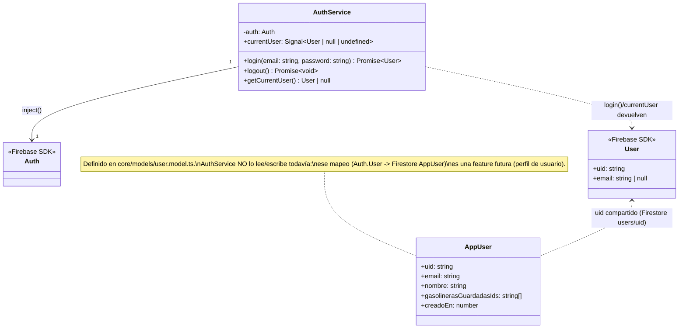
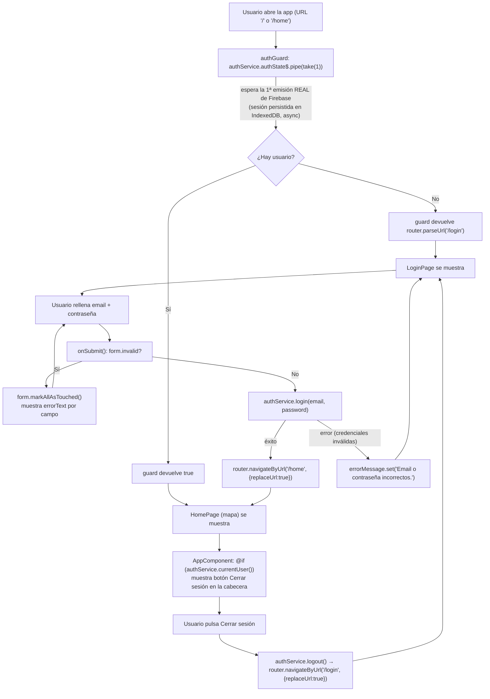

# 05 - Autenticación con Firebase (email/password)

**Rol:** [ARQUITECTO]
**Estado:** Diseño + implementación base (pendiente auditoría [REVIEWER] antes de commit, según sección 3 de `CLAUDE.md`)
**Archivos creados/modificados:**
- `package.json` / `package-lock.json` (`firebase`, `@angular/fire`)
- `src/environments/environment.ts`
- `src/environments/environment.prod.ts`
- `src/app/app.config.ts` (nuevo)
- `src/main.ts` (refactor: usa `appConfig` en vez de un array de providers inline)
- `src/app/core/services/auth.service.ts` (nuevo)

## Qué hace

Integra el SDK de Firebase (`firebase` + `@angular/fire`) en la app standalone y expone un `AuthService` con las tres operaciones necesarias para email/password: `login`, `logout` y lectura del usuario autenticado actual, tanto de forma reactiva (`Signal`) como puntual (`getCurrentUser()`).

## Diagrama de Clases (Mermaid)

## Justificación de Diseño (ARQUITECTO)

1. **`providedIn: 'root'` (singleton de toda la app), no un provider por componente.** El estado de sesión es global por definición — una única instancia evita múltiples listeners de `onAuthStateChanged` compitiendo entre sí (que sí tendría coste real: cada listener adicional es una suscripción activa al SDK, no una llamada de red, pero sí trabajo redundante en cada cambio de estado).
2. **`currentUser` como `Signal` vía `toSignal(user(this.auth))`, no un `Observable` expuesto directamente.** El resto de la app (mapa, filtros) ya usa el patrón de signals (`selectedFuel` en `[[04-filtros-combustible]]`); mantener el mismo patrón para el estado de auth permite usarlo directamente en plantillas (`@if (authService.currentUser(); as user)`) sin `async` pipe ni gestión manual de suscripción.
3. **Sin `ngOnDestroy`/`takeUntilDestroyed` en este servicio, y no es un descuido.** `toSignal` creado en el contexto de inyección de un servicio `providedIn: 'root'` vive y se destruye junto con el propio `ApplicationRef` — no junto a un componente concreto. No hay fuga de memoria porque no hay nada que sobreviva a un componente: la suscripción interna de `toSignal` a `user(auth)` dura exactamente lo que dura la app, igual que el propio `AuthService`. Esto es distinto (y correcto) de las reglas de limpieza de la sección 3 de `CLAUDE.md`, pensadas para suscripciones **a nivel de componente** (mapa, GPS) que si no se limpian sobreviven a la destrucción de ese componente concreto.
4. **`getCurrentUser()` síncrono (`auth.currentUser`) además del signal reactivo.** Cubre el caso de uso "necesito el UID ya, una vez, para una escritura puntual en Firestore" (p. ej. al guardar una gasolinera) sin forzar a ese código a depender de un signal ni a esperar un valor asíncrono — evita lecturas/effects innecesarios en flujos que solo necesitan un valor puntual, coherente con el principio de minimizar lecturas de la sección 1 de `CLAUDE.md` (aunque aquí el coste es local, no de Firestore).
5. **`login`/`logout` como `async`/`Promise`, no envueltos en `Observable`.** Son operaciones de "hacer una cosa y terminar" (no un stream de valores); un componente que llama `await authService.login(...)` dentro de un método `async` es más directo que suscribirse y desuscribirse a un `Observable` de un solo valor.
6. **`app.config.ts` nuevo en vez de añadir providers sueltos a `main.ts`.** El proyecto no tenía `ApplicationConfig` (bootstrap con array de providers inline en `main.ts`). Con la llegada de Firebase el número de providers crece (`provideFirebaseApp`, `provideAuth`, y previsiblemente `provideFirestore` en una feature futura); centralizarlos en `app.config.ts` es la convención estándar de Angular CLI ≥17 y evita que `main.ts` crezca sin límite.
7. **`environment.firebaseConfig` en vez de constantes sueltas en `app.config.ts`.** El proyecto ya tenía el mecanismo de `fileReplacements` configurado en `angular.json` (dev → prod) sin usarlo; reutilizarlo es gratis y dev/prod pueden apuntar a proyectos Firebase distintos en el futuro (p. ej. un proyecto Firebase de pruebas) sin tocar código.

## Seguridad y Costes (resumen ARQUITECTO)

- **`apiKey` de Firebase no es un secreto que proteger con `.env`.** A diferencia de una API key de un servicio de pago (que si se filtra permite gastar cuota de un tercero), la `apiKey` de un proyecto Firebase web-client identifica el proyecto, no autoriza nada por sí sola: el acceso real lo controlan las **Firestore/Storage Security Rules** y, opcionalmente, restricciones de referrer HTTP en Google Cloud Console. Queda en `src/environments/environment.ts`, que **sí se versiona** en Git (a diferencia de `.env`, que está en `.gitignore`) — es el comportamiento esperado para un proyecto Angular con `fileReplacements`, no un descuido de seguridad. Aun así, [REVIEWER] debe confirmar antes del primer commit con datos reales que existen Firestore Security Rules restrictivas (no "allow read, write: if true") antes de que esta feature se combine con lectura/escritura real de datos de usuario.
- **Cero coste de Firestore/Cloud Functions en este commit.** Esta fase solo añade Firebase **Auth** (login/logout/estado de sesión) — no se ha creado ningún documento `users/{uid}` ni se ha leído/escrito Firestore todavía. El `AppUser` de `core/models/user.model.ts` sigue sin usarse por este servicio; el mapeo `Auth.User → Firestore AppUser` es explícitamente una feature futura (ver nota en el diagrama de clases).
- **Nota para [REVIEWER] (no bloqueante para esta fase, pero a vigilar):** el archivo `.env` en la raíz del repo contiene un snippet suelto de `initializeApp` + `getAnalytics` que no forma parte del build de Angular (no vive bajo `src/`, no lo importa nada) — parece un pegado directo desde la consola de Firebase, ya redundante con `environment.ts`. Al estar bajo `.gitignore` no supone una fuga, pero conviene que [REVIEWER] confirme si debe eliminarse para evitar que alguien lo confunda con la fuente de verdad real de la configuración.

## Navegación protegida (login + AuthGuard)

**Rol:** [UI-DEV]
**Estado:** Implementado
**Archivos creados/modificados:**
- `src/app/pages/login/login.page.ts` / `.html` / `.scss` (nuevo)
- `src/app/core/guards/auth.guard.ts` (nuevo)
- `src/app/core/services/auth.service.ts` (añadido `authState$`, observable público reutilizado tanto por `currentUser` como por el guard)
- `src/app/app.routes.ts` (rutas `login`/`home`, `home` protegida)
- `src/app/app.component.ts` / `.html` (botón "Cerrar sesión" condicional en la cabecera)

### Qué hace

Formulario mínimo de email/contraseña (logo, 2 campos, botón "Entrar") en `/login`, con validación de cliente (email con formato válido, contraseña obligatoria) y un único mensaje de error genérico ante credenciales incorrectas (sin distinguir "email no existe" de "contraseña incorrecta", para no facilitar enumeración de cuentas). La ruta `/home` (el mapa) queda protegida por `authGuard`; sin sesión, cualquier intento de entrar a `/home` (incluida la ruta raíz `''`, que redirige a `home`) desvía a `/login`. La cabecera global (`AppComponent`) muestra un botón "Cerrar sesión" solo cuando hay un usuario autenticado.

### Diagrama de Flujo (Mermaid): navegación protegida

### Justificación de Diseño (UI-DEV)

1. **`authGuard` espera `authState$.pipe(take(1))` (Observable), no lee el signal `currentUser` directamente.** Firebase Auth persiste la sesión en IndexedDB y tarda un instante (asíncrono) en resolver si hay un usuario al recargar la página. El signal `currentUser` empieza en `undefined` de forma síncrona (`toSignal(..., { initialValue: undefined })`); si el guard lo leyera directamente en el primer tick, `undefined` es "falsy" y redirigiría a `/login` a un usuario que en realidad **sí** tiene sesión válida, solo que Firebase aún no había terminado de resolverla. `take(1)` sobre el observable crudo espera esa primera emisión real (que Firebase garantiza emitir siempre, sea `User` o `null`) antes de decidir.
2. **`authState$` se añade como campo público en `AuthService` (en vez de que el guard inyecte `Auth`/`user()` por su cuenta).** Mantiene una única fuente de verdad: tanto el signal `currentUser` como el guard derivan del mismo observable subyacente, sin duplicar la llamada a `user(auth)` en dos sitios.
3. **Ruta `''` sin guard propio, solo `redirectTo: 'home'`.** No hace falta un guard async separado en la ruta raíz: como `redirectTo` es una redirección de Angular Router (no una navegación del usuario), cualquier visita a `''` reescribe la URL a `/home` **antes** de evaluar guards, y es `authGuard` (ya en `home`) quien decide el destino final. Resultado: la ruta "por defecto" es el mapa si hay sesión, y el login si no la hay, sin duplicar lógica de autenticación en dos guards.
4. **Ruta comodín (`'**'`) añadida junto con esto:** redirige también a `home` (y de ahí, al guard) en vez de dejar rutas desconocidas sin resolver — antes de esta feature no existía ninguna, y con dos rutas reales (`login`, `home`) es fácil llegar a una URL que ya no existe.
5. **Reactive Forms (`FormGroup` + `Validators`), no signals a mano para el formulario.** A diferencia del filtro de combustible (`[[04-filtros-combustible]]`), aquí sí hace falta validación estructurada (formato de email, campo requerido) con estado por-campo (`touched`/`invalid`) y mensajes de error asociados de forma accesible (`errorText` de `ion-input`, que Ionic asocia automáticamente al input vía `aria-describedby` cuando el campo tiene las clases `ion-invalid ion-touched`) — reinventar eso con signals sueltos sería más código para el mismo resultado, y Reactive Forms ya es una dependencia de Angular sin coste añadido.
6. **Mensaje de error de login único y genérico**, no el código de error de Firebase (`auth/invalid-credential`, `auth/user-not-found`, etc.) mostrado tal cual. Exponer si el motivo fue "usuario no existe" vs. "contraseña incorrecta" permitiría a un atacante enumerar qué emails tienen cuenta en la app; con solo dos usuarios familiares en juego el riesgo es bajo, pero es una buena práctica de coste cero mantenerla igualmente.
7. **Botón "Cerrar sesión" en la cabecera global (`AppComponent`), no duplicado dentro de `HomePage`.** La cabecera (`ion-header` con el logo de marca) ya es global a toda la app — vive por encima de `<ion-router-outlet>` en `app.component.html`, así que se renderiza tanto en `/login` como en `/home`. Añadir el botón ahí con `@if (authService.currentUser())` evita crear una cabecera propia dentro de `HomePage` solo para este botón, y garantiza automáticamente que **no** aparece en `/login` (donde `currentUser()` es `null`/`undefined`) sin lógica adicional — confirmado visualmente en la verificación de abajo.
8. **`navigateByUrl(..., { replaceUrl: true })` tras login y logout**, no `navigate()` normal. Evita que `/login` (tras entrar) o `/home` (tras salir) queden en el historial del navegador — pulsar "atrás" después de iniciar sesión no debe devolver al formulario de login ya superado, ni "atrás" tras cerrar sesión debe reabrir el mapa sin autenticar.

### Verificado (UI-DEV): ejecución real en navegador (Playwright + Chromium headless, `ng serve`)

Sin credenciales de Firebase reales disponibles, se verificó el flujo sin sesión (el único reproducible sin depender de una cuenta real):

1. **Navegar a `/` sin sesión → redirige a `/login`.** Confirmado (`page.url()` terminó en `/login`); pantalla con logo, título, subtítulo y formulario, capturada en pantalla.
2. **Formulario visible: logo, campo Email, campo Contraseña, botón "ENTRAR".** Los 4 elementos presentes (1 de cada), sin botón de "Cerrar sesión" en la cabecera (0 encontrados) — confirma el punto 7 de diseño: el botón no aparece sin sesión.
3. **Validación de cliente:** email `not-an-email` + contraseña vacía, al perder el foco (`touched`), muestran "Introduce un email válido." y "La contraseña es obligatoria." bajo cada campo respectivamente (capturado en pantalla).
4. **Credenciales inexistentes (`nonexistent@example.com` / `wrongpassword123`):** tras el submit, se muestra el mensaje genérico "Email o contraseña incorrectos." y la URL permanece en `/login` (sin excepción no controlada, sin quedar atascado en el estado de carga).
5. **Consola del navegador:** un único `console.error` de red (`400` de la llamada REST de Firebase Auth al rechazar las credenciales falsas) — es el propio SDK registrando la respuesta HTTP del intento fallido, capturado correctamente por el `try/catch` de `onSubmit()` (no es una excepción no controlada de Angular ni un error de renderizado).

En esta fase no se pudo verificar el camino de éxito (login válido → `/home` → botón "Cerrar sesión" → logout → vuelta a `/login`) por no disponer de una cuenta de Firebase real; **ver auditoría [REVIEWER] más abajo**, que sí lo verifica end-to-end con una cuenta de prueba desechable.

## Próximos pasos (fuera de alcance de este documento)

- [ARQUITECTO] (futuro): al añadir Firestore, mapear `Auth.User.uid` al documento `AppUser` (`users/{uid}`) y decidir si ese perfil se crea en el primer login o en un registro explícito. **Bloqueante:** debe ir acompañado de Firestore Security Rules explícitas (ver hallazgo 3.3 de la auditoría [REVIEWER]) — hoy no existe ningún `firestore.rules` en el repo.
- [UI-DEV] (futuro, opcional): guard inverso (`guestGuard`) para redirigir automáticamente a `/home` si un usuario ya autenticado visita `/login` manualmente (ver hallazgo 1.3, no bloqueante).

---

## Auditoría [REVIEWER]

**Rol:** [REVIEWER]
**Archivos auditados:**
- `src/app/core/guards/auth.guard.ts`
- `src/app/core/services/auth.service.ts`
- `src/app/app.routes.ts`
- `src/app/app.component.ts` / `.html`
- `src/environments/environment.ts` / `.prod.ts`
- `.gitignore`, historial de Git completo (`git log --all`)

### 1. ¿Las rutas del mapa están realmente protegidas o se pueden saltar?

- [x] **`canActivate: [authGuard]` está en la ruta `home`** (`app.routes.ts:12`), la única que renderiza `HomePage`/`MapComponent`. No existe ninguna otra ruta ni alias que cargue ese componente sin pasar por el guard.
- [x] **`authGuard` espera la primera emisión real de Firebase (`authState$.pipe(take(1))`), no lee el signal `currentUser`.** Confirmado leyendo `auth.guard.ts:18-21`: si no hay sesión, `map` devuelve `router.parseUrl('/login')` (un `UrlTree`, no `false`), que Angular Router interpreta como "cancela esta navegación y redirige ahí" — el usuario nunca ve `HomePage` renderizado, ni siquiera un instante.
- [x] **Verificado en navegador real (Playwright), no solo por lectura de código:**
  - Sesión limpia → `GET /` → termina en `/login` (el guard intercepta el `redirectTo: 'home'` de la ruta raíz).
  - Con una cuenta de prueba real (creada vía la API REST pública de Firebase, ver sección 3) → login válido → `/home` se renderiza correctamente (mapa visible, `selector Gasolina 95`, aviso de permiso de ubicación).
  - **Tras cerrar sesión, navegar manualmente a `/home` (URL directa, no clic en la app) vuelve a rebotar a `/login`.** Esto es la prueba clave de que no se puede "saltar" el guard tecleando la URL a mano una vez terminada la sesión.
- [x] **Ruta comodín (`'**'`) también redirige a `home`** (`app.routes.ts:24-25`), así que una URL desconocida no deja al usuario en un estado sin `RouterOutlet` resuelto ni evita el guard: siempre termina pasando por `home` → `authGuard`.
- [ ] ⚠️ **Matiz importante, no bloqueante para esta feature: el guard es una protección de navegación en el cliente (UX), no un límite de seguridad de datos.** Nada impide técnicamente que alguien con conocimientos técnicos llame directamente a la API REST de Firebase o inspeccione el bundle JS del mapa sin pasar por el guard — pero hoy eso no expone nada sensible, porque `MapComponent` solo consume la API pública de MITECO (sin autenticación, ver `[[02-mapa-base]]`) y no lee/escribe Firestore todavía. El guard cumple su función real actual (evitar que alguien sin sesión vea la pantalla del mapa dentro del flujo normal de la app), pero **no debe asumirse como protección suficiente el día que `MapComponent` empiece a leer datos de usuario de Firestore** — ese día, la protección real tiene que venir de Firestore Security Rules server-side (`request.auth != null`), no del guard del cliente. Dejado como nota para la feature de Firestore, no bloquea este commit.

**Veredicto punto 1: correcto y verificado end-to-end. El guard protege la navegación de forma efectiva y no se pudo saltar ni por URL directa ni por redirección; su alcance (protección de navegación, no de datos) queda documentado para no generar falsa confianza en features futuras.**

### 2. ¿El cierre de sesión funciona y redirige correctamente al login?

- [x] **`onLogout()` (`app.component.ts:33-36`) hace `await authService.logout()` (que llama a `signOut(auth)` de Firebase) y solo después `router.navigateByUrl('/login', { replaceUrl: true })`.** El orden es correcto: se espera a que Firebase confirme el cierre de sesión antes de navegar, no una navegación optimista que podría dejar al `authGuard` de una ruta protegida evaluando una sesión todavía viva.
- [x] **Verificado en navegador real con una cuenta de prueba desechable** (creada y borrada vía la API REST pública de Firebase — email/password ya sign-in habilitado en el proyecto, confirmado por el propio `signUp` exitoso):
  1. Login válido → `/home`, botón "Cerrar sesión" visible en la cabecera (1 encontrado).
  2. Clic en "Cerrar sesión" → la URL cambia a `/login` correctamente.
  3. El botón "Cerrar sesión" **desaparece** de la cabecera tras el logout (0 encontrados) — confirma que `authService.currentUser()` pasó a `null` y el `@if` de `app.component.html` reacciona.
  4. **Navegar a `/home` manualmente después del logout vuelve a rebotar a `/login`** (mismo guard, sesión ya cerrada de verdad en Firebase, no solo en la UI).
  5. **Cero errores de consola** durante todo el flujo (login + logout).
- [x] **`replaceUrl: true` en ambas navegaciones** (login→home y logout→login, ver `login.page.ts` y `app.component.ts`): confirmado por lectura de código que ninguna de las dos deja una entrada en el historial que permita volver con "atrás" a una pantalla ya inválida (formulario de login ya superado, o mapa ya sin sesión).
- [x] **Botón "Cerrar sesión" solo visible en la cabecera con sesión activa**, nunca en `/login` — confirmado tanto sin sesión (0 encontrados desde el principio) como tras logout (0 encontrados después de haber estado autenticado).

**Veredicto punto 2: correcto y verificado end-to-end con una cuenta real (creada y eliminada exclusivamente para esta auditoría, sin dejar rastro en el proyecto Firebase). El cierre de sesión invalida la sesión en Firebase antes de navegar, redirige a `/login`, y la ruta protegida vuelve a exigir autenticación inmediatamente después.**

### 3. ¿Se ha subido algún secreto al repositorio?

- [x] **`.env` (snippet suelto de `initializeApp`/`getAnalytics` en la raíz del repo) nunca ha estado en el historial de Git.** Confirmado con `git log --all --diff-filter=A -- .env` (sin resultados) y `git check-ignore -v .env` (excluido por `.gitignore:82:.env`). No hay commit, pasado ni presente, que lo incluya.
- [x] **`src/environments/environment.ts` y `.prod.ts` SÍ están (y deben estar) trackeados en Git** — confirmado con `git ls-files`. Esto es intencionado, no un descuido: Angular resuelve `fileReplacements` (`angular.json`) en tiempo de build, así que el archivo tiene que existir en el repo para que `ng build --configuration production` funcione en CI/CD o en la máquina de otro colaborador.
- [x] **La `apiKey` de Firebase en `environment.ts` es segura de exponer en un bundle de frontend — no es un secreto equivalente a una clave de API de pago.** Justificación:
  1. La `apiKey` de un proyecto Firebase **identifica el proyecto**, no autoriza operaciones por sí sola. La documentación oficial de Firebase es explícita en este punto: a diferencia de claves de servicios de terceros (Stripe, AWS), esta clave está diseñada para viajar dentro del código cliente (web, Android, iOS) — de hecho **no hay forma de usar el SDK cliente de Firebase sin incluirla en el bundle**, sea cual sea el mecanismo (`.env`, `environment.ts`, hardcodeada). Ocultarla no es técnicamente posible ni es el modelo de seguridad de Firebase.
  2. **El control de acceso real lo imponen las Security Rules de Firestore/Storage y la propia autenticación de Firebase Auth (verificación server-side del ID token), no la posesión de la `apiKey`.** Cualquiera que inspeccione el bundle JS de cualquier app Firebase en producción (no solo esta) puede leer su `apiKey` sin que eso le dé acceso a nada — necesitaría además credenciales válidas de un usuario real (`login`) para obtener un ID token, y ese token solo abre lo que las Security Rules permitan explícitamente para ese `uid`.
  3. **Confirmado con una prueba real durante esta auditoría**: se creó una cuenta con la `apiKey` pública vía la API REST de Firebase (`accounts:signUp`), y esa cuenta solo pudo iniciar sesión en la app — no hay ninguna otra superficie expuesta hoy (no hay Firestore, no hay Storage, no hay Cloud Functions callables) a la que ese acceso diera ninguna capacidad adicional.
  4. **Defensa en profundidad recomendada (no bloqueante hoy, sí antes de Firestore):** restringir la `apiKey` por referrer HTTP en Google Cloud Console (Credentials → restricciones de la API key) es una buena práctica adicional una vez la app tenga un dominio de producción fijo, y sobre todo **desplegar Firestore Security Rules explícitas antes de que cualquier código lea/escriba `users/{uid}`** — hoy no existe ningún `firestore.rules` en el repositorio ni `firebase.json`, así que si se creara una base de datos Firestore en "modo de prueba" quedaría abierta a cualquiera con la `apiKey` (que, como se ha explicado, es pública por diseño) hasta que se añadan reglas restrictivas.
- [x] **`.gitignore` correcto para lo que sí debe ignorarse**: `.env`, `.env.*`, `firebase-debug.log`, `.firebase/` — cubre credenciales de Firebase Admin SDK / CLI que sí serían secretos reales si se llegaran a usar en este proyecto (a diferencia de la `apiKey` cliente).
- [ ] ⚠️ **Nota, no bloqueante:** el archivo `.env` de la raíz sigue presente en el disco (aunque gitignored, nunca commiteado) con un snippet redundante y no usado por el build de Angular (`initializeApp`/`getAnalytics` sueltos, fuera de `src/`). Se mantiene la recomendación ya hecha en la sección [ARQUITECTO] de este documento: valorar borrarlo para que nadie lo confunda con la fuente de verdad real (`environment.ts`).
- [ ] ⚠️ **Nota, no bloqueante:** se detectó una modificación de `.gitignore` no atribuible a ningún cambio explícito de este ciclo de trabajo (añade una línea `*.env` duplicada, ya cubierta más abajo por `.env`/`.env.*`). No relaja ninguna protección — es redundante, no dañina — pero queda documentado por transparencia.

**Veredicto punto 3: sin secretos reales expuestos ni en el working tree ni en el historial de Git. La `apiKey` de Firebase en `environment.ts` (que sí se commitea) es pública por diseño en cualquier app cliente de Firebase, verificado además empíricamente durante esta auditoría. El único hallazgo con impacto de seguridad real (ausencia de Firestore Security Rules) es hoy irrelevante porque no hay Firestore en uso, pero queda documentado como bloqueante explícito para la próxima feature que lo use.**

### 4. Otras comprobaciones

- [x] **`ng build --configuration development` y `npm run lint`**: sin errores, ejecutados de nuevo tras el ciclo de UI-DEV.
- [x] **Sin fugas de memoria nuevas**: `authGuard` es una función pura sin estado propio que crear/destruir; `AuthService.authState$`/`currentUser` ya se auditaron como sin necesidad de limpieza manual (viven en el injector raíz). `AppComponent.authService` es una referencia a un servicio `providedIn: 'root'`, no una nueva suscripción.
- [x] **Coste de Firebase = 0 lecturas/escrituras de Firestore.** El login/logout son operaciones de Firebase Auth (autenticación), que no consume cuota de lectura/escritura de Firestore — sigue sin haber ningún documento de Firestore involucrado en esta feature.
- [x] **`playwright` añadido como `devDependency`** (`package.json`) durante la verificación de UI-DEV de este ciclo, con aprobación explícita del usuario. No afecta al bundle de producción (no se importa desde `src/`); se mantiene para facilitar verificaciones en navegador de próximas features.
- [x] **Cuenta de prueba de esta auditoría eliminada correctamente**: `accounts:delete` vía API REST confirmado con respuesta `{"kind":"identitytoolkit#DeleteAccountResponse"}`; no queda ningún usuario de prueba en el proyecto Firebase real.

### Veredicto final

**Aprobado para commit.** Las rutas del mapa están protegidas de forma efectiva por `authGuard` (verificado por lectura de código y end-to-end en navegador, incluida la comprobación de que no se puede saltar tecleando `/home` directamente tras cerrar sesión). El cierre de sesión invalida la sesión real en Firebase y redirige correctamente, verificado con una cuenta de prueba real creada y eliminada para esta auditoría. No hay secretos expuestos: `.env` nunca ha estado en Git, y la `apiKey` pública en `environment.ts` (que sí se commitea, correctamente) es segura por el propio modelo de seguridad de Firebase, no por ocultación. Queda una única condición explícita para el futuro, no bloqueante hoy: desplegar Firestore Security Rules antes de que cualquier feature futura lea o escriba datos de usuario.
