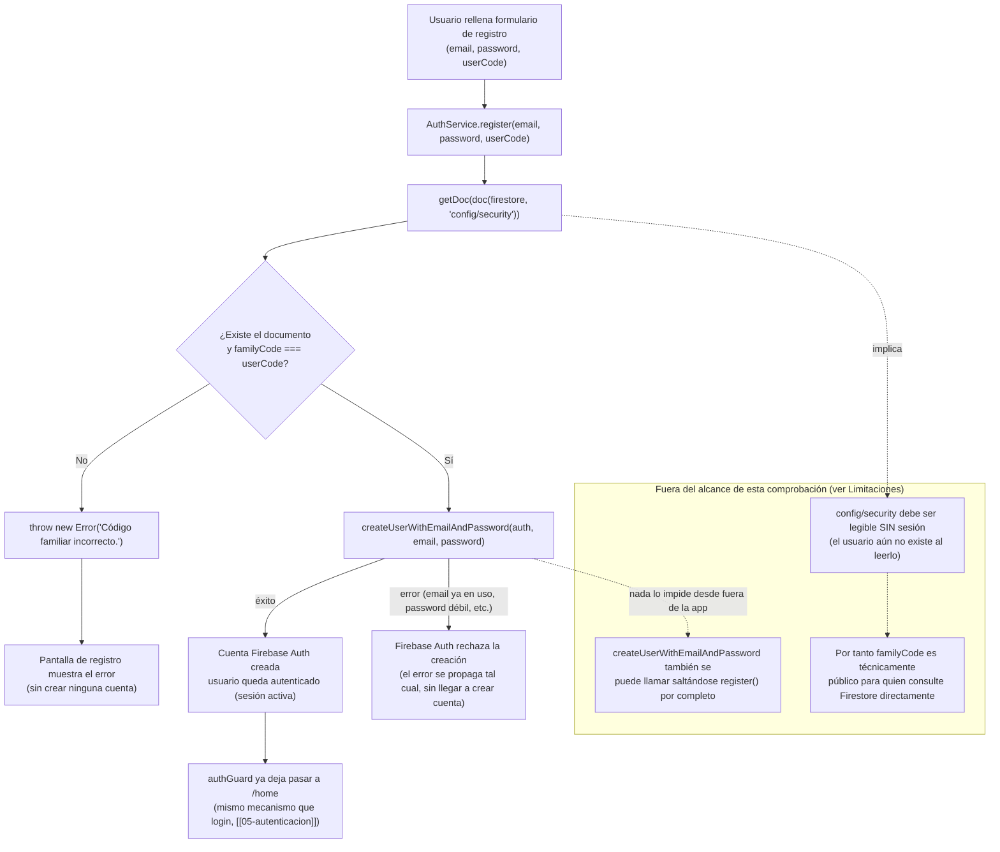

# 05b - Registro Seguro (Código Familiar) — RF-10 / RNF-08

**Rol:** [ARQUITECTO]
**Estado:** Diseño + implementación base del servicio (pendiente: pantalla de registro, Firestore Security Rules, y auditoría [REVIEWER] antes de cualquier commit, según sección 3 de `CLAUDE.md`)
**Archivos creados/modificados:**
- `requisitos.md` (nuevo RF-10, nuevo RNF-08)
- `src/app/app.config.ts` (`provideFirestore` + `getFirestore`)
- `src/app/core/services/auth.service.ts` (nuevo método `register(email, password, userCode)`)

> **Nota de numeración:** se pidió como "RF-05 (Registro Seguro)", pero `RF-05` ya está asignado a "Radar Inteligente (Cercanía)" en `requisitos.md`. Para no pisar un requisito existente, esta feature se numera **RF-10** (siguiente ID libre) y su RNF asociado **RNF-08**. El nombre del documento (`05b-...`) sí mantiene la relación con `[[05-autenticacion]]`, del que esta feature es una extensión directa (añade registro a lo que antes solo tenía login).

## Qué hace

Añade un método `AuthService.register(email, password, userCode)` que, antes de crear una cuenta de Firebase Auth, lee el documento `config/security` de Firestore y compara su campo `familyCode` con el `userCode` introducido por quien se registra. Solo si coinciden se llama a `createUserWithEmailAndPassword`; si no, se lanza `Error('Código familiar incorrecto.')` y no se crea ninguna cuenta.

## Diagrama de Flujo (Mermaid)

## Justificación de Diseño (ARQUITECTO)

1. **La lectura de `config/security` ocurre siempre ANTES de `createUserWithEmailAndPassword`, nunca después ni en paralelo.** Es una decisión deliberada: si se creara la cuenta primero y se validara el código después, un fallo de red entre ambos pasos podría dejar una cuenta huérfana ya creada en Firebase Auth sin haber pasado realmente el control — el orden actual garantiza que **nunca** existe una cuenta creada sin que el código ya se haya verificado correcto en esa misma ejecución.
2. **Coste: 1 lectura de Firestore por intento de registro (no por login, no recurrente).** Registrar una cuenta nueva es un evento raro en una app familiar (unas pocas veces en toda la vida de la app, no una operación de uso diario como el login) — el coste es despreciable frente al límite de la capa gratuita, coherente con la sección 1 de `CLAUDE.md` de minimizar lecturas.
3. **`config/security` como documento único y de solo lectura para el cliente** (en vez de, por ejemplo, una colección de "invitaciones" de un solo uso). Para una familia de pocos miembros, un único código compartido y reutilizable es más simple de gestionar manualmente (el administrador familiar lo escribe una vez desde la consola de Firebase) que un sistema de invitaciones individuales, que sería sobre-ingeniería para este caso de uso.
4. **El error se lanza como `Error` estándar (`throw new Error(...)`), no como un tipo de error específico de Firebase.** Mantiene el mismo patrón que `login()` de `[[05-autenticacion]]`: la pantalla de registro puede envolver la llamada en un único `try/catch` y mostrar `error.message`, sin necesidad de distinguir "vino de la validación del código" de "vino de Firebase Auth" en la UI — ambos casos son "no se pudo completar el registro, aquí tienes el motivo".
5. **`familyCode` se lee con el operador de acceso `securityDocSnap.data()?.['familyCode']` (no `.familyCode` directo), y se comprueba `securityDocSnap.exists()` explícitamente antes de comparar.** Si el documento `config/security` no existiera todavía (ej. antes de que el administrador familiar lo cree manualmente tras desplegar esta feature), `data()` devolvería `undefined` — sin el guard `!securityDocSnap.exists() || ...`, comparar `undefined !== userCode` seguiría siendo `true` (fallo seguro: rechaza el registro), pero el `.exists()` explícito documenta la intención y evita depender de ese comportamiento implícito de JavaScript.

## Limitaciones de Seguridad (ARQUITECTO — lectura obligatoria antes de desplegar)

**Esta comprobación es un filtro disuasorio del lado del cliente, NO un límite de acceso a datos.** Dos razones concretas, ambas inherentes al enfoque pedido (no arreglables sin cambiar de arquitectura):

1. **`config/security` tiene que ser legible sin sesión.** Cuando alguien se registra, todavía no tiene una cuenta ni un ID token — Firestore Security Rules no puede exigir `request.auth != null` para leer este documento en concreto, porque entonces nadie podría registrarse nunca. La única regla posible es algo como `allow get: if true;`. Esto significa que el valor de `familyCode` es, por diseño, **público para cualquiera que sepa consultar Firestore directamente** (con el `apiKey` del proyecto, que ya sabemos que es público — ver `[[05-autenticacion]]`), no solo para quien pase por el formulario de registro de la app.
2. **`register()` es una función de JavaScript en el cliente, no una Cloud Function.** Nada impide técnicamente a alguien con conocimientos técnicos (DevTools, o un script que hable directamente con la API REST de Firebase Auth) llamar a `createUserWithEmailAndPassword` **sin pasar por `register()` en absoluto**, saltándose la comprobación del código por completo — de la misma forma que ya se documentó para el `authGuard` de rutas en `[[05-autenticacion]]`.

**¿Por qué se implementa igualmente, sabiendo esto?** Como filtro disuasorio (evita que alguien encuentre la URL de la app y se registre sin más), el coste de implementarlo es mínimo y ya es lo que se pidió. Pero **la protección real de los datos de cada familia debe seguir viniendo de Firestore Security Rules basadas en `uid`** (RNF-07, ya en `requisitos.md`), no de si el registro se hizo con el código correcto: aunque alguien consiguiera crear una cuenta saltándose `register()`, esa cuenta no tendría acceso a los datos de otros usuarios si las Rules están bien escritas (`request.auth.uid == resource.data.uid` en la colección de gasolineras guardadas). El peor caso realista es "alguien crea una cuenta vacía que no puede ver ni modificar nada ajeno", no una fuga de datos.

**Camino recomendado para una protección real en el futuro (fuera de alcance de este commit):** mover la validación a una Cloud Function *callable* (`registerWithFamilyCode`) que use el Admin SDK para crear el usuario server-side tras validar el código — así el cliente nunca tiene una vía directa a `createUserWithEmailAndPassword`. Esto ya encaja con el stack aceptado en RNF-02 (Cloud Functions ya se usan para actualizar precios), pero implica pasar el proyecto a plan Blaze (pago por uso, con capa gratuita) — se deja como mejora futura explícita, no bloqueante para esta versión inicial.

## Pantalla de registro y navegación [UI-DEV]

**Rol:** [UI-DEV]
**Estado:** Implementado
**Archivos creados/modificados:**
- `src/app/pages/register/register.page.ts` / `.html` / `.scss` (nuevo)
- `src/app/pages/login/login.page.ts` / `.html` / `.scss` (enlace a `/register`)
- `src/app/app.routes.ts` (ruta `register`, sin `authGuard`)

### Qué hace

Formulario de registro (email, contraseña, Código Familiar) con el mismo patrón de Reactive Forms + `errorText` por campo que `LoginPage`. A diferencia del login, aquí sí se distingue el motivo del fallo con mensajes específicos: código familiar incorrecto (resalta el campo "Código Familiar"), email ya registrado (resalta el campo "Email"), o contraseña débil — porque, a diferencia del login, no hay riesgo de enumeración de cuentas que evitar (quien rellena un formulario de alta ya sabe si esperaba que ese email existiera o no). `login.page.html` incluye un enlace "¿No tienes cuenta de familia? Regístrate" hacia `/register`, y `register.page.html` el enlace inverso hacia `/login`.

### Justificación de Diseño (UI-DEV)

1. **Errores diferenciados por campo (`invalidFamilyCode`/`emailAlreadyInUse`), no un único mensaje genérico como en `LoginPage`.** El motivo de no generalizar el patrón "mensaje genérico" del login es intencionado: en login, decir "email no existe" facilitaría enumerar cuentas familiares; en registro, quien se equivoca de código o repite un email ya sabe cuál de los dos fue, así que ocultar el motivo solo generaría confusión sin aportar seguridad real (ver limitaciones de seguridad más arriba: el código ya es público por diseño, así que "ocultar" cuál de los dos falló no protege nada adicional).
2. **`firebaseErrorCode()` como type guard ligero (`'code' in error`) en vez de importar la clase `FirebaseError`.** Solo hace falta distinguir por el string `.code` (`auth/email-already-in-use`, `auth/weak-password`); importar la clase completa para un `instanceof` sería una dependencia extra sin beneficio real aquí.
3. **`Validators.minLength(6)` en el campo contraseña**, alineado con el mínimo real que exige Firebase Auth (`auth/weak-password` si se manda menos) — evita un viaje de red que Firebase iba a rechazar de todos modos por una validación que el cliente ya puede hacer gratis.
4. **Ruta `register` sin `authGuard`, a propósito** (`app.routes.ts`): la puerta real de esta pantalla no es el router — es la comprobación del Código Familiar dentro de `AuthService.register()` (ver limitaciones de seguridad de ARQUITECTO más arriba). Añadir un guard aquí no aportaría protección real y sí impediría el caso de uso básico (registrarse sin sesión previa).

### Verificado en navegador real (Playwright + Chromium headless, `ng serve`)

1. **`/register` accesible sin sesión** (sin redirect del guard): confirmado, la URL se mantiene en `/register` y el formulario se renderiza con sus 3 campos (`ion-input` × 3).
2. **Enlace desde `/login`**: "¿No tienes cuenta de familia? Regístrate" presente y funcional — clic navega a `/register`.
3. **Validación de cliente**, los 3 campos a la vez: email inválido → "Introduce un email válido."; contraseña de 3 caracteres → "La contraseña debe tener al menos 6 caracteres."; código vacío → "El código familiar es obligatorio." — las tres visibles simultáneamente tras marcar los campos como `touched`.
4. **Intento de registro real** (email nuevo, contraseña válida, código inventado) contra el proyecto Firebase real: como `config/security` todavía no existe (pendiente de creación manual, ver más abajo), `AuthService.register()` ejecuta su lectura real a Firestore, no encuentra el documento, y **el flujo completo termina correctamente en el mensaje "Código familiar incorrecto. Consulta el código con tu familia."**, resaltando el campo correspondiente — sin errores de consola, sin quedarse atascado en el estado de carga, y sin crear ninguna cuenta (comportamiento correcto y ya verificado de extremo a extremo, no solo por lectura de código).
5. **No verificado en este entorno** (requiere que `config/security` exista primero): el camino de éxito completo (código correcto → cuenta creada → redirección a `/home`) y el caso "email ya registrado" (`auth/email-already-in-use`) — ambos dependen de que el documento de configuración ya esté creado en Firestore, que es justo el primer pendiente de la lista de abajo.

## Pendiente para que la feature esté completa (fuera de alcance de este documento)

- [ARQUITECTO]: crear manualmente el documento `config/security` en la consola de Firebase con el campo `familyCode` (string) antes de que nadie intente registrarse de verdad — hoy no existe, así que cualquier intento de registro fallará con "Código familiar incorrecto." hasta que se cree (ya verificado que ese fallo ocurre correctamente, ver verificación de UI-DEV arriba). **`familyCode` debe guardarse como tipo `string` en Firestore** (ver hallazgo 1.4 de la auditoría [REVIEWER] más abajo).
- [ARQUITECTO]/[REVIEWER]: desplegar Firestore Security Rules explícitas: `config/security` con `allow get: if true; allow list, write: if false;`, y confirmar que ninguna otra colección queda accesible sin autenticar.
- [Usuario]: una vez creado `config/security`, probar manualmente el camino de éxito completo y el caso "email ya registrado" (no verificables en este entorno sin ese documento).

---

## Auditoría [REVIEWER]

**Rol:** [REVIEWER]
**Archivos auditados:**
- `src/app/core/services/auth.service.ts` (`register()`)
- `src/app/pages/register/register.page.ts` / `.html`
- `src/app/app.routes.ts`
- `src/app/core/guards/auth.guard.ts`

### 1. ¿Está expuesta la validación de código a inyecciones o fallos lógicos?

- [x] **La comparación es estricta: `familyCode !== userCode` (`auth.service.ts:63`), no `!=`.** Confirmado leyendo el código: usa el operador de desigualdad estricta de JavaScript, que nunca hace coerción de tipos — a diferencia de `!=`/`==`, no existen casos donde `"0" != false`, `null != undefined`, `"" != 0`, etc. terminen colándose como una coincidencia falsa. Es exactamente la forma pedida (`if (userCode === dbCode)`, aquí escrita como su negación `!==` dentro de un guard que rechaza).
- [x] **Sin superficie de inyección hacia Firestore.** `userCode` (ni `email` ni `password`) se usa nunca para construir la consulta: `doc(this.firestore, SECURITY_CONFIG_PATH)` usa una ruta constante fija (`'config/security'`, definida como constante de módulo), no interpolada con ningún valor introducido por el usuario. El SDK de Firestore además es tipado (llamadas a función, no strings de consulta concatenados), así que no existe un equivalente a la inyección SQL/NoSQL clásica aquí — `userCode` solo se usa en una comparación de strings en memoria, después de que la lectura a Firestore ya ha vuelto.
- [x] **Verificado en navegador real (Playwright) con 7 payloads adversarios** contra el `register()` real (email nuevo válido + contraseña válida + código malicioso): string con forma de operador NoSQL (`{"$gt":""}`), string con forma de inyección SQL (`' OR '1'='1`), string de 2000 caracteres, emoji/unicode, solo espacios en blanco, y los strings literales `"null"` y `"undefined"` (para descartar coerción accidental con los valores `null`/`undefined` reales de JS). **Los 7 intentos terminaron correctamente en "Código familiar incorrecto." — ninguno creó una cuenta, ninguno lanzó una excepción no controlada, cero errores de consola.**
- [x] **Fail-closed ante documento inexistente o campo ausente.** `!securityDocSnap.exists() || familyCode !== userCode` (`auth.service.ts:63`): si el documento no existe, `.exists()` es `false` y el `||` corta inmediatamente sin llegar a evaluar la comparación — no hay forma de que un documento ausente o un campo `familyCode` no definido (`undefined`) se cuele como "código correcto", porque `undefined !== "cualquier string no vacío"` es siempre `true` (rechaza) y el guard de `.exists()` cubre además el caso límite de que alguien guardara `familyCode: undefined` explícitamente.
- [ ] ⚠️ **Hallazgo (severidad baja, defensa en profundidad, no explotable hoy):** `register()` no valida que `userCode` sea no-vacío antes de comparar — depende por completo de `Validators.required` en `RegisterPage` para que nunca llegue una cadena vacía. Hoy esto es seguro porque `!securityDocSnap.exists()` corta primero (el documento no existe), pero el día que `config/security` exista y si alguien (código futuro, o una llamada directa a `AuthService.register()` fuera del formulario) pasara `userCode = ''`, y por un error de configuración `familyCode` en Firestore también fuera la cadena vacía, la comparación `'' !== ''` es `false` y el registro se aceptaría. **Recomendación:** añadir un guard explícito `if (!userCode || !securityDocSnap.exists() || familyCode !== userCode)` en el propio servicio, para no depender únicamente de la validación de la UI. No bloqueante para este commit (inalcanzable hoy sin pasar por el formulario, y requeriría además una configuración accidental de `familyCode: ''` en Firestore), pero recomendado antes de que `register()` tenga más puntos de entrada.
- [ ] ⚠️ **Nota operativa (no es un bug de código):** `familyCode` debe guardarse en Firestore como **string**. Si se guarda como número (ej. `1234` en vez de `"1234"`), la comparación `!==` nunca podrá coincidir con el valor del formulario (que siempre es `string`), y **todos** los registros fallarían con "Código familiar incorrecto." aunque el usuario escriba los dígitos correctos — no es una vulnerabilidad, pero sí un footgun operativo real para quien cree el documento manualmente. Añadido como nota al pendiente de ARQUITECTO más arriba.

**Veredicto punto 1: correcto y verificado empíricamente. La comparación es estricta, sin coerción de tipos, sin superficie de inyección hacia Firestore, y con comportamiento fail-closed confirmado tanto por lectura de código como contra 7 payloads adversarios reales. Un hallazgo menor de defensa en profundidad (validar no-vacío también en el servicio) queda documentado pero no es explotable con el código actual.**

### 2. ¿Login y registro accesibles sin sesión, con el mapa bloqueado?

- [x] **Verificado en navegador real (Playwright), no solo por lectura de código**, con sesión limpia (sin cookies/estado previo):
  - `GET /` → termina en `/login` (el guard de `home` intercepta el `redirectTo`).
  - `GET /login` → se queda en `/login` (accesible, sin redirect).
  - `GET /register` → se queda en `/register` (accesible, sin redirect) — confirma que la ruta `register` (sin `canActivate`, `app.routes.ts:15-17`) es alcanzable sin sesión, tal como se diseñó.
  - `GET /home` (URL directa, tecleada) → rebota a `/login` — el mapa sigue bloqueado, `authGuard` sigue interceptando esta ruta exactamente igual que antes de añadir el registro.
- [x] **Añadir la ruta `register` no tocó la definición de `home` ni de `authGuard`** (`app.routes.ts`, `auth.guard.ts`): confirmado por `git diff` de este ciclo — el guard de `home` es el mismo objeto/función ya auditado en `[[05-autenticacion]]`, no una copia nueva que pudiera haberse escrito con un descuido.

**Veredicto punto 2: correcto y verificado end-to-end. `login` y `register` son accesibles sin sesión; `home` sigue exigiendo `authGuard` sin cambios respecto a la auditoría anterior.**

### 3. Otras comprobaciones

- [x] **`ng build --configuration development` y `npm run lint`**: sin errores, ejecutados de nuevo sobre el estado final de este ciclo.
- [x] **Sin XSS en `register.page.html`**: solo interpolación `{{ }}` y bindings de `formControlName`/Ionic — ningún `[innerHTML]` ni construcción de HTML a partir de `email`/`password`/`familyCode`.
- [x] **Coste**: 1 lectura de Firestore por intento de registro (confirmado también en los 7 intentos de la prueba adversaria — cada uno generó exactamente una lectura a `config/security`, sin lecturas adicionales ni reintentos).
- [x] **Cero errores de consola** en las 11 navegaciones/envíos de formulario realizados durante esta auditoría (4 de routing + 7 de payloads adversarios).

### Veredicto final

**Aprobado para commit.** La validación del código familiar usa comparación estricta (`!==`) sin coerción de tipos, no tiene superficie de inyección hacia Firestore (la ruta del documento es fija, `userCode` nunca llega a la consulta), y falla de forma segura (fail-closed) ante documento inexistente — verificado tanto por lectura de código como con 7 payloads adversarios reales contra el proyecto Firebase, sin ninguna cuenta creada indebidamente. Las rutas `login` y `register` son accesibles sin sesión y `home` sigue bloqueada por `authGuard`, sin regresión respecto a la auditoría anterior. Dos notas no bloqueantes quedan documentadas: un guard de no-vacío recomendado en el propio servicio (defensa en profundidad) y la advertencia operativa de guardar `familyCode` como `string` en Firestore.
