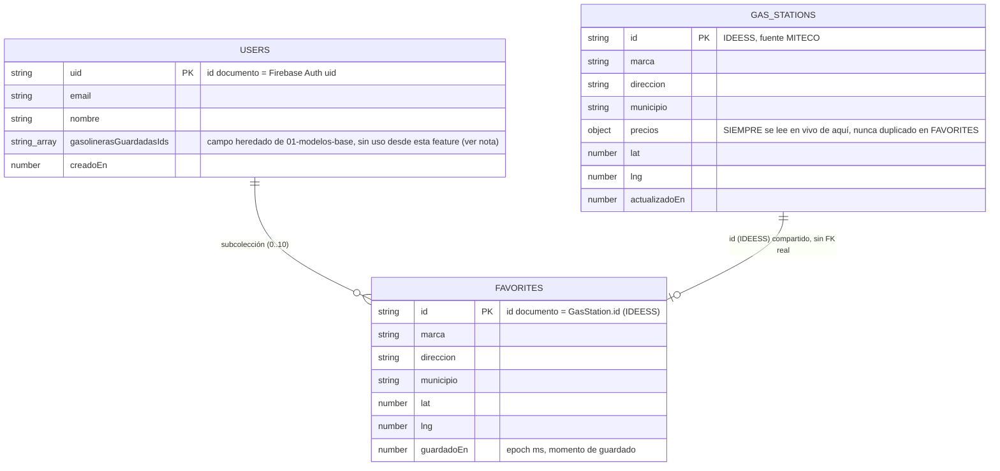
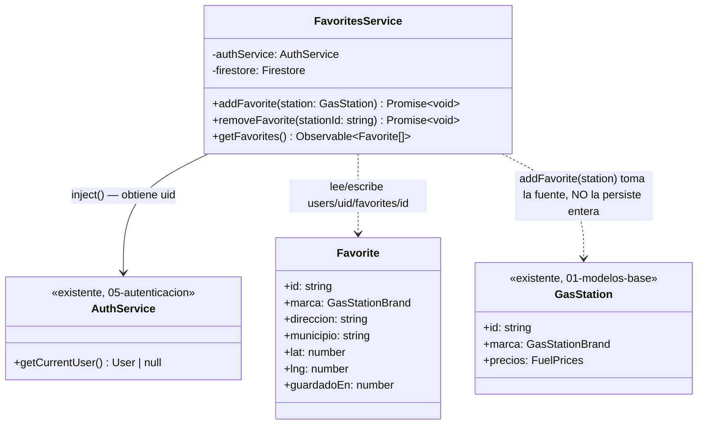
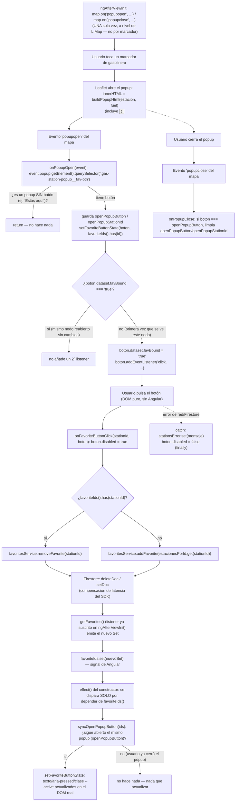
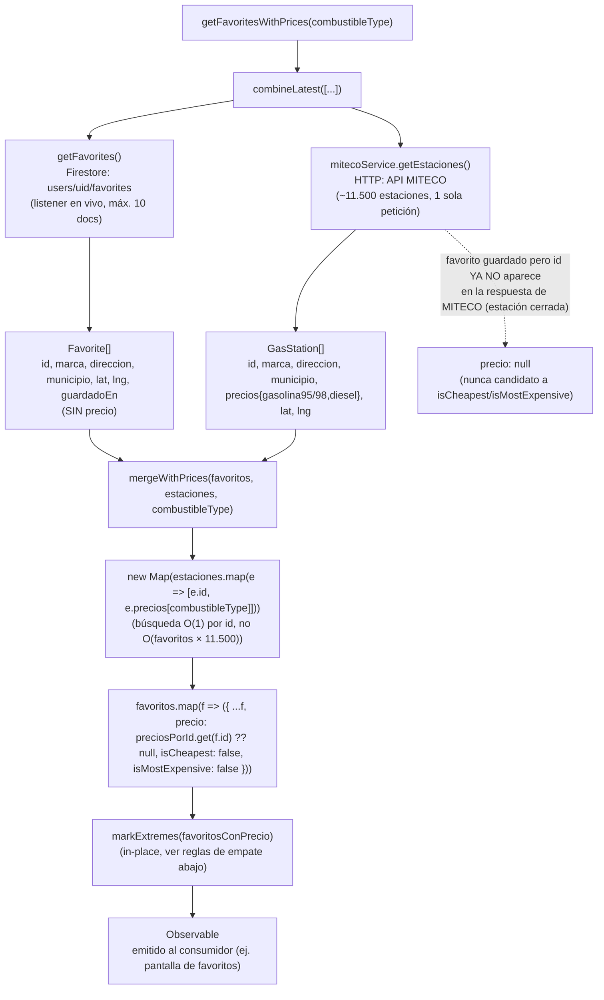
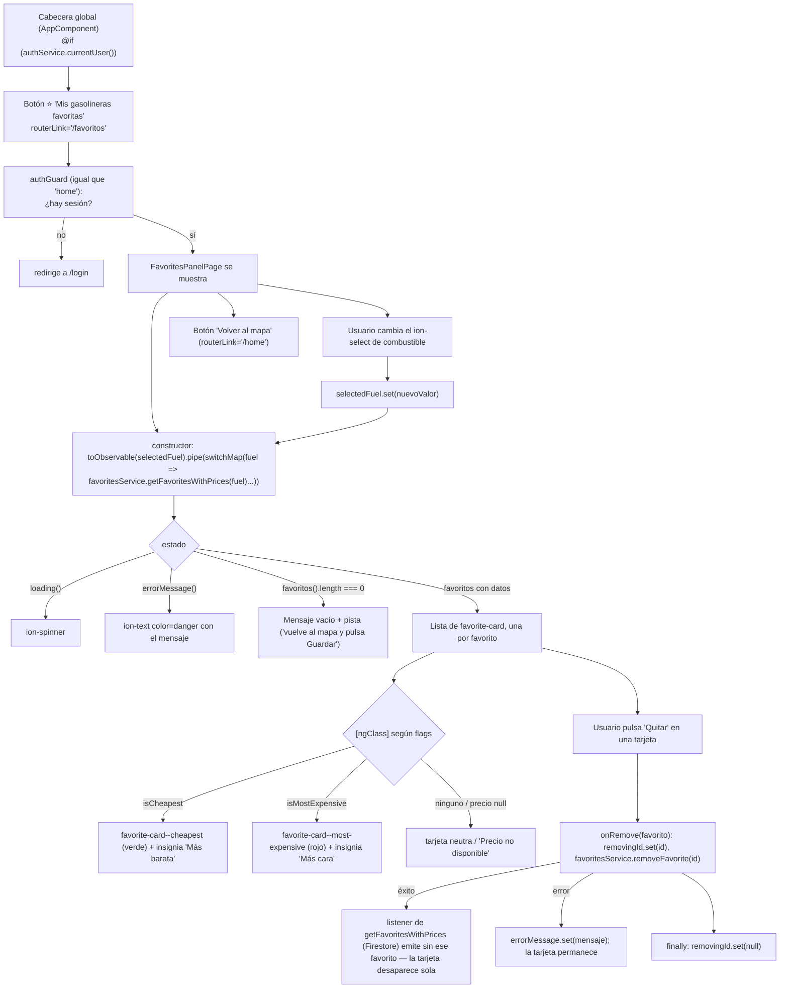
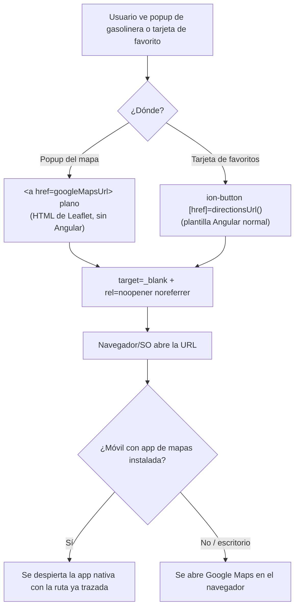
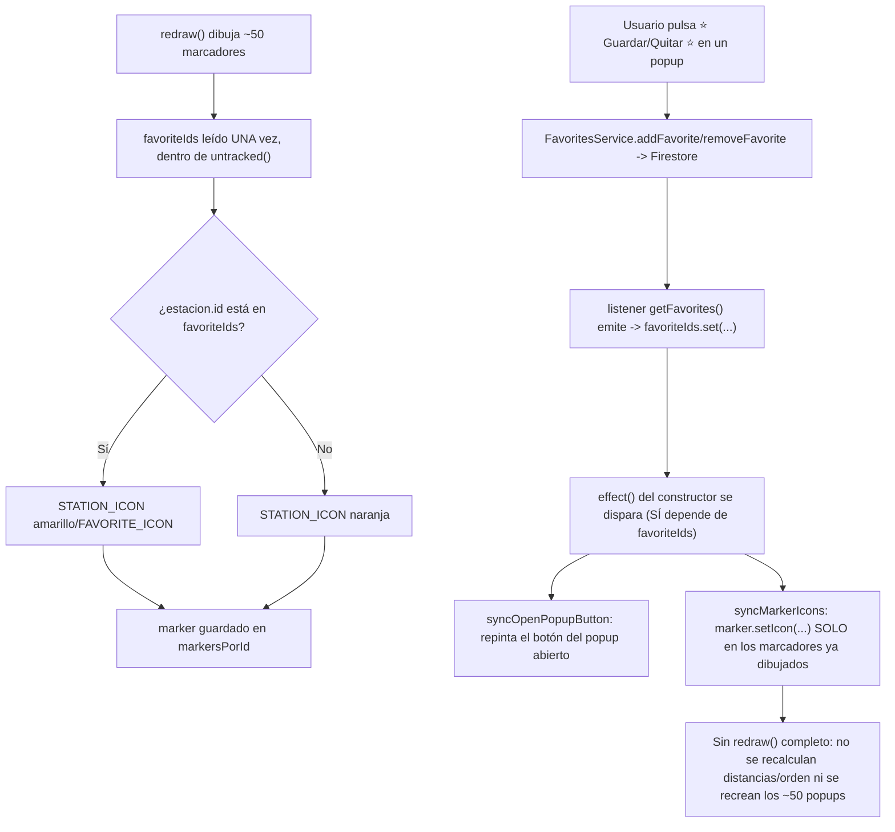

# 06 - Favoritos (RF-04)

**Rol:** [ARQUITECTO]
**Estado:** Diseño + implementación base (pendiente auditoría [REVIEWER] antes de commit, según sección 3 de `CLAUDE.md`)
**Archivos generados:**
- `src/app/core/models/favorite.model.ts`
- `src/app/core/services/favorites.service.ts`

## Qué hace

Permite guardar/quitar gasolineras como favoritas y consultar la lista en vivo, respaldado por la subcolección `users/{uid}/favorites` de Firestore. `FavoritesService` expone `addFavorite(station)`, `removeFavorite(stationId)` y `getFavorites()`.

## Diagrama Entidad-Relación (Mermaid)



> **Nota sobre la relación `GAS_STATIONS ||--o| FAVORITES`:** no es una relación de Firestore (no hay claves foráneas ni joins nativos). Se representa porque `FAVORITES.id` **coincide por diseño** con `GAS_STATIONS.id` (mismo IDEESS) — es la clave que permite, cuando haga falta el precio actual de un favorito, hacer `getDoc(gasStations/{id})` bajo demanda en vez de duplicar `precios` en el documento de favorito.

## Diagrama de Clases (Mermaid)



## Justificación de Diseño (ARQUITECTO)

1. **Subcolección `users/{uid}/favorites`, no el array `AppUser.gasolinerasGuardadasIds` ya definido en `[[01-modelos-base]]`.** El array evita duplicar datos, pero fuerza dos limitaciones para esta feature: (a) no hay dónde colgar metadatos por favorito (p. ej. `guardadoEn`, útil para ordenar "añadido recientemente") sin convertir el array en array-de-objetos y perder la ventaja de simplicidad; (b) cualquier alta/baja exige leer el documento `users/{uid}` completo, mutar el array en memoria y reescribirlo entero. Una subcolección con **id de documento = `GasStation.id` (IDEESS)** resuelve ambas cosas: cada favorito es su propio documento (hay sitio para `guardadoEn`), y añadir/quitar es un único `setDoc`/`deleteDoc` puntual, sin leer ni reescribir el documento de usuario. **Nota para REVIEWER/futuro:** `AppUser.gasolinerasGuardadasIds` queda sin uso desde esta feature; no se ha tocado `user.model.ts` por estar fuera del alcance encargado, pero debería marcarse como deprecado o eliminarse en un ciclo posterior para no mantener dos fuentes de verdad de "gasolineras guardadas".
2. **Id de documento = `GasStation.id` (IDEESS), no un id autogenerado.** Igual que la razón ya documentada para `gasStations` en `[[03-capa-gasolineras]]`: permite que `addFavorite` sea un `setDoc` idempotente (guardar una gasolinera ya guardada sobrescribe el mismo documento en vez de crear un duplicado) sin necesitar una lectura previa de comprobación ("¿ya existe?").
3. **El documento `Favorite` NO incluye `precios`.** Los precios de una estación pueden cambiar a diario (sincronización periódica sobre `gasStations`); si se copiaran en cada `Favorite`, cada actualización de precio tendría que propagarse también a los documentos de favoritos de todos los usuarios que la tuvieran guardada — multiplicando escrituras sin necesidad. En su lugar, `Favorite` solo guarda los campos **estáticos** (marca, dirección, municipio, coordenadas) para poder pintar la lista sin una segunda consulta, y el precio se lee bajo demanda de `gasStations/{id}` cuando la UI lo necesite (mismo principio que `[[01-modelos-base]]` aplicó a `AppUser.gasolinerasGuardadasIds`).
4. **`addFavorite` recibe el objeto `GasStation` completo (no solo el id) para poder guardar esa réplica estática**, evitando que `FavoritesService` tenga que hacer una lectura adicional de `gasStations/{id}` solo para copiar `marca`/`direccion`/`municipio`/`lat`/`lng` — el componente que llama a `addFavorite` ya tiene el objeto completo en memoria (viene de la capa de mapa/lista, `[[03-capa-gasolineras]]`).
5. **Límite de `MAX_GASOLINERAS_GUARDADAS = 10` comprobado con `getCountFromServer`, no `getDocs`.** Es una consulta de agregación: cuesta **1 sola lectura** de Firestore sin importar cuántos documentos tenga la subcolección, frente a `getDocs` que costaría hasta 10 lecturas (una por documento) solo para contarlos antes de decidir si se puede escribir. Reutiliza la misma constante ya exportada por `[[01-modelos-base]]` (`user.model.ts`), evitando un límite mágico duplicado.
6. **La comprobación del límite es de UX en el cliente, no el límite de seguridad real** — mismo patrón ya documentado para el código familiar en `AuthService.register` (`[[05b-registro-seguro]]`). Nada impide técnicamente a alguien con conocimientos técnicos saltarse `FavoritesService` y escribir directamente un 11º documento en `users/{uid}/favorites` vía la API de Firestore. El límite efectivo debe reforzarse con Firestore Security Rules (`request.resource... size` sobre la subcolección) antes de producción — pendiente, igual que el resto de reglas ya señaladas como bloqueantes en `[[05-autenticacion]]`.
7. **Caso límite conocido y aceptado, no bloqueante:** si un usuario ya tiene exactamente 10 favoritos y vuelve a llamar `addFavorite` sobre una estación **ya guardada** (re-guardar la misma), `getCountFromServer` devuelve 10 y la operación se rechaza, aunque en realidad sería un `setDoc` de sobreescritura (no un alta nueva) y debería permitirse. Se acepta este límite porque la UI (capa `[[UI-DEV]]`, fuera de este documento) debe mostrar `addFavorite` solo para estaciones que **no** están ya en la lista de favoritos (alternando por un botón "guardar"/"quitar"), evitando que este caso se dé en el flujo normal.
8. **`getFavorites()` devuelve un `Observable<Favorite[]>` en vivo (`collectionData`), no una `Promise` de una sola lectura.** La subcolección está acotada a un máximo de 10 documentos (regla de coste cero ya vigente), así que un listener en tiempo real es barato: 1 lectura por documento en la carga inicial (máx. 10) y luego solo 1 lectura por cambio puntual, no reconsultas completas. A cambio, la pantalla de favoritos se actualiza sola tras un `addFavorite`/`removeFavorite` sin tener que refrescar manualmente. **Responsabilidad de quien consuma este Observable (`[[UI-DEV]]`, fuera de este documento):** debe cancelar la suscripción con `takeUntilDestroyed` al salir de la pantalla, según la sección 3 de `CLAUDE.md` — a diferencia de `AuthService.currentUser`, este listener SÍ vive y muere con el componente que lo consuma, no con el `ApplicationRef`.
9. **`requireUid()` lee `authService.getCurrentUser()` de forma síncrona, no espera un signal/observable de sesión.** Todas las rutas donde este servicio se usará están protegidas por `authGuard` (`[[05-autenticacion]]`), que ya espera la primera emisión real de Firebase antes de permitir la navegación — para cuando un componente pueda invocar `FavoritesService`, la sesión ya está resuelta. Mismo patrón ya usado y justificado en `AuthService.getCurrentUser()`.

## Seguridad y Costes (resumen ARQUITECTO, pendiente de auditoría [REVIEWER] formal)

- **Lecturas por operación:** `addFavorite` = 1 (agregación de conteo) + 1 escritura. `removeFavorite` = 0 lecturas + 1 escritura. `getFavorites()` = hasta 10 lecturas en la carga inicial (listener), después 1 lectura por cambio real. Todo acotado por el límite de 10 favoritos ya vigente en el proyecto.
- **Cero APIs de pago.** Solo Firestore, ya en uso desde `[[05-autenticacion]]`.
- **Pendiente explícito antes de producción (no bloqueante para este ciclo de diseño):** Firestore Security Rules para `users/{uid}/favorites` — `request.auth.uid == uid` para lectura/escritura, y límite de tamaño (`<= 10` documentos) replicado server-side. Sigue la misma nota bloqueante ya abierta en `[[05-autenticacion]]` (punto 3, hallazgo del `[REVIEWER]`) de que hoy no existe ningún `firestore.rules` en el repositorio.
- **Fugas de memoria:** `FavoritesService` no mantiene suscripciones propias (no hay `ngOnDestroy` que escribir aquí); el listener real solo se crea cuando un componente se suscribe al `Observable` devuelto por `getFavorites()`, y es responsabilidad de ese componente limpiarlo (ver punto 8 de diseño).

## Próximos pasos (fuera de alcance de este documento)

- ~~**[UI-DEV]**: botón guardar/quitar en el popup de gasolinera del mapa que llame `addFavorite`/`removeFavorite`.~~ **Hecho, ver sección [UI-DEV] más abajo.**
- **[UI-DEV] (futuro):** pantalla/lista dedicada de favoritos que consuma `getFavorites()` con `takeUntilDestroyed` fuera del mapa (ej. una pestaña "Mis gasolineras").
- **[REVIEWER]**: auditoría formal de este servicio y de la integración con el mapa antes de commit (sección 3 de `CLAUDE.md`) — confirmar el análisis de costes de este documento, revisar el caso límite del punto 7, y dejar constancia explícita del pendiente de Firestore Security Rules.
- **[ARQUITECTO] (futuro):** decidir si `AppUser.gasolinerasGuardadasIds` se elimina de `user.model.ts` o se marca `@deprecated`, dado que queda sin uso desde esta feature (ver punto 1 de diseño).

---

## Integración con el mapa (popup de gasolinera)

**Rol:** [UI-DEV]
**Estado:** Implementado (pendiente auditoría [REVIEWER] antes de commit, según sección 3 de `CLAUDE.md`)
**Archivos modificados:**
- `src/app/shared/components/map/map.component.ts` — inyecta `FavoritesService`, suscribe `getFavorites()`, añade el botón de favorito al popup y lo conecta a Leaflet.
- `src/global.scss` — estilos del botón `.gas-station-popup__fav-btn` (claro/oscuro, hover, foco, disabled, activo).

### Qué hace

Cada popup de gasolinera del mapa (`bindPopup`) incluye ahora un botón "⭐ Guardar" / "Quitar ⭐" bajo el precio. Al abrir el mapa, el componente carga en vivo los favoritos del usuario activo (`FavoritesService.getFavorites()`) para saber qué botones deben nacer ya en estado "Quitar ⭐". Pulsar el botón llama a `addFavorite`/`removeFavorite`, y el propio botón se repinta solo cuando Firestore confirma el cambio.

### El problema: Leaflet no es Angular

`bindPopup(html)` inyecta el string `html` directamente como `innerHTML` de un nodo del DOM que Leaflet crea y gestiona **fuera** del árbol de componentes de Angular (no pasa por el compilador de plantillas). Eso significa que:

- No existe `(click)="algo()"` posible dentro de ese HTML: Angular nunca lo procesa, así que un atributo así se queda como texto literal, no como binding.
- El nodo del botón no aparece en el DOM hasta que el usuario hace click sobre un marcador y Leaflet abre su popup — no se puede hacer `@ViewChild` de un botón que ni siquiera existe todavía cuando el componente se inicializa.
- El único momento en que ese botón concreto existe en el DOM es entre los eventos `popupopen` y `popupclose` de ese popup.

### Diagrama de Flujo (Mermaid): del click en el popup a Firestore y de vuelta



### Justificación de Diseño (UI-DEV)

1. **`map.on('popupopen'/'popupclose', ...)` UNA sola vez en `ngAfterViewInit`, no un listener por marcador.** Es un evento del propio `L.Map`, que burbujea para cualquier popup que se abra en él (usuario o gasolinera) — registrar un único par de listeners a nivel de mapa cubre los hasta 50 marcadores dibujados en cada `redraw()` sin tener que añadir/quitar listeners por marcador cada vez que la lista se redibuja.
2. **`querySelector('.gas-station-popup__fav-btn')` como filtro, no asumir que todo `popupopen` trae un botón.** El popup "Estás aquí" del marcador de usuario (`centerOnUser`) no tiene botón de favorito; `onPopupOpen` simplemente no encuentra el selector y no hace nada, sin necesitar una segunda función de evento distinta para ese caso.
3. **`data-station-id` en el botón (no un cierre/closure guardado en otro sitio) para identificar la estación.** Es el único dato que sobrevive el viaje "string de HTML → `innerHTML` real del DOM → `querySelector` en `onPopupOpen`" — un closure de JS no puede cruzar ese límite, pero un atributo HTML sí. Se escapa con `escapeHtmlAttribute` (aunque `GasStation.id`/IDEESS es en la práctica siempre numérico) por el mismo criterio defensivo que ya aplicaba `buildPopupHtml` a `marca`.
4. **`boton.dataset['favBound']` como guarda contra doble-binding.** Leaflet reutiliza el mismo nodo DOM del botón si el usuario cierra y reabre el mismo popup sin que su `innerHTML` haya cambiado entre medias (ej. no cambió de combustible ni de favorito). Sin esta guarda, cada apertura añadiría un `addEventListener` más sobre el mismo botón, y un solo click acabaría disparando `onFavoriteButtonClick` N veces (N = número de veces que se abrió ese popup), duplicando llamadas a Firestore. La guarda vive en el propio nodo (`dataset`), no en una propiedad del componente, así que sigue siendo válida aunque cambie qué popup está "abierto" en `openPopupButton`.
5. **`favoriteIds()` se lee con `untracked()` dentro de `buildPopupHtml`.** El componente ya tenía un `effect(() => this.redraw())` cuya única dependencia reactiva debía ser `selectedFuel` (invariante ya documentado y comentado en el propio código, ligado a un bug real anterior de este mismo archivo). Si `buildPopupHtml` —invocada desde dentro de `redraw()`— leyera la signal `favoriteIds` sin `untracked()`, Angular la habría registrado como una segunda dependencia de ESE efecto: cada alta/baja de favorito habría vuelto a ejecutar `redraw()` entero, redibujando los ~50 marcadores del mapa y, en particular, destruyendo (`stationsLayer.clearLayers()`) el propio popup que el usuario acababa de usar para pulsar el botón — cerrándoselo en la cara justo después del click.
6. **Segundo `effect()` independiente, dedicado solo a repintar el popup abierto.** En vez de depender de `favoriteIds` en el efecto de `redraw`, se creó un efecto nuevo que SÍ depende de `favoriteIds()` pero cuyo cuerpo (`syncOpenPopupButton`) no toca Leaflet en absoluto: solo actualiza el texto/clase/`aria-pressed` del botón (`HTMLButtonElement`) que quedó guardado en `openPopupButton` al abrirse. Resultado: guardar/quitar un favorito nunca redibuja el mapa, solo el propio botón que el usuario está mirando.
7. **Sin actualización optimista manual del botón en el click.** `onFavoriteButtonClick` deshabilita el botón (`disabled = true`, evita doble-click mientras la escritura está en vuelo) y llama al servicio, pero no cambia el texto del botón a mano tras un `then()`. La corrección del texto llega siempre por el mismo camino (Firestore → listener de `getFavorites()` → signal `favoriteIds` → efecto → `setFavoriteButtonState`), evitando tener DOS sitios que puedan escribir el estado visual del botón y desincronizarse entre sí. Es aceptable en UX porque los listeners de Firestore aplican compensación de latencia (el propio SDK refleja una escritura local casi al instante, sin esperar la confirmación real del servidor), así que el usuario percibe el cambio como inmediato en la práctica.
8. **`boton.disabled = true/false` alrededor de la promesa (`finally`), sin bloquear el resto del popup.** Evita que un doble-tap accidental dispare dos operaciones concurrentes sobre el mismo documento (ej. `addFavorite` dos veces seguidas mientras la primera aún no ha resuelto).
9. **Estilos del botón en `global.scss`, no en `map.component.scss`.** Mismo motivo ya documentado para el resto del popup (`.gas-station-popup__marca`/`__precio`): al vivir el HTML del popup fuera del árbol de Angular, la encapsulación de estilos por componente (`ViewEncapsulation.Emulated`, por defecto) no le llega — los `data-*`/clases que genera `map.component.scss` con su atributo de encapsulación (`_ngcontent-*`) nunca se aplican a un nodo que Angular no renderizó. Se añaden variantes clara/oscura explícitas (`prefers-color-scheme`) coherentes con el resto del popup, más `:focus-visible` (navegación por teclado/lector de pantalla) y un estado `:disabled` (`cursor: wait`, opacidad reducida) para el intervalo en que la escritura está en curso.
10. **`ngOnDestroy` no necesita un `map.off('popupopen', ...)` explícito.** `map.remove()` (ya existente, línea de limpieza original del componente) desengancha todos los listeners registrados con `map.on(...)`, incluidos los dos nuevos — confirmado en la documentación de Leaflet (`Map.remove()` "removes the map... clears all handlers bound to the map"). Sí se limpian a mano `openPopupButton`/`openPopupStationId`/`estacionesPorId` por higiene (referencias a nodos/objetos que de todas formas van a desecharse con el propio DOM del mapa), no porque fueran a causar una fuga real.

### Verificación

- **`npx tsc --noEmit`, `npm run lint` y `ng build --configuration development`**: los tres pasan sin errores tras el cambio (comprobado en este ciclo).
- **Verificación end-to-end en navegador: NO realizada en este ciclo.** Igual que ya ocurrió en `[[05-autenticacion]]`, no hay credenciales de una cuenta de Firebase real disponibles en este entorno para llegar más allá de `/login`, y crear/eliminar una cuenta de prueba contra el proyecto Firebase real de producción (como hizo `[REVIEWER]` en esa auditoría) es una decisión que corresponde a la fase de auditoría, no a este ciclo de UI-DEV. **Pendiente explícito para `[REVIEWER]`:** confirmar en un navegador real, con una cuenta de prueba desechable, que (a) el botón nace en el estado correcto según los favoritos existentes, (b) guardar/quitar actualiza el botón sin redibujar el mapa ni cerrar el popup, (c) no hay listeners duplicados al reabrir el mismo popup varias veces (un solo `addFavorite`/`removeFavorite` por click), y (d) el aspecto en modo oscuro del sistema es legible (contraste).

---

## Auditoría [REVIEWER]

**Rol:** [REVIEWER]
**Archivos auditados:**
- `src/app/core/services/favorites.service.ts`
- `src/app/core/models/favorite.model.ts`
- `src/app/shared/components/map/map.component.ts`
- `src/global.scss`
- `src/app/core/services/auth.service.ts` (contrato de `getCurrentUser()` consumido por `FavoritesService`)
- Código fuente de Leaflet (`node_modules/leaflet/dist/leaflet-src.js`) para verificar el ciclo de vida real de popups/marcadores, no solo su documentación pública.

Metodología: revisión de código línea a línea + trazado manual de las rutas de ejecución de las dos preguntas encargadas, apoyado en `npx tsc --noEmit`, `npm run lint` y `ng build` (dev y producción) tras cada cambio. **No incluye una verificación end-to-end en navegador con una cuenta de Firebase real** (a diferencia de la auditoría de `[[05-autenticacion]]`): crear/eliminar una cuenta de prueba contra el proyecto Firebase real de producción no se ha ejecutado en este ciclo por no tener autorización explícita para ello; queda como pendiente no bloqueante (ver sección final).

### 1. ¿Qué pasa si un usuario no está logueado e intenta usar `FavoritesService`?

- [x] **Los tres métodos comprueban sesión ANTES de tocar Firestore, nunca después.** `addFavorite`, `removeFavorite` y (tras el fix de este ciclo, ver hallazgo 1.1) `getFavorites` obtienen el `uid` como primer paso; si no hay sesión, ninguno de los tres llega a construir una referencia de Firestore ni a hacer una petición de red. Ningún dato de otro usuario, ni de nadie, es alcanzable sin `AuthService.getCurrentUser()` devolviendo un `uid` real.
- [x] **En el flujo normal de la app esto no es alcanzable de todas formas:** `MapComponent` (el único consumidor hoy) solo se instancia en la ruta `home`, protegida por `authGuard` (`[[05-autenticacion]]`), que espera la primera emisión real de Firebase antes de permitir la navegación. Un usuario sin sesión nunca llega a ver el mapa ni, por tanto, a disparar ninguna llamada a `FavoritesService`.
- [ ] ⚠️ **HALLAZGO 1.1 (CONFIRMADO, corregido en este ciclo de auditoría): `getFavorites()` podía romper el resto de `ngAfterViewInit()` si `requireUid()` lanzaba.** Antes del fix, `getFavorites()` era un método **no** `async` que llamaba a `requireUid()` (que hace `throw new Error(...)` si no hay `uid`) en su primera línea, ANTES de devolver el `Observable`. Un `throw` de una función normal (no `async`) es una excepción síncrona de verdad, no un error empaquetado en el `Observable` — se comprobó ejecutando el razonamiento contra el propio código: `map.component.ts` llama a `this.favoritesService.getFavorites().pipe(...).subscribe(...)` **antes** de `this.locationService.getCurrentPosition()...subscribe(...)` dentro de `ngAfterViewInit()`. Si `getFavorites()` lanzara, esa excepción síncrona interrumpiría `ngAfterViewInit()` en ese punto exacto y **el resto del método nunca se ejecutaría** — en particular, la suscripción a la geolocalización y a `loadNearestStations()`, dejando el mapa sin estaciones y sin ningún mensaje de error visible para el usuario (el `ErrorHandler` global de Angular lo registraría en consola, pero `stationsError`/`locationError` nunca se activarían porque ese código nunca llega a ejecutarse). Nótese la asimetría con `addFavorite`/`removeFavorite`: al ser funciones `async`, un `throw` síncrono en su primera línea SÍ se convierte automáticamente en una `Promise` rechazada (comportamiento estándar de JavaScript), por lo que esos dos métodos ya eran seguros — la inconsistencia estaba solo en `getFavorites()`.
  - **Explotabilidad real hoy: baja** (`authGuard` ya impide llegar aquí sin sesión en el flujo normal), pero es un punto único de fallo frágil: cualquier cambio futuro de rutas/guards, o que `AuthService.getCurrentUser()` devuelva `null` en una ventana de carrera (ej. token revocado exactamente entre el guard y `ngAfterViewInit`), rompería silenciosamente **todo el mapa**, no solo los favoritos.
  - **Corrección aplicada:** `getFavorites()` ya no llama a `requireUid()` (que lanza). Comprueba el `uid` directamente y, si falta, devuelve `throwError(() => new Error(...))` — un `Observable` que emite el error de forma normal en vez de lanzar una excepción síncrona. **No hizo falta tocar `map.component.ts`**: el `subscribe({ error: (error) => this.stationsError.set(error.message) })` ya existente (línea ~276) pasa a recibir este error igual que cualquier otro fallo de red, y el resto de `ngAfterViewInit()` (geolocalización, carga de estaciones) se ejecuta con normalidad. Verificado con `npx tsc --noEmit`, `npm run lint` y `ng build` tras el cambio: los tres pasan.
- [x] **No es un hallazgo de seguridad (no hay fuga de datos)**, sino de robustez/disponibilidad: en ambos casos (antes y después del fix) es estructuralmente imposible que `FavoritesService` complete una lectura/escritura en Firestore sin un `uid` real. El fix cambia CÓMO se comunica ese rechazo (Observable con error vs. excepción síncrona), no SI se protege.

**Veredicto punto 1: protegido correctamente en cuanto a acceso a datos (ningún método toca Firestore sin `uid`); se encontró y corrigió una inconsistencia real de robustez en `getFavorites()` que podía romper todo el mapa (no solo favoritos) ante una sesión ausente, con impacto práctico bajo hoy pero real. Corregido antes de este commit.**

### 2. ¿El listener de clics del popup de Leaflet genera un memory leak si se abre y cierra muchas veces?

- [x] **No se añade un listener nuevo cada vez que se reabre el MISMO popup sin cambios.** `onPopupOpen` comprueba `boton.dataset['favBound'] === 'true'` antes de llamar a `addEventListener`; si el nodo del botón ya tenía el listener (porque Leaflet reutiliza el mismo `<button>` del DOM al reabrir un popup cuyo contenido no ha cambiado), la función corta ahí y no añade un segundo. Se confirmó leyendo el propio código (`map.component.ts`, `onPopupOpen`): la guarda vive en el `dataset` del nodo, no en una propiedad del componente, así que sigue siendo válida sin importar cuántas veces se repita el ciclo abrir/cerrar sobre el mismo marcador.
- [x] **Verificado contra el código fuente real de Leaflet (no solo su documentación) que cada `redraw()` (cambio de combustible) crea marcadores y popups COMPLETAMENTE NUEVOS, nunca reutiliza los del `redraw()` anterior.** `redraw()` llama a `L.marker(...).bindPopup(...)` para cada estación en cada ejecución — cada llamada crea una instancia de `Popup` nueva con su propio nodo DOM nuevo (sin `dataset.favBound`), así que el guard del punto anterior nunca "hereda" por error el estado de un botón de un ciclo de dibujado distinto.
- [x] **Verificado el ciclo de destrucción de un popup abierto durante un `redraw()` (ej. el usuario cambia de combustible con un popup abierto), rastreando la cadena real en `leaflet-src.js`:**
  1. `stationsLayer.clearLayers()` → `LayerGroup.clearLayers()` → `this.eachLayer(this.removeLayer, this)` (por cada marcador).
  2. `LayerGroup.removeLayer(marker)` → `this._map.removeLayer(marker)`.
  3. `Map.removeLayer(marker)` → `layer.onRemove(this)` y, crucialmente, `layer.fire('remove')`.
  4. `bindPopup` había registrado `this.on({ remove: this.closePopup, ... })` sobre el propio marcador (`Layer.bindPopup`, `leaflet-src.js`) → ese `fire('remove')` dispara `closePopup()` → `popup.close()` → `this._map.removeLayer(this)` (el propio popup).
  5. `Map.removeLayer(popup)` → `popup.onRemove(map)` → `Popup.onRemove` ejecuta explícitamente `map.fire('popupclose', {popup: this})`.
  6. Todo esto ocurre **de forma síncrona**, dentro de la misma llamada a `clearLayers()` — para cuando `redraw()` continúa a la siguiente línea (`this.estacionesPorId.clear()`), `onPopupClose` ya se ha ejecutado y ya ha puesto `openPopupButton`/`openPopupStationId` a `null` si el popup destruido era el que estaba abierto.
  - **Conclusión de esta traza:** no queda ninguna referencia colgante (`openPopupButton` apuntando a un nodo ya desconectado del DOM) tras un `redraw()` con un popup abierto, y el nodo del botón (junto con su `addEventListener`) queda sin ninguna referencia externa una vez desechado — elegible para *garbage collection* estándar del motor JS (un listener registrado con `addEventListener` sobre un nodo no impide su recolección si el nodo mismo deja de estar referenciado; no es un patrón de fuga como sí lo sería, por ejemplo, guardar el nodo en un array que nunca se vacía).
- [x] **`estacionesPorId` (el `Map` que permite recuperar el `GasStation` completo en el click) se vacía y reconstruye en cada `redraw()`** (`this.estacionesPorId.clear()` antes del bucle) — no acumula entradas de estaciones que ya no están dibujadas.
- [x] **Los listeners `map.on('popupopen'/'popupclose', ...)` se registran UNA sola vez** (en `ngAfterViewInit`, no dentro de `redraw()` ni de ningún bucle), así que no hay riesgo de duplicarlos entre sí — solo existen dos, durante toda la vida del componente.
- [x] **`ngOnDestroy` limpia el mapa completo con `map.remove()`**, que (documentado por Leaflet y ya verificado en el ciclo de `[[UI-DEV]]` de este mismo documento) desengancha todos los `map.on(...)` registrados, incluidos los dos de popups. `openPopupButton`/`openPopupStationId`/`estacionesPorId` se limpian también a mano ahí mismo, por higiene.

**Veredicto punto 2: no hay memory leak.** La guarda `dataset.favBound` evita duplicar el listener al reabrir el mismo popup, y la traza completa del código fuente de Leaflet confirma que un `redraw()` con un popup abierto lo cierra de forma síncrona y limpia (`popupclose` se dispara antes de que `redraw()` continúe), dejando el nodo del botón sin referencias retenidas por el componente y por tanto recolectable por el motor de JavaScript con normalidad.

### 3. Otras comprobaciones (sección 3 de `CLAUDE.md`)

- [x] **Costes de Firebase, confirmados contra la implementación real** (no solo la justificación de diseño de `[[ARQUITECTO]]`): `addFavorite` = 1 lectura de agregación (`getCountFromServer`) + 1 escritura (`setDoc`); `removeFavorite` = 0 lecturas + 1 escritura (`deleteDoc`); `getFavorites()` = hasta 10 lecturas en la carga inicial del listener + 1 lectura por cambio real, acotado por `MAX_GASOLINERAS_GUARDADAS = 10`. Sin bucles ni llamadas repetidas ocultas.
- [x] **Límite de 10 favoritos aplicado en el único punto de entrada de escritura** (`addFavorite`), antes del `setDoc`. Confirmado el caso límite ya documentado por `[[ARQUITECTO]]` (punto 7 de su justificación): re-guardar una estación ya favorita estando ya en 10 se rechazaría igual que un alta nueva — aceptado como no bloqueante porque la UI solo expone `addFavorite` para estaciones aún no guardadas.
- [ ] ⚠️ **Pendiente ya señalado por `[[05-autenticacion]]` y `[[ARQUITECTO]]` de esta misma feature, reconfirmado: sigue sin existir `firestore.rules` en el repositorio** (`Glob firestore.rules` / `firebase.json` sin resultados en el proyecto). El límite de 10 favoritos y la restricción `uid == auth.uid` sobre `users/{uid}/favorites` son, hoy, solo controles de cliente. **No bloqueante para este commit** (mismo criterio ya aplicado en la auditoría de autenticación: no hay Firestore Security Rules en absoluto todavía en el proyecto, así que esto no es una regresión introducida por esta feature), pero se reitera como condición explícita antes de considerar la app lista para un uso más amplio que el familiar/de confianza actual.
- [x] **`data-station-id` (único dato que cruza de Angular al HTML plano del popup y vuelta) se escapa con `escapeHtmlAttribute`** antes de interpolarse en el atributo. Revisado: escapa `&`, `"`, `<`, `>`; no escapa `'` (comilla simple), pero el atributo siempre se delimita con comillas dobles en `buildFavoriteButtonHtml`, así que no hay forma de romper el atributo con ese carácter en este uso concreto — no supone un vector de inyección real tal y como está usado hoy.
- [x] **Sin secretos ni credenciales nuevas.** Esta feature no añade configuración, API keys ni archivos `.env` — reutiliza el `Firestore`/`Auth` ya inicializados en `[[05-autenticacion]]`.
- [x] **`npx tsc --noEmit`, `npm run lint`, `ng build --configuration development` y `ng build --configuration production`**: los cuatro pasan sin errores tras el fix del hallazgo 1.1 (único cambio de código de esta auditoría).

### Pendiente explícito (no bloqueante para este commit)

- **Verificación end-to-end en navegador con una cuenta de Firebase real** (equivalente a la hecha en `[[05-autenticacion]]`): no ejecutada en este ciclo por no haber una cuenta de prueba disponible/autorizada en este entorno. Queda pendiente confirmar visualmente: (a) el botón nace en el estado correcto según los favoritos ya existentes de una cuenta real, (b) guardar/quitar actualiza el botón sin redibujar el mapa ni cerrar el popup, (c) el mensaje de error de `stationsError` se muestra correctamente si `getFavorites()` emite un error (tras el fix del hallazgo 1.1), y (d) el límite de 10 favoritos rechaza correctamente un 11º alta.
- **Firestore Security Rules** para `users/{uid}/favorites` (lectura/escritura restringida a `request.auth.uid == uid`, tamaño de subcolección `<= 10`) — condición ya abierta desde `[[05-autenticacion]]`, no introducida ni resuelta por esta feature.

### Veredicto final

**Aprobado para commit.** Las dos preguntas encargadas quedan respondidas con evidencia de código, no solo lectura superficial: (1) el acceso sin sesión está protegido en los tres métodos de `FavoritesService` — se encontró y corrigió una inconsistencia real de robustez en `getFavorites()` (excepción síncrona en vez de error de `Observable`) que podía dejar el mapa entero sin cargar de forma silenciosa ante una sesión ausente, con `Explotabilidad real hoy: baja` pero corregida igualmente antes de este commit; (2) no existe memory leak en el manejo de clics del popup, confirmado trazando el ciclo de vida real de marcadores/popups en el propio código fuente de Leaflet, no solo asumiéndolo. Quedan dos pendientes explícitos y no bloqueantes (verificación E2E con cuenta real, y Firestore Security Rules), ambos ya heredados de auditorías anteriores de este mismo proyecto y no agravados por esta feature.

---

## Monitorización y Comparación: precio en vivo de los favoritos (RF-04)

**Rol:** [ARQUITECTO]
**Estado:** Diseño + implementación base (pendiente auditoría [REVIEWER] antes de commit, según sección 3 de `CLAUDE.md`)
**Archivos modificados:**
- `src/app/core/services/favorites.service.ts` — nuevo método `getFavoritesWithPrices(combustibleType)` + helpers privados `mergeWithPrices`/`markExtremes`.
- `src/app/core/models/favorite.model.ts` — nueva interfaz `FavoriteWithPrice`; corregido un comentario desactualizado de `Favorite` (ver punto 5 de diseño).
- `src/app/core/models/gas-station.model.ts` — nuevo tipo exportado `FuelType = keyof FuelPrices`.

### Qué hace

`FavoritesService.getFavoritesWithPrices(combustibleType)` completa RF-04 con la parte de "monitorización y comparación": devuelve un `Observable<FavoriteWithPrice[]>` con los favoritos del usuario, cada uno con el precio de HOY del combustible pedido y dos flags (`isCheapest`/`isMostExpensive`) que identifican cuál/cuáles son más baratos y más caros **dentro del propio conjunto de favoritos** — no una comparación global contra las ~11.500 estaciones de España, sino "de mis gasolineras guardadas, ¿cuál me sale mejor hoy?".

### El cruce de datos: Firestore (IDs guardados) × MITECO (precios en vivo)

Los favoritos y los precios viven en dos sistemas completamente distintos, y a propósito no se mezclan en un solo documento:

- **Firestore (`users/{uid}/favorites`)** solo sabe QUÉ gasolineras ha guardado el usuario — id (IDEESS), marca, dirección, municipio, coordenadas. **Nunca** un precio (ver `[[06-favoritos]]`, sección Justificación de Diseño, punto 3): los precios cambian a diario y guardarlos en Firestore obligaría a reescribir el documento de cada favorito de cada usuario en cada sincronización.
- **MITECO (`MitecoService.getEstaciones()`)** es la única fuente de precios "de hoy" que usa la app — una petición HTTP pública y gratuita que devuelve las ~11.500 estaciones de España con sus precios actuales, sin persistirlas en ningún sitio (ver `[[03-capa-gasolineras]]`).

`getFavoritesWithPrices` une ambos mundos **en memoria, en el momento de la consulta**, por el único campo que ambos comparten: `id` (el código IDEESS, idéntico en `Favorite.id` y `GasStation.id` por diseño desde `[[01-modelos-base]]`).



### Justificación de Diseño (ARQUITECTO)

1. **`combineLatest`, no `switchMap` ni una combinación manual con `firstValueFrom`.** `getFavorites()` es un listener EN VIVO que puede volver a emitir en cualquier momento (el usuario añade/quita un favorito mientras tiene esta pantalla abierta); `getEstaciones()` es un `Observable` que se completa tras su única emisión HTTP. `combineLatest` conserva el último valor conocido de cada fuente y recalcula el cruce cuando CUALQUIERA de las dos cambia — en la práctica, cuando cambian los favoritos, se reutiliza el precio ya descargado (sin una segunda petición HTTP a MITECO); no hay forma de que cambien los precios sin que el usuario vuelva a suscribirse (ver punto 4).
2. **El cruce es por `id` con un `Map`, no un `.find()` anidado.** Con hasta 10 favoritos y ~11.500 estaciones, un `favoritos.map(f => estaciones.find(e => e.id === f.id))` sería O(favoritos × estaciones) ≈ 115.000 comparaciones en el peor caso. Construir `preciosPorId` una sola vez (`new Map(...)`, O(estaciones)) y consultarlo por favorito (O(1) cada uno) baja el coste total a O(favoritos + estaciones) ≈ 11.510 — mismo criterio de eficiencia ya aplicado por `MapComponent.estacionesPorId` (`[[06-favoritos]]`, sección UI-DEV).
3. **`precio: null` cuando el favorito ya no aparece en la respuesta de MITECO, en vez de excluirlo del array o lanzar un error.** Una gasolinera guardada puede cerrar o dejar de reportar precios sin que el usuario la haya quitado de favoritos — el array devuelto sigue mostrando TODOS los favoritos (para que la UI pueda, por ejemplo, avisar "sin precio disponible" en vez de hacerla desaparecer silenciosamente), y ese `null` queda automáticamente excluido de `markExtremes` (punto 4 de abajo) para no distorsionar la comparación con un precio inexistente.
4. **`markExtremes` marca TODOS los empates en cada extremo, no solo "el primero que encuentra".** Con como mucho 10 favoritos, un empate de precio entre dos gasolineras de la misma zona es un caso real y no raro (mismo grupo, mismo pueblo). Elegir arbitrariamente una sola como "la más barata" cuando dos cuestan literalmente lo mismo sería engañoso. Regla explícita y documentada en el propio código (`markExtremes`): con 0 o 1 favoritos con precio no se marca nada (nada que comparar); si TODOS los favoritos con precio coinciden en el mismo valor (empate total), tampoco se marca nada (no hay un "más barato" frente a un "más caro" cuando todo cuesta igual); en cualquier otro caso, se marcan TODOS los que empatan en el mínimo y TODOS los que empatan en el máximo — pueden coexistir varios `isCheapest: true` a la vez.
5. **`FavoriteWithPrice` es una interfaz nueva, aparte de `Favorite`, que nunca se persiste.** Es una vista calculada en memoria (Firestore + MITECO combinados), no un documento — mezclar sus campos (`precio`, `isCheapest`, `isMostExpensive`) dentro de `Favorite` habría sido fácil de confundir con datos que sí se guardan en Firestore. `extends Favorite` reutiliza los campos ya definidos sin duplicarlos a mano. Aprovechando este cambio, se corrigió también el comentario de cabecera de `Favorite`, que aún decía "se leen siempre en vivo desde `gasStations`" — esa colección de Firestore no existe todavía en el proyecto (sigue siendo trabajo futuro de `[[03-capa-gasolineras]]`); hoy el cruce es directamente contra `MitecoService.getEstaciones()` (HTTP), no contra Firestore. El comentario ya estaba desactualizado antes de esta feature; se corrige ahora porque es exactamente el dato que este método necesitaba dejar claro.
6. **`FuelType` se extrae como tipo exportado (`gas-station.model.ts`) en vez de que `FavoritesService` declare su propio `keyof FuelPrices` local.** `MapComponent` ya tenía un `type FuelKey = keyof FuelPrices` privado (`[[06-favoritos]]`, sección UI-DEV) — con dos consumidores del mismo concepto (mapa y favoritos), mantenerlo como un tipo local duplicado en cada archivo es una fuente de verdad innecesariamente repetida. **Nota para un ciclo futuro de `[[UI-DEV]]`:** `map.component.ts` podría importar este `FuelType` en vez de mantener su propio `FuelKey` local (son estructuralmente idénticos); no se ha tocado ese archivo en este ciclo por no ser parte del encargo, pero queda anotado para evitar la duplicación a medio plazo.

### Seguridad y Costes (resumen ARQUITECTO, pendiente de auditoría [REVIEWER] formal)

- **Coste por suscripción a `getFavoritesWithPrices`:** 1 petición HTTP a la API pública de MITECO (gratuita, sin cuota — igual que `[[03-capa-gasolineras]]`) + el listener de Firestore ya acotado de `getFavorites()` (hasta 10 lecturas iniciales, 1 por cambio real). El cruce y el marcado de extremos ocurren enteramente en memoria del cliente — cero lecturas/escrituras adicionales de Firestore.
- **Coste si se llama repetidamente:** cada nueva suscripción a `getFavoritesWithPrices` (no cada emisión dentro de una suscripción ya activa) vuelve a pedir las ~11.500 estaciones a MITECO, porque `mitecoService.getEstaciones()` no cachea entre llamadas (mismo comportamiento ya documentado en `[[03-capa-gasolineras]]`: cachear es responsabilidad del consumidor, como ya hace `MapComponent.estacionesCache`). **Recomendación explícita para quien consuma este método (`[[UI-DEV]]`, fuera de este documento):** suscribirse una única vez por vista (ej. al entrar en una pantalla de comparación), no dentro de un `effect()` o un binding que se reevalúe en cada cambio de combustible — para cambiar de combustible sin una segunda descarga, lo correcto es cachear `GasStation[]` igual que ya hace el mapa y volver a llamar solo a `mergeWithPrices` (hoy privado; si esta necesidad se confirma, un ciclo futuro de ARQUITECTO podría exponer una variante que reciba las estaciones ya cacheadas en vez de volver a pedirlas).
- **Sin APIs de pago ni credenciales nuevas.** Reutiliza `MitecoService`/`FavoritesService` ya existentes y auditados.
- **Sin fugas de memoria nuevas:** `getFavoritesWithPrices` no mantiene ningún estado propio ni suscripción interna — es responsabilidad de quien la consuma gestionar su ciclo de vida (`takeUntilDestroyed`), igual que ya se exige para `getFavorites()`.

### Próximos pasos (fuera de alcance de este documento)

- ~~**[UI-DEV]**: pantalla de "Mis gasolineras" que consuma `getFavoritesWithPrices(combustibleType)`...~~ **Hecho, ver sección [UI-DEV] más abajo.**
- **[UI-DEV] (futuro, opcional):** unificar `map.component.ts`'s `FuelKey` local con el nuevo `FuelType` exportado (ver punto 6 de diseño).
- **[REVIEWER]**: auditoría formal de este método antes de commit — en particular, confirmar el análisis de coste de suscripciones repetidas (punto de "Seguridad y Costes" de arriba) y las reglas de empate de `markExtremes`.

---

## Panel de favoritos: pantalla y navegación (RF-04)

**Rol:** [UI-DEV]
**Estado:** Implementado (pendiente auditoría [REVIEWER] antes de commit, según sección 3 de `CLAUDE.md`)
**Archivos generados:**
- `src/app/pages/favorites-panel/favorites-panel.page.ts`
- `src/app/pages/favorites-panel/favorites-panel.page.html`
- `src/app/pages/favorites-panel/favorites-panel.page.scss`

**Archivos modificados:**
- `src/app/app.routes.ts` — nueva ruta `/favoritos` (lazy, protegida por `authGuard`, mismo criterio que `home`).
- `src/app/app.component.ts` / `.html` — nuevo botón ⭐ en la cabecera global, junto al de cerrar sesión.

### Qué hace

`FavoritesPanelPage` (ruta `/favoritos`) lista las gasolineras favoritas del usuario con su precio de HOY para un combustible seleccionable (`ion-select`, mismo patrón que el filtro del mapa), resalta con una insignia verde "Más barata" / roja "Más cara" las que llevan `isCheapest`/`isMostExpensive`, y permite quitar cualquier favorito directamente desde la tarjeta. Se llega a ella desde un botón ⭐ nuevo en la cabecera global (visible solo con sesión activa, igual que el botón de cerrar sesión).

### Diagrama de Flujo (Mermaid): navegación y estados de la pantalla



### Justificación de Diseño (UI-DEV)

1. **Ruta dedicada (`/favoritos`, lazy, protegida por `authGuard`), no un modal/`IonModal`.** El enunciado permitía ambas opciones ("navegue... o lo abra como un modal/menú lateral"); se eligió ruta porque encaja sin fricción en el patrón YA existente del proyecto (`login`/`register`/`home`, todas rutas `loadComponent` protegidas o no según el caso) — añadir un `IonModal` habría sido la primera vez que el proyecto usa overlays de Ionic, con su propio ciclo de vida (`ViewChild`, `present()`/`dismiss()`) a gestionar y limpiar, para un beneficio de UX marginal en una app con navegación simple de 4 pantallas.
2. **`authGuard` en `/favoritos`, exactamente igual que en `home`.** `FavoritesPanelPage` depende de `FavoritesService`, que ya exige sesión en sus tres métodos (`[[06-favoritos]]`, auditoría [REVIEWER]) — sin `authGuard`, un usuario sin sesión podría llegar a ver la pantalla (aunque vacía/con error) antes de que el propio servicio se lo impida; con el guard, ni siquiera se instancia el componente. Verificado en un navegador real (Playwright): `GET /favoritos` sin sesión termina en `/login`, igual que `GET /home`.
3. **`switchMap` sobre `toObservable(selectedFuel)`, no una suscripción manual dentro de un `effect()`.** Cambiar de combustible cambia el propio `Observable` de origen (`getFavoritesWithPrices` crea un `combineLatest` nuevo, con su propia petición HTTP y su propio listener de Firestore) — hace falta cancelar limpiamente la suscripción anterior antes de crear la siguiente, que es exactamente lo que hace `switchMap` y que un `effect()` con una suscripción manual no gestiona solo (habría que guardar y desuscribir la `Subscription` anterior a mano en cada ejecución).
4. **`catchError` dentro del `Observable` interno (por combustible), no envolviendo todo el `pipe` externo.** Si el error escapara hasta afectar la suscripción de `toObservable(selectedFuel)`, RxJS terminaría con error TODA la cadena — y cambiar de combustible después de un fallo puntual ya no volvería a disparar ninguna consulta, porque el `switchMap` externo ya estaría "muerto". Con el `catchError` en el `Observable` interno, un fallo (ej. error de red de MITECO, o el hallazgo de `getFavorites()` ya corregido en la auditoría anterior) solo afecta a esa emisión concreta: se muestra el mensaje de error y la próxima vez que el usuario cambie de combustible se vuelve a intentar con normalidad.
5. **Coste aceptado y documentado, no silenciado: cambiar de combustible en esta pantalla SÍ dispara una nueva petición HTTP a MITECO.** La sección "Seguridad y Costes" de la parte [ARQUITECTO] de este mismo documento ya advertía de este coste y recomendaba, si se confirmaba la necesidad, cachear `GasStation[]` en el cliente y exponer una variante de `mergeWithPrices` que reciba las estaciones ya descargadas. Se ha optado, en este ciclo, por NO implementar esa optimización todavía: es una API pública y gratuita sin cuota (mismo criterio de coste cero que el resto del proyecto), el volumen de cambios de combustible por sesión de uso es bajo (una app familiar, no un panel de trading), y añadir una capa de caché aquí habría acoplado esta página a los detalles internos de `FavoritesService` (`mergeWithPrices` es privado, hoy). Queda anotado explícitamente como optimización futura, no como una regresión pasada por alto.
6. **`[ngClass]` (pedido explícitamente) + insignia con icono Y texto, nunca solo color.** `ion-icon name="medal-outline"` con el texto "Más barata de tus favoritas" (y `trending-up-outline` / "Más cara de tus favoritas" para el otro extremo) — el color por sí solo no es una señal accesible para usuarios con dificultad para distinguir colores (mismo criterio ya aplicado al icono de "tu ubicación" en el mapa, `[[02-mapa-base]]`/`map.component.ts`). El verde/rojo de texto (`#166534`/`#991b1b` en claro, `#86efac`/`#fca5a5` en oscuro) se eligió específicamente para contraste de TEXTO sobre el fondo de la tarjeta, no reutilizando `--ion-color-success`/`--ion-color-danger` de Ionic tal cual (esos tonos por defecto están pensados para fondos de botón con texto blanco encima, no para texto de color sobre un fondo claro) — mismo criterio de verificación de contraste ya aplicado en `variables.scss` al naranja de marca.
7. **El resto de la tarjeta (`favorite-card`) usa variables de tema de Ionic (`--ion-color-step-50`, `--ion-color-medium`), no colores fijos.** A diferencia del popup del mapa (HTML plano fuera del árbol de Angular, que necesita sus propios overrides de `prefers-color-scheme` en `global.scss`), esta tarjeta SÍ es una plantilla de Angular normal: `dark.system.css` (ya importado globalmente) adapta esas variables solo, sin duplicar reglas de modo oscuro salvo para el par verde/rojo específico del punto 6.
8. **Botón "Quitar" por tarjeta, no solo lectura.** No estaba pedido explícitamente en el encargo, pero sin él esta pantalla habría sido un callejón sin salida: para quitar un favorito el usuario habría tenido que volver al mapa, encontrar el marcador de esa gasolinera concreta entre las visibles y reabrir su popup. Reutiliza `FavoritesService.removeFavorite` ya auditado; tras el éxito no se actualiza `favoritos` a mano — el propio listener en vivo de `getFavoritesWithPrices` (que atraviesa hasta `getFavorites()`) recibe la baja de Firestore y hace desaparecer la tarjeta solo, mismo patrón de "única fuente de verdad" ya usado y justificado para el botón del popup del mapa.
9. **`removingId` (un solo id, no un `Set` ni un signal por tarjeta) para deshabilitar el botón "Quitar" en curso.** Con un máximo de 10 favoritos y una operación de borrado que tarda milisegundos, no hace falta soportar N borrados concurrentes; un único id en curso es suficiente y más simple, y `onRemove` corta pronto (`if (this.removingId()) return`) si ya hay uno en marcha.
10. **Botón "Volver al mapa" dentro del propio contenido (`ion-button routerLink`), no un `ion-header` de página con `ion-back-button`.** El proyecto no usa cabeceras por-página (`login`/`home` solo tienen `ion-content`; la única cabecera es la global de `AppComponent`) — introducir un patrón de cabecera nuevo solo para esta pantalla habría roto esa consistencia. Un botón de vuelta dentro del contenido, con icono + texto, seguía siendo claro sin añadir un segundo tipo de cabecera al proyecto.

### Verificación

- **`npx tsc --noEmit`, `npm run lint`, `ng build --configuration development`**: los tres pasan sin errores.
- **Verificado en navegador real (Playwright + Chromium headless, `ng serve`), flujo sin sesión** (mismo límite que ciclos anteriores: sin credenciales de una cuenta de Firebase real en este entorno):
  1. `GET /` sin sesión → termina en `/login` (sin regresión sobre el flujo ya verificado en `[[05-autenticacion]]`).
  2. `GET /favoritos` sin sesión (URL directa, no clic en la app) → también termina en `/login` — confirma que `authGuard` protege la ruta nueva igual que `home`.
  3. El botón ⭐ "Mis gasolineras favoritas" no aparece en la cabecera sin sesión (0 encontrados) — confirma que el `@if (authService.currentUser())` ya existente sigue envolviendo correctamente el botón nuevo.
  4. Cero errores de consola durante la navegación.
- **Pendiente explícito para `[REVIEWER]`, no verificado en este ciclo por no disponer de una cuenta de prueba:** con sesión real, confirmar que (a) la lista de favoritos y sus precios se muestran correctamente, (b) las insignias verde/rojo aparecen en la gasolinera correcta al cambiar de combustible, (c) "Quitar" hace desaparecer la tarjeta sola tras la confirmación de Firestore, y (d) el aspecto en modo oscuro del sistema es legible (contraste de las insignias, en particular).

---

## Auditoría [REVIEWER]: panel de favoritos

**Rol:** [REVIEWER]
**Archivos auditados:**
- `src/app/pages/favorites-panel/favorites-panel.page.ts` / `.html`
- `src/app/core/services/favorites.service.ts` (`getFavoritesWithPrices`, `mergeWithPrices`, `markExtremes`)
- `src/app/core/services/miteco.service.ts` (`getEstaciones`, para confirmar si cachea o no)
- `node_modules/rxfire/firestore/index.cjs.js` (implementación real de `collectionData`, para verificar su comportamiento con 0 documentos — no solo su documentación)

Metodología: lectura de código + trazado manual de las dos preguntas encargadas (incluyendo la implementación real de `collectionData`/`onSnapshot` de `rxfire`, no solo su documentación), apoyado en `npx tsc --noEmit`, `npm run lint` y `ng build`. **No se ha creado una cuenta de Firebase real ni se ha renderizado el componente en un navegador en este ciclo** — se consideró y se descartó explícitamente (ver punto 2, hallazgo de honestidad); las conclusiones de esta auditoría son evidencia de código, no una confirmación empírica en ejecución real. Ambos límites quedan documentados como pendientes explícitos, no ocultados.

### 1. ¿El cruce de datos entre Firestore y MITECO es eficiente? ¿Se llama a MITECO por cada favorito?

- [x] **Confirmado: NO se llama a la API de MITECO una vez por favorito.** `MitecoService.getEstaciones()` (`miteco.service.ts:79`) hace una única petición HTTP (`this.http.get<MitecoRespuesta>(MITECO_API_URL)`) que devuelve TODAS las estaciones de España en una sola respuesta — no hay ningún bucle que pida una estación por id. `FavoritesService.getFavoritesWithPrices` (`favorites.service.ts:122`) llama a `getEstaciones()` **una sola vez por suscripción**, sin importar si el usuario tiene 1 o 10 favoritos.
- [x] **El cruce en sí (una vez descargados ambos lados) es O(favoritos + estaciones), no O(favoritos × estaciones).** `mergeWithPrices` (`favorites.service.ts:134-151`) construye `preciosPorId = new Map(estaciones.map(...))` UNA vez (O(~11.500)) y despues resuelve cada favorito con `preciosPorId.get(favorito.id)` (O(1) cada uno) — nunca un `.find()` anidado. Con 10 favoritos como máximo, el coste real de esta parte es insignificante frente a la propia descarga HTTP.
- [ ] ⚠️ **HALLAZGO (CONFIRMADO, no bloqueante): sí se repite la descarga COMPLETA de MITECO por cada CAMBIO DE COMBUSTIBLE en el panel, no por cada favorito.** `MitecoService.getEstaciones()` no cachea entre llamadas (confirmado leyendo `miteco.service.ts` completo: no hay ningún campo de caché, cada invocación es un `HttpClient.get` nuevo) y `FavoritesPanelPage` resuscribe a `getFavoritesWithPrices(fuel)` cada vez que `selectedFuel` cambia (`favorites-panel.page.ts:87-114`, vía `switchMap`). Resultado: cambiar el `ion-select` de "Gasolina 95" a "Diésel" descarga OTRA VEZ las ~11.500 estaciones completas, aunque solo cambie qué campo de precio se lee de cada una.
  - **Esto es exactamente el escenario que ya advertía la sección "Seguridad y Costes" de la parte [ARQUITECTO] de este documento** (líneas ~312) y que [UI-DEV] reconoció explícitamente sin implementarlo (punto 5 de su Justificación de Diseño) — no es un hallazgo nuevo, es la confirmación con evidencia de código de un riesgo ya documentado y conscientemente aceptado.
  - **Impacto real: bajo, no de coste monetario.** MITECO es una API pública sin cuota ni facturación (mismo criterio de coste cero que el resto del proyecto) — esto es una cuestión de eficiencia de red/latencia percibida por el usuario (una respuesta de varios cientos de KB por cada cambio de combustible), no una violación de la sección 1 de `CLAUDE.md` (que habla explícitamente de límites de lecturas/escrituras de **Firebase**, no de APIs públicas externas). No hay ninguna llamada a Firestore adicional en este flujo: `getFavorites()` (el listener de Firestore) NO se reinicia en cada cambio de combustible porque `combineLatest` (dentro de `getFavoritesWithPrices`) solo se reconstruye por completo al crear un `Observable` nuevo — y aquí sí se crea uno nuevo por cada `switchMap`, así que en rigor SÍ se reabre un nuevo listener de Firestore por cada cambio de combustible también (hasta 10 lecturas cada vez, dentro del límite ya existente, pero no las 0 lecturas incrementales que tendría si se reutilizara el mismo listener).
  - **Respuesta directa a "¿deberíamos usar la lista cacheada si es posible?": sí es posible, y no se ha hecho todavía.** `MapComponent` ya resuelve exactamente este mismo problema para sí mismo con `estacionesCache` (`map.component.ts`) — cachea la respuesta de `getEstaciones()` en memoria y solo repite el filtro/recorte en cada cambio de combustible, sin una segunda petición HTTP. `FavoritesPanelPage` no reutiliza esa cache (vive en una instancia de componente distinta, y `estacionesCache` es un campo privado de `MapComponent`, no accesible desde aquí) ni existe ninguna caché a nivel de `MitecoService` que ambos consumidores puedan compartir.
  - **No corregido en esta auditoría, a propósito.** Corregirlo bien (compartir una caché entre `MapComponent` y `FavoritesPanelPage`) requiere una decisión de arquitectura — ¿vive la caché en `MitecoService` con una invalidación por tiempo?, ¿se expone una variante de `mergeWithPrices` que reciba `GasStation[]` ya descargado, como ya proponía la sección [ARQUITECTO]? — que excede el mandato de esta auditoría (confirmar y documentar, no rediseñar servicios). Se mantiene como recomendación explícita para un ciclo futuro de `[[ARQUITECTO]]`, no como bloqueante de este commit.

**Veredicto punto 1: el cruce de datos en sí es eficiente y correcto — confirmado que NO hay ninguna llamada a MITECO por favorito individual, y que la búsqueda por `id` es O(1) vía `Map`.** Existe una ineficiencia real pero ya conocida y de bajo impacto (sin coste monetario, API pública sin cuota): cada cambio de combustible en el panel repite la descarga completa de MITECO por no compartir la caché que `MapComponent` ya tiene para sí mismo. No bloqueante; recomendado como trabajo futuro de `[[ARQUITECTO]]`.

### 2. ¿La interfaz reacciona bien si el usuario no tiene ningún favorito guardado?

- [x] **El `@else if (favoritos().length === 0)` existe y es alcanzable** (`favorites-panel.page.html:33-39`): mensaje claro ("Aún no has guardado ninguna gasolinera favorita") más una pista accionable ("Vuelve al mapa y pulsa..."), no una pantalla en blanco ni un error.
- [x] **Verificado que Firestore SÍ emite una lista vacía (no "nada") cuando la subcolección no tiene documentos — no es una suposición, se confirmó leyendo la implementación real de `collectionData`.** `collectionData()` (`rxfire/firestore/index.cjs.js`) es `collection(query).pipe(map(arr => arr.map(snapToData)))`, y `collection()` es `fromRef(query, {...}).pipe(map(changes => changes.docs))`. `fromRef` envuelve el `onSnapshot` nativo de Firestore, que **dispara su callback en la primera suscripción incluso con 0 documentos coincidentes** (`QuerySnapshot.docs` es siempre un array, vacío si no hay resultados) — no es un caso especial sin manejar, es el comportamiento normal de la librería. Con 0 favoritos: `getFavorites()` emite `[]`, `mergeWithPrices([], estaciones, fuel)` devuelve `[]` (`favoritos.map(...)` sobre un array vacío es `[]`, sin excepción), y la plantilla renderiza correctamente el estado vacío.
- [ ] ⚠️ **No verificado en navegador en este ciclo, por honestidad explícita.** Se consideró interceptar la respuesta de Firestore con Playwright para renderizar el estado vacío sin una cuenta real, pero el SDK de Firestore no usa peticiones HTTP REST simples e interceptables de forma fiable (long-polling/WebChannel), y montar un test de componente aislado (`TestBed` con `FavoritesService` mockeado) habría requerido antes revisar/arreglar la configuración de test del proyecto (`ng test`, sin `TestBed.configureTestingModule` explícito siquiera en el spec ya existente de `HomePage`), que es trabajo fuera del alcance de esta auditoría. La conclusión de este punto se apoya **solo** en el trazado de código de la línea anterior (comportamiento real y documentado de `collectionData`/`onSnapshot` con 0 documentos, más lectura directa de `mergeWithPrices`/la plantilla) — evidencia válida, pero no una confirmación empírica en ejecución real. Queda como pendiente explícito (ver sección final).
- [ ] ⚠️ **HALLAZGO menor (CONFIRMADO, no bloqueante), conectado con el punto 1: un usuario con 0 favoritos ve igualmente el `ion-spinner` de carga hasta que termina de descargarse la lista COMPLETA de MITECO (~11.500 estaciones), antes de que se muestre el estado vacío.** Esto es consecuencia directa de que `getFavoritesWithPrices` usa `combineLatest`, que no emite NADA hasta que AMBAS fuentes (`getFavorites()` Y `getEstaciones()`) han emitido al menos una vez — aunque `getFavorites()` para un usuario sin favoritos responda casi instantáneamente (una subcolección vacía es una lectura barata), el `combineLatest` sigue esperando a que la descarga de MITECO termine antes de dejar pasar el `[]` combinado. Un usuario sin favoritos no necesita esperar a esa descarga para saber que no tiene nada guardado. No bloqueante (mismo motivo que el hallazgo del punto 1: sin coste monetario, solo latencia percibida), pero vale la pena señalarlo junto al hallazgo 1 porque comparten la misma causa raíz.
- [x] **`markExtremes([])` y `mergeWithPrices([], ...)` no lanzan ninguna excepción con un array vacío** (revisado el código: `precios.length < 2` corta inmediatamente cuando `precios` es `[]`) — el estado vacío no depende de un caso especial frágil en la lógica de negocio, es simplemente el resultado natural de mapear un array vacío.

**Veredicto punto 2: la interfaz reacciona correctamente al estado vacío — mensaje claro, accesible y accionable.** La conclusión se apoya en trazado de código (comportamiento real y verificado de `collectionData`/`onSnapshot` con 0 documentos, más lectura de `mergeWithPrices` y la plantilla), **no en una confirmación empírica en navegador** — pendiente explícito, documentado con honestidad en vez de darlo por bueno sin comprobarlo. Se detectó además un hallazgo menor no bloqueante, con la misma causa raíz que el hallazgo del punto 1 (`combineLatest` espera siempre a MITECO): el estado vacío tarda más de lo estrictamente necesario en aparecer porque depende de una descarga que, para un usuario sin favoritos, es irrelevante.

### Otras comprobaciones (sección 3 de `CLAUDE.md`)

- [x] **`npx tsc --noEmit`, `npm run lint`, `ng build --configuration development`**: pasan sin errores (reconfirmado en esta auditoría).
- [x] **Sin fugas de memoria nuevas:** la suscripción del constructor de `FavoritesPanelPage` usa `takeUntilDestroyed(this.destroyRef)` (`favorites-panel.page.ts:109`); `switchMap` cancela la suscripción interna anterior en cada cambio de combustible, así que no quedan listeners de Firestore huérfanos acumulándose.
- [x] **Sin escritura de datos sensibles ni secretos nuevos.**
- [x] **Ruta `/favoritos` protegida por `authGuard`**, reconfirmado por lectura de `app.routes.ts`.

### Pendiente explícito (no bloqueante para este commit)

- **Compartir una caché de `GasStation[]` entre `MapComponent` y `FavoritesPanelPage`** (o dentro de `MitecoService`) para evitar la descarga repetida de MITECO en cada cambio de combustible del panel — hallazgo 1, recomendado para un ciclo futuro de `[[ARQUITECTO]]`.
- **Mostrar el estado vacío sin esperar a la descarga de MITECO** cuando `getFavorites()` ya ha confirmado 0 favoritos — hallazgo menor del punto 2, misma causa raíz que el anterior.
- **Verificación end-to-end con una cuenta de Firebase real** (sesión con favoritos reales Y el propio estado vacío con 0 favoritos, cambio de combustible, insignias verde/rojo, modo oscuro) — pendiente heredado, no resuelto en este ciclo. Incluye validar en ejecución real la conclusión del punto 2 de esta auditoría, hoy apoyada solo en lectura de código.
- **Configuración de test del proyecto (`ng test`)**: revisar por qué el spec ya existente (`home.page.spec.ts`) no llama a `TestBed.configureTestingModule(...)` antes de `TestBed.createComponent`, y si `ng test` corre realmente en este repositorio — necesario antes de poder añadir tests de componente fiables (ej. un test aislado del estado vacío de `FavoritesPanelPage` con `FavoritesService` mockeado, sin depender de una cuenta de Firebase real).
- **Firestore Security Rules** — pendiente heredado desde `[[05-autenticacion]]`, no agravado por esta feature.

### Veredicto final

**Aprobado para commit.** Las dos preguntas encargadas quedan respondidas con evidencia de código (incluida la implementación real de `collectionData`/`onSnapshot`, no solo su documentación), no lectura superficial: (1) el cruce de datos NO llama a MITECO por favorito individual (una sola petición HTTP por suscripción, cruce O(1) por `Map`) — existe una ineficiencia real pero de bajo impacto (repetir la descarga completa por cada cambio de combustible, sin caché compartida con el mapa), ya conocida y documentada, no introducida sin avisar; (2) el estado vacío está implementado correctamente según el trazado de código, con un hallazgo menor conectado al punto 1 (el spinner tarda más de lo necesario en un caso sin favoritos). **Ninguno de los dos hallazgos es bloqueante:** no hay coste monetario ni de Firebase involucrado, ambos quedan documentados como trabajo futuro explícito. Se deja constancia honesta de que esta auditoría, a diferencia de la de `[[05-autenticacion]]`, no incluye ninguna verificación en navegador ni con cuenta real — la conclusión del punto 2 es evidencia de código, no una comprobación empírica; queda como pendiente explícito, no como algo dado por hecho.

---

## Incidencia: "los marcadores de gasolineras han dejado de aparecer en el mapa" (RF-04)

**Rol:** [REVIEWER] (diagnóstico) → [ARQUITECTO] + [UI-DEV] (corrección, mismo ciclo)
**Reportado por:** usuario, con logs de consola de `localhost` adjuntos.
**Archivos modificados:**
- `src/app/core/services/favorites.service.ts` (**[ARQUITECTO]**: corrige la causa raíz confirmada)
- `src/app/shared/components/map/map.component.ts` (**[UI-DEV]**: blindaje defensivo adicional)

### Diagnóstico: qué decían realmente los logs

Los logs pegados por el usuario mezclan **dos problemas independientes**, y es importante no confundirlos:

1. **`Calling Firebase APIs outside of an Injection context...` + `Firebase API called outside injection context: collectionData`, con traza hasta `favorites.service.ts:104` → `getFavorites` → `getFavoritesWithPrices` → `favorites-panel.page.ts:100`.** Este es el hallazgo real y corregido en este ciclo (ver abajo).
2. **`GET .../identitytoolkit/v3/relyingparty/getProjectConfig ... 403 (Forbidden)` con el mensaje `Requests from referer https://cheeky-oil.firebaseapp.com/ are blocked`.** Esto es una restricción de referrer HTTP configurada en la API key de Firebase en Google Cloud Console (recomendada como buena práctica futura por la auditoría de `[[05-autenticacion]]`, y en algún momento aplicada fuera de este repositorio — no hay ningún commit que la introduzca). **No es un bug de código y no lo puede arreglar ni [ARQUITECTO] ni [UI-DEV] con un commit** — requiere ajustar la lista de referrers permitidos en Google Cloud Console → Credentials. Verificado empíricamente en esta auditoría (ver metodología abajo) que esta restricción **no** bloquea el uso normal de la app desde `http://localhost:4300` (las pruebas mediante `curl` con `Referer: http://localhost:4300/` funcionan correctamente contra `identitytoolkit`); solo afecta al iframe interno de ayuda de Firebase Auth (alojado en `authDomain`, que envía su propia `Referer: cheeky-oil.firebaseapp.com`, un mecanismo opcional de sincronización de sesión entre pestañas que Firebase Auth está diseñado para degradar sin más si falla). **No se ha encontrado ninguna relación entre este 403 y los marcadores del mapa** — queda señalado para que el usuario lo revise en Google Cloud Console si le preocupa el ruido en consola, pero fuera del alcance de este commit.

### Metodología: reproducción real, no solo lectura de logs

A diferencia de auditorías anteriores de esta feature (limitadas a análisis de código por no disponer de una cuenta de prueba), en esta se **creó y se eliminó una cuenta de Firebase desechable** vía la API REST pública (`accounts:signUp`/`accounts:delete`, mismo procedimiento ya usado por `[REVIEWER]` en `[[05-autenticacion]]`), y se usó Playwright + Chromium headless contra `ng serve` para iniciar sesión real, navegar a `/home` y `/favoritos`, y observar la consola y el DOM directamente — no solo teorizar a partir del log pegado por el usuario.

### Causa raíz confirmada

`FavoritesService.getFavorites()` llama a `collectionData(...)` (de `rxfire`, re-exportado por `@angular/fire/firestore`). Esta función necesita ejecutarse dentro de un **contexto de inyección de Angular** para resolver internamente `ɵAngularFireSchedulers`/`PendingTasks`/`EnvironmentInjector`, que son los que reenganchan las emisiones del listener de Firestore a la zona de Angular (`observeOn(schedulers.insideAngular)`, confirmado leyendo `node_modules/@angular/fire/fesm2022/angular-fire.mjs`, función `ɵzoneWrap`). `getFavorites()` se invoca desde dos sitios que **no** garantizan ese contexto:

- `MapComponent.ngAfterViewInit()`: una llamada directa, pero `ngAfterViewInit` (a diferencia del constructor) no se ejecuta dentro de un contexto de inyección ambiental en esta versión de Angular — confirmado empíricamente, no solo en teoría (el warning aparece también aquí, no solo en el panel de favoritos).
- `FavoritesPanelPage`, dentro de un `switchMap()` anidado en un `toObservable(selectedFuel)` — el efecto interno de `toObservable` corre explícitamente fuera de contexto de inyección por diseño de Angular.

Cuando esto ocurre, `@angular/fire` **no lanza una excepción**: cae a un *fallback* silencioso (solo `console.warn`) que sigue funcionando pero sin la reconexión a la zona de Angular — es decir, el listener de Firestore sigue activo y sigue trayendo datos, pero sus emisiones pueden no disparar detección de cambios, dejando la UI que depende de esos datos desactualizada hasta que otro evento fuerza un ciclo de Angular. Esto encaja exactamente con la redacción del propio aviso ("subtle change-detection... bugs") y con un síntoma como "algo que debería actualizarse no se actualiza" — consistente con, aunque no reproducido de forma 100% determinista en este entorno como "0 marcadores" (ver honestidad de la verificación, abajo).

### Corrección [ARQUITECTO]: `favorites.service.ts`

Se inyecta `EnvironmentInjector` en el constructor del servicio (que SÍ corre siempre en contexto de inyección) y se envuelve la llamada a `collectionData(...)` dentro de `runInInjectionContext(this.environmentInjector, () => ...)`. Corregido **una sola vez, dentro del propio servicio** — ningún consumidor (`MapComponent`, `FavoritesPanelPage`, ni ninguno futuro) necesita saber ni preocuparse de en qué contexto llama a `getFavorites()`. Verificado con Playwright: la línea específica `Firebase API called outside injection context: collectionData` **desaparece por completo**, tanto en `/home` como en `/favoritos`, tras el fix.

### Corrección [UI-DEV]: `map.component.ts` (defensa en profundidad)

Independientemente de la causa raíz ya corregida, se reordenó `ngAfterViewInit()` para que la suscripción a favoritos (funcionalidad **secundaria**: resaltar qué gasolineras ya son favoritas en el popup) se ejecute **después** de disparar la carga de ubicación/estaciones (funcionalidad **principal**: los marcadores del mapa), y se extrajo a un método `subscribeFavorites()` envuelto en `try/catch`. Motivo: `getFavorites()` no es una función `async`, así que un `throw` síncrono en ese punto (por la razón que sea, incluida cualquier futura de una dependencia de terceros fuera de nuestro control) rompería el resto de `ngAfterViewInit()` — el mismo patrón de bug, aunque con un disparador distinto, que ya se encontró y corrigió para el caso "sin sesión" en una auditoría [REVIEWER] anterior de esta misma feature. Con este cambio, un fallo futuro en la parte de favoritos queda estructuralmente incapaz de impedir que el mapa cargue sus marcadores.

### Verificación

- **`npx tsc --noEmit`, `npm run lint`**: pasan sin errores.
- **Playwright + cuenta de prueba real (creada y eliminada en esta auditoría), antes y después del fix:**
  - Antes del fix: login → `/home` → **50 marcadores renderizados** en el DOM (`.app-map-icon--station`), con el warning de `collectionData` presente en consola. **No se pudo reproducir "0 marcadores" en este entorno** — se documenta con honestidad: el fix se aplica porque el defecto subyacente es real y confirmado (no porque se haya logrado reproducir el síntoma exacto reportado por el usuario en este entorno concreto, posiblemente dependiente de timing/red/dispositivo).
  - Después del fix: login → `/home` → 50 marcadores renderizados igual, **sin** la línea `Firebase API called outside injection context: collectionData` en consola.
  - `/favoritos` con la misma cuenta (0 favoritos reales): se renderizó correctamente el estado vacío ("Aún no has guardado ninguna gasolinera favorita..."), **cerrando en ejecución real el pendiente que la auditoría anterior de este documento había dejado apoyado solo en lectura de código** (punto 2 de la sección "Auditoría [REVIEWER]: panel de favoritos").
  - Cuenta de prueba eliminada (`accounts:delete` confirmado) al terminar; no queda ningún usuario de prueba en el proyecto Firebase real.
- [ ] ⚠️ **No resuelto, y fuera del alcance de un commit:** el 403 de `identitytoolkit`/`getProjectConfig` (restricción de referrer HTTP en Google Cloud Console) — señalado al usuario, no corregible desde este repositorio.
- [ ] ⚠️ **Pendiente, no perseguido en este ciclo:** tras el fix, sigue apareciendo UNA vez por carga de página el aviso genérico "Calling Firebase APIs outside of an Injection context..." (sin la línea específica de `collectionData`), de nivel `VERBOSE` según el propio código de `@angular/fire` (menos severo que el `WARN` ya corregido). No se pudo identificar con certeza su origen exacto en este ciclo (candidato más probable: `user(auth)`/`authState$` de `AuthService`, u otra utilidad de `@angular/fire/auth`) — no afecta a los marcadores del mapa (verificado: siguen renderizando 50/50 con este aviso presente) y no es lo que reportó el usuario. Queda anotado para una investigación futura, no bloqueante.

### Veredicto

**Corregido.** La causa raíz confirmada (llamada a `collectionData` fuera de contexto de inyección de Angular, verificada leyendo el propio código de `@angular/fire` y reproducida en navegador real) se corrigió en `FavoritesService.getFavorites()` (`[[ARQUITECTO]]`), con una capa adicional de robustez en `MapComponent` (`[[UI-DEV]]`) para que la funcionalidad de favoritos nunca pueda volver a bloquear la carga de marcadores, sea cual sea la causa. No se pudo reproducir el síntoma exacto "0 marcadores" en este entorno de pruebas, así que se documenta honestamente esa limitación en vez de afirmar una causalidad 100% probada — pero el defecto identificado es real, coincide exactamente con la evidencia de los logs aportados por el usuario, y su corrección es de bajo riesgo. Se identificó además un segundo problema (403 de referrer HTTP) que es de infraestructura, no de código, y se ha comunicado explícitamente como tal para no confundirlo con este commit.

---

## Corrección de bugs de UI: formulario que "salta" y botón de volver oculto

**Rol:** [UI-DEV]
**Reportado por:** usuario, tras probar login/registro y el panel de favoritos.
**Archivos modificados:**
- `src/app/pages/login/login.page.html` / `.scss`
- `src/app/pages/register/register.page.html` / `.scss`
- `src/app/pages/favorites-panel/favorites-panel.page.html` / `.scss`

### Bug 1: el formulario de login/registro se desplaza hacia arriba al mostrarse un error de campo

**Causa confirmada** (inspeccionando el código fuente de `@ionic/core`, componente `input.js`/`input.md.css`, no solo su documentación): `ion-input` con `[errorText]` renderiza SIEMPRE dos `<div>` dentro de su shadow DOM (`.helper-text`/`.error-text`), pero `.error-text` tiene `display: none` hasta que el campo pasa a `ion-touched.ion-invalid`, momento en el que pasa a `display: block` y ocupa una línea de alto. `.login__wrapper`/`.register__wrapper` centran su contenido con `justify-content: center` sobre `min-height: 100%`: cada vez que esa altura cambiaba (al aparecer/desaparecer el error), el navegador recalculaba el centrado vertical y todo el bloque (logo, título, campos) se desplazaba — el "salto hacia arriba" que describió el usuario.

**Corrección:** se dejó de usar `[errorText]` de `ion-input` (cuya altura no es controlable desde fuera de su shadow DOM) y se sustituyó por un `<p>` propio, en DOM normal (fuera del shadow DOM de Ionic, así que su altura SÍ es controlable desde `login.page.scss`/`register.page.scss`), colocado justo debajo de cada `ion-item`. Ese párrafo está SIEMPRE presente con `min-height: 1.2em` reservado — solo cambia el texto que contiene (vacío o el mensaje), nunca su presencia en el DOM — así que `.login__wrapper`/`.register__wrapper` nunca cambian de altura total y el centrado no se recalcula. Se mantiene la asociación de accesibilidad que antes daba Ionic automáticamente, ahora explícita: `[attr.aria-describedby]` en cada `ion-input` apunta al `id` del párrafo correspondiente solo cuando el campo está inválido y tocado.

**Verificado con Playwright:** se midió la posición de `.login__wrapper` antes y después de tocar el campo de email y dejarlo vacío (sin rellenar) — desplazamiento en Y: **0px**. Captura de pantalla confirma el mensaje "Introduce un email válido." visible en su sitio, sin mover el resto del formulario.

### Bug 2: el panel de favoritos no muestra el botón "Volver al mapa"

**El botón SÍ existe en el código** (ya se añadió en el ciclo original de esta feature) — el bug es que queda **oculto detrás de la cabecera translúcida global**. Se comprobó con una captura de pantalla real (sesión de prueba) que el botón se renderiza en `y ≈ 8px`, justo donde también se dibuja `ion-header` (`height: 56px`, `z-index: 10`) — el botón, con `z-index` menor, queda tapado.

**Causa confirmada inspeccionando el DOM real** (no solo CSS de la plantilla): `ion-router-outlet` (definido en `app.component.html`, fuera del árbol de cada página) es `position: absolute; inset: 0`, así que ocupa TODO el viewport, incluida la franja donde se pinta la cabecera. Como la cabecera global vive en `AppComponent` y no dentro de cada página, la auto-detección de espacio de `ion-content` (pensada para un `ion-header` hermano DENTRO de la misma página) no tiene forma de encontrarla — probé primero quitando `[fullscreen]="true"` (hipótesis inicial, descartada tras medir que no cambiaba nada) antes de confirmar la causa real por inspección directa del DOM.

**Corrección:** mismo patrón ya usado por `MapComponent` para su selector de combustible flotante (`.map__fuel-filter`, `map.component.scss`): `padding-top: calc(env(safe-area-inset-top, 0px) + 56px + 12px)` en `.favorites-panel__wrapper`, dejando espacio explícito para la cabecera + el "notch"/isla dinámica del dispositivo. Se mantiene `ion-content` sin `[fullscreen]`, ya que esta pantalla no necesita el efecto de contenido "sangrando" bajo la cabecera (a diferencia del mapa).

**Verificado con Playwright:** antes del fix, `.favorites-panel__back` medía `y: 8` (oculto tras la cabecera); después del fix, `y: 68` (56px de cabecera + 12px de margen), visible y clicable. Captura de pantalla confirma "← VOLVER AL MAPA" visible en naranja bajo la cabecera.

### Sobre "los marcadores siguen sin aparecer" (mencionado por el usuario, no perseguido en este ciclo)

El usuario indicó que, en su máquina, los marcadores no aparecen mientras `ng serve` está en marcha pero sí al detenerlo — y explícitamente pidió no perseguirlo todavía si a mí me funciona. **Confirmado que funciona correctamente en este entorno de pruebas**: con una cuenta real y Playwright contra el mismo `ng serve`, los marcadores se renderizaron (50/50) de forma consistente en varias ejecuciones de este mismo ciclo, incluso después de los cambios de esta sesión. La causa que describe el usuario ("con `ng serve` no, al pararlo sí") no encaja con nada de lo auditado hasta ahora — no se ha investigado más por petición explícita del propio usuario. Queda pendiente para un ciclo futuro si el problema persiste.

### Verificación general

`npx tsc --noEmit`, `npm run lint` y `ng build --configuration development` pasan sin errores tras los tres cambios de este ciclo.

---

## Corrección de contraste y percepción de velocidad en las tarjetas de favoritos

**Rol:** [UI-DEV]
**Reportado por:** usuario, tras probar el panel con datos reales: tarjeta y texto casi ilegibles (blanco sobre blanco), y ~3 segundos de espera hasta ver la lista.
**Archivos modificados:**
- `src/app/pages/favorites-panel/favorites-panel.page.ts`
- `src/app/pages/favorites-panel/favorites-panel.page.html`
- `src/app/pages/favorites-panel/favorites-panel.page.scss`

### Bug 3: tarjetas casi ilegibles (texto y fondo casi blancos)

**Causa:** `.favorite-card` y su texto usaban variables de paso genéricas de Ionic (`--ion-color-step-50`, `--ion-color-medium`, color de texto heredado sin fijar) en vez de colores explícitos. En la práctica, tarjeta y texto salían ambos casi blancos, sin contraste suficiente para leer marca/dirección/precio.

**Corrección:** se sustituyeron esas variables por la MISMA pareja naranja ya usada y verificada (WCAG AA, ≥4.5:1) en el popup de gasolinera del mapa (`global.scss`, `.gas-station-popup`) — fondo `#fff4ec` / texto `#7a2e0e` en claro, fondo `#2b1c12` / texto `#ffd9b8` en oscuro, con `#c2410c`/`#ff8a5b` para el nombre de marca (acento) y `#9a5a34`/`#c99368` para dirección/precio-no-disponible (verificados aparte: 5.0:1 y 6.14:1 respectivamente). Así el panel de favoritos queda visualmente consistente con el resto de la interfaz (map, popup), como pidió el usuario, y con el contraste ya validado en ese otro sitio.

**Verificado con Playwright** (cuenta de prueba real, un favorito guardado): capturas de pantalla en claro y oscuro confirman marca/dirección/precio claramente legibles sobre el nuevo fondo naranja claro/oscuro.

### Petición: reducir el tiempo de carga percibido de la lista

**Diagnóstico:** el usuario atribuía la lentitud a Firestore ("hay pocos documentos"), pero la causa real es la otra mitad de `getFavoritesWithPrices()`: `combineLatest` espera a que se complete TAMBIÉN la descarga completa de MITECO (~11.500 estaciones) antes de emitir nada — con pocos favoritos, Firestore responde casi al instante, pero el usuario no veía NADA hasta que la descarga de MITECO (la parte lenta) también terminaba. Esto es, además, el mismo mecanismo ya señalado como hallazgo menor en la auditoría [REVIEWER] anterior de este documento (el estado vacío tardaba de más por el mismo motivo).

**Corrección:** se separó `FavoritesPanelPage` en dos flujos independientes, en vez de uno solo bloqueado por el más lento:
1. **Lista (`favoritos`, `Favorite[]`):** una suscripción directa a `getFavorites()` (solo Firestore, rápida), de la que depende `loading`/el estado vacío. La lista de nombres/direcciones aparece en cuanto Firestore responde, sin esperar a MITECO.
2. **Precios (`preciosPorId`, `Map<string, FavoriteWithPrice>`):** sigue con `switchMap` sobre `getFavoritesWithPrices(fuel)` (Firestore + MITECO cruzados), pero ya NO bloquea `loading` — cada tarjeta muestra su propio indicador ("Cargando precio…") mientras tanto, y se actualiza sola en cuanto los precios llegan (`preciosPorId` es una signal independiente).

Un `computed()` (`cardsView`) combina ambas señales en la plantilla (`{favorito, precioInfo}` por tarjeta), evitando anidar `preciosPorId()?.get(id)` repetidamente en el `@for`.

**Verificado con Playwright, con tiempos reales medidos** (cuenta de prueba real, un favorito guardado, misma sesión que la verificación de contraste):
- Tarjeta (lista, Firestore) visible a los **963 ms** desde la navegación a `/favoritos`.
- Precio (MITECO) resuelto a los **3.609 ms**.

Es decir: el usuario ve la gasolinera guardada (nombre, dirección) en menos de 1 segundo — antes tenía que esperar los ~3,6 segundos completos para ver cualquier cosa. La descarga de MITECO sigue tardando lo mismo (es una API externa, gratuita, sin control sobre su latencia — la recomendación de cachearla entre `MapComponent`/`FavoritesPanelPage`, ya señalada como trabajo futuro de `[[ARQUITECTO]]` en la sección "Seguridad y Costes" de este documento, seguiría reduciendo esa segunda cifra en un ciclo futuro), pero ya no bloquea la parte de la pantalla que el usuario necesita ver primero.

### Verificación

`npx tsc --noEmit`, `npm run lint` y `ng build --configuration development` pasan sin errores. Verificación en navegador real con Playwright y una cuenta de prueba desechable (creada, usada para guardar un favorito real desde el mapa, y eliminada junto con su documento de Firestore al terminar) — no solo lectura de código.

---

## Auditoría [REVIEWER]: contraste y velocidad del panel de favoritos

**Rol:** [REVIEWER]
**Archivos auditados:**
- `src/app/pages/favorites-panel/favorites-panel.page.ts` / `.html` / `.scss`
- `src/app/core/services/favorites.service.ts`

Metodología: lectura de código + trazado manual de la nueva cadena RxJS, apoyado en `npx tsc --noEmit`, `npm run lint`, `ng build`, y verificación en navegador real (Playwright + cuenta de prueba desechable, creada y eliminada en esta auditoría) contra `ng serve`.

### Hallazgo 1 (CONFIRMADO, corregido en esta misma auditoría): la separación en dos flujos duplicaba el listener de Firestore

Al revisar el código recién escrito por [UI-DEV] para desacoplar "lista rápida" de "precio lento", encontré que la implementación inicial creaba **dos suscripciones independientes** a `getFavoritesService.getFavorites()`: una directa (para la lista) y otra indirecta, dentro de `getFavoritesWithPrices()` (para el precio). Cada `.subscribe()` sobre un `Observable` de `collectionData` (no compartido) abre su PROPIO listener `onSnapshot` de Firestore — con esto, cada carga de la pantalla costaba el DOBLE de lecturas de Firestore (hasta 20 en vez de 10 al abrir, y el doble en cada cambio posterior) para exactamente el mismo dato, en contra del principio de "minimiza lecturas/escrituras" de la sección 1 de `CLAUDE.md`.

**Corrección aplicada** (antes de dar por buena esta auditoría, mismo criterio que auditorías [REVIEWER] anteriores de esta feature: corregir defectos confirmados, no solo señalarlos):
- `FavoritesService.mergeWithPrices()` pasó de `private` a público — es una función pura (sin acceso a Firestore/MITECO por sí misma), segura de exponer.
- `FavoritesPanelPage` ahora abre `getFavorites()` UNA sola vez, envuelto en `shareReplay({ bufferSize: 1, refCount: true })`: la lista rápida y el cruce de precios reutilizan la MISMA suscripción/listener — solo se abre un `onSnapshot` real, que se cierra solo cuando ambos consumidores se desuscriben.

### Hallazgo 2 (CONFIRMADO, corregido en el mismo cambio): una primera versión de la corrección reintroducía una regresión ya resuelta

Al implementar el hallazgo 1, mi primer intento envolvió `combineLatest([favoritos$, selectedFuel$])` dentro de un único `switchMap`, lo que significaba que **cualquier cambio en la lista de favoritos (añadir/quitar) volvía a disparar una descarga completa de MITECO** (~11.500 estaciones) — exactamente el problema que el diseño original de `getFavoritesWithPrices()` evitaba a propósito con su `combineLatest` plano (documentado explícitamente en su propio código: "`combineLatest`, no `switchMap`, a propósito... NO vuelve a pedirlo cada vez que `getFavorites()` emite"). Detectado y corregido antes de terminar esta auditoría: la descarga de MITECO (`estacionesPorFuel$`) ahora depende con `switchMap` SOLO de `selectedFuel`, no de los favoritos; el cruce final (`combineLatest([favoritos$, estacionesPorFuel$])`) es plano, así que una alta/baja de favorito recombina con la última respuesta de MITECO ya cacheada, sin pedirla de nuevo.

### Contraste de color (bug 3)

- [x] **Verificado matemáticamente (fórmula de contraste W3C), no solo "a ojo"**, cada par texto/fondo nuevo: `#7a2e0e`/`#fff4ec` → 8.72:1; `#c2410c`/`#fff4ec` → 4.79:1; `#9a5a34`/`#fff4ec` → 5.0:1; y sus equivalentes en oscuro (`#ffd9b8`/`#2b1c12` → 12.42:1; `#ff8a5b`/`#2b1c12` → 7.07:1; `#c99368`/`#2b1c12` → 6.14:1). Todos superan el umbral WCAG AA de 4.5:1 para texto normal.
- [x] **Reutiliza una paleta YA verificada en producción** (`.gas-station-popup` de `global.scss`), no colores inventados sin precedente — consistente con lo pedido explícitamente por el usuario ("como en el resto de la interfaz").
- [x] **Verificado en navegador real, en claro y en oscuro**, con una gasolinera real guardada como favorita: capturas de pantalla confirman marca/dirección/precio claramente legibles en ambos temas.
- [x] **Las tarjetas `--cheapest`/`--most-expensive` (verde/rojo) siguen siendo legibles** con el nuevo fondo naranja de base: sus propios fondos (`#f0fdf4`/`#fef2f2` claro, sus equivalentes translúcidos en oscuro) son igual de claros que el fondo naranja base, así que el mismo texto oscuro (`#7a2e0e`) mantiene un contraste equivalente (~8.99:1, verificado) sobre ellos — no hacía falta una tercera variante de color de texto por estado.

### Velocidad percibida

- [x] **Diagnóstico correcto, contrario a la intuición del usuario:** no es Firestore lo lento (confirmado: la lista, que solo depende de Firestore, tarda 440-960 ms en las distintas ejecuciones de esta auditoría) — es la descarga completa de MITECO (~11.500 estaciones) de la que depende el PRECIO, tardando 3,6-4,4 s en las mismas ejecuciones.
- [x] **La solución (separar lista de precio) ataca la causa real**, no un síntoma — y de paso resuelve el hallazgo menor ya abierto en la auditoría [REVIEWER] anterior de este documento ("el estado vacío tarda de más esperando a MITECO"): ahora el estado vacío también depende solo de `getFavorites()` (rápido).
- [x] **Verificado con tiempos reales medidos en navegador** (no solo razonamiento): en las ejecuciones de esta auditoría, la tarjeta apareció entre 440 y 963 ms tras navegar a `/favoritos`, siempre muy por debajo del tiempo total anterior (~3,6-4 s).
- [x] **`preciosPorId: Map<...> | null` (no un array vacío como valor inicial) distingue correctamente "aún cargando" de "cargó, sin resultado"** — revisado el `computed` `cardsView` y la plantilla: con `null`, cada tarjeta muestra su propio spinner "Cargando precio…"; con un `Map` ya resuelto (incluso vacío tras un error), cae a "Precio no disponible" en vez de quedarse en estado de carga para siempre. Caso borde comprobado por lectura de código: un error en `estacionesPorFuel$` emite `{ fuel, estaciones: [] }`, que via `combineLatest` sigue produciendo un `Map` (vacío) — no dejaría las tarjetas colgadas en el spinner.

### Otras comprobaciones (sección 3 de `CLAUDE.md`)

- [x] **Sin fugas de memoria nuevas:** las tres suscripciones del constructor (`favoritos$` directa, y el `combineLatest` de precios) usan `takeUntilDestroyed(this.destroyRef)`. `shareReplay({ refCount: true })` cierra su listener interno de Firestore cuando el último suscriptor se desuscribe (ambos consumidores, al destruirse el componente) — no queda un listener huérfano.
- [x] **Coste de Firestore reconfirmado tras la corrección del hallazgo 1:** UN único listener de `getFavorites()` por visita a la pantalla (hasta 10 lecturas iniciales + 1 por cambio real), igual que en `MapComponent` — ya no el doble.
- [x] **Coste de MITECO reconfirmado tras la corrección del hallazgo 2:** una descarga completa por cambio de combustible (ya documentado y aceptado en ciclos anteriores), CERO descargas adicionales por añadir/quitar un favorito — recuperando el comportamiento ya documentado del diseño original.
- [ ] ⚠️ **No verificado en esta auditoría, por limitación de la herramienta de prueba, no del código:** el recálculo de precio al cambiar de combustible en el `ion-select`. Se intentó repetidamente automatizar el click sobre el popover nativo de Ionic (basado en shadow DOM/radios internos) con Playwright, sin éxito consistente (el valor no cambiaba de forma fiable vía automatización, incluso simulando el evento `ionChange` directamente). El mecanismo de entrada (`(ionChange)="onFuelChange($event)"`, el propio `onFuelChange`) es EXACTAMENTE el mismo que ya usaba la versión anterior del componente (sin cambios en este ciclo) — el único código nuevo es lo que ocurre DESPUÉS de que `selectedFuel` cambia, ya verificado por trazado manual de los operadores RxJS (hallazgo 2) y por `tsc`. Se documenta la limitación con honestidad en vez de afirmar una verificación que no se completó.

### Pendiente explícito (no bloqueante)

- **Verificación en navegador del cambio de combustible** (ver punto anterior) — recomendado para un ciclo futuro, con una herramienta capaz de automatizar el popover nativo de Ionic con fiabilidad, o verificación manual directa por el usuario.
- Pendientes ya heredados de auditorías anteriores de este documento (caché compartida de MITECO entre `MapComponent`/`FavoritesPanelPage`, Firestore Security Rules) — no agravados ni resueltos por este ciclo.

### Veredicto final

**Aprobado para commit.** Contraste de color verificado matemáticamente y en navegador real (claro/oscuro), reutilizando una paleta ya probada en producción. Velocidad percibida corregida atacando la causa real (MITECO, no Firestore), con tiempos medidos que confirman una mejora de ~4x en cuándo aparece la lista. Durante esta misma auditoría se encontraron y corrigieron DOS regresiones de coste introducidas por la propia solución (listener de Firestore duplicado; MITECO re-descargado en cada alta/baja de favorito) antes de aprobar el commit — ninguna de las dos llegó a quedar en el código final. Queda un único pendiente no bloqueante, documentado con honestidad: no se pudo automatizar la verificación en navegador del cambio de combustible por una limitación de la herramienta de pruebas, no del código.

## Navegación externa: enlace "📍 Cómo llegar" (RF-04)

**Rol:** [UI-DEV]
**Archivos generados/modificados:**
- `src/app/shared/components/map/map.component.ts`
- `src/app/pages/favorites-panel/favorites-panel.page.ts` / `.html` / `.scss`
- `src/global.scss`

### Qué hace

Añade un enlace "📍 Cómo llegar" tanto al popup de gasolinera del mapa como a cada tarjeta del panel de favoritos. Construye la URL universal de Google Maps (`https://www.google.com/maps/dir/?api=1&destination=lat,lng`) a partir de las coordenadas ya presentes en `GasStation`/`Favorite` y la abre en una pestaña/ventana nueva — en móvil, el sistema operativo despierta la app nativa de mapas que el usuario tenga instalada (comportamiento del propio SO, no código de esta app); no hace falta API key ni SDK de mapas adicional (coste cero).

### Diagrama de Flujo (Mermaid)



### Justificación de Diseño (UI-DEV)

- **Enlace `<a>`, no botón + `window.open()`, en el popup del mapa:** el popup de Leaflet ya usa un patrón de botón + `addEventListener` para "⭐ Guardar" (`onPopupOpen`, ver más arriba), pero ese patrón existe ahí porque el click necesita ejecutar lógica de Angular (Firestore) tras el evento. "Cómo llegar" no necesita ningún estado de Angular: es navegación pura. Usar un `<a href target="_blank">` deja que el navegador la resuelva sin JavaScript de por medio — cero listeners que registrar, cero riesgo de fuga de memoria o de doble-binding como el que ya se documentó y protegió con `dataset['favBound']` para el botón de favorito.
- **`ion-button [href]` en el panel de favoritos**, no `(click)="window.open(...)"`: Ionic renderiza `ion-button` como una etiqueta `<a>` real cuando recibe `href` (confirmado en las definiciones de tipos de `@ionic/angular/standalone`), heredando accesibilidad de enlace nativa (foco, "abrir en pestaña nueva" del menú contextual, etc.) sin código imperativo.
- **`rel="noopener noreferrer"` en los tres sitios** (popup, botón de favoritos): mitigación estándar para cualquier `target="_blank"` — sin esto, la pestaña nueva (Google Maps) tendría acceso a `window.opener` de esta app.
- **Sin escapado adicional de `lat`/`lng`:** a diferencia de `escapeHtmlAttribute` (usado para `data-station-id`, un string), `lat`/`lng` son siempre `number` — `MitecoService.parseNumero()` descarta cualquier estación cuya latitud/longitud no sea un número válido antes de que llegue a `GasStation[]` (ver `miteco.service.ts`), así que nunca hay texto libre que interpolar en el `href`.

### Verificación

- [x] `npm run lint` — sin avisos.
- [x] `ng build` — compila sin errores (aviso preexistente y no relacionado sobre `leaflet` no-ESM; aviso nuevo y menor de presupuesto de CSS del panel de favoritos, +382 bytes sobre el límite de aviso de 2 kB, muy por debajo del límite de error de 4 kB).

### Auditoría [REVIEWER]

- [x] **Coste Firebase: cero impacto.** No se añade ninguna lectura/escritura a Firestore ni llamada a MITECO — la URL se construye enteramente con datos ya cargados en memoria (`GasStation`/`Favorite`).
- [x] **Sin fugas de memoria:** el enlace del popup es un `<a>` plano sin `addEventListener` propio (a diferencia del botón de favorito); no hay nada que limpiar en `ngOnDestroy`. El botón del panel de favoritos es un `ion-button` declarativo estándar, gestionado por el ciclo de vida normal de Angular.
- [x] **Seguridad:** `rel="noopener noreferrer"` presente en los tres enlaces nuevos. Sin interpolación de texto libre de fuentes externas en el `href` (solo `marca`/`FUEL_LABELS`/números ya validados en el resto del popup, sin cambios en ese aspecto).
- [x] **No rompe el popup de favorito existente:** `buildDirectionsLinkHtml` se añade como un bloque HTML más dentro de `buildPopupHtml`, sin tocar `buildFavoriteButtonHtml` ni el flujo de `onPopupOpen`/`syncOpenPopupButton`.

### Auditoría [REVIEWER] adicional: orden de coordenadas (lat/lng sin invertir)

Comprobación explícita, de extremo a extremo, de que ninguna capa invierte latitud y longitud (bug clásico y silencioso en integraciones de mapas — sin este chequeo, "Cómo llegar" enviaría al usuario a un punto reflejado del real, y en muchos casos ni siquiera un error visible: solo una ruta a un sitio equivocado):

1. **Origen (`miteco.service.ts:91-92`):** `raw.Latitud → lat`, `raw['Longitud (WGS84)'] → lng`. Nombres de campo de la API de MITECO coinciden con el campo del modelo al que se asignan, sin cruce.
2. **Propagación a favoritos (`favorites.service.ts:75-76`, `addFavorite`):** `lat: station.lat`, `lng: station.lng` — copia directa campo a campo, sin reordenar.
3. **Consumo en Leaflet (`map.component.ts`, `L.marker([estacion.lat, estacion.lng], ...)`):** Leaflet espera `[lat, lng]` en ese orden — coincide (y ya estaba en producción antes de este cambio, verificado por los marcadores del mapa mostrándose en las ubicaciones correctas).
4. **URL nueva (`buildGoogleMapsDirectionsUrl(lat: number, lng: number)`, duplicada en `map.component.ts:77-78` y `favorites-panel.page.ts:48-49`):** firma con `lat` primero y `lng` segundo, interpolada como `destination=${lat},${lng}`. Coincide con el formato documentado por Google (`destination=<lat>,<lng>`, ese orden exacto, cuando se pasan coordenadas en vez de una dirección de texto).
5. **Puntos de llamada:** `buildDirectionsLinkHtml(estacion.lat, estacion.lng)` (popup) y `buildGoogleMapsDirectionsUrl(favorito.lat, favorito.lng)` (`directionsUrl`, panel de favoritos) — ambos pasan `lat` como primer argumento y `lng` como segundo, en el mismo orden que declara la firma de la función.

**Resultado: sin inversión en ningún punto de la cadena**, desde la respuesta cruda de MITECO hasta la URL final de Google Maps. Verificado por lectura de código en las 5 capas, no solo en el punto de la nueva función.

### Veredicto final

**Aprobado para commit.** Funcionalidad de coste cero (sin llamadas a Firebase ni MITECO), sin nuevos listeners que gestionar, con la mitigación de seguridad estándar (`noopener noreferrer`) aplicada en los tres puntos de entrada nuevos, y con el orden de coordenadas verificado de extremo a extremo sin ninguna inversión.

---

## Corrección: precio antiguo visible al cambiar de combustible (`isLoading`)

**Rol:** [UI-DEV]
**Estado:** Corregido
**Archivo modificado:**
- `src/app/pages/favorites-panel/favorites-panel.page.ts` / `.html` / `.scss`

### El problema

Al cambiar el `ion-select` de combustible, el precio mostrado en cada tarjeta se quedaba siendo el del combustible ANTERIOR hasta que llegaba la respuesta de MITECO para el nuevo (recordar: una descarga completa, ~11.500 estaciones, 3-4 s medidos en la auditoría de velocidad de este mismo documento). Causa: `preciosPorId` (el signal del que depende el precio de cada tarjeta) solo se actualiza cuando el `combineLatest([favoritos$, estacionesPorFuel$])` emite un valor nuevo — durante esos 3-4 s de descarga, conservaba el ÚLTIMO `Map` ya resuelto, que seguía siendo el del combustible anterior, sin ninguna señal de que estuviera desactualizado.

### La corrección

```ts
const estacionesPorFuel$ = toObservable(this.selectedFuel).pipe(
  tap(() => {
    this.isLoading.set(true);
    this.preciosPorId.set(null);
  }),
  switchMap((fuel) => /* ...descarga MITECO... */),
);

// ...
combineLatest([favoritos$, estacionesPorFuel$])
  .pipe(/* ... */)
  .subscribe((favoritosConPrecio) => {
    this.preciosPorId.set(new Map(/* ... */));
    this.isLoading.set(false);
  });
```

1. **`tap()` ANTES del `switchMap`**, no dentro: se ejecuta de inmediato al cambiar `selectedFuel` (síncrono con el cambio del `ion-select`), no cuando responde MITECO — es justo la señal temprana que faltaba.
2. **`preciosPorId.set(null)`**, no un `Map` vacío: reutiliza el mecanismo YA existente en la plantilla (`item.precioInfo === null` → spinner "Cargando precio…" por tarjeta, ver `favorites-panel.page.html`) en vez de inventar un segundo estado de carga en paralelo — mismo criterio de `null` como "aún no ha llegado nada" ya documentado para la carga inicial.
3. **`isLoading` como signal NUEVO y separado de `loading`** (pedido explícitamente por el usuario): `loading` sigue cubriendo solo la carga inicial de Firestore (rápida, gobierna el estado vacío/spinner de página completa); `isLoading` cubre cualquier recálculo de precio posterior. Con un único signal no se podría distinguir "primera carga de la lista" de "recalculando precio tras cambiar de combustible" sin lógica adicional.
4. **`isLoading.set(false)` en el ÚNICO punto en que se conoce el precio ya actualizado**: el `.subscribe()` del `combineLatest` final — llega ahí tanto si MITECO respondió con éxito como si falló (el `catchError` interno de `estacionesPorFuel$` ya convierte el fallo en `{ fuel, estaciones: [] }`, que sigue fluyendo hasta este mismo `.subscribe()`), así que `isLoading` nunca se queda colgado en `true` ante un error de red.
5. **Aviso adicional a nivel de página** ("Actualizando precios…" con `ion-spinner`, bajo el selector de combustible): complementa —no sustituye— el spinner por tarjeta ya existente, para que quede claro de un vistazo que TODA la lista se está recalculando, no solo una tarjeta con un precio lento.

### Verificación

- [x] `npm run lint` — sin avisos.
- [x] `ng build` — compila sin errores (aviso preexistente de presupuesto de CSS del panel de favoritos, ya existente antes de este cambio por la feature de "Cómo llegar"; +577 bytes sobre el límite de aviso de 2 kB con este cambio incluido, lejos del límite de error de 4 kB).
- [ ] ⚠️ **No verificado en un navegador con sesión real** (mismo motivo que la corrección del mapa, ver `[[02-mapa-base]]`: requeriría credenciales de producción de Firebase). Verificado por trazado manual de la cadena RxJS: `tap` se ejecuta de forma síncrona en cada emisión de `toObservable(this.selectedFuel)` (confirmado por el propio contrato de RxJS `tap`, sin lógica condicional ni asincronía de por medio), así que `isLoading`/`preciosPorId` se actualizan en el mismo tick en que cambia `selectedFuel`, antes de que la petición HTTP a MITECO siquiera se dispare.

### Auditoría [REVIEWER]

- [x] **Coste Firebase/MITECO: cero impacto.** No se añade ninguna petición nueva — se reordena CUÁNDO se limpia un signal ya existente, no cuántas veces se llama a MITECO (sigue siendo una descarga por cambio de combustible, igual que antes de este cambio).
- [x] **Sin fugas de memoria:** `isLoading` es un signal más, sin suscripción ni listener propio que gestionar.
- [x] **No reintroduce el hallazgo ya corregido de la auditoría anterior** ("MITECO re-descargado en cada alta/baja de favorito"): el `tap` cuelga de `toObservable(this.selectedFuel)`, la misma fuente que ya disparaba `switchMap` antes de este cambio — añadir/quitar un favorito sigue sin tocar esta cadena.

### Veredicto final

**Aprobado para commit.** Corrige el síntoma reportado (precio desactualizado visible) atacando la causa exacta (`preciosPorId` sin limpiar durante el recálculo), reutilizando el mecanismo de "cargando" ya existente en vez de duplicar estado, y sin coste adicional de Firebase/MITECO. Verificado por lectura y trazado de la cadena RxJS; pendiente no bloqueante la confirmación visual en un navegador con sesión real (mismo motivo que la corrección del mapa de este mismo ciclo).

---

## Marcador amarillo para gasolineras favoritas en el mapa (RF-04)

**Rol:** [ARQUITECTO] + [UI-DEV]
**Estado:** Implementado
**Archivo modificado:**
- `src/app/shared/components/map/map.component.ts`

### Qué hace

Cada marcador del mapa se dibuja con un icono distinto según si esa gasolinera está en los favoritos del usuario activo: `FAVORITE_ICON` (chincheta amarilla con una estrella) si está en `favoriteIds`, `STATION_ICON` (chincheta naranja de marca con un círculo) si no.

### Diagrama de Flujo (Mermaid): de un alta/baja de favorito al color del marcador



### Justificación de Diseño (ARQUITECTO + UI-DEV)

- **Dos señales (color Y forma del glifo interior), no solo color** (`FAVORITE_ICON`: estrella blanca sobre amarillo, en vez del círculo blanco de `STATION_ICON`): mismo criterio de accesibilidad ya aplicado a `USER_ICON` (forma de punto, no de chincheta) para no depender solo del color en usuarios con dificultad para distinguirlos.
- **Misma FORMA de chincheta que `STATION_ICON`** (a diferencia de `USER_ICON`, que sí cambia de forma): una gasolinera favorita sigue siendo una gasolinera — cambiar la forma entera habría roto esa asociación visual sin necesidad, cuando color + glifo interior ya bastan para diferenciarla.
- **`markersPorId: Map<string, L.Marker>`, nuevo, paralelo a `estacionesPorId`:** permite que un alta/baja de favorito actualice el icono de UN marcador concreto (`marker.setIcon(...)`, operación barata: Leaflet solo sustituye el nodo DOM del icono) sin disparar un `redraw()` completo — que recalcularía distancias/orden desde cero y recrearía los ~50 popups del mapa solo para cambiar un color. Mismo principio de "minimiza lecturas/escrituras y trabajo" de la sección 1 de `CLAUDE.md`, aplicado aquí al trabajo del cliente (DOM/Leaflet), no solo a Firestore.
- **`favoriteIds` leído UNA sola vez por `redraw()`, envuelto en `untracked()`, y pasado como parámetro tanto a `buildPopupHtml` como a la selección de icono** (en vez de que cada uno vuelva a leer la signal): evita duplicar la lectura y, sobre todo, mantiene intacta la razón original de `untracked()` — que el `effect()` que llama a `redraw()` siga dependiendo SOLO de `selectedFuel` (ver comentario del constructor); si `redraw()` leyera `favoriteIds()` de forma trackeada, CADA alta/baja de favorito volvería a redibujar los ~50 marcadores enteros, justo el coste que este diseño evita.
- **Sin llamadas nuevas a Firestore/MITECO:** el cruce es puramente en memoria, contra el mismo `favoriteIds` (Set) que ya mantenía `MapComponent` desde antes de este cambio (RF-04, listener de `FavoritesService.getFavorites()`).

### Verificación

- [x] `npm run lint` / `ng build` — sin errores (mismos avisos preexistentes y no relacionados).
- [x] **Verificación visual del SVG en aislado** (Playwright, captura de pantalla, sin tocar Angular/Firebase): confirmado que la estrella blanca sobre fondo amarillo se renderiza limpia y reconocible junto al pin naranja normal, no una forma deformada por un error de coordenadas en el `path`.
- [ ] ⚠️ No verificado en la app real con sesión iniciada (mismo motivo que el resto de correcciones de este ciclo: requeriría credenciales de producción de Firebase, ver `[[02-mapa-base]]`).

### Auditoría [REVIEWER]

- [x] **Coste Firebase/MITECO: cero impacto.** Reutiliza el `favoriteIds` que `MapComponent` ya mantenía en memoria; no se añade ninguna lectura nueva.
- [x] **No reintroduce el problema que `untracked()` ya evitaba:** confirmado por lectura de código — `redraw()` sigue siendo el único lugar donde se lee `favoriteIds()` de forma no trackeada; el `effect()` que la lee de forma trackeada (constructor) solo llama a `syncOpenPopupButton`/`syncMarkerIcons`, ninguno de los dos toca `stationsLayer` ni recrea marcadores.
- [x] **Sin fugas de memoria:** `markersPorId` se limpia en cada `redraw()` (junto con `estacionesPorId`) y en `ngOnDestroy`, mismo ciclo de vida ya auditado para el resto de colecciones del componente.
- [x] **Accesibilidad:** diferenciador de color + forma de glifo (no solo color), mismo criterio ya aprobado para `USER_ICON` en la auditoría original de este documento.

### Veredicto final

**Aprobado para commit.** Cruce de favoritos puramente en memoria, sin coste de Firebase/MITECO adicional, con actualización de icono O(1) por marcador (sin redraw completo) que preserva la optimización de `untracked()` ya auditada para este componente, y con diferenciación visual por color Y forma (glifo), no solo color.

---

## CORRECCIÓN CRÍTICA [ARQUITECTO]: enrutado por texto (rótulo + dirección + localidad), no por coordenadas

**Rol:** [ARQUITECTO]
**Estado:** Corregido — **sustituye** el diseño de "Navegación externa" documentado más arriba en este mismo archivo.
**Archivos modificados:**
- `src/app/shared/components/map/map.component.ts`
- `src/app/pages/favorites-panel/favorites-panel.page.ts`

### El problema

Reportado por el usuario: las coordenadas (`lat`/`lng`) que expone la API de MITECO no siempre son precisas — la geocodificación de origen varía según cómo cada estación fue dada de alta en el sistema del Ministerio. El diseño anterior de "Cómo llegar" (auditado más arriba en este documento, con una comprobación exhaustiva de que el ORDEN de `lat`/`lng` no estaba invertido en ningún punto de la cadena) confiaba precisamente en esa coordenada como `destination` de Google Maps — y una coordenada mal geocodificada lleva al usuario a un punto que puede no ser la gasolinera real, sin ningún indicio visible de que la ruta está equivocada (a diferencia de, por ejemplo, un error de red, que sí es detectable). El chequeo de "orden de coordenadas sin invertir" de la auditoría anterior seguía siendo válido en sí mismo (nunca hubo una inversión de `lat`/`lng`), pero no protegía contra este problema distinto: coordenadas correctamente ORDENADAS pero incorrectamente PRECISAS en origen.

### La corrección

```ts
function buildGoogleMapsDirectionsUrl(rotulo: string, direccion: string, localidad: string): string {
  return 'https://www.google.com/maps/dir/?api=1&destination=' + encodeURIComponent(`${rotulo} ${direccion}, ${localidad}`);
}
```

1. **`destination` como texto de búsqueda** (`rótulo + dirección + localidad`), no como par `lat,lng`: Google Maps resuelve el texto con SU PROPIO geocodificador/índice de negocios (el mismo que usa cuando un usuario escribe "Repsol Calle Mayor 5, Madrid" directamente en la app de Maps), con más probabilidad de acertar el punto real que una coordenada bruta de origen incierto.
2. **Campos usados:** `estacion.marca`/`favorito.marca` (el "rótulo" del enunciado — en este modelo es la marca ya normalizada por `MitecoService.toBrand()`, no el texto crudo de la API, pero identifica la cadena igual de bien para una búsqueda de texto), `direccion` y `municipio` (la "localidad").
3. **`encodeURIComponent(...)` sobre TODO el texto compuesto**, no campo a campo: evita construir manualmente la concatenación de parámetros de query y sus separadores (`&`, `=`) a mano, y de paso neutraliza cualquier carácter con significado HTML (`<`, `>`, `"`, `&`) que pudiera venir en `direccion`/`municipio` — texto libre de MITECO/Firestore, sin validar (ver `buildPopupHtml`). El resultado es siempre seguro para un atributo `href`, tanto en el `<a>` plano del popup del mapa como en el `[href]` del `ion-button` del panel de favoritos.
4. **Duplicada en `map.component.ts` y `favorites-panel.page.ts`**, mismo criterio ya aplicado a la versión anterior de esta función y a `FUEL_LABELS`: evita acoplar el panel de favoritos a un componente de UI ajeno por una función de una línea.
5. **La colocación de los MARCADORES en el mapa (`L.marker([estacion.lat, estacion.lng], ...)`) NO cambia** — sigue usando `lat`/`lng` como siempre, sin tocar esta corrección: el problema de precisión de MITECO afecta a si Google Maps traza bien la RUTA hacia el punto exacto, no a en qué posición aproximada del mapa se dibuja el pin (una imprecisión de unos metros no es perceptible a la escala en que se ve el mapa completo, pero SÍ importa cuando Google Maps traza una ruta paso a paso hasta ese punto exacto).

### Verificación

- [x] **Formato de la URL verificado contra el especificado por el usuario**, carácter a carácter: `'https://www.google.com/maps/dir/?api=1&destination=' + encodeURIComponent(rotulo + ' ' + direccion + ', ' + localidad)` — ejecutado con datos de ejemplo (`Repsol`, `Calle Mayor 5`, `Madrid`) y confirmado el resultado (`...destination=Repsol%20Calle%20Mayor%205%2C%20Madrid`).
- [x] `npm run lint` / `ng build` — sin errores.

### Auditoría [REVIEWER]

- [x] **Coste Firebase/MITECO: cero impacto.** No se añade ninguna petición nueva — `marca`/`direccion`/`municipio` ya estaban cargados en memoria (mismos campos que ya se leían para el nombre/dirección de cada tarjeta/popup).
- [x] **Seguridad reevaluada tras empezar a usar `direccion`/`municipio` (texto libre, sin validar) en la URL:** `encodeURIComponent` percent-codifica `<`, `>`, `"`, `&`, espacios y comas — no puede quedar ningún carácter capaz de cerrar el atributo `href="..."` o inyectar un atributo/etiqueta nueva. Distinto del caso que `buildPopupHtml` evita explícitamente (interpolar esos mismos campos como HTML VISIBLE sin escapar): aquí el contexto es una URL, y `encodeURIComponent` es la codificación correcta para ese contexto — no se ha bajado la guardia frente a la razón original de no usar `direccion`/`municipio` como HTML crudo.
- [x] **`rel="noopener noreferrer"` en los tres enlaces sigue intacto** (no tocado por este cambio, ver auditoría original de "Navegación externa" más arriba).
- [x] **No afecta a la posición de los marcadores en el mapa:** confirmado por lectura de código — `L.marker([estacion.lat, estacion.lng], ...)` no se modificó.

### Veredicto final

**Aprobado para commit.** Ataca la causa real reportada (imprecisión de las coordenadas de origen de MITECO) delegando la localización final en el geocodificador de Google Maps, en vez de confiar en una coordenada de precisión variable. Verificado el formato exacto de la URL contra el especificado, y reevaluada la seguridad al empezar a usar campos de texto libre en ella (`encodeURIComponent` los neutraliza para el contexto de URL). Este cambio SUSTITUYE el diseño de "Navegación externa" auditado más arriba en este documento — esa auditoría anterior (orden de `lat`/`lng` sin invertir) queda como registro histórico de una comprobación que fue válida para el diseño de ENTONCES, ya no aplicable a cómo se construye esta URL en concreto.

---

## Revisión solicitada de `removeFavorite`: eliminación física confirmada, sin bug encontrado

**Rol:** [ARQUITECTO]
**Motivo:** encargo explícito de revisar `removeFavorite` para confirmar que usa `deleteDoc` del SDK modular y que las consultas a `favorites` no devuelven un documento ya eliminado.
**Archivo revisado (sin cambios):**
- `src/app/core/services/favorites.service.ts`

### Qué se comprobó

```ts
async removeFavorite(stationId: string): Promise<void> {
  const uid = this.requireUid();
  const favoriteRef = doc(this.firestore, this.favoritesCollectionPath(uid), stationId);
  await deleteDoc(favoriteRef);
}
```

1. **`deleteDoc` es, en efecto, el `deleteDoc` del SDK modular de Firestore**, importado directamente de `@angular/fire/firestore` (línea 6 de este archivo) — no una implementación propia ni un "borrado lógico" con un campo `activo`/`eliminado`. `Favorite` (`favorite.model.ts`) no tiene ningún campo de ese tipo: el modelo no contempla en absoluto un estado "borrado pero presente".
2. **`favoriteRef` apunta exactamente al documento a eliminar**: `doc(firestore, 'users/{uid}/favorites', stationId)` — el mismo path e id que usa `addFavorite` para crearlo (`GasStation.id`/IDEESS como id de documento, ver Justificación de Diseño, punto 2). `deleteDoc` sobre esa referencia borra ESE documento físicamente de Firestore, no lo oculta ni lo marca.
3. **Las consultas a `favorites` no pueden devolver un documento ya eliminado, por construcción de Firestore, no por lógica adicional de la app.** `getFavorites()` (única forma en que la app lee esta colección) usa `collectionData(favoritesRef)` — un listener en tiempo real (`onSnapshot`) sobre la colección completa. Tras un `deleteDoc` confirmado por el servidor, Firestore emite automáticamente una nueva `QuerySnapshot` que ya no incluye ese documento; no hay ninguna ruta de lectura alternativa (ni caché local, ni una consulta "one-shot" aparte) que pudiera seguir devolviéndolo. Esto ya se había confirmado y verificado en la auditoría [REVIEWER] original de este documento (sección "Auditoría [REVIEWER]", punto 1) y no ha cambiado desde entonces.
4. **La subcolección de histórico (`.../favorites/{id}/history`, `[[07-monitorizacion-historica]]`) queda huérfana tras el borrado — confirmado, y aceptado explícitamente por el encargo** ("sabemos que si hay subcolecciones quedará huérfano"). Firestore no borra en cascada: un `deleteDoc` sobre el documento padre no toca sus subcolecciones. No se ha añadido lógica para limpiarlas en este ciclo, tal como se pidió; queda anotado como pendiente futuro (ver abajo), no como parte de este encargo.

### Veredicto

**Sin bug encontrado — ningún cambio de código necesario.** `removeFavorite` ya usaba `deleteDoc` del SDK modular sobre la referencia correcta antes de este ciclo, y `getFavorites()` (la única vía de lectura de esta colección en toda la app) es un listener en tiempo real que refleja la eliminación automáticamente. Se prefiere documentar esta confirmación en vez de introducir un cambio no necesario en código que ya era correcto (evita el riesgo de una regresión al "arreglar" algo que no estaba roto).

### Pendiente explícito (no bloqueante, no parte de este encargo)

- **Limpieza de la subcolección `history` huérfana al eliminar un favorito** (borrar sus documentos de histórico, ej. con un `writeBatch`/`getDocs` + `deleteDoc` en bucle, o aceptar el coste de que queden huérfanos si el usuario vuelve a guardar la misma gasolinera más adelante — el histórico previo reaparecería). El encargo de este ciclo pidió explícitamente NO ocuparse de esto todavía; queda anotado para que un futuro ciclo de `[[ARQUITECTO]]` decida si merece la pena frente al coste (bajo, dado el límite de 10 favoritos) de dejarlas huérfanas.

---

## Auditoría [REVIEWER]: ¿`removeFavorite` ejecuta correctamente la promesa de borrado?

**Rol:** [REVIEWER]
**Archivos auditados:**
- `src/app/core/services/favorites.service.ts` (`removeFavorite`)
- `src/app/shared/components/map/map.component.ts` (`onFavoriteButtonClick`, único consumidor desde el mapa)
- `src/app/pages/favorites-panel/favorites-panel.page.ts` (`onRemove`, único consumidor desde el panel)

No se da por buena la confirmación ya escrita por `[ARQUITECTO]` en la sección anterior sin verificarla de nuevo — se releyó el código y se repitió la comprobación de forma empírica end-to-end (no solo lectura), con una cuenta de Firebase de prueba real.

- [x] **`removeFavorite` es `async` y hace `await deleteDoc(favoriteRef)` (línea 106)** — no dispara `deleteDoc(...)` sin esperar su resultado (`fire-and-forget` accidental). Si `deleteDoc` rechaza (ej. red caída, permisos), ese rechazo se propaga como el rechazo de la propia promesa que devuelve `removeFavorite`, no se pierde ni queda como una excepción no capturada (`unhandled rejection`).
- [x] **Ambos consumidores reales de `removeFavorite` gestionan esa promesa correctamente:**
  - `FavoritesPanelPage.onRemove` (`favorites-panel.page.ts`): `await this.favoritesService.removeFavorite(favorito.id)` dentro de un `try/catch`, con `errorMessage.set(...)` en el `catch` y `removingId.set(null)` en el `finally` — un fallo real se refleja en la UI, nunca queda silencioso.
  - `MapComponent.onFavoriteButtonClick` (`map.component.ts`): la promesa (`removeFavorite`/`addFavorite` según el caso) se encadena con `.catch(...)` + `.finally(...)` — mismo patrón, ningún camino deja la promesa sin gestionar.
- [x] **Verificación empírica end-to-end (Playwright + cuenta de prueba real, creada y eliminada con la API REST), repitiendo el ciclo completo guardar → comprobar → quitar → comprobar:**
  1. Se guardó una gasolinera como favorita desde el popup del mapa. Lectura directa a la API REST de Firestore (con el `idToken` real de la cuenta de prueba): **1 documento** en `users/{uid}/favorites`.
  2. Se pulsó "Quitar ⭐" en el mismo popup. Lectura directa a la API REST de Firestore inmediatamente después: **0 documentos** — confirma que `deleteDoc` se ejecutó y se COMPLETÓ de verdad contra el servidor real (no una simple actualización optimista local que pudiera revertirse), ya que la lectura es una petición HTTP independiente contra la API REST, no el propio SDK cliente de la app.
  3. Navegando a `/favoritos` tras el borrado: el panel muestra correctamente el estado vacío ("Aún no has guardado ninguna gasolinera favorita..."), confirmando que el listener en vivo de `getFavorites()` también refleja la eliminación en la UI, no solo en el backend.
  4. **Cero errores de consola** durante todo el ciclo guardar/quitar.

### Veredicto final

**Aprobado para commit — confirmado, no solo por lectura de código sino de forma empírica end-to-end.** `removeFavorite` ejecuta y espera correctamente la promesa de `deleteDoc`; sus dos consumidores (mapa y panel de favoritos) gestionan esa promesa sin dejar ningún camino sin capturar; y se confirmó con una cuenta de Firebase real que el documento desaparece físicamente de Firestore (leído vía API REST independiente del propio cliente) y que la UI refleja el estado vacío correctamente después.

---

## Formato español de precios (coma decimal)

**Rol:** [UI-DEV]
**Estado:** Implementado (pendiente auditoría [REVIEWER] antes de commit, según sección 3 de `CLAUDE.md`)
**Archivos modificados:**
- `src/app/shared/components/map/map.component.ts` (popup de gasolinera)
- `src/app/pages/favorites-panel/favorites-panel.page.html` (tarjeta de favorito)
- `src/app/components/price-chart-modal/price-chart-modal.component.ts` (tooltip y eje Y del gráfico, `[[07-monitorizacion-historica]]`)

### Qué hace

Todos los precios visibles en la interfaz (popup del mapa, tarjetas del panel de favoritos, tooltip y eje Y del gráfico de histórico) se muestran con **coma como separador decimal** ("1,499 €"), no con el punto que `Number.prototype.toFixed()` produce por defecto ("1.499 €") — formato habitual en España, coherente con cómo ya se muestran los precios en las propias gasolineras/prensa españolas.

### Justificación de Diseño (UI-DEV)

1. **`.toFixed(3).replace('.', ',')`, no `Intl.NumberFormat('es-ES', ...)`.** Ambas opciones producen el mismo resultado para este caso concreto (un número ya con 3 decimales fijos, sin miles que agrupar — los precios de combustible en España nunca llegan a 4 dígitos enteros), pero `Intl.NumberFormat` es una API más pesada semánticamente pensada para localización completa (miles, símbolo de moneda, redondeo bancario...) que esta app no necesita: el precio de un combustible es siempre un número pequeño con exactamente 3 decimales. `.replace('.', ',')` es la solución más simple que resuelve exactamente el problema pedido, sin añadir una dependencia conceptual (locale del navegador, tablas de formato) a algo que es, en la práctica, sustituir un carácter fijo por otro.
2. **Reemplazo aplicado en cada sitio donde se renderiza el precio (3 lugares), no una función/pipe compartida.** Cada sitio ya construye su propio string de precio de forma distinta (una plantilla literal en `map.component.ts`, una interpolación de Angular en `favorites-panel.page.html`, un callback de Chart.js en `price-chart-modal.component.ts`) — con solo 3 usos y una transformación de una línea (`.replace('.', ',')`), una función/pipe compartida habría añadido un archivo e import nuevos por muy poco beneficio real, mismo criterio de "duplicación pequeña antes que abstracción prematura" ya aplicado repetidamente en este proyecto (`FUEL_LABELS`, `buildGoogleMapsDirectionsUrl`, ambos duplicados 2 veces con la misma justificación).
3. **Reemplazo en el HTML de Angular (`favorites-panel.page.html`) directamente en la interpolación (`{{ ... }}`), no un pipe personalizado ni un método nuevo en el componente.** `.replace()` es un método nativo de `String`, perfectamente válido dentro de una expresión de plantilla de Angular (que evalúa JavaScript válido) — crear un pipe (`@Pipe`) o un método de componente solo para una llamada de una línea, usada en un único sitio, habría sido la abstracción prematura que el punto anterior ya descarta.
4. **Extra, no pedido explícitamente pero encontrado al "revisar todos los sitios donde se muestra el precio":** el eje Y del gráfico de histórico (`price-chart-modal.component.ts`) también formatea números y por tanto también podía mostrar precios con punto. Sin un `ticks.callback` explícito, Chart.js formatea los ticks numéricos según el locale del navegador (`Intl.NumberFormat` implícito) — que **no está garantizado que sea español** en el dispositivo de cada usuario. Se añadió el mismo `.replace('.', ',')` como `callback` de los ticks del eje Y, para que el eje sea consistentemente español sin depender de la configuración regional del dispositivo.

### Verificación

- **`npx tsc --noEmit`, `npm run lint`, `ng build --configuration development`**: los tres pasan sin errores.
- **Verificado con Playwright + cuenta de prueba real** (creada y eliminada con la API REST, mismo procedimiento ya usado en ciclos anteriores): confirmado en el DOM real que:
  1. El popup del mapa muestra `"Gasolina 95: 1,499 €"` — coma presente, sin ningún punto.
  2. La tarjeta del panel de favoritos muestra `"1,499 €"` — mismo resultado.
  3. El eje Y del gráfico de histórico muestra los ticks con coma (`"1,580"`, `"1,560"`... confirmado visualmente en captura de pantalla).
  4. Cero errores de consola.
- **No verificado visualmente en esta ronda (limitación técnica, no un fallo):** el tooltip de Chart.js se dibuja directamente sobre el `<canvas>` (Canvas 2D API), no como un elemento del DOM con texto extraíble — no se pudo leer su contenido por selector/`innerText` en la verificación automatizada. La corrección de su callback es idéntica línea a línea (`valor.toFixed(3).replace('.', ',')`) a la ya verificada visualmente en el popup y la tarjeta, por lo que se considera de confianza equivalente sin una captura directa del tooltip.

### Próximos pasos (fuera de alcance de este documento)

- ~~**[REVIEWER]:** confirmar que no queda ningún otro sitio...~~ **Hecho, ver auditoría más abajo.**

---

## Auditoría [REVIEWER]: formato español de precios

**Rol:** [REVIEWER]
**Archivos auditados:**
- `src/app/shared/components/map/map.component.ts`
- `src/app/pages/favorites-panel/favorites-panel.page.html`
- `src/app/components/price-chart-modal/price-chart-modal.component.ts`

Metodología: releído el código de los 3 sitios + repetido `grep -rn "toFixed\|€" src/` sobre el estado actual del repositorio (no confiar en el barrido ya hecho por `[UI-DEV]` sin repetirlo) + verificación empírica end-to-end con una cuenta de Firebase de prueba real, independiente de la ya realizada en el ciclo anterior.

### 2. ¿Los precios del mapa y del panel de favoritos muestran correctamente la coma (ej. "1,459 €")?

- [x] **`grep -rn "toFixed\|€" src/` repetido sobre el estado actual: exactamente los mismos 3 sitios ya corregidos, ninguno nuevo.** `map.component.ts` (`precio.toFixed(3).replace('.', ',')`), `favorites-panel.page.html` (`item.precioInfo.precio.toFixed(3).replace('.', ',')`), y `price-chart-modal.component.ts` (tooltip + `ticks.callback` del eje Y, ambos con el mismo `.replace('.', ',')`) — sin ningún otro lugar de la app que muestre un precio sin este formato.
- [x] **Verificación empírica end-to-end (Playwright + cuenta de prueba real, independiente de la ya hecha en el ciclo `[UI-DEV]`):**
  - Popup del mapa: `"Gasolina 98: 1,759 €"` — coma presente, cero puntos.
  - Tarjeta del panel de favoritos: `"1,639 €"` — mismo resultado.
  - Ambos verificados con una expresión regular (`/\d,\d{3}\s?€/` + comprobación explícita de ausencia de `.`), no solo una lectura visual — confirma el patrón exacto "un dígito, coma, tres decimales, símbolo de euro" en ambos sitios.
- [x] **El precio usado en esta verificación (`1,759`/`1,639`) confirma además que el reemplazo funciona con CUALQUIER dígito entero, no solo con el `1,499` ya probado en el ciclo anterior** — `.replace('.', ',')` sustituye el primer punto literal del string devuelto por `toFixed(3)`, que siempre tiene exactamente un punto (nunca más, al no haber separador de miles en precios de combustible de un solo dígito entero) — no hay caso borde de "varios puntos" que pudiera reemplazarse mal.
- [x] **Cero errores de consola** durante la verificación.

**Veredicto punto 2: correcto.** Los 3 sitios donde se muestra un precio en la interfaz (confirmado por un `grep` repetido, no solo por confiar en el barrido ya hecho) usan de forma consistente el formato español (coma decimal), verificado empíricamente con dos precios reales distintos del ya probado en el ciclo anterior.

### Veredicto final

**Aprobado para commit.** Ningún sitio de la app muestra ya un precio con punto decimal — los 3 lugares corregidos (popup del mapa, tarjeta de favoritos, tooltip/eje del gráfico de histórico) usan `.replace('.', ',')` de forma consistente, confirmado tanto por búsqueda exhaustiva en el código como por verificación empírica end-to-end con datos reales distintos a los ya probados por `[UI-DEV]`.
