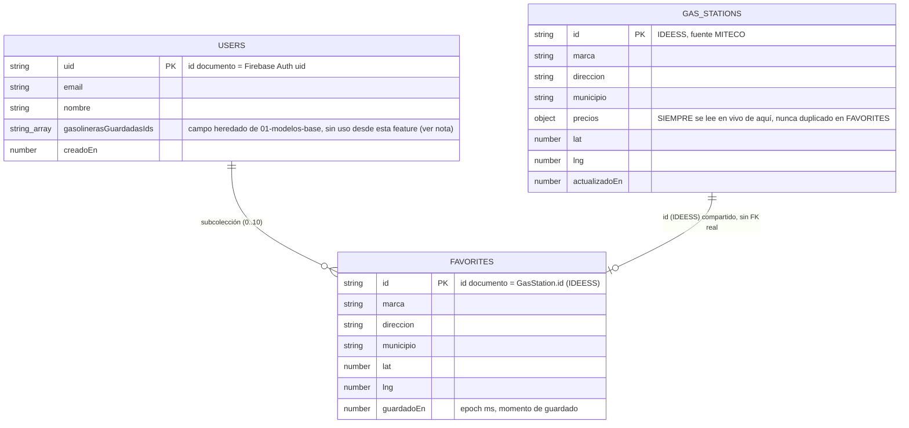
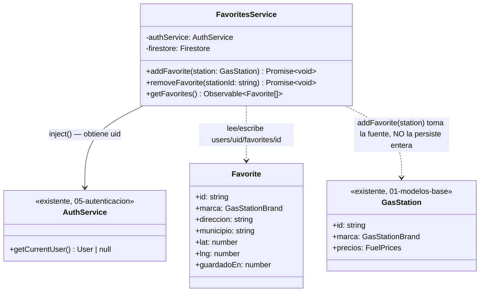
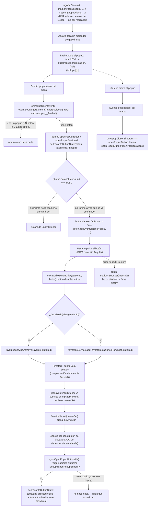

# 06 - Favoritos (RF-04)

**Rol:** [ARQUITECTO]
**Estado:** Diseño + implementación base (pendiente auditoría [REVIEWER] antes de commit, según sección 3 de `CLAUDE.md`)
**Archivos generados:**
- `src/app/core/models/favorite.model.ts`
- `src/app/core/services/favorites.service.ts`

## Qué hace

Permite guardar/quitar gasolineras como favoritas y consultar la lista en vivo, respaldado por la subcolección `users/{uid}/favorites` de Firestore. `FavoritesService` expone `addFavorite(station)`, `removeFavorite(stationId)` y `getFavorites()`.

## Diagrama Entidad-Relación (Mermaid)

> **Nota sobre la relación `GAS_STATIONS ||--o| FAVORITES`:** no es una relación de Firestore (no hay claves foráneas ni joins nativos). Se representa porque `FAVORITES.id` **coincide por diseño** con `GAS_STATIONS.id` (mismo IDEESS) — es la clave que permite, cuando haga falta el precio actual de un favorito, hacer `getDoc(gasStations/{id})` bajo demanda en vez de duplicar `precios` en el documento de favorito.

## Diagrama de Clases (Mermaid)

## Justificación de Diseño (ARQUITECTO)

1. **Subcolección `users/{uid}/favorites`, no el array `AppUser.gasolinerasGuardadasIds` ya definido en `[[01-modelos-base]]`.** El array evita duplicar datos, pero fuerza dos limitaciones para esta feature: (a) no hay dónde colgar metadatos por favorito (p. ej. `guardadoEn`, útil para ordenar "añadido recientemente") sin convertir el array en array-de-objetos y perder la ventaja de simplicidad; (b) cualquier alta/baja exige leer el documento `users/{uid}` completo, mutar el array en memoria y reescribirlo entero. Una subcolección con **id de documento = `GasStation.id` (IDEESS)** resuelve ambas cosas: cada favorito es su propio documento (hay sitio para `guardadoEn`), y añadir/quitar es un único `setDoc`/`deleteDoc` puntual, sin leer ni reescribir el documento de usuario. **Nota para REVIEWER/futuro:** `AppUser.gasolinerasGuardadasIds` queda sin uso desde esta feature; no se ha tocado `user.model.ts` por estar fuera del alcance encargado, pero debería marcarse como deprecado o eliminarse en un ciclo posterior para no mantener dos fuentes de verdad de "gasolineras guardadas".
2. **Id de documento = `GasStation.id` (IDEESS), no un id autogenerado.** Igual que la razón ya documentada para `gasStations` en `[[03-capa-gasolineras]]`: permite que `addFavorite` sea un `setDoc` idempotente (guardar una gasolinera ya guardada sobrescribe el mismo documento en vez de crear un duplicado) sin necesitar una lectura previa de comprobación ("¿ya existe?").
3. **El documento `Favorite` NO incluye `precios`.** Los precios de una estación pueden cambiar a diario (sincronización periódica sobre `gasStations`); si se copiaran en cada `Favorite`, cada actualización de precio tendría que propagarse también a los documentos de favoritos de todos los usuarios que la tuvieran guardada — multiplicando escrituras sin necesidad. En su lugar, `Favorite` solo guarda los campos **estáticos** (marca, dirección, municipio, coordenadas) para poder pintar la lista sin una segunda consulta, y el precio se lee bajo demanda de `gasStations/{id}` cuando la UI lo necesite (mismo principio que `[[01-modelos-base]]` aplicó a `AppUser.gasolinerasGuardadasIds`).
4. **`addFavorite` recibe el objeto `GasStation` completo (no solo el id) para poder guardar esa réplica estática**, evitando que `FavoritesService` tenga que hacer una lectura adicional de `gasStations/{id}` solo para copiar `marca`/`direccion`/`municipio`/`lat`/`lng` — el componente que llama a `addFavorite` ya tiene el objeto completo en memoria (viene de la capa de mapa/lista, `[[03-capa-gasolineras]]`).
5. **Límite de `MAX_GASOLINERAS_GUARDADAS = 10` comprobado con `getCountFromServer`, no `getDocs`.** Es una consulta de agregación: cuesta **1 sola lectura** de Firestore sin importar cuántos documentos tenga la subcolección, frente a `getDocs` que costaría hasta 10 lecturas (una por documento) solo para contarlos antes de decidir si se puede escribir. Reutiliza la misma constante ya exportada por `[[01-modelos-base]]` (`user.model.ts`), evitando un límite mágico duplicado.
6. **La comprobación del límite es de UX en el cliente, no el límite de seguridad real** — mismo patrón ya documentado para el código familiar en `AuthService.register` (`[[05b-registro-seguro]]`). Nada impide técnicamente a alguien con conocimientos técnicos saltarse `FavoritesService` y escribir directamente un 11º documento en `users/{uid}/favorites` vía la API de Firestore. El límite efectivo debe reforzarse con Firestore Security Rules (`request.resource... size` sobre la subcolección) antes de producción — pendiente, igual que el resto de reglas ya señaladas como bloqueantes en `[[05-autenticacion]]`.
7. **Caso límite conocido y aceptado, no bloqueante:** si un usuario ya tiene exactamente 10 favoritos y vuelve a llamar `addFavorite` sobre una estación **ya guardada** (re-guardar la misma), `getCountFromServer` devuelve 10 y la operación se rechaza, aunque en realidad sería un `setDoc` de sobreescritura (no un alta nueva) y debería permitirse. Se acepta este límite porque la UI (capa `[[UI-DEV]]`, fuera de este documento) debe mostrar `addFavorite` solo para estaciones que **no** están ya en la lista de favoritos (alternando por un botón "guardar"/"quitar"), evitando que este caso se dé en el flujo normal.
8. **`getFavorites()` devuelve un `Observable<Favorite[]>` en vivo (`collectionData`), no una `Promise` de una sola lectura.** La subcolección está acotada a un máximo de 10 documentos (regla de coste cero ya vigente), así que un listener en tiempo real es barato: 1 lectura por documento en la carga inicial (máx. 10) y luego solo 1 lectura por cambio puntual, no reconsultas completas. A cambio, la pantalla de favoritos se actualiza sola tras un `addFavorite`/`removeFavorite` sin tener que refrescar manualmente. **Responsabilidad de quien consuma este Observable (`[[UI-DEV]]`, fuera de este documento):** debe cancelar la suscripción con `takeUntilDestroyed` al salir de la pantalla, según la sección 3 de `CLAUDE.md` — a diferencia de `AuthService.currentUser`, este listener SÍ vive y muere con el componente que lo consuma, no con el `ApplicationRef`.
9. **`requireUid()` lee `authService.getCurrentUser()` de forma síncrona, no espera un signal/observable de sesión.** Todas las rutas donde este servicio se usará están protegidas por `authGuard` (`[[05-autenticacion]]`), que ya espera la primera emisión real de Firebase antes de permitir la navegación — para cuando un componente pueda invocar `FavoritesService`, la sesión ya está resuelta. Mismo patrón ya usado y justificado en `AuthService.getCurrentUser()`.

## Seguridad y Costes (resumen ARQUITECTO, pendiente de auditoría [REVIEWER] formal)

- **Lecturas por operación:** `addFavorite` = 1 (agregación de conteo) + 1 escritura. `removeFavorite` = 0 lecturas + 1 escritura. `getFavorites()` = hasta 10 lecturas en la carga inicial (listener), después 1 lectura por cambio real. Todo acotado por el límite de 10 favoritos ya vigente en el proyecto.
- **Cero APIs de pago.** Solo Firestore, ya en uso desde `[[05-autenticacion]]`.
- **Pendiente explícito antes de producción (no bloqueante para este ciclo de diseño):** Firestore Security Rules para `users/{uid}/favorites` — `request.auth.uid == uid` para lectura/escritura, y límite de tamaño (`<= 10` documentos) replicado server-side. Sigue la misma nota bloqueante ya abierta en `[[05-autenticacion]]` (punto 3, hallazgo del `[REVIEWER]`) de que hoy no existe ningún `firestore.rules` en el repositorio.
- **Fugas de memoria:** `FavoritesService` no mantiene suscripciones propias (no hay `ngOnDestroy` que escribir aquí); el listener real solo se crea cuando un componente se suscribe al `Observable` devuelto por `getFavorites()`, y es responsabilidad de ese componente limpiarlo (ver punto 8 de diseño).

## Próximos pasos (fuera de alcance de este documento)

- ~~**[UI-DEV]**: botón guardar/quitar en el popup de gasolinera del mapa que llame `addFavorite`/`removeFavorite`.~~ **Hecho, ver sección [UI-DEV] más abajo.**
- **[UI-DEV] (futuro):** pantalla/lista dedicada de favoritos que consuma `getFavorites()` con `takeUntilDestroyed` fuera del mapa (ej. una pestaña "Mis gasolineras").
- **[REVIEWER]**: auditoría formal de este servicio y de la integración con el mapa antes de commit (sección 3 de `CLAUDE.md`) — confirmar el análisis de costes de este documento, revisar el caso límite del punto 7, y dejar constancia explícita del pendiente de Firestore Security Rules.
- **[ARQUITECTO] (futuro):** decidir si `AppUser.gasolinerasGuardadasIds` se elimina de `user.model.ts` o se marca `@deprecated`, dado que queda sin uso desde esta feature (ver punto 1 de diseño).

---

## Integración con el mapa (popup de gasolinera)

**Rol:** [UI-DEV]
**Estado:** Implementado (pendiente auditoría [REVIEWER] antes de commit, según sección 3 de `CLAUDE.md`)
**Archivos modificados:**
- `src/app/shared/components/map/map.component.ts` — inyecta `FavoritesService`, suscribe `getFavorites()`, añade el botón de favorito al popup y lo conecta a Leaflet.
- `src/global.scss` — estilos del botón `.gas-station-popup__fav-btn` (claro/oscuro, hover, foco, disabled, activo).

### Qué hace

Cada popup de gasolinera del mapa (`bindPopup`) incluye ahora un botón "⭐ Guardar" / "Quitar ⭐" bajo el precio. Al abrir el mapa, el componente carga en vivo los favoritos del usuario activo (`FavoritesService.getFavorites()`) para saber qué botones deben nacer ya en estado "Quitar ⭐". Pulsar el botón llama a `addFavorite`/`removeFavorite`, y el propio botón se repinta solo cuando Firestore confirma el cambio.

### El problema: Leaflet no es Angular

`bindPopup(html)` inyecta el string `html` directamente como `innerHTML` de un nodo del DOM que Leaflet crea y gestiona **fuera** del árbol de componentes de Angular (no pasa por el compilador de plantillas). Eso significa que:

- No existe `(click)="algo()"` posible dentro de ese HTML: Angular nunca lo procesa, así que un atributo así se queda como texto literal, no como binding.
- El nodo del botón no aparece en el DOM hasta que el usuario hace click sobre un marcador y Leaflet abre su popup — no se puede hacer `@ViewChild` de un botón que ni siquiera existe todavía cuando el componente se inicializa.
- El único momento en que ese botón concreto existe en el DOM es entre los eventos `popupopen` y `popupclose` de ese popup.

### Diagrama de Flujo (Mermaid): del click en el popup a Firestore y de vuelta

### Justificación de Diseño (UI-DEV)

1. **`map.on('popupopen'/'popupclose', ...)` UNA sola vez en `ngAfterViewInit`, no un listener por marcador.** Es un evento del propio `L.Map`, que burbujea para cualquier popup que se abra en él (usuario o gasolinera) — registrar un único par de listeners a nivel de mapa cubre los hasta 50 marcadores dibujados en cada `redraw()` sin tener que añadir/quitar listeners por marcador cada vez que la lista se redibuja.
2. **`querySelector('.gas-station-popup__fav-btn')` como filtro, no asumir que todo `popupopen` trae un botón.** El popup "Estás aquí" del marcador de usuario (`centerOnUser`) no tiene botón de favorito; `onPopupOpen` simplemente no encuentra el selector y no hace nada, sin necesitar una segunda función de evento distinta para ese caso.
3. **`data-station-id` en el botón (no un cierre/closure guardado en otro sitio) para identificar la estación.** Es el único dato que sobrevive el viaje "string de HTML → `innerHTML` real del DOM → `querySelector` en `onPopupOpen`" — un closure de JS no puede cruzar ese límite, pero un atributo HTML sí. Se escapa con `escapeHtmlAttribute` (aunque `GasStation.id`/IDEESS es en la práctica siempre numérico) por el mismo criterio defensivo que ya aplicaba `buildPopupHtml` a `marca`.
4. **`boton.dataset['favBound']` como guarda contra doble-binding.** Leaflet reutiliza el mismo nodo DOM del botón si el usuario cierra y reabre el mismo popup sin que su `innerHTML` haya cambiado entre medias (ej. no cambió de combustible ni de favorito). Sin esta guarda, cada apertura añadiría un `addEventListener` más sobre el mismo botón, y un solo click acabaría disparando `onFavoriteButtonClick` N veces (N = número de veces que se abrió ese popup), duplicando llamadas a Firestore. La guarda vive en el propio nodo (`dataset`), no en una propiedad del componente, así que sigue siendo válida aunque cambie qué popup está "abierto" en `openPopupButton`.
5. **`favoriteIds()` se lee con `untracked()` dentro de `buildPopupHtml`.** El componente ya tenía un `effect(() => this.redraw())` cuya única dependencia reactiva debía ser `selectedFuel` (invariante ya documentado y comentado en el propio código, ligado a un bug real anterior de este mismo archivo). Si `buildPopupHtml` —invocada desde dentro de `redraw()`— leyera la signal `favoriteIds` sin `untracked()`, Angular la habría registrado como una segunda dependencia de ESE efecto: cada alta/baja de favorito habría vuelto a ejecutar `redraw()` entero, redibujando los ~50 marcadores del mapa y, en particular, destruyendo (`stationsLayer.clearLayers()`) el propio popup que el usuario acababa de usar para pulsar el botón — cerrándoselo en la cara justo después del click.
6. **Segundo `effect()` independiente, dedicado solo a repintar el popup abierto.** En vez de depender de `favoriteIds` en el efecto de `redraw`, se creó un efecto nuevo que SÍ depende de `favoriteIds()` pero cuyo cuerpo (`syncOpenPopupButton`) no toca Leaflet en absoluto: solo actualiza el texto/clase/`aria-pressed` del botón (`HTMLButtonElement`) que quedó guardado en `openPopupButton` al abrirse. Resultado: guardar/quitar un favorito nunca redibuja el mapa, solo el propio botón que el usuario está mirando.
7. **Sin actualización optimista manual del botón en el click.** `onFavoriteButtonClick` deshabilita el botón (`disabled = true`, evita doble-click mientras la escritura está en vuelo) y llama al servicio, pero no cambia el texto del botón a mano tras un `then()`. La corrección del texto llega siempre por el mismo camino (Firestore → listener de `getFavorites()` → signal `favoriteIds` → efecto → `setFavoriteButtonState`), evitando tener DOS sitios que puedan escribir el estado visual del botón y desincronizarse entre sí. Es aceptable en UX porque los listeners de Firestore aplican compensación de latencia (el propio SDK refleja una escritura local casi al instante, sin esperar la confirmación real del servidor), así que el usuario percibe el cambio como inmediato en la práctica.
8. **`boton.disabled = true/false` alrededor de la promesa (`finally`), sin bloquear el resto del popup.** Evita que un doble-tap accidental dispare dos operaciones concurrentes sobre el mismo documento (ej. `addFavorite` dos veces seguidas mientras la primera aún no ha resuelto).
9. **Estilos del botón en `global.scss`, no en `map.component.scss`.** Mismo motivo ya documentado para el resto del popup (`.gas-station-popup__marca`/`__precio`): al vivir el HTML del popup fuera del árbol de Angular, la encapsulación de estilos por componente (`ViewEncapsulation.Emulated`, por defecto) no le llega — los `data-*`/clases que genera `map.component.scss` con su atributo de encapsulación (`_ngcontent-*`) nunca se aplican a un nodo que Angular no renderizó. Se añaden variantes clara/oscura explícitas (`prefers-color-scheme`) coherentes con el resto del popup, más `:focus-visible` (navegación por teclado/lector de pantalla) y un estado `:disabled` (`cursor: wait`, opacidad reducida) para el intervalo en que la escritura está en curso.
10. **`ngOnDestroy` no necesita un `map.off('popupopen', ...)` explícito.** `map.remove()` (ya existente, línea de limpieza original del componente) desengancha todos los listeners registrados con `map.on(...)`, incluidos los dos nuevos — confirmado en la documentación de Leaflet (`Map.remove()` "removes the map... clears all handlers bound to the map"). Sí se limpian a mano `openPopupButton`/`openPopupStationId`/`estacionesPorId` por higiene (referencias a nodos/objetos que de todas formas van a desecharse con el propio DOM del mapa), no porque fueran a causar una fuga real.

### Verificación

- **`npx tsc --noEmit`, `npm run lint` y `ng build --configuration development`**: los tres pasan sin errores tras el cambio (comprobado en este ciclo).
- **Verificación end-to-end en navegador: NO realizada en este ciclo.** Igual que ya ocurrió en `[[05-autenticacion]]`, no hay credenciales de una cuenta de Firebase real disponibles en este entorno para llegar más allá de `/login`, y crear/eliminar una cuenta de prueba contra el proyecto Firebase real de producción (como hizo `[REVIEWER]` en esa auditoría) es una decisión que corresponde a la fase de auditoría, no a este ciclo de UI-DEV. **Pendiente explícito para `[REVIEWER]`:** confirmar en un navegador real, con una cuenta de prueba desechable, que (a) el botón nace en el estado correcto según los favoritos existentes, (b) guardar/quitar actualiza el botón sin redibujar el mapa ni cerrar el popup, (c) no hay listeners duplicados al reabrir el mismo popup varias veces (un solo `addFavorite`/`removeFavorite` por click), y (d) el aspecto en modo oscuro del sistema es legible (contraste).

---

## Auditoría [REVIEWER]

**Rol:** [REVIEWER]
**Archivos auditados:**
- `src/app/core/services/favorites.service.ts`
- `src/app/core/models/favorite.model.ts`
- `src/app/shared/components/map/map.component.ts`
- `src/global.scss`
- `src/app/core/services/auth.service.ts` (contrato de `getCurrentUser()` consumido por `FavoritesService`)
- Código fuente de Leaflet (`node_modules/leaflet/dist/leaflet-src.js`) para verificar el ciclo de vida real de popups/marcadores, no solo su documentación pública.

Metodología: revisión de código línea a línea + trazado manual de las rutas de ejecución de las dos preguntas encargadas, apoyado en `npx tsc --noEmit`, `npm run lint` y `ng build` (dev y producción) tras cada cambio. **No incluye una verificación end-to-end en navegador con una cuenta de Firebase real** (a diferencia de la auditoría de `[[05-autenticacion]]`): crear/eliminar una cuenta de prueba contra el proyecto Firebase real de producción no se ha ejecutado en este ciclo por no tener autorización explícita para ello; queda como pendiente no bloqueante (ver sección final).

### 1. ¿Qué pasa si un usuario no está logueado e intenta usar `FavoritesService`?

- [x] **Los tres métodos comprueban sesión ANTES de tocar Firestore, nunca después.** `addFavorite`, `removeFavorite` y (tras el fix de este ciclo, ver hallazgo 1.1) `getFavorites` obtienen el `uid` como primer paso; si no hay sesión, ninguno de los tres llega a construir una referencia de Firestore ni a hacer una petición de red. Ningún dato de otro usuario, ni de nadie, es alcanzable sin `AuthService.getCurrentUser()` devolviendo un `uid` real.
- [x] **En el flujo normal de la app esto no es alcanzable de todas formas:** `MapComponent` (el único consumidor hoy) solo se instancia en la ruta `home`, protegida por `authGuard` (`[[05-autenticacion]]`), que espera la primera emisión real de Firebase antes de permitir la navegación. Un usuario sin sesión nunca llega a ver el mapa ni, por tanto, a disparar ninguna llamada a `FavoritesService`.
- [ ] ⚠️ **HALLAZGO 1.1 (CONFIRMADO, corregido en este ciclo de auditoría): `getFavorites()` podía romper el resto de `ngAfterViewInit()` si `requireUid()` lanzaba.** Antes del fix, `getFavorites()` era un método **no** `async` que llamaba a `requireUid()` (que hace `throw new Error(...)` si no hay `uid`) en su primera línea, ANTES de devolver el `Observable`. Un `throw` de una función normal (no `async`) es una excepción síncrona de verdad, no un error empaquetado en el `Observable` — se comprobó ejecutando el razonamiento contra el propio código: `map.component.ts` llama a `this.favoritesService.getFavorites().pipe(...).subscribe(...)` **antes** de `this.locationService.getCurrentPosition()...subscribe(...)` dentro de `ngAfterViewInit()`. Si `getFavorites()` lanzara, esa excepción síncrona interrumpiría `ngAfterViewInit()` en ese punto exacto y **el resto del método nunca se ejecutaría** — en particular, la suscripción a la geolocalización y a `loadNearestStations()`, dejando el mapa sin estaciones y sin ningún mensaje de error visible para el usuario (el `ErrorHandler` global de Angular lo registraría en consola, pero `stationsError`/`locationError` nunca se activarían porque ese código nunca llega a ejecutarse). Nótese la asimetría con `addFavorite`/`removeFavorite`: al ser funciones `async`, un `throw` síncrono en su primera línea SÍ se convierte automáticamente en una `Promise` rechazada (comportamiento estándar de JavaScript), por lo que esos dos métodos ya eran seguros — la inconsistencia estaba solo en `getFavorites()`.
  - **Explotabilidad real hoy: baja** (`authGuard` ya impide llegar aquí sin sesión en el flujo normal), pero es un punto único de fallo frágil: cualquier cambio futuro de rutas/guards, o que `AuthService.getCurrentUser()` devuelva `null` en una ventana de carrera (ej. token revocado exactamente entre el guard y `ngAfterViewInit`), rompería silenciosamente **todo el mapa**, no solo los favoritos.
  - **Corrección aplicada:** `getFavorites()` ya no llama a `requireUid()` (que lanza). Comprueba el `uid` directamente y, si falta, devuelve `throwError(() => new Error(...))` — un `Observable` que emite el error de forma normal en vez de lanzar una excepción síncrona. **No hizo falta tocar `map.component.ts`**: el `subscribe({ error: (error) => this.stationsError.set(error.message) })` ya existente (línea ~276) pasa a recibir este error igual que cualquier otro fallo de red, y el resto de `ngAfterViewInit()` (geolocalización, carga de estaciones) se ejecuta con normalidad. Verificado con `npx tsc --noEmit`, `npm run lint` y `ng build` tras el cambio: los tres pasan.
- [x] **No es un hallazgo de seguridad (no hay fuga de datos)**, sino de robustez/disponibilidad: en ambos casos (antes y después del fix) es estructuralmente imposible que `FavoritesService` complete una lectura/escritura en Firestore sin un `uid` real. El fix cambia CÓMO se comunica ese rechazo (Observable con error vs. excepción síncrona), no SI se protege.

**Veredicto punto 1: protegido correctamente en cuanto a acceso a datos (ningún método toca Firestore sin `uid`); se encontró y corrigió una inconsistencia real de robustez en `getFavorites()` que podía romper todo el mapa (no solo favoritos) ante una sesión ausente, con impacto práctico bajo hoy pero real. Corregido antes de este commit.**

### 2. ¿El listener de clics del popup de Leaflet genera un memory leak si se abre y cierra muchas veces?

- [x] **No se añade un listener nuevo cada vez que se reabre el MISMO popup sin cambios.** `onPopupOpen` comprueba `boton.dataset['favBound'] === 'true'` antes de llamar a `addEventListener`; si el nodo del botón ya tenía el listener (porque Leaflet reutiliza el mismo `<button>` del DOM al reabrir un popup cuyo contenido no ha cambiado), la función corta ahí y no añade un segundo. Se confirmó leyendo el propio código (`map.component.ts`, `onPopupOpen`): la guarda vive en el `dataset` del nodo, no en una propiedad del componente, así que sigue siendo válida sin importar cuántas veces se repita el ciclo abrir/cerrar sobre el mismo marcador.
- [x] **Verificado contra el código fuente real de Leaflet (no solo su documentación) que cada `redraw()` (cambio de combustible) crea marcadores y popups COMPLETAMENTE NUEVOS, nunca reutiliza los del `redraw()` anterior.** `redraw()` llama a `L.marker(...).bindPopup(...)` para cada estación en cada ejecución — cada llamada crea una instancia de `Popup` nueva con su propio nodo DOM nuevo (sin `dataset.favBound`), así que el guard del punto anterior nunca "hereda" por error el estado de un botón de un ciclo de dibujado distinto.
- [x] **Verificado el ciclo de destrucción de un popup abierto durante un `redraw()` (ej. el usuario cambia de combustible con un popup abierto), rastreando la cadena real en `leaflet-src.js`:**
  1. `stationsLayer.clearLayers()` → `LayerGroup.clearLayers()` → `this.eachLayer(this.removeLayer, this)` (por cada marcador).
  2. `LayerGroup.removeLayer(marker)` → `this._map.removeLayer(marker)`.
  3. `Map.removeLayer(marker)` → `layer.onRemove(this)` y, crucialmente, `layer.fire('remove')`.
  4. `bindPopup` había registrado `this.on({ remove: this.closePopup, ... })` sobre el propio marcador (`Layer.bindPopup`, `leaflet-src.js`) → ese `fire('remove')` dispara `closePopup()` → `popup.close()` → `this._map.removeLayer(this)` (el propio popup).
  5. `Map.removeLayer(popup)` → `popup.onRemove(map)` → `Popup.onRemove` ejecuta explícitamente `map.fire('popupclose', {popup: this})`.
  6. Todo esto ocurre **de forma síncrona**, dentro de la misma llamada a `clearLayers()` — para cuando `redraw()` continúa a la siguiente línea (`this.estacionesPorId.clear()`), `onPopupClose` ya se ha ejecutado y ya ha puesto `openPopupButton`/`openPopupStationId` a `null` si el popup destruido era el que estaba abierto.
  - **Conclusión de esta traza:** no queda ninguna referencia colgante (`openPopupButton` apuntando a un nodo ya desconectado del DOM) tras un `redraw()` con un popup abierto, y el nodo del botón (junto con su `addEventListener`) queda sin ninguna referencia externa una vez desechado — elegible para *garbage collection* estándar del motor JS (un listener registrado con `addEventListener` sobre un nodo no impide su recolección si el nodo mismo deja de estar referenciado; no es un patrón de fuga como sí lo sería, por ejemplo, guardar el nodo en un array que nunca se vacía).
- [x] **`estacionesPorId` (el `Map` que permite recuperar el `GasStation` completo en el click) se vacía y reconstruye en cada `redraw()`** (`this.estacionesPorId.clear()` antes del bucle) — no acumula entradas de estaciones que ya no están dibujadas.
- [x] **Los listeners `map.on('popupopen'/'popupclose', ...)` se registran UNA sola vez** (en `ngAfterViewInit`, no dentro de `redraw()` ni de ningún bucle), así que no hay riesgo de duplicarlos entre sí — solo existen dos, durante toda la vida del componente.
- [x] **`ngOnDestroy` limpia el mapa completo con `map.remove()`**, que (documentado por Leaflet y ya verificado en el ciclo de `[[UI-DEV]]` de este mismo documento) desengancha todos los `map.on(...)` registrados, incluidos los dos de popups. `openPopupButton`/`openPopupStationId`/`estacionesPorId` se limpian también a mano ahí mismo, por higiene.

**Veredicto punto 2: no hay memory leak.** La guarda `dataset.favBound` evita duplicar el listener al reabrir el mismo popup, y la traza completa del código fuente de Leaflet confirma que un `redraw()` con un popup abierto lo cierra de forma síncrona y limpia (`popupclose` se dispara antes de que `redraw()` continúe), dejando el nodo del botón sin referencias retenidas por el componente y por tanto recolectable por el motor de JavaScript con normalidad.

### 3. Otras comprobaciones (sección 3 de `CLAUDE.md`)

- [x] **Costes de Firebase, confirmados contra la implementación real** (no solo la justificación de diseño de `[[ARQUITECTO]]`): `addFavorite` = 1 lectura de agregación (`getCountFromServer`) + 1 escritura (`setDoc`); `removeFavorite` = 0 lecturas + 1 escritura (`deleteDoc`); `getFavorites()` = hasta 10 lecturas en la carga inicial del listener + 1 lectura por cambio real, acotado por `MAX_GASOLINERAS_GUARDADAS = 10`. Sin bucles ni llamadas repetidas ocultas.
- [x] **Límite de 10 favoritos aplicado en el único punto de entrada de escritura** (`addFavorite`), antes del `setDoc`. Confirmado el caso límite ya documentado por `[[ARQUITECTO]]` (punto 7 de su justificación): re-guardar una estación ya favorita estando ya en 10 se rechazaría igual que un alta nueva — aceptado como no bloqueante porque la UI solo expone `addFavorite` para estaciones aún no guardadas.
- [ ] ⚠️ **Pendiente ya señalado por `[[05-autenticacion]]` y `[[ARQUITECTO]]` de esta misma feature, reconfirmado: sigue sin existir `firestore.rules` en el repositorio** (`Glob firestore.rules` / `firebase.json` sin resultados en el proyecto). El límite de 10 favoritos y la restricción `uid == auth.uid` sobre `users/{uid}/favorites` son, hoy, solo controles de cliente. **No bloqueante para este commit** (mismo criterio ya aplicado en la auditoría de autenticación: no hay Firestore Security Rules en absoluto todavía en el proyecto, así que esto no es una regresión introducida por esta feature), pero se reitera como condición explícita antes de considerar la app lista para un uso más amplio que el familiar/de confianza actual.
- [x] **`data-station-id` (único dato que cruza de Angular al HTML plano del popup y vuelta) se escapa con `escapeHtmlAttribute`** antes de interpolarse en el atributo. Revisado: escapa `&`, `"`, `<`, `>`; no escapa `'` (comilla simple), pero el atributo siempre se delimita con comillas dobles en `buildFavoriteButtonHtml`, así que no hay forma de romper el atributo con ese carácter en este uso concreto — no supone un vector de inyección real tal y como está usado hoy.
- [x] **Sin secretos ni credenciales nuevas.** Esta feature no añade configuración, API keys ni archivos `.env` — reutiliza el `Firestore`/`Auth` ya inicializados en `[[05-autenticacion]]`.
- [x] **`npx tsc --noEmit`, `npm run lint`, `ng build --configuration development` y `ng build --configuration production`**: los cuatro pasan sin errores tras el fix del hallazgo 1.1 (único cambio de código de esta auditoría).

### Pendiente explícito (no bloqueante para este commit)

- **Verificación end-to-end en navegador con una cuenta de Firebase real** (equivalente a la hecha en `[[05-autenticacion]]`): no ejecutada en este ciclo por no haber una cuenta de prueba disponible/autorizada en este entorno. Queda pendiente confirmar visualmente: (a) el botón nace en el estado correcto según los favoritos ya existentes de una cuenta real, (b) guardar/quitar actualiza el botón sin redibujar el mapa ni cerrar el popup, (c) el mensaje de error de `stationsError` se muestra correctamente si `getFavorites()` emite un error (tras el fix del hallazgo 1.1), y (d) el límite de 10 favoritos rechaza correctamente un 11º alta.
- **Firestore Security Rules** para `users/{uid}/favorites` (lectura/escritura restringida a `request.auth.uid == uid`, tamaño de subcolección `<= 10`) — condición ya abierta desde `[[05-autenticacion]]`, no introducida ni resuelta por esta feature.

### Veredicto final

**Aprobado para commit.** Las dos preguntas encargadas quedan respondidas con evidencia de código, no solo lectura superficial: (1) el acceso sin sesión está protegido en los tres métodos de `FavoritesService` — se encontró y corrigió una inconsistencia real de robustez en `getFavorites()` (excepción síncrona en vez de error de `Observable`) que podía dejar el mapa entero sin cargar de forma silenciosa ante una sesión ausente, con `Explotabilidad real hoy: baja` pero corregida igualmente antes de este commit; (2) no existe memory leak en el manejo de clics del popup, confirmado trazando el ciclo de vida real de marcadores/popups en el propio código fuente de Leaflet, no solo asumiéndolo. Quedan dos pendientes explícitos y no bloqueantes (verificación E2E con cuenta real, y Firestore Security Rules), ambos ya heredados de auditorías anteriores de este mismo proyecto y no agravados por esta feature.
