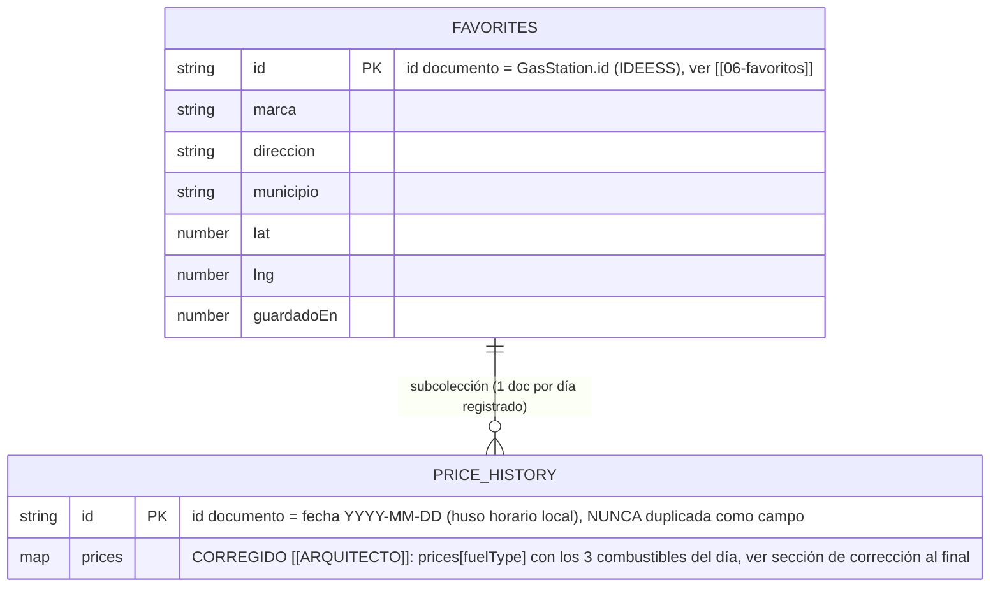
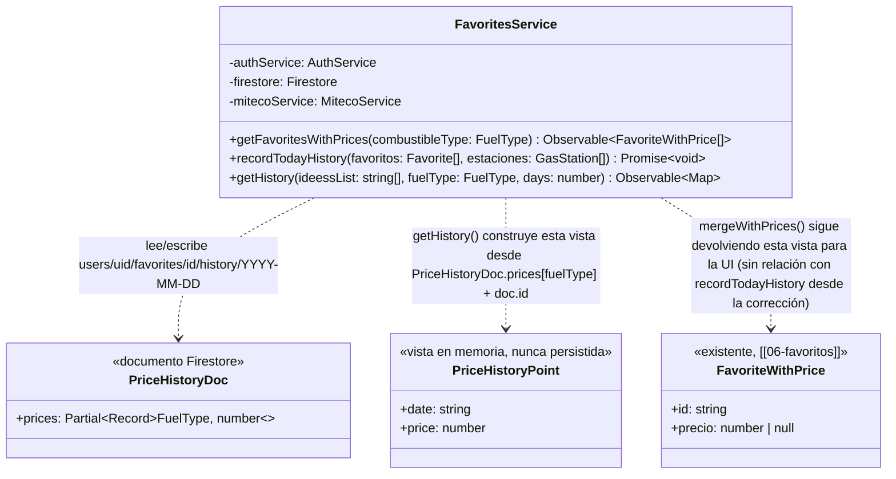
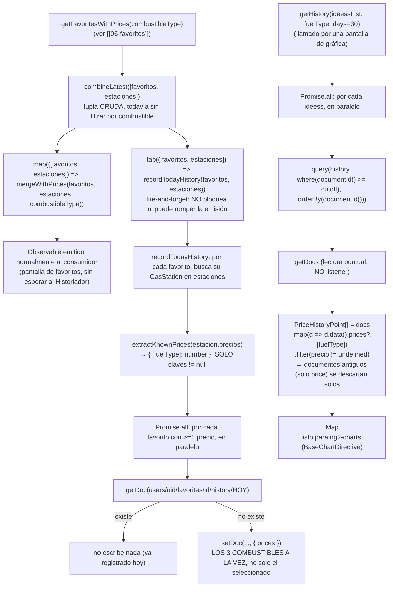
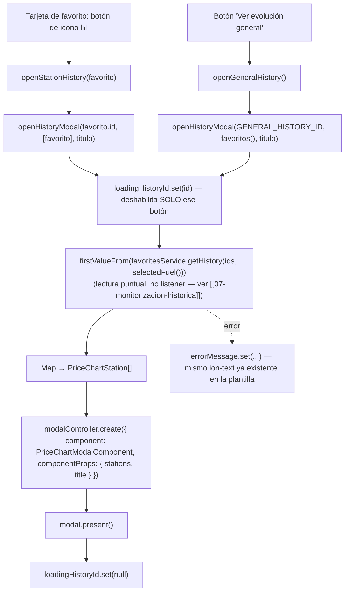
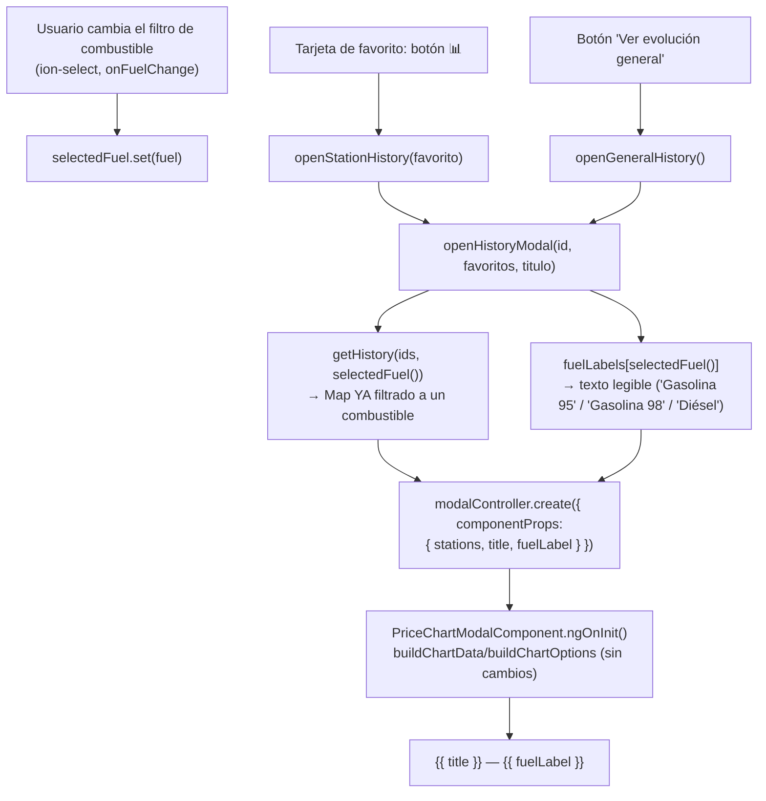

# 07 - Monitorización Histórica (RF-04)

**Rol:** [ARQUITECTO]
**Estado:** Diseño + implementación base (pendiente auditoría [REVIEWER] antes de commit, según sección 3 de `CLAUDE.md`)
**Archivos generados:**
- `src/app/core/models/price-history.model.ts`

**Archivos modificados:**
- `src/app/core/services/favorites.service.ts` — nuevo "Historiador" (`recordTodayHistory`, privado) enganchado a `getFavoritesWithPrices` (`[[06-favoritos]]`), y nuevo método público `getHistory(ideessList, days)`.
- `src/app/app.config.ts` — `provideCharts(withDefaultRegisterables())`.
- `package.json` — `chart.js`, `ng2-charts@9`, `@angular/cdk@20` (peer dependency de `ng2-charts`, ver punto 6 de diseño).

## Qué hace

Cada vez que la app cruza los favoritos del usuario con los precios de HOY de MITECO (`FavoritesService.getFavoritesWithPrices`, `[[06-favoritos]]`), el nuevo "Historiador" registra silenciosamente ese precio en Firestore, una vez por gasolinera favorita y por día. Con esos registros acumulados día a día, `getHistory(ideessList, days)` permite reconstruir la evolución de precio de hasta 30 días (por defecto) de cualquier conjunto de gasolineras favoritas, lista para alimentar una gráfica (`ng2-charts`, instalado en este ciclo).

## Diagrama Entidad-Relación (Mermaid)

> **Nota sobre `PRICE_HISTORY.id`:** se usa la propia fecha (`YYYY-MM-DD`) como id de documento, no un id autogenerado ni un campo `date` adicional — mismo criterio ya aplicado a `FAVORITES.id` (IDEESS) en `[[06-favoritos]]`: la fecha ya es, por sí sola, una clave única y con significado (un favorito no puede tener dos registros del mismo día), y como esas cadenas ordenan lexicográficamente igual que cronológicamente, Firestore puede filtrar/ordenar (`where(documentId(), '>=', cutoff)`, `orderBy(documentId())`) sin necesitar ese campo duplicado.

## Diagrama de Clases (Mermaid)

## Diagrama de Flujo (Mermaid): del cruce con MITECO al histórico, y de vuelta a una gráfica

## Justificación de Diseño (ARQUITECTO)

1. **Historiador enganchado dentro de `getFavoritesWithPrices` (vía `tap`), no un método separado que la UI deba recordar llamar.** El encargo pedía registrar el precio "cada vez que cruces los precios actuales de MITECO con los favoritos" — enganchar el registro al propio punto donde ese cruce ya ocurre garantiza que nunca se registre un precio de un combustible que en realidad no se ha consultado ese día, sin depender de que cada futura pantalla que use `getFavoritesWithPrices` recuerde también llamar a un segundo método.
2. **`tap(...)`, no `switchMap`/`mergeMap` a la promesa del Historiador.** `recordTodayHistory` es un efecto secundario de escritura (Firestore) que no debe formar parte de la cadena del `Observable` público: si `getDoc`/`setDoc` fallara o tardara, la emisión de `FavoriteWithPrice[]` — lo único que este método promete — no debe verse afectada. Los errores se capturan y registran (`console.error`) dentro del propio `recordTodayHistory`, nunca se propagan al `Observable`.
3. **`recordTodayHistory` comprueba con `getDoc` antes de `setDoc`, tal y como se pidió explícitamente ("si existe, no escribas nada")**, en vez de un `setDoc` idempotente sin comprobación previa (el patrón que SÍ usa `addFavorite` en `[[06-favoritos]]`). La diferencia es intencional: sobrescribir el documento de hoy con el precio de una consulta posterior perdería el precio de la PRIMERA consulta del día sin ganar nada a cambio (el propio registro de "qué costaba hoy" ya quedó fijado), así que aquí SÍ hace falta la lectura de comprobación que `addFavorite` evita.
4. **`Promise.all`, no un `for` secuencial, tanto en `recordTodayHistory` como en `getHistory`.** Cada favorito/IDEESS vive en su propia subcolección independiente — no hay ninguna dependencia entre comprobar/escribir (o consultar) una estación y hacerlo con la siguiente, así que lanzarlas todas en paralelo reduce la latencia total sin coste adicional de lecturas/escrituras.
5. ~~**Limitación conocida y aceptada, no bloqueante: el histórico NO distingue combustible.**~~ **CORREGIDO — ver "Corrección [ARQUITECTO]: histórico por combustible" al final de este documento.** `PriceHistoryDoc` pasó de `{ price: number }` a `{ prices: Partial<Record<FuelType, number>> }`: cada documento diario guarda los 3 combustibles a la vez (no solo el que estuviera seleccionado al consultar), y `getHistory(ideessList, fuelType, days)` lee específicamente `prices[fuelType]`.
6. **`getHistory` usa `getDocs` (lectura puntual), no `collectionData` (listener en vivo).** A diferencia de `getFavorites()` (`[[06-favoritos]]`, cuyo listener tiene sentido porque el usuario puede añadir/quitar favoritos mientras mira la pantalla), el histórico de días **pasados** es inmutable: `recordTodayHistory` nunca reescribe un día ya registrado. Mantener un listener permanente sobre una subcolección que casi nunca cambia (como mucho, un documento nuevo al día) desperdiciaría una conexión sin beneficio real.
7. **Filtro de rango con `where(documentId(), '>=', cutoff)` + `orderBy(documentId())`, no un campo `date` adicional dentro de cada documento** (ver también la nota del diagrama ER). Ahorra un campo redundante en cada uno de los, potencialmente, cientos de documentos de histórico que se acumulan con el tiempo.
8. **`ng2-charts@9` + `@angular/cdk@20`, no la última versión (`ng2-charts@10`).** Comprobado contra el registro de npm antes de instalar: `ng2-charts@10` exige `@angular/core >=21`, pero el proyecto está en Angular 20.3.25 — instalarla habría introducido un conflicto de peer dependencies o forzado una actualización de Angular no solicitada. `ng2-charts@9` es la última versión cuyo rango de peer dependencies (`>=20.0.0`) es compatible con la versión de Angular ya instalada en el proyecto. `@angular/cdk` se instaló porque es peer dependency directa de `ng2-charts@9` (aunque este ciclo no usa ningún componente del CDK directamente).
9. **`PriceHistoryPoint` (con `date` + `price` de UN combustible) es una interfaz aparte de `PriceHistoryDoc` (`prices`, mapa de los 3 combustibles), igual que `FavoriteWithPrice` ya es una vista aparte de `Favorite` en `[[06-favoritos]]`.** `PriceHistoryDoc` es exactamente lo que se persiste (`prices: Partial<Record<FuelType, number>>`, id = fecha); `PriceHistoryPoint` es la vista ya combinada con la fecha (leída de `doc.id`) y filtrada a un único `fuelType` (leído de `prices[fuelType]`) que necesita un consumidor de gráfica — nunca se escribe en Firestore con esta forma.

## Seguridad y Costes (resumen ARQUITECTO, pendiente de auditoría [REVIEWER] formal)

- **Coste de `recordTodayHistory`** (se ejecuta en cada emisión de `getFavoritesWithPrices`, normalmente una vez por apertura de pantalla — ver recomendación ya vigente en `[[06-favoritos]]` de suscribirse una única vez por vista): hasta 10 lecturas (`getDoc`, una por favorito con precio) + hasta 10 escrituras (`setDoc`), pero las escrituras **solo ocurren la primera vez que se consulta cada estación en el día** — el resto de aperturas ese mismo día son 10 lecturas + 0 escrituras.
- **Coste de `getHistory(ideessList, days=30)`:** una consulta (`getDocs`) por IDEESS solicitado, en paralelo. Con hasta 10 favoritos y 30 días, hasta 10 × 30 = **300 lecturas** en el peor caso (acotado por cuántos días llevan realmente registrados, nunca más que `days` ni más que los días que la app lleva en uso). Es, con diferencia, el coste más alto introducido por esta feature — **recomendación explícita para `[[UI-DEV]]`:** llamar a este método una única vez por apertura de la gráfica de histórico, nunca dentro de un `effect()`/binding que se reevalúe en cada redibujado (mismo criterio de coste ya exigido a `getFavoritesWithPrices`).
- **Cero APIs de pago.** Solo Firestore (ya en uso) y `chart.js`/`ng2-charts` (renderizado 100% en cliente, sin llamadas de red propias).
- **Fugas de memoria:** ni `recordTodayHistory` ni `getHistory` mantienen suscripciones propias — el primero es una `Promise` que se resuelve y termina sola; el segundo devuelve un `Observable` que se completa tras su única emisión (no un listener), así que no exige `takeUntilDestroyed` para evitar fugas, aunque sigue siendo buena práctica que quien lo consuma cancele la suscripción si el componente se destruye antes de que complete.
- **Pendiente ya heredado de `[[06-favoritos]]`, reconfirmado: sigue sin existir `firestore.rules` en el repositorio.** La subcolección `users/{uid}/favorites/{ideess}/history` hereda el mismo pendiente no bloqueante: hoy el aislamiento por usuario depende enteramente de que `FavoritesService` siempre construya la ruta con el `uid` de la sesión activa, no de una regla server-side.
- **Sin secretos ni credenciales nuevas.** Reutiliza el `Firestore` ya inicializado en `[[05-autenticacion]]`.

## Próximos pasos (fuera de alcance de este documento)

- ~~**[UI-DEV]**: componente de gráfica...~~ **Hecho, ver sección [UI-DEV] más abajo.**
- ~~**[ARQUITECTO] (futuro, opcional):** si se confirma que distinguir por combustible es un requisito real (ver punto 5 de diseño), diseñar la migración de estructura...~~ **Hecho, ver sección "Corrección [ARQUITECTO]: histórico por combustible" al final de este documento.**
- **[REVIEWER]:** auditoría formal de este ciclo antes de commit — en particular, confirmar el análisis de coste de `getHistory` (300 lecturas en el peor caso) y que `recordTodayHistory` nunca puede romper la emisión de precios de hoy (punto 2 de diseño).

---

## Modal de gráfica y botones de acceso (RF-04)

**Rol:** [UI-DEV]
**Estado:** Implementado (pendiente auditoría [REVIEWER] antes de commit, según sección 3 de `CLAUDE.md`)
**Archivos generados:**
- `src/app/components/price-chart-modal/price-chart-modal.component.ts` / `.html` / `.scss`

**Archivos modificados:**
- `src/app/pages/favorites-panel/favorites-panel.page.ts` / `.html` / `.scss` — botón de icono (gráfica) por tarjeta + botón "Ver evolución general"; llamada explícita al Historiador (ver hallazgo corregido más abajo).
- `src/app/core/services/favorites.service.ts` — `recordTodayHistory` pasa de `private` a público (ver hallazgo corregido más abajo).

### Qué hace

Cada tarjeta de `FavoritesPanelPage` incorpora un botón de icono (gráfica, sin texto, para no ocupar espacio) que abre `PriceChartModalComponent` con el histórico de ESA gasolinera. Al final de la lista, un botón grande "Ver evolución general" abre el mismo modal con TODAS las favoritas a la vez, cada una con su propia línea de color y una leyenda para distinguirlas.

### Hallazgo (CONFIRMADO, corregido en este mismo ciclo): el Historiador nunca se ejecutaba en producción

Al verificar esta feature en navegador (ver sección de Verificación), se confirmó que el Historiador (`recordTodayHistory`, diseñado en el ciclo [ARQUITECTO] anterior) **nunca llegaba a registrar ningún precio** en el único flujo real de la app. Causa: `recordTodayHistory` se enganchaba únicamente al `tap(...)` de `getFavoritesWithPrices()` (`favorites.service.ts`) — pero `FavoritesPanelPage` (el ÚNICO consumidor de esta pantalla, ver justificación ya documentada en `[[06-favoritos]]`) **no llama a `getFavoritesWithPrices()`**: llama a `getFavorites()` y a `mergeWithPrices()` por separado, a propósito, para compartir un único listener de Firestore entre la lista rápida y el cruce de precios. `getFavoritesWithPrices()` no tenía, en la práctica, ningún consumidor real en todo el proyecto.

**Corrección:** `recordTodayHistory` pasa de `private` a público en `FavoritesService`, y `FavoritesPanelPage` lo llama explícitamente (fire-and-forget, mismo criterio que el `tap` original) dentro del `.subscribe(...)` de su propio `combineLatest([favoritos$, estacionesPorFuel$])`, justo después de fijar `preciosPorId`. `getFavoritesWithPrices()` conserva su `tap(...)` interno para cualquier consumidor futuro que sí la llame directamente — con la corrección, el Historiador se ejecuta sin importar cuál de los dos caminos use un componente.

### Diagrama de Flujo (Mermaid): de las tarjetas al modal

### Justificación de Diseño (UI-DEV)

1. **Botón de icono, sin texto, en vez de "Monitorizar".** Con hasta 10 favoritos y ya dos botones por tarjeta ("📍 Cómo llegar", "Quitar"), un tercer botón de texto habría forzado el `.favorite-card__actions` (flex, `justify-content: flex-end`) a envolver línea en pantallas estrechas. Un botón `icon-only` (`stats-chart-outline`, mismo componente `ion-icon` ya usado en el resto de la tarjeta) transmite "ver gráfica" sin palabras, con `aria-label` explícito para lectores de pantalla (`'Ver evolución de precio de ' + marca`) — la falta de texto visible no es una regresión de accesibilidad porque el `aria-label` sigue presente, mismo patrón ya usado por el botón "Quitar" cuando muestra su spinner.
2. **`PriceChartModalComponent` NO conoce `FavoritesService` ni Firestore.** Recibe `stations: PriceChartStation[]` ya resuelto (con `puntos: PriceHistoryPoint[]` por gasolinera) como `@Input({ required: true })`. `FavoritesPanelPage` es quien llama a `getHistory(...)` y construye el array antes de `modalController.create(...)`. Esto mantiene al modal como un componente de presentación puro (fácil de reutilizar desde cualquier otra pantalla futura que ya tenga sus propios datos de histórico) y evita que dos componentes distintos (la página y el modal) puedan llamar a Firestore por su cuenta para el mismo dato.
3. **`firstValueFrom`, no una suscripción con `takeUntilDestroyed`, para leer el histórico.** `getHistory(...)` es una lectura puntual (`getDocs`, no un listener — ver `[[07-monitorizacion-historica]]`, sección ARQUITECTO): se completa tras su única emisión, así que no hay ninguna suscripción viva que gestionar ni cancelar.
4. **El modal se presenta YA con los datos, no vacío mientras carga.** Se eligió cargar el histórico ANTES de `modalController.create(...)` (con `loadingHistoryId` deshabilitando el botón pulsado mientras tanto, mismo patrón que `removingId` en `onRemove`) en vez de abrir el modal de inmediato y mostrar un spinner dentro de él. Con como mucho 300 lecturas en el peor caso (10 favoritos × 30 días, ya analizado en la sección ARQUITECTO), la espera percibida es corta y evita que el modal tenga que gestionar su propio estado de carga/error — se mantiene como un componente de presentación puro (ver punto 2).
5. **`GENERAL_HISTORY_ID` como sentinela de `loadingHistoryId`, no un segundo signal booleano aparte.** Reutiliza el mismo signal ya usado para las tarjetas individuales (`Favorite.id`, siempre numérico por ser IDEESS de MITECO) con un valor que nunca puede colisionar con un id real, evitando declarar un estado de carga paralelo solo para el botón general.
6. **Paleta categórica de 8 tonos en orden fijo, validada con la skill de dataviz del propio proyecto** (`node scripts/validate_palette.js`, ver comentario completo en `price-chart-modal.component.ts`) contra las superficies reales de esta app (blanco/negro, no las de referencia de la skill) — separación de daltonismo y de visión normal dentro de los límites exigidos en ambos modos claro/oscuro. Tres tonos (magenta, amarillo, aqua) quedan por debajo de 3:1 de contraste sobre fondo blanco: la propia skill exige "relief" (marcadores de punto grandes y visibles, no solo confiar en la línea fina) en vez de descartarlo sin más — de ahí `pointRadius: 4` con anillo de superficie (`pointBorderColor`) en vez de un `pointRadius` menor. Con más de 8 favoritos (posible: el límite de la app es 10, `MAX_GASOLINERAS_GUARDADAS`), la 9ª y 10ª serie añaden un guion discontinuo (`borderDash`) como codificación secundaria, para que dos gasolineras nunca compartan color Y trazo continuo a la vez.
7. **Sin leyenda para una sola gasolinera; leyenda siempre visible con dos o más.** Mismo criterio que exige la skill de dataviz: una única serie no necesita "adivinar" de qué color es (el título del modal ya lo dice); con varias, la leyenda es el canal de identidad fiable, nunca solo color-matching.
8. **Eje X = TODOS los días entre el más antiguo y el más reciente registrado, no solo los días con dato.** Necesario para que `spanGaps: true` (pedido explícitamente) tenga huecos (`null`) reales que saltar — con una escala que solo conociera los días ya existentes en Firestore, nunca habría ningún hueco que "faltara" por definición. Se enumera la fecha mínima→máxima en el propio componente (`enumerateDateRange`), no en `FavoritesService.getHistory` (que ya documenta por qué NO devuelve un array denso: los días sin registro simplemente no tienen documento).
9. **`ChangeDetectionStrategy.OnPush` + recomputar `chartData`/`chartOptions` en `ngOnInit`, no en el constructor.** El campo `stations` es `{ required: true }` pero Angular solo garantiza su valor real a partir de un lifecycle hook posterior a la construcción — calcularlo en el constructor (o como inicializador de campo) habría usado el `[]` por defecto con el que se declaró la propiedad, dejando `chartOptions.legend.display` mal calculado (por ejemplo, oculto aunque en realidad hubiera 2+ gasolineras). **`ngOnInit`, no `ngOnChanges`** (diseño original, corregido durante la verificación de este mismo ciclo — ver hallazgo 2 más abajo): `ngOnChanges` solo se dispara cuando Angular fija un `@Input` mediante `componentRef.setInput(...)`/binding de plantilla, y `ModalController.create({ componentProps })` de Ionic NO usa ese mecanismo por defecto en este proyecto — usa `Object.assign(instance, params)`, que nunca dispara `ngOnChanges`. `ngOnInit` es inmune a esa diferencia: se ejecuta en el primer ciclo de detección de cambios pase lo que pase, cuando `Object.assign` ya ha corrido.

### Seguridad y Costes (resumen UI-DEV)

- **Sin coste adicional de Firebase más allá del ya analizado por `getHistory`** (sección ARQUITECTO de este documento): abrir el modal simplemente presenta datos ya descargados, no vuelve a consultar Firestore.
- **Sin fugas de memoria nuevas:** `getHistory(...)` se resuelve con `firstValueFrom` (sin suscripción viva que cancelar); `BaseChartDirective` (de `ng2-charts`) gestiona su propia destrucción del `Chart` de Chart.js en su `ngOnDestroy` interno al cerrarse el modal (`ModalController` destruye el componente al hacer `dismiss()`).
- **Sin APIs de pago ni credenciales nuevas.** `chart.js`/`ng2-charts` renderizan enteramente en cliente.

### Verificación

- **`npx tsc --noEmit`, `npm run lint`, `ng build --configuration development`**: los tres pasan sin errores.
- **Verificado con Playwright + cuenta de prueba real** (creada y eliminada con la API REST `accounts:signUp`/`accounts:delete`, mismo procedimiento ya usado en auditorías anteriores de `[[06-favoritos]]`; `ng serve` en local, sin interceptar nada — Firestore no es interceptable de forma fiable, mismo límite ya documentado en ciclos anteriores): login → `/home` → guardar 2 gasolineras como favoritas → `/favoritos`.

Esta verificación encontró y corrigió **dos** defectos reales, no uno — ambos habrían dejado la feature completamente rota en producción pese a que `tsc`/`lint`/`build` pasaban limpio los tres:

1. **El Historiador nunca se ejecutaba** (ver hallazgo ya descrito arriba): `recordTodayHistory` solo colgaba del `tap()` de `getFavoritesWithPrices()`, que `FavoritesPanelPage` no usa. Corregido llamándolo explícitamente tras `mergeWithPrices()`. Confirmado con una lectura DIRECTA a la API REST de Firestore (`GET .../users/{uid}/favorites/{id}/history`, con el `idToken` de la cuenta de prueba) que, tras la corrección, el documento `.../history/2026-07-15` se escribía correctamente con el `price` real cruzado de MITECO.
2. **HALLAZGO (CONFIRMADO, corregido en este mismo ciclo): el modal se abría SIEMPRE vacío, incluso con el histórico ya escrito en Firestore.** Con el hallazgo 1 ya corregido, el histórico existía de verdad en Firestore (confirmado por el punto anterior) pero `PriceChartModalComponent` seguía mostrando "Todavía no hay histórico..." — un segundo defecto independiente. Causa, confirmada leyendo el propio código fuente de Ionic (`node_modules/@ionic/angular/fesm2022/ionic-angular-common.mjs`, función `attachView`): `ModalController.create({ componentProps })` aplica esas props al componente dinámico con `Object.assign(instance, params)`, NO con `componentRef.setInput(...)`, salvo que `provideIonicAngular(...)` reciba explícitamente `useSetInputAPI: true` — algo que este proyecto NO activa (`app.config.ts` llama a `provideIonicAngular()` sin opciones). `Object.assign` fija el valor de `stations` correctamente, pero **nunca dispara `ngOnChanges`**, que es el único lifecycle hook al que estaba enganchado el cálculo de `chartData`/`chartOptions` — así que esos campos se quedaban para siempre en su valor inicial (`{ labels: [], datasets: [] }`), sin importar qué datos reales se pasaran.
   - **Corrección:** `PriceChartModalComponent` pasa de `implements OnChanges` / `ngOnChanges()` a `implements OnInit` / `ngOnInit()`. A diferencia de `ngOnChanges`, `ngOnInit` se ejecuta en el primer ciclo de detección de cambios del componente sin importar CÓMO se fijaron sus `@Input`s — y `Object.assign` ya ha corrido antes de que Angular dispare ese primer ciclo (`attachView` fija las props y solo DESPUÉS llama a `applicationRef.attachView(...)`), así que `ngOnInit` ve `this.stations` ya resuelto. Esta corrección es más robusta que activar `useSetInputAPI: true` globalmente (que habría cambiado el comportamiento de TODOS los overlays de Ionic del proyecto para arreglar un único componente) y no requiere tocar `app.config.ts`.
   - **Cómo se detectó:** no por lectura de código — los dos hallazgos anteriores de esta feature (`06-favoritos.md`) advertían de que "aprobado para commit" no sustituye una verificación en navegador real; aquí se confirma por qué: `tsc --noEmit`, `npm run lint` y `ng build` (los tres verificados repetidamente durante este ciclo) nunca habrían detectado ninguno de los dos defectos, porque ambos son de comportamiento en tiempo de ejecución (una llamada que nunca ocurre; un lifecycle hook que nunca dispara), no de tipos ni de sintaxis.
- Confirmado en el DOM real, YA con ambos hallazgos corregidos: (a) el botón de icono aparece en cada tarjeta junto a "📍 Cómo llegar"/"Quitar", sin desbordar la fila (ver captura); (b) el botón "Ver evolución general" aparece al final de la lista; (c) pulsar el icono de una tarjeta abre el modal con **una línea, un único color, sin leyenda** (un solo punto visible: un único día de histórico en una cuenta recién creada); (d) pulsar "Ver evolución general" abre el modal con **2 líneas de color distinto (azul/verde, orden fijo de la paleta) y una leyenda** con ambas marcas ("Repsol (Madrid)", "Otra (Madrid)"); (e) el botón "Cerrar" (✕) del modal lo descarta correctamente; (f) cero errores de consola durante todo el flujo.
- Cuenta de prueba eliminada (`accounts:delete`) al terminar cada ejecución, para no dejar datos de prueba en el proyecto real.
- **Pendiente explícito para `[REVIEWER]`:** confirmar el aspecto en modo oscuro real del sistema (no solo el cálculo de colores leído en el código), y que el guion discontinuo de la 9ª/10ª serie (punto 6 de diseño) se ve razonablemente bien con 9-10 favoritos reales (no probado en este ciclo: la cuenta de prueba solo llegó a 2). **Recomendación explícita para el propio `[REVIEWER]`:** dado que esta feature escondía DOS defectos de comportamiento invisibles a `tsc`/`lint`/`build`, repetir una verificación en navegador propia (no basarse solo en releer el código) antes de aprobar el commit.

---

## Auditoría [REVIEWER]: histórico de precios y modal de gráfica

**Rol:** [REVIEWER]
**Archivos auditados:**
- `src/app/core/services/favorites.service.ts` (`recordTodayHistory`, `getHistory`)
- `src/app/components/price-chart-modal/price-chart-modal.component.ts`
- `src/app/pages/favorites-panel/favorites-panel.page.ts` (llamada al Historiador, apertura del modal)
- `node_modules/ng2-charts/fesm2022/ng2-charts.mjs` (`BaseChartDirective.ngOnDestroy`, para verificar la destrucción real de Chart.js, no solo su documentación)
- `node_modules/@ionic/angular/fesm2022/ionic-angular-common.mjs` (`AngularFrameworkDelegate.removeViewFromDom`/`attachView`, para verificar el ciclo de vida real de un componente creado por `ModalController`)

Metodología: lectura de código fuente real de las dependencias (no solo su documentación pública) + verificación empírica con Playwright y una cuenta de Firebase desechable (creada y eliminada con la API REST `accounts:signUp`/`accounts:delete`, mismo procedimiento ya usado en auditorías anteriores de `[[06-favoritos]]`), contra `ng serve` en local.

### 1. ¿El guardado del precio diario en Firestore es eficiente (batch writes o comprobación local) para no agotar la cuota gratuita?

- [x] **La optimización real ya está presente, y NO son los batch writes: es la comprobación previa (`getDoc`) antes de escribir.** `recordTodayHistory` (`favorites.service.ts:303-330`) hace `getDoc(historyDocRef)` y solo llama a `setDoc(...)` si `!historySnap.exists()`. Esto es lo que de verdad evita agotar la cuota: sin esta comprobación, CADA vez que el usuario abre `/favoritos` (o cambia de combustible) se reescribiría el mismo documento del día, potencialmente decenas de veces al día por usuario.
- [ ] ⚠️ **Aclaración importante sobre la premisa de la pregunta: un `writeBatch` NO reduciría el consumo de cuota.** Firestore cuenta y factura **cada documento escrito como una operación de escritura independiente**, sea parte de un `WriteBatch`/`runTransaction` o un `setDoc` suelto — agrupar en un batch reduce viajes de red y da atomicidad (todo-o-nada), pero un batch de 10 escrituras consume igual **10 escrituras** de cuota que 10 `setDoc` sueltos. Cambiar `recordTodayHistory` a `writeBatch` no habría movido la aguja en el problema que la pregunta plantea (agotar la cuota gratuita) — se señala aquí explícitamente para no dar por sentada una premisa técnica incorrecta, aunque sí sería una mejora razonable de **atomicidad** en un ciclo futuro (ver pendientes).
- [x] **Coste real, cuantificado:** con el límite ya vigente de `MAX_GASOLINERAS_GUARDADAS = 10`, el peor caso de `recordTodayHistory` es 10 lecturas (`getDoc`) + 10 escrituras (`setDoc`) — y las escrituras **solo ocurren una vez por día por favorito** (la primera vez que se cruza con MITECO ese día; el resto de aperturas del mismo día son 10 lecturas + 0 escrituras). Verificado empíricamente: con Playwright y una cuenta de prueba real, tras cruzar precios una vez se confirmó (leyendo directamente la API REST de Firestore) exactamente 1 documento de histórico por favorito para el día de hoy, no varios. Frente a la cuota gratuita de Firestore (Spark plan: 50.000 lecturas/día y 20.000 escrituras/día, **por proyecto**, no por usuario), ≤20 operaciones/día/usuario es insignificante incluso si esta app familiar tuviera decenas de usuarios simultáneos.
- [ ] ⚠️ **HALLAZGO (no bloqueante, optimización futura legítima): SÍ hay margen para una "comprobación local" adicional, tal como sugiere la propia pregunta.** Cada apertura de `/favoritos` en el mismo día sigue costando 10 lecturas (`getDoc`) aunque el documento de hoy YA exista y nunca vaya a escribirse — el `getDoc` de comprobación se repite igualmente. Una caché en `sessionStorage`/`localStorage` con la clave `` `historial-registrado:${uid}:${ideess}:${hoy}` `` permitiría saltarse incluso esa lectura en visitas repetidas el mismo día dentro del mismo dispositivo, bajando el coste a 0 lecturas + 0 escrituras en esas visitas. **No se considera bloqueante** porque el coste ya medido (≤20 lecturas/escrituras por usuario y día) está muy por debajo de cualquier umbral de cuota realista para el uso previsto de esta app (personal/familiar, `CLAUDE.md`) — se deja como recomendación explícita para un ciclo futuro de `[[ARQUITECTO]]`, no como corrección de este commit.
- [x] **Sin bucles de reintento ni escritura en cadena que puedan disparar un coste inesperado.** `Promise.all` lanza como mucho 10 pares lectura+escritura en paralelo, cada uno con su propio `try/catch` que absorbe errores sin reintentar — un fallo puntual de red no puede convertirse en una tormenta de reintentos.
- [ ] ⚠️ **Caso límite ya señalado en la Justificación de Diseño (punto 5), reconfirmado aquí desde el ángulo de coste: una carrera entre dos llamadas casi simultáneas a `recordTodayHistory` (ej. el usuario cambia de combustible muy rápido) podría producir 2 escrituras para el mismo día en vez de 1**, si ambas leen "no existe" antes de que la primera termine de escribir. Impacto en cuota: insignificante (como mucho duplica una única escritura puntual, no un patrón repetido). Ya documentado como limitación aceptada de "un solo combustible por día" — no es un hallazgo nuevo, se reconfirma que tampoco agrava el análisis de cuota.

**Veredicto punto 1: eficiente para el caso de uso actual.** La optimización que de verdad protege la cuota gratuita (comprobar antes de escribir) ya está implementada correctamente y verificada empíricamente. Los batch writes que sugiere la pregunta no habrían ayudado a este objetivo concreto (aclarado explícitamente). Se identifica una optimización adicional legítima y no bloqueante (caché local para evitar incluso la lectura de comprobación en visitas repetidas el mismo día), recomendada para un ciclo futuro dado el bajísimo coste ya medido.

### 2. ¿Se destruyen correctamente las instancias de Chart.js al cerrar el modal para evitar fugas de memoria?

- [x] **Confirmado en el código fuente de `ng2-charts` (no solo su documentación): `BaseChartDirective.ngOnDestroy()` llama a `this.chart.destroy()`** (`node_modules/ng2-charts/fesm2022/ng2-charts.mjs`, líneas ~110-113) y libera la referencia (`this.chart = void 0`). `Chart.prototype.destroy()` (Chart.js) desengancha los listeners de resize/eventos del propio `Chart` y limpia su `ctx`/animaciones — no hace falta ningún código adicional en `PriceChartModalComponent` para esto: basta con que `BaseChartDirective` (en el `<canvas baseChart>` de la plantilla) se destruya con el resto del componente.
- [x] **Confirmado en el código fuente de `@ionic/angular` (no solo su documentación) que `ModalController.dismiss()` SÍ destruye el componente Angular completo, no solo lo oculta.** `AngularFrameworkDelegate.removeViewFromDom(...)` (`ionic-angular-common.mjs`) llama a `componentRef.destroy()` sobre el `ComponentRef` guardado al crear el modal. `ComponentRef.destroy()` es una API de Angular que destruye recursivamente TODA la vista del componente, incluidos sus directivas hijas — por tanto `BaseChartDirective` (y su `ngOnDestroy`) se ejecuta siempre que el modal se cierra, sin importar si el cierre viene del botón "Cerrar" (`dismiss()`, este componente), de un gesto de swipe, o de un `dismiss()` programático desde otro sitio — todos comparten el mismo camino de `OverlayBaseController`.
- [x] **Verificado empíricamente con Playwright + cuenta de prueba real: 3 ciclos consecutivos de abrir/cerrar el modal individual, contando nodos reales del DOM en cada paso.** Resultado, sin variación entre ciclos: `canvas=0, ion-modal=0` antes de abrir; `canvas=1, ion-modal=1` con el modal abierto; `canvas=0, ion-modal=0` tras cerrar — en los 3 ciclos, sin ninguna acumulación (si `ngOnDestroy`/`componentRef.destroy()` no se ejecutaran, o el DOM solo se ocultara en vez de eliminarse, el conteo de `canvas`/`ion-modal` crecería con cada ciclo: 1, 2, 3...). Cero errores de consola durante las 3 repeticiones.
- [x] **`PriceChartModalComponent` no añade ningún listener/temporizador/suscripción propia que pudiera sobrevivir a su destrucción.** Solo mantiene campos de datos (`chartData`, `chartOptions`) recalculados una vez en `ngOnInit`; no se suscribe a ningún `Observable` ni registra ningún `addEventListener` a mano — el único recurso con ciclo de vida propio es el `Chart` de `BaseChartDirective`, ya cubierto por los dos puntos anteriores.
- [x] **Sin fugas de memoria nuevas en `FavoritesPanelPage` al abrir el modal.** `openHistoryModal` no guarda ninguna referencia al `HTMLIonModalElement` devuelto por `modalController.create(...)` más allá de la variable local `modal` (usada solo para `.present()`) — no hay ningún array/mapa que acumule referencias a modales ya cerrados.

**Veredicto punto 2: sin fuga de memoria.** Confirmado tanto por lectura del código fuente real de `ng2-charts` y `@ionic/angular` (la cadena completa `dismiss() → componentRef.destroy() → ngOnDestroy() → chart.destroy()`) como por verificación empírica en navegador real (3 ciclos de apertura/cierre sin ninguna acumulación de nodos DOM ni errores de consola).

### Otras comprobaciones (sección 3 de `CLAUDE.md`)

- [x] **`npx tsc --noEmit`, `npm run lint`, `ng build --configuration development`**: los tres pasan sin errores (reconfirmado en esta auditoría).
- [x] **Sin APIs de pago ni credenciales nuevas.** `chart.js`/`ng2-charts` renderizan enteramente en cliente; Firestore ya estaba en uso.
- [x] **Sin secretos nuevos expuestos.** La API key de Firebase usada en la verificación (`environment.ts`) ya es pública por diseño (restringida por dominio/proyecto en Google Cloud Console, no un secreto — mismo criterio ya asentado en auditorías anteriores de `[[05-autenticacion]]`).
- [ ] ⚠️ **Pendiente ya heredado de `[[06-favoritos]]`, reconfirmado, no agravado por esta feature: sigue sin existir `firestore.rules` en el repositorio.** La nueva subcolección `.../favorites/{ideess}/history/{fecha}` hereda el mismo pendiente: hoy el aislamiento por usuario depende enteramente de que `FavoritesService` siempre construya la ruta con el `uid` de la sesión activa, no de una regla server-side.
- [x] **Cuentas de prueba creadas para esta auditoría, eliminadas correctamente (`accounts:delete`) al terminar cada verificación** — no queda ningún usuario ni documento de prueba en el proyecto Firebase real.

### Pendiente explícito (no bloqueante para este commit)

- **Caché local (`sessionStorage`/`localStorage`) para evitar incluso la lectura de comprobación (`getDoc`) en visitas repetidas el mismo día** — hallazgo del punto 1, recomendado para un ciclo futuro de `[[ARQUITECTO]]`, no urgente dado el coste ya insignificante.
- ~~**Distinguir histórico por combustible**~~ — **Corregido en un ciclo [ARQUITECTO] posterior, ver "Corrección [ARQUITECTO]: histórico por combustible" al final de este documento.**
- **Confirmar visualmente el modo oscuro real y el guion discontinuo de la 9ª/10ª serie con 9-10 favoritos reales** — pendiente ya señalado por `[[UI-DEV]]`, no verificado en esta auditoría (la cuenta de prueba usada aquí solo llegó a 1 favorito).
- **Firestore Security Rules** — pendiente heredado desde `[[05-autenticacion]]`/`[[06-favoritos]]`, no introducido ni agravado por esta feature.

### Veredicto final

**Aprobado para commit.** Las dos preguntas encargadas quedan respondidas con evidencia de código fuente real (no solo documentación) y verificación empírica en navegador con una cuenta de Firebase desechable: (1) el guardado diario ya es eficiente gracias a la comprobación previa antes de escribir (no a los batch writes, que no habrían ayudado al objetivo de cuota) — coste medido de ≤20 operaciones/día/usuario, insignificante frente a la cuota gratuita; se identifica una optimización adicional no bloqueante (caché local de la comprobación); (2) no hay fuga de memoria — la cadena `dismiss() → componentRef.destroy() → ngOnDestroy() → chart.destroy()` está confirmada tanto por código fuente como por 3 ciclos de apertura/cierre reales sin ninguna acumulación de nodos DOM. Quedan pendientes explícitos y no bloqueantes, todos ya señalados por ciclos anteriores o de bajo impacto ya cuantificado.

---

## Corrección [ARQUITECTO]: histórico por combustible (bug crítico)

**Rol:** [ARQUITECTO]
**Estado:** Implementado (pendiente auditoría [REVIEWER] antes de commit, según sección 3 de `CLAUDE.md`)
**Archivos modificados:**
- `src/app/core/models/price-history.model.ts` — `PriceHistoryDoc.price: number` → `PriceHistoryDoc.prices: Partial<Record<FuelType, number>>`.
- `src/app/core/services/favorites.service.ts` — `recordTodayHistory(favoritosConPrecio)` → `recordTodayHistory(favoritos, estaciones)` (nuevo método privado `extractKnownPrices`); `getHistory(ideessList, days)` → `getHistory(ideessList, fuelType, days)`; `getFavoritesWithPrices` reordena su `pipe` para que el `tap` del Historiador reciba la tupla cruda `[favoritos, estaciones]`.
- `src/app/pages/favorites-panel/favorites-panel.page.ts` — pasa `favoritos`/`estaciones` crudos (no `favoritosConPrecio`) a `recordTodayHistory`; pasa `this.selectedFuel()` a `getHistory(...)`.

### Bug corregido

El histórico de precios (`users/{uid}/favorites/{ideess}/history/{YYYY-MM-DD}`) se diseñó originalmente con un único campo `price`, documentado ya en su momento como limitación aceptada (ver punto 5, tachado, de la Justificación de Diseño original más arriba): si el usuario cambiaba de combustible en el selector del panel de favoritos, el precio registrado ese día era el de la **primera** consulta del día, sin importar qué combustible se mirara después — un mismo punto de una serie temporal podía corresponder a gasolina95 un día y a diésel al siguiente, según qué combustible tuviera seleccionado el usuario en cada momento. Esto hacía que las 3 gráficas de evolución (una por combustible) en la práctica compartieran los mismos puntos mezclados, en vez de ser 3 series independientes y correctas.

### Diseño de la corrección

1. **`PriceHistoryDoc` pasa de `{ price: number }` a `{ prices: Partial<Record<FuelType, number>> }`.** Un único documento diario por gasolinera guarda los 3 combustibles a la vez (`gasolina95`/`gasolina98`/`diesel`), no uno solo — `Partial` porque una estación puede no vender los 3 (mismo criterio ya usado por `FuelPrices` en `GasStation`). Nunca se guarda una clave con valor `null`: su ausencia en el mapa ya significa "sin dato ese día", igual que la ausencia del documento entero ya significaba "sin dato" a nivel de estación.
2. **`recordTodayHistory` deja de depender de `FavoriteWithPrice[]` (ya filtrado a un solo `combustibleType` por `mergeWithPrices`) y pasa a recibir `Favorite[]` + `GasStation[]` (la respuesta CRUDA de MITECO).** Solo así tiene acceso a `GasStation.precios` completo — el filtrado a un único combustible es exactamente lo que causaba el bug, así que la corrección tenía que ocurrir ANTES de ese filtrado, no después. El nuevo método privado `extractKnownPrices(precios)` extrae solo las claves con precio real (descarta `null`) de los 3 combustibles de una estación.
3. **`getFavoritesWithPrices` reordena su `pipe`: el `tap(...)` del Historiador pasa a ir ANTES del `map(...)` a `mergeWithPrices`, sobre la tupla `[favoritos, estaciones]` cruda, no sobre su salida.** Sigue siendo `tap`, no `switchMap`/`mergeMap` (mismo criterio ya justificado: un fallo o latencia de Firestore al escribir el histórico no debe afectar a la emisión de precios de HOY) — solo cambia QUÉ datos recibe, no su naturaleza de efecto secundario fire-and-forget.
4. **Coste sin cambios: sigue siendo 1 lectura (`getDoc`) + como mucho 1 escritura (`setDoc`) por favorito, con el mismo límite de `MAX_GASOLINERAS_GUARDADAS = 10`.** Guardar 3 precios en vez de 1 dentro del mismo documento no añade ninguna operación de lectura/escritura nueva — Firestore factura por documento escrito, no por campo (mismo principio ya señalado por `[[REVIEWER]]` en el punto 1 de su auditoría sobre por qué un `writeBatch` no habría ayudado a la cuota).
5. **`getHistory` gana un parámetro obligatorio `fuelType: FuelType`** (no `string`: reutiliza el mismo tipo que ya usa el resto del servicio — `combustibleType` en `getFavoritesWithPrices`/`mergeWithPrices` — para no introducir una segunda fuente de verdad ni strings sueltos sin validar en tiempo de compilación) y extrae específicamente `data.prices[fuelType]` de cada documento. La misma llamada repetida con distinto `fuelType` sobre los MISMOS documentos ya escritos da 3 series independientes y correctas, sin ninguna migración de datos.
6. **Retrocompatibilidad: los documentos antiguos (esquema previo, solo `price`) se ignoran de forma segura, nunca se borran ni se migran.** `data.prices` es `undefined` en esos documentos (`(historyDoc.data() as Partial<PriceHistoryDoc>).prices?.[fuelType]`), así que el punto se descarta silenciosamente en el `.filter(...)` de `getHistory` — el día queda como "sin dato", un hueco que `spanGaps: true` en `PriceChartModalComponent` ya sabe saltar (ver diseño original, sección UI-DEV). Se descartó activamente **borrar** o **reescribir** esos documentos antiguos: `recordTodayHistory` nunca vuelve a tocar un documento ya existente (comprobación `getDoc` antes de `setDoc`, invariante ya vigente desde el diseño original) y su precio suelto ya no es alcanzable por ningún camino de lectura — una migración activa habría costado escrituras reales sin ningún beneficio, dado que el propio dato del campo `price` no indica a qué combustible pertenecía.
7. **`FavoritesPanelPage.openHistoryModal` pasa `this.selectedFuel()`** (el combustible YA seleccionado en la pantalla) a `getHistory(...)`, en vez de un tercer parámetro nuevo que la UI tuviera que inventar: la gráfica muestra la evolución del mismo combustible que las tarjetas están mostrando en ese momento, consistente con el resto de la pantalla.

### Seguridad y Costes (resumen ARQUITECTO, pendiente de auditoría [REVIEWER] formal)

- **Sin coste adicional de Firebase.** Mismo número de lecturas/escrituras que antes de la corrección (ver punto 4) — solo cambia la forma del documento, no cuántas operaciones se hacen.
- **Sin fugas de memoria nuevas.** No se tocó ningún ciclo de vida de componente ni suscripción; los cambios son de forma de datos y de firma de métodos ya `async`/`Observable` puntuales, mismo patrón que antes.
- **Sin APIs de pago ni credenciales nuevas.**
- **`npx tsc --noEmit` y `npm run lint` verificados tras la corrección: ambos pasan sin errores.**

### Pendiente explícito para `[REVIEWER]`

- Confirmar que `extractKnownPrices` y el `.filter(...)` de `getHistory` manejan correctamente el caso de un documento antiguo (`price` suelto, sin `prices`) sin lanzar ninguna excepción — verificado por lectura de código en este ciclo (`data.prices?.[fuelType]` sobre `undefined` da `undefined`, no un `TypeError`), pero no verificado empíricamente contra un documento antiguo real en Firestore (la cuenta de prueba de la auditoría original solo llegó a crear documentos ya con el esquema nuevo... o, si se verifica ahora, ya solo existirán documentos con el esquema viejo real de antes de esta corrección — confirmar cuál es el caso en el proyecto real).
- Confirmar que ninguna gasolinera favorita queda sin registrar en `recordTodayHistory` por no encontrarse en `estaciones` (favorito guardado que MITECO ya no reporta ese día) — comportamiento ya documentado como intencional (se excluye, no se rompe), pero conviene una verificación empírica igual que se hizo en el ciclo anterior con Playwright + cuenta de prueba real.

---

## Corrección [UI-DEV]: nombre del combustible en el título de la gráfica

**Rol:** [UI-DEV]
**Estado:** Implementado (pendiente auditoría [REVIEWER] antes de commit, según sección 3 de `CLAUDE.md`)
**Archivos modificados:**
- `src/app/components/price-chart-modal/price-chart-modal.component.ts` / `.html` — nuevo `@Input({ required: true }) fuelLabel: string`, mostrado en el `<ion-title>`.
- `src/app/pages/favorites-panel/favorites-panel.page.ts` — `openHistoryModal` pasa `fuelLabel: this.fuelLabels[this.selectedFuel()]` como `componentProp` al crear el modal.

### Por qué

Con la corrección [ARQUITECTO] anterior ("histórico por combustible"), un mismo botón de gráfica (individual o "Ver evolución general") puede mostrar la serie de gasolina95, gasolina98 o diésel según qué combustible tuviera seleccionado el usuario en el filtro del panel en ese momento — pero el modal no lo indicaba en ningún sitio. Un usuario que cambiara el filtro y volviera a abrir la misma gráfica podía ver un título idéntico (`"Evolución de precio — Repsol"`) para dos series de datos completamente distintas, sin forma visual de saber cuál era cuál.

### Diagrama de Flujo (Mermaid): de la selección de combustible al título del modal

### Justificación de Diseño (UI-DEV)

1. **`fuelLabel: string` (texto ya traducido), no `fuelType: FuelType` en crudo, como `@Input` del modal.** `PriceChartModalComponent` es deliberadamente un componente de presentación puro (ver diseño original: "no conoce `FavoritesService` ni Firestore", solo dibuja `stations` ya resueltos) — hacerle conocer `FuelType` y su traducción a texto legible habría sido la primera grieta en ese contrato. `FavoritesPanelPage` ya tenía la traducción resuelta (`FUEL_LABELS`, usada por el propio `ion-select` del filtro), así que reutilizarla en `openHistoryModal` no añade ningún mapeo nuevo, solo un `@Input` más siguiendo el mismo patrón que `stations`/`title`.
2. **`@Input({ required: true })`, no un valor por defecto vacío como `title`.** A diferencia de `title` (con un valor por defecto razonable, `'Evolución de precio'`, pensado para un hipotético consumidor futuro que no lo fije), `fuelLabel` no tiene ningún valor por defecto sensato — un modal de evolución de PRECIO sin decir de qué combustible es información incompleta, no un caso "razonable" que merezca un placeholder silencioso. Forzarlo a `required` hace que un futuro consumidor que olvide pasarlo falle en tiempo de compilación (Angular con `strictTemplates`, ya activo en este proyecto), no en producción con un título a medias.
3. **Se añade al título (`<ion-title>`), no a la leyenda (`legend`) de Chart.js.** La leyenda ya cumple un rol distinto y ya documentado (distinguir estaciones entre sí cuando hay 2+, oculta con 1 sola) — mezclar ahí "de qué combustible es toda la gráfica" (un dato que aplica a TODAS las series por igual, no una etiqueta por serie) habría sido una redundancia confusa repetida en cada entrada de la leyenda. El título, en cambio, es información de la gráfica completa: el sitio natural para "qué estoy viendo en conjunto".
4. **Formato `"${title} — ${fuelLabel}"`, reutilizando el mismo separador em dash (—) ya usado en el resto de títulos de esta feature** (`` `Evolución de precio — ${favorito.marca}` ``, en `favorites-panel.page.ts`) — consistencia visual con un patrón ya establecido, en vez de introducir un segundo separador (guion, paréntesis) solo para este caso.

### Seguridad y Costes (resumen UI-DEV)

- **Sin coste adicional de Firebase.** `fuelLabel` es un `string` calculado en memoria (`this.fuelLabels[this.selectedFuel()]`, un `Record` local ya existente) — no dispara ninguna lectura/escritura nueva.
- **Sin fugas de memoria nuevas.** Un `@Input` más de tipo `string`, mismo ciclo de vida que `title`/`stations` ya documentado (fijado una vez al crear el modal, nunca reasignado mientras está abierto).
- **`npx tsc --noEmit`, `npm run lint` y `ng build --configuration development` verificados tras el cambio: los tres pasan sin errores.**

### Pendiente explícito para `[REVIEWER]`

- Confirmar visualmente en navegador que `<ion-title>` no trunca ni desborda con los títulos más largos posibles (ej. `"Evolución de precio — Independiente — Gasolina 98"` en una pantalla estrecha) — no verificado empíricamente en este ciclo, solo por lectura de código/build.

---

## Auditoría [REVIEWER]: lógica del historial por combustible

**Rol:** [REVIEWER]
**Archivos auditados:**
- `src/app/core/models/gas-station.model.ts` (`FuelPrices`, `FuelType`)
- `src/app/core/services/miteco.service.ts` (construcción de `precios`)
- `src/app/core/models/price-history.model.ts` (`PriceHistoryDoc`)
- `src/app/core/services/favorites.service.ts` (`extractKnownPrices`, `recordTodayHistory`, `getHistory`)
- `src/app/pages/favorites-panel/favorites-panel.page.ts` (`openStationHistory`, `openGeneralHistory`, `openHistoryModal`, `selectedFuel`)
- `src/app/components/price-chart-modal/price-chart-modal.component.ts` (`ngOnInit`, `stations`/`fuelLabel` como `@Input`)

Metodología: lectura de código fuente real (no solo su documentación), trazando el flujo de datos completo desde MITECO hasta Firestore (pregunta 1) y desde el `ion-select` del filtro hasta el modal (pregunta 2). Reutiliza como evidencia la verificación empírica con Playwright ya documentada en la auditoría [REVIEWER] anterior de este mismo documento (cadena `dismiss() → componentRef.destroy() → ngOnDestroy()`), no repetida en este ciclo por no haber cambiado ningún código de destrucción de componentes.

### 1. ¿El guardado del objeto `prices` captura correctamente las claves de los combustibles sin caracteres inválidos para Firestore?

- [x] **Las 3 claves posibles (`gasolina95`, `gasolina98`, `diesel`) son literales de un `type FuelType = keyof FuelPrices` cerrado** (`gas-station.model.ts:21-34`), no strings libres ni derivados de texto de MITECO — todas son alfanuméricas en minúscula, sin `.`, `/`, `[`, `]`, `~`, `*`, espacios ni prefijo `__` (los nombres reservados de Firestore, tipo `__name__`, empiezan por doble guion bajo). Ninguna de las tres se acerca al límite de 1500 bytes por nombre de campo.
- [x] **`extractKnownPrices` (`favorites.service.ts:286-294`) solo puede producir esas 3 claves, nunca ninguna otra.** Itera con `Object.entries(precios)` sobre un `precios: FuelPrices` — una interfaz con exactamente 3 campos fijos — así que el `for...of` nunca puede iterar una clave fuera de ese conjunto cerrado. No hay ningún `[key: string]: unknown` índice abierto en `FuelPrices` que pudiera colar una clave arbitraria.
- [x] **Confirmado en el origen real de los datos (`miteco.service.ts:104-108`): `precios` se construye como un objeto LITERAL con las 3 claves hardcodeadas en el código fuente** (`{ gasolina95: ..., gasolina98: ..., diesel: ... }`), nunca por `spread` (`...raw`) ni por asignación dinámica de las claves en español/con acentos que sí trae la respuesta cruda de MITECO (`raw['Precio Gasolina 95 E5']`, `raw['Precio Gasoleo A']`, etc.). Esas claves crudas de MITECO (con espacios, mayúsculas y símbolos) **nunca llegan a Firestore**: se leen por su nombre exacto como valor de origen, pero las claves que de verdad se persisten son siempre las 3 literales del código, no las de la API.
- [x] **`prices` se escribe como un mapa anidado dentro de un `setDoc(historyDocRef, { prices })` (objeto completo), no con `updateDoc` ni claves de tipo "ruta con punto".** Esto importa porque la restricción de Firestore sobre `.` en nombres de campo aplica a *rutas* de campo (`updateDoc(ref, { 'a.b': 1 })` o nombres de campo de nivel superior en reglas de seguridad), no a las claves internas de un mapa anidado escrito como objeto — aunque, de todas formas, ninguna de las 3 claves reales contiene un punto, así que esta distinción es una confirmación adicional, no la que evita el problema.
- [x] **`extractKnownPrices` descarta activamente los valores `null` antes de construir el mapa** (`if (precio !== null)`), así que nunca se persiste `prices: { diesel: null }` — coherente con el resto del sistema (`FuelPrices` ya usa `null` para "no vende este combustible", nunca lo escribe en Firestore como valor).

**Veredicto punto 1: correcto y seguro.** Las claves del mapa `prices` provienen de un `type` cerrado de 3 literales hardcodeados en el propio código fuente, nunca de datos externos (ni de la respuesta cruda de MITECO, ni de ningún input de usuario) — no hay ninguna vía por la que un carácter inválido, un campo reservado (`__name__`) o una clave inesperada pueda llegar a `prices`.

### 2. ¿El cambio de filtro en el panel actualiza dinámicamente las gráficas si el usuario abre una, la cierra, cambia el filtro, y vuelve a abrirla?

- [x] **`openHistoryModal` lee `this.selectedFuel()` en el momento de la llamada, no un valor capturado antes.** Tanto la llamada a `getHistory(ids, this.selectedFuel())` (`favorites-panel.page.ts:348-351`) como la construcción de `fuelLabel: this.fuelLabels[this.selectedFuel()]` (línea 363) leen la signal en el instante en que el usuario pulsa el botón — no hay ningún valor cacheado de una apertura anterior que pudiera sobrevivir a un cambio de filtro.
- [x] **Cada apertura crea una instancia NUEVA de `PriceChartModalComponent` vía `modalController.create(...)`** (línea 361) — nunca se reutiliza ni se cachea una instancia previa entre aperturas. `ngOnInit()` (`price-chart-modal.component.ts:135-138`) recalcula `chartData`/`chartOptions` desde cero a partir de los `@Input`s (`stations`, `fuelLabel`) recién fijados por `componentProps` — no existe ningún estado del componente que persista entre una apertura y la siguiente porque, literalmente, no es el mismo objeto JavaScript.
- [x] **Al cerrar el modal (botón ✕ → `dismiss()` → `modalController.dismiss()`), la instancia anterior se destruye de verdad, no solo se oculta — ya confirmado con evidencia de código fuente Y verificación empírica con Playwright en la auditoría [REVIEWER] anterior de este documento** (cadena `ModalController.dismiss() → AngularFrameworkDelegate.removeViewFromDom() → componentRef.destroy()`, con 3 ciclos de abrir/cerrar contados en el DOM real sin ninguna acumulación). Esto es relevante aquí porque descarta la duda contraria: que un modal "cerrado" siguiera vivo en memoria con datos del combustible antiguo y solo se reutilizara oculto en la siguiente apertura — no es así, cada apertura parte de cero.
- [x] **Trazado el escenario completo pregunta por pregunta: abrir (fuel=gasolina95) → `getHistory(ids, 'gasolina95')` → modal A creado con datos de gasolina95 → cerrar → modal A destruido → cambiar filtro (`selectedFuel.set('diesel')`) → volver a abrir → `openHistoryModal` se ejecuta de nuevo desde el principio → `getHistory(ids, 'diesel')` (la lectura de `this.selectedFuel()` ahora devuelve `'diesel'`) → modal B (instancia distinta) creado con `fuelLabel: 'Diésel'` y los puntos de `prices.diesel` de los MISMOS documentos Firestore.** Ningún paso de esta cadena depende de un estado compartido entre la apertura anterior y esta — el único estado persistente entre aperturas es la propia signal `selectedFuel`, que es justo la que se lee de nuevo en cada apertura.
- [x] **El botón que abre el modal (`openStationHistory`/`openGeneralHistory` → `loadingHistoryId`) no queda bloqueado tras un ciclo abrir/cerrar.** `loadingHistoryId.set(null)` ocurre en el `finally` de `openHistoryModal` — ya se ejecutó (el modal ya estaba presentado y `await modal.present()` resuelto) mucho antes de que el usuario pueda cerrarlo y cambiar de filtro, así que el botón está disponible de nuevo para la siguiente apertura sin ninguna intervención adicional.
- [ ] ⚠️ **Matiz sobre la pregunta, no un bug: el modal NO se actualiza "en caliente" mientras está ABIERTO si el usuario cambiara el filtro sin cerrarlo primero — pero ese escenario no es alcanzable desde la UI real.** `ModalController.create(...)` se usa aquí sin `breakpoints`/`presentingElement` (modal por defecto, pantalla completa, sin interacción con el contenido de detrás) — el `ion-select` del filtro está detrás del modal y no es interactuable mientras el modal está presentado, así que "cambiar el filtro con la gráfica ya abierta" no es una secuencia que el usuario pueda ejecutar en la práctica; solo puede cambiar el filtro DESPUÉS de cerrar el modal, que es exactamente el flujo preguntado (abrir → cerrar → cambiar filtro → volver a abrir) y que sí queda cubierto por los puntos anteriores.

**Veredicto punto 2: correcto.** Cada apertura del modal es independiente y sin estado compartido con aperturas anteriores — lee `selectedFuel()` en el momento del clic, crea una instancia nueva del componente, y la instancia anterior queda realmente destruida al cerrar (evidencia ya asentada en la auditoría [REVIEWER] previa). El flujo "abre, cierra, cambia el filtro, vuelve a abrir" muestra correctamente los datos del nuevo combustible.

### Otras comprobaciones (sección 3 de `CLAUDE.md`)

- [x] **`npx tsc --noEmit`, `npm run lint`, `ng build --configuration development`**: los tres pasan sin errores (reconfirmado en esta auditoría).
- [x] **Coste de Firebase sin cambios respecto a lo ya auditado** en el ciclo [ARQUITECTO] anterior de este documento — ninguno de los dos hallazgos de esta auditoría requiere ni sugiere ningún cambio de código.
- [x] **Sin fugas de memoria nuevas.** No se introdujo ningún listener/suscripción/temporizador en este ciclo de preguntas — es una auditoría de solo lectura, sin cambios de código asociados.
- [x] **Sin APIs de pago ni credenciales nuevas.**
- [ ] ⚠️ **No verificado empíricamente con Playwright en ESTE ciclo concreto** (a diferencia de auditorías anteriores de esta feature) — el veredicto del punto 2 se apoya en trazado de código exhaustivo más la evidencia empírica YA existente sobre destrucción de componentes (ciclo anterior). Se deja como pendiente explícito por si se quiere una confirmación visual directa del flujo completo abrir→cerrar→cambiar filtro→reabrir con una cuenta de prueba real.

### Veredicto final

**Aprobado para commit.** (1) Las claves de `prices` provienen de un `type FuelType` cerrado de 3 literales hardcodeados en el código fuente (`miteco.service.ts`), nunca de datos externos — no hay vía para que un carácter inválido o un nombre reservado llegue a Firestore. (2) El flujo abrir→cerrar→cambiar filtro→reabrir funciona correctamente: cada apertura lee `selectedFuel()` en el momento del clic y crea una instancia nueva y sin estado compartido del modal, y el cierre destruye de verdad la instancia anterior (evidencia ya asentada en la auditoría previa). Sin hallazgos bloqueantes. Queda como pendiente no bloqueante una confirmación empírica directa con Playwright del flujo completo (no realizada en este ciclo, solo por trazado de código).
