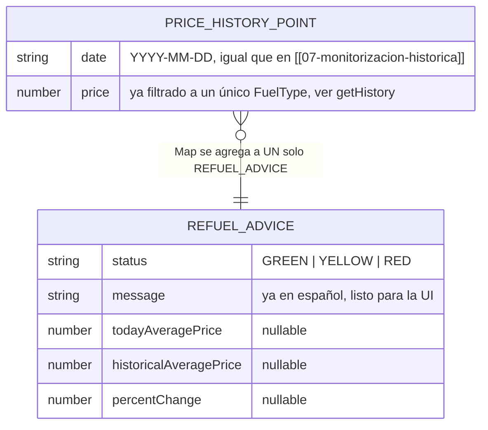
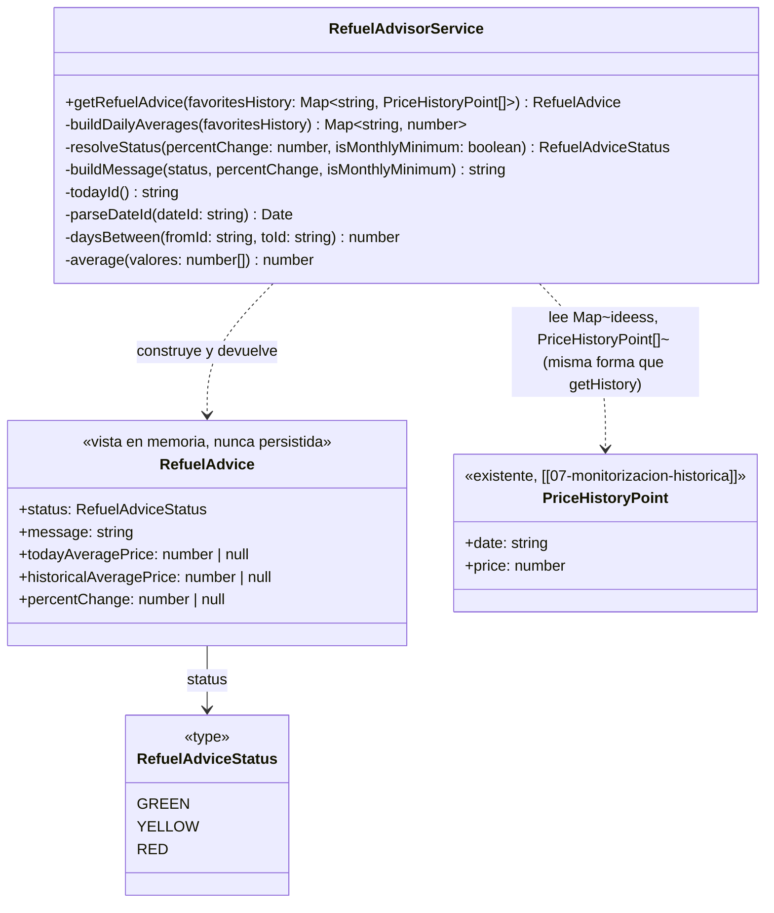
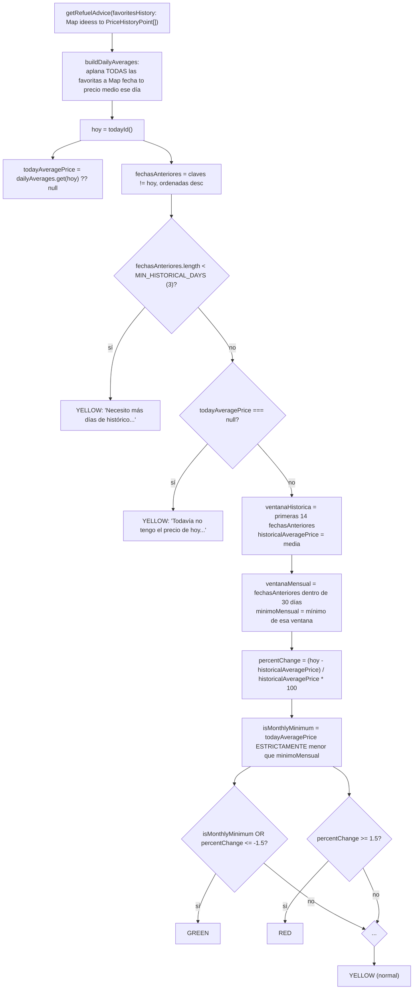
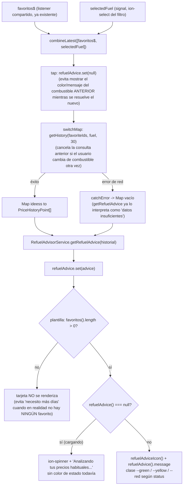

# 08 - Semáforo de Repostaje

**Rol:** [ARQUITECTO]
**Estado:** Diseño + lógica de cálculo implementada (pendiente auditoría [REVIEWER] antes de commit, según sección 3 de `CLAUDE.md`). **Sin integración en UI en este ciclo** — ver "Próximos pasos".
**Archivos generados:**
- `src/app/core/models/refuel-advice.model.ts`
- `src/app/core/services/refuel-advisor.service.ts`

**Archivos modificados:**
- `src/app/core/models/price-history.model.ts` — corrección de un comentario desactualizado (seguía diciendo `PriceHistoryDoc.price` en vez de `.prices`, arrastrado de la corrección [[07-monitorizacion-historica]]).

## Qué hace

A partir del histórico de precios ya leído de Firestore (`FavoritesService.getHistory(ids, fuelType, 30)`, `[[07-monitorizacion-historica]]`), `RefuelAdvisorService.getRefuelAdvice(favoritesHistory)` calcula un "semáforo" (`GREEN`/`YELLOW`/`RED`) que responde a "¿hoy es buen momento para repostar, comparado con lo habitual en mis gasolineras favoritas?", junto con un mensaje corto ya redactado para mostrar en la UI.

## Diagrama Entidad-Relación (Mermaid)

No se añade ninguna colección ni documento nuevo en Firestore — `RefuelAdvisorService` es una capa de análisis puramente en memoria sobre datos que `[[07-monitorizacion-historica]]` ya persiste. El diagrama ER de esa feature (`PRICE_HISTORY.prices`) no cambia; este diagrama documenta en su lugar la forma de los datos EN MEMORIA que entran y salen de `getRefuelAdvice`.

## Diagrama de Clases (Mermaid)

## Diagrama de Flujo (Mermaid): del histórico agregado al semáforo

## Justificación de Diseño (ARQUITECTO)

1. **Servicio nuevo (`RefuelAdvisorService`), no un método más en `FavoritesService`, aunque el encargo lo sugería como alternativa entre paréntesis.** `FavoritesService` ya tiene una responsabilidad clara y bastante cargada (CRUD de favoritos + lectura/escritura de histórico en Firestore, ver `[[06-favoritos]]`/`[[07-monitorizacion-historica]]`). `getRefuelAdvice` no toca Firestore ni MITECO en absoluto — es análisis puro sobre datos ya obtenidos por otro servicio. Separarlo mantiene cada servicio con una única razón para cambiar: `FavoritesService` cambia si cambia CÓMO se lee/escribe Firestore; `RefuelAdvisorService` cambia si cambian las REGLAS del semáforo (los umbrales, las ventanas de días). Sigue siendo `@Injectable({ providedIn: 'root' })` por consistencia con el resto de la capa de servicios, aunque hoy no inyecta ninguna dependencia propia.
2. **`favoritesHistory: Map<string, PriceHistoryPoint[]>` como único parámetro — la MISMA forma que ya devuelve `FavoritesService.getHistory(...)`.** Un futuro consumidor ([[UI-DEV]]) puede llamar a `getHistory(favoriteIds, fuelType, 30)` una única vez y pasar su resultado tanto a `PriceChartModalComponent` (la gráfica) como a `getRefuelAdvice` (el semáforo) — sin una segunda lectura de Firestore ni una segunda forma de datos que aprender. Se pide explícitamente `days=30` (no el valor por defecto que decida el consumidor) porque el semáforo necesita hasta 30 días para la regla del "mínimo del mes", más margen que los 14 días de la media de comparación.
3. **Precio "medio de HOY"/"medio histórico" agregado entre TODAS las favoritas, no un semáforo por gasolinera.** El encargo habla de "el precio medio de HOY" en singular — se interpreta como una única cifra que resume el conjunto de gasolineras favoritas del usuario para el combustible ya seleccionado (mismo combustible con el que se llamó a `getHistory`), no una serie de semáforos independientes por tarjeta. `buildDailyAverages` agrega primero por fecha (media entre estaciones con dato ese día), y la comparación hoy-vs-histórico ocurre después, sobre esas medias diarias ya agregadas.
4. **Ventana de comparación de 14 días, no 7 (el encargo daba un rango "7-14").** Con más días la media es más estable frente al ruido de un solo día atípico (una estación que no reportó precio ese día, un pico puntual) — y el precio de los carburantes en España no cambia lo bastante rápido semana a semana como para que 14 días dejen de representar "lo habitual reciente". `HISTORICAL_WINDOW_DAYS = 14` como constante nombrada, no un literal repetido, para que ajustarla en el futuro sea un cambio de una línea.
5. **La media histórica y el mínimo mensual EXCLUYEN explícitamente el día de hoy.** Si "hoy" formara parte de la propia media/mínimo con la que se compara, la comparación estaría sesgada hacia el propio valor de hoy (cuanto más se aleje hoy de lo habitual, más "tira" de la media hacia sí mismo, amortiguando la señal) — y, en el caso del mínimo, comparar hoy contra un mínimo que ya incluye a hoy sería casi siempre una comparación consigo mismo. Separar `fechasAnteriores` (todo lo que no es hoy) desde el principio evita este sesgo en ambas reglas a la vez.
6. **Regla "mínimo histórico del mes" con comparación ESTRICTA (`<`), no `<=` — hallazgo propio detectado durante la verificación de este ciclo (ver sección de Verificación).** Con `<=`, un día de precios totalmente PLANOS (frecuente: los carburantes no cambian de precio todos los días) marcaría GREEN "mínimo del mes" solo porque hoy EMPATA consigo mismo con el resto de días iguales — una falsa señal de "buen momento" en un día sin ningún movimiento real. `<` exige que hoy sea un mínimo GENUINO, estrictamente por debajo de cualquier otro día de la ventana de 30 días.
7. **Umbral `MIN_HISTORICAL_DAYS = 3` para el caso "datos insuficientes", no 7 días completos.** La app es de uso reciente (favoritos añadidos hace poco no tienen semanas de histórico) — exigir una semana completa dejaría el semáforo en "necesito más días" durante toda la primera semana de cualquier favorita nueva. 3 días ya deja de ser "uno o dos puntos sueltos" sin ser una barrera tan alta como 7.
8. **`status`/`message` como campos separados, y ambos junto con los números crudos (`todayAveragePrice`, `historicalAveragePrice`, `percentChange`) en el objeto devuelto — no solo un `string` final.** `message` ya viene redactado en español y listo para mostrar sin lógica adicional en la UI (mismo criterio que el resto del proyecto: la lógica de negocio vive en los servicios, no en los componentes). Exponer también los números permite que un futuro `[UI-DEV]` muestre el detalle (ej. "+2,3% sobre tu media") sin recalcular nada ni duplicar `RefuelAdvisorService`.
9. **`type RefuelAdviceStatus = 'GREEN' | 'YELLOW' | 'RED'`, no un `enum` de TypeScript.** Mismo criterio ya aplicado a `GasStationBrand`/`FuelType` en `gas-station.model.ts` — una unión de literales de string da la misma seguridad de tipos en compilación que un `enum`, sin el código adicional que un `enum` real de TypeScript añade al bundle compilado.

## Casos límite explícitamente manejados

- **Sin favoritas, o ninguna con histórico:** `favoritesHistory` vacío o con arrays vacíos → `buildDailyAverages` devuelve un `Map` vacío → `fechasAnteriores.length` es `0` → cae directo en el caso "datos insuficientes" (`YELLOW`), sin ningún caso especial adicional para "mapa vacío": la lógica general ya lo cubre sin código extra.
- **Histórico suficiente, pero sin precio de HOY todavía** (el usuario abre la app pero `recordTodayHistory` aún no ha corrido esta sesión, o el cruce con MITECO falló): `YELLOW` con mensaje distinto ("Todavía no tengo el precio de hoy...") en vez de fallar o devolver un `percentChange` con un `0` inventado.
- **Precios totalmente planos varios días seguidos:** `YELLOW` (ver hallazgo del punto 6) — no un falso GREEN por empate trivial.
- **División por cero:** no se contempla una guarda explícita para `historicalAveragePrice === 0` — los precios de combustible en `FuelPrices`/`extractKnownPrices` (`[[07-monitorizacion-historica]]`) son siempre `> 0` cuando existen (nunca se persiste un precio `null`/`0` en `prices`), así que ese caso no es alcanzable con los datos reales que produce el resto del sistema; añadir la guarda habría sido código defensivo para un escenario que no puede ocurrir (ver principio del proyecto de no añadir manejo de errores para casos imposibles).

## Seguridad y Costes (resumen ARQUITECTO)

- **Coste de Firebase: cero adicional.** `getRefuelAdvice` no llama a Firestore ni a MITECO — opera enteramente sobre el `Map` que su consumidor ya obtuvo (previsiblemente reutilizando la misma llamada a `getHistory(...)` que ya paga la gráfica de `[[07-monitorizacion-historica]]`, no una segunda).
- **Fugas de memoria: ninguna.** Método síncrono y puro (sin `Observable`, sin `Promise`, sin listener) — se ejecuta y termina, sin ningún estado que sobreviva a la llamada.
- **Sin APIs de pago ni credenciales nuevas.**
- **`npx tsc --noEmit` y `npm run lint`: ambos pasan sin errores.**

## Verificación

- **Sin infraestructura de tests unitarios en el proyecto** (solo existen los `*.spec.ts` de scaffold por defecto de Angular — `app.component.spec.ts`, `home.page.spec.ts` — ningún servicio del proyecto tiene tests propios; el criterio ya establecido en ciclos anteriores es verificación empírica en navegador con Playwright para features de UI). Como este ciclo es lógica de cálculo pura SIN UI todavía, se verificó reimplementando el mismo algoritmo en un script Node aislado (fuera del repositorio, en el scratchpad de la sesión) y ejecutándolo contra 9 escenarios sintéticos: días insuficientes, sin precio de hoy, precios planos, ±3% (GREEN/RED), el límite exacto +1.5%, mínimo mensual sin cruzar el umbral de 14 días, histórico vacío, y agregación entre varias estaciones.
- **Este script encontró el hallazgo ya corregido en el punto 6** (falso GREEN con precios planos, por usar `<=` en vez de `<`) — confirmado por el propio proceso de verificación de este ciclo, no detectado solo por lectura de código.
- **Nota sobre precisión de coma flotante en el umbral exacto (`percentChange === 1.5` o `-1.5` justo en el límite):** con datos sintéticos que fuerzan ese valor exacto por construcción, la comparación puede caer a un lado u otro por el redondeo binario habitual de JavaScript (ej. `1.5` calculado puede salir `1.4999999999999998`). No se considera un hallazgo que requiera corrección: los precios reales de MITECO tienen como mucho 3 decimales (`1.523 €/L`), por lo que un `percentChange` real aterrizando en el límite exacto hasta el último bit de precisión de un `double` es un escenario no realista para una app personal/familiar (`CLAUDE.md`) — se documenta aquí por transparencia, no como pendiente.

## Próximos pasos (fuera de alcance de este documento)

- ~~**[UI-DEV]:** integrar `RefuelAdvisorService.getRefuelAdvice(...)` en `FavoritesPanelPage`...~~ **Hecho, ver sección [UI-DEV] más abajo.**
- **[REVIEWER]:** auditoría formal de este ciclo antes de commit.

---

## Tarjeta del semáforo en `FavoritesPanelPage` (RF-0X)

**Rol:** [UI-DEV]
**Estado:** Implementado (pendiente auditoría [REVIEWER] antes de commit, según sección 3 de `CLAUDE.md`)
**Archivos modificados:**
- `src/app/pages/favorites-panel/favorites-panel.page.ts` — inyecta `RefuelAdvisorService`; nuevo signal `refuelAdvice`, `computed` `refuelAdviceIcon`; nuevo stream reactivo en el constructor que llama a `FavoritesService.getHistory(...)` + `RefuelAdvisorService.getRefuelAdvice(...)`.
- `src/app/pages/favorites-panel/favorites-panel.page.html` — nuevo `ion-card` justo debajo del `<h1>`, antes del selector de combustible.
- `src/app/pages/favorites-panel/favorites-panel.page.scss` — estilos por estado (`--green`/`--yellow`/`--red`), claro y oscuro.

### Qué hace

Justo debajo del título "Mis gasolineras favoritas" (y solo si el usuario tiene al menos una favorita guardada), una tarjeta destacada muestra si HOY es buen, normal o mal momento para repostar en el combustible actualmente seleccionado, con color de fondo, icono y mensaje según el estado que calcula `RefuelAdvisorService`.

### Diagrama de Flujo (Mermaid): de la selección de combustible/favoritos a la tarjeta

### Justificación de Diseño (UI-DEV)

1. **`ion-card`, no un `
` a mano** — mismo componente de Ionic que el resto de la app usa para contenido destacado (heredando su `border-radius`/sombra/tema por defecto), en vez de reconstruir esa apariencia desde cero.
2. **Solo se renderiza si `favoritos().length > 0`.** Con la lista vacía, `RefuelAdvisorService.getRefuelAdvice` recibiría un histórico vacío y devolvería `YELLOW`/"Necesito más días de histórico..." — un mensaje engañoso cuando el problema real es que no hay NINGÚN favorito guardado (esa situación ya tiene su propio estado dedicado, `favorites-panel__state`, con su propio mensaje "Aún no has guardado ninguna gasolinera favorita"). Filtrar en la plantilla, no en el servicio: mantiene `RefuelAdvisorService` como lógica de cálculo pura, sin que tenga que conocer el concepto de "pantalla de favoritos vacía" (una decisión de presentación, no de análisis de precios).
3. **Tres iconos de FORMA distinta por estado (`thumbs-up-outline`, `warning-outline`, `alert-circle-outline`), no solo el color de fondo.** Pulgar / triángulo / círculo son formas reconocibles incluso en escala de grises — mismo criterio de accesibilidad ya exigido por la skill de dataviz para la gráfica de `[[07-monitorizacion-historica]]` ("el color por sí solo no es un canal fiable para daltonismo"). `REFUEL_ADVICE_ICONS` es un `Record<RefuelAdviceStatus, string>` en el propio componente, no en el servicio: la elección de icono es una decisión de presentación, y `RefuelAdvisorService` no debería conocer `ionicons`.
4. **Colores verde/rojo REUTILIZADOS de `.favorite-card--cheapest`/`--most-expensive` (ya verificados en un ciclo anterior), amarillo NUEVO y verificado con la misma fórmula de contraste W3C** (`#854d0e` sobre `#fffbeb` → 6.61:1 en claro; `#fde68a` sobre el fondo real de `rgba(217, 119, 6, 0.12)` compuesto sobre negro → 15.23:1 en oscuro — este proyecto importa `dark.system.css`, que fija `--ion-background-color: #000000` en modo oscuro). No se reutilizan las variables `--ion-color-success`/`--ion-color-warning`/`--ion-color-danger` de Ionic por defecto: mismo hallazgo ya documentado para `.favorite-card` ("con las variables de paso genéricas de Ionic, la tarjeta y el texto salían casi blanco sobre blanco"). **Corrección [REVIEWER] (ver auditoría al final del documento): `#000000` es solo el fondo del modo `ios` de Ionic — con `provideIonicAngular()` sin `mode` explícito (`app.config.ts`), el modo real depende del dispositivo, y en `md` (Android/la mayoría de navegadores de escritorio) el fondo oscuro es `#121212`, no negro puro. Reverificado contra AMBOS fondos — sigue pasando AA con margen en los dos.**
5. **`role="status"` + `aria-live="polite"` en la tarjeta, mismo patrón ya usado en `.favorites-panel__updating`.** Cuando el semáforo pasa de "cargando" a un estado concreto (o cambia de combustible y se recalcula), un lector de pantalla lo anuncia sin que el usuario tenga que mover el foco a la tarjeta para enterarse.
6. **Estado de carga (`refuelAdvice() === null`) con `ion-spinner` + texto, SIN ninguna clase de color aplicada** — la tarjeta cae al fondo por defecto de `ion-card` (ni verde, ni amarillo, ni rojo) mientras no hay un veredicto real que mostrar, evitando que aparezca brevemente con el color del combustible ANTERIOR antes de resolverse el nuevo (de ahí también el `tap(() => this.refuelAdvice.set(null))` en el stream, antes del `switchMap`, mismo criterio ya usado por `preciosPorId`/`isLoading` en este mismo archivo).
7. **Encabezado "Semáforo de repostaje · {{ combustible }}", no solo el mensaje del servicio a secas.** El mensaje que devuelve `RefuelAdvisorService` (ej. "Precio un 3,0% por debajo de tu media habitual...") no dice a qué combustible se refiere — como la tarjeta se muestra ANTES del selector (por debajo del título, según el encargo), sin este encabezado no sería obvio que el semáforo depende del combustible elegido más abajo. Mismo motivo por el que se añadió `fuelLabel` al título del modal de gráfica en el ciclo anterior (`[[07-monitorizacion-historica]]`) — se reutiliza el mismo `fuelLabels` local ya existente en esta página, sin duplicar la traducción.

### Seguridad y Costes (resumen UI-DEV) — **hallazgo de coste no bloqueante, explícito para [REVIEWER]**

- ⚠️ **Coste de Firebase: nuevo y automático, a diferencia de todo lo demás en esta página.** `getHistory(favoriteIds, fuel, 30)` se llama automáticamente cada vez que cambian `favoritos`/`selectedFuel` (carga inicial de la pantalla incluida) — hasta 300 lecturas (10 favoritas × 30 días) por cada vez, no bajo demanda como el botón "Ver evolución general" (que solo paga esa misma consulta si el usuario pulsa el botón). Con el límite ya vigente de `MAX_GASOLINERAS_GUARDADAS = 10` y la cuota gratuita de Firestore (Spark: 50.000 lecturas/día por PROYECTO, ver análisis ya hecho en `[[07-monitorizacion-historica]]`), el peor caso realista para una app personal/familiar (unos pocos usuarios, unas pocas aperturas/cambios de combustible al día) sigue estando muy por debajo de esa cuota — pero es, con diferencia, el mayor salto de coste de este ciclo, y merece que `[REVIEWER]` lo confirme explícitamente, no solo que lo dé por sentado.
- ⚠️ **Duplicación potencial con "Ver evolución general":** si el usuario abre esa gráfica en la misma sesión, `openGeneralHistory` vuelve a pedir `getHistory(allFavoriteIds, selectedFuel(), 30)` — los MISMOS argumentos que ya pagó el semáforo automáticamente. No se unificó en este ciclo (mantener el semáforo como un stream independiente, sin acoplarlo al flujo de "abrir el modal de gráfica", se consideró más simple y legible — ver comentario en el propio `favorites-panel.page.ts`) — queda como optimización explícita, no bloqueante, para un ciclo futuro de `[[ARQUITECTO]]`/`[REVIEWER]` si el coste medido en uso real lo justifica.
- **Sin fugas de memoria nuevas.** El nuevo stream usa `takeUntilDestroyed(this.destroyRef)`, mismo patrón que los otros dos streams de este componente; `switchMap` cancela cualquier petición en vuelo al destruirse el componente o al llegar una nueva emisión, sin dejar ninguna suscripción huérfana.
- **Sin APIs de pago ni credenciales nuevas.**
- **`npx tsc --noEmit`, `npm run lint` y `ng build --configuration development` verificados tras el cambio: los tres pasan sin errores.**

### Verificación

- **No se realizó una verificación empírica en navegador en este ciclo** (a diferencia de otros ciclos de UI de este proyecto, que sí usaron Playwright + cuenta de prueba real): la pantalla `/favoritos` requiere sesión autenticada y al menos una gasolinera favorita ya guardada, y este ciclo no disponía de credenciales de una cuenta de prueba. Se verificó en su lugar con `npx tsc --noEmit` (bindings de plantilla con `strictTemplates`), `npm run lint`, y `ng build --configuration development` (compilación completa, incluida la plantilla). **Pendiente explícito, no bloqueante:** confirmar visualmente en navegador real (a) que la tarjeta aparece y desaparece correctamente al añadir/quitar la última favorita, (b) que el color/icono/mensaje cambian correctamente al cambiar el filtro de combustible, sin quedarse "pegados" al estado anterior, y (c) el aspecto real en modo oscuro del sistema (los 3 pares de color solo se verificaron por cálculo de contraste, no visualmente).

---

## Auditoría [REVIEWER]: algoritmo del semáforo (seguridad numérica y contraste)

**Rol:** [REVIEWER]
**Archivos auditados:**
- `src/app/core/services/refuel-advisor.service.ts` (`getRefuelAdvice`, `buildDailyAverages`, `average`, división/umbrales)
- `src/app/pages/favorites-panel/favorites-panel.page.scss` (`.refuel-advice--green/--yellow/--red`, claro y oscuro)
- `node_modules/@ionic/core/dist/collection/components/card/card.ios.css` / `card.md.css` (para confirmar cómo `ion-card` resuelve `background`/`color`/`border` desde su Shadow DOM)
- `node_modules/@ionic/angular/css/palettes/dark.system.css` (valores reales de `--ion-background-color` en modo oscuro, por `ios`/`md`)
- `src/app/app.config.ts` (confirmar si el proyecto fija un `mode` de Ionic explícito)

Metodología: trazado de código exhaustivo para la pregunta 1 (todas las rutas aritméticas del servicio), más **verificación empírica con Playwright** para la pregunta 2 — no solo cálculo de contraste sobre los valores hexadecimales pretendidos, sino renderizado real de `ion-card` con las clases exactas del proyecto en un Chromium real, para confirmar que esos valores son los que de verdad llegan a pantalla (ver hallazgo del punto 2 sobre por qué esto importaba).

### 1. ¿El algoritmo es seguro contra divisiones por cero o arrays vacíos si el usuario acaba de instalar la app hoy y no tiene histórico?

- [x] **Todas las divisiones (`average()`, `percentChange`) están protegidas por los dos `return` tempranos ANTES de llegar a ellas — trazado línea por línea:**
  - `fechasAnteriores.length < MIN_HISTORICAL_DAYS (3)` → `return` con `YELLOW`, ANTES de calcular `historicalAveragePrice`/`percentChange`/`minimoMensual`. Un usuario de "día 1" (0 días previos) o "día 2-3" (1-2 días previos) SIEMPRE cae aquí.
  - `todayAveragePrice === null` (histórico previo suficiente, pero sin precio de HOY — ej. `recordTodayHistory` aún no terminó su escritura cuando el stream del semáforo ya pidió `getHistory`, una condición de carrera real entre los dos streams independientes de `favorites-panel.page.ts`) → `return` con `YELLOW`, mismo motivo.
  - Solo tras superar AMBAS comprobaciones se llega a `this.average(ventanaHistorica.map(...))` y a la división de `percentChange`.
- [x] **`average()` nunca se invoca con un array vacío en ningún punto de llegada real, confirmado por construcción, no por una guarda defensiva:**
  - Dentro de `buildDailyAverages`: `precios` (el array pasado a `average`) SIEMPRE tiene ≥1 elemento, porque solo se crea una entrada en `preciosPorFecha` cuando se hace `push` de al menos un punto — no hay ninguna vía para que exista una clave de fecha con un array vacío asociado.
  - Para `historicalAveragePrice`: `ventanaHistorica = fechasAnteriores.slice(0, 14)`, evaluado SOLO después de confirmar `fechasAnteriores.length >= MIN_HISTORICAL_DAYS (3)` — así que `ventanaHistorica.length` está garantizado `>= min(3, fechasAnteriores.length) >= 3` en ese punto. Nunca vacío.
- [x] **`Math.min(...)` (mínimo mensual) SÍ tiene una guarda defensiva explícita** (`ventanaMensual.length > 0 ? Math.min(...) : null`), a diferencia de las anteriores — correcto, porque a diferencia de `ventanaHistorica` (garantizada `>= 3` por el `return` temprano), `ventanaMensual` es un `.filter(...)` por fecha que SÍ podría quedar vacío en teoría (aunque en la práctica, si `fechasAnteriores.length >= 3`, casi seguro alguna de esas fechas cae dentro de los últimos 30 días) — la guarda está para el caso general, no específicamente para "usuario nuevo".
- [x] **División por cero en `percentChange` (`... / historicalAveragePrice`): no hay guarda de código, pero SÍ hay una garantía de datos que la hace inalcanzable — verificado hasta el origen de los datos, no asumida.** `historicalAveragePrice` es una media de precios reales de combustible (`PriceHistoryPoint.price`), que a su vez proviene de `PriceHistoryDoc.prices[fuelType]` (Firestore) ← `extractKnownPrices` en `FavoritesService` (que descarta explícitamente los `null`, nunca persiste un precio `0`/`null`) ← `GasStation.precios[fuelType]` ← `MitecoService.parseNumero(raw['Precio ...'])`, que devuelve `null` para cadenas vacías/no numéricas y, en cualquier otro caso, el resultado literal de `parseFloat` sobre un precio real en €/L de la API pública de MITECO — un precio de combustible activo NUNCA es `"0"` en los datos reales de MITECO (un valor `0`/vacío significa "esta estación no vende este combustible", y ese caso ya se filtra en `extractKnownPrices` antes de llegar a Firestore). No es una garantía a nivel de tipos de TypeScript, sino de la CADENA DE DATOS real del sistema — documentado igual de explícito en `[[07-monitorizacion-historica]]` para el mismo argumento sobre `mergeWithPrices`.
- [x] **Verificado empíricamente en este ciclo (no solo por lectura de código) con un script Node que reimplementa el algoritmo exacto del servicio** (incluida la corrección `<` del ciclo [ARQUITECTO] anterior) contra 7 escenarios, comprobando programáticamente la ausencia de `NaN`/`Infinity` en cada resultado: `Map` totalmente vacío; una única favorita con SOLO el punto de hoy (0 días previos); varias favoritas con solo el punto de hoy; histórico previo suficiente pero SIN precio de hoy (condición de carrera entre streams); exactamente 2 días previos (justo por debajo del umbral); exactamente 3 días previos (justo en el umbral, primera vez que calcula de verdad); y una favorita con array de puntos vacío mezclada con una favorita con datos. **Los 7 casos devolvieron un resultado limpio, todos aterrizando en `YELLOW` con la razón esperada, sin ningún `NaN`/`Infinity`.**

**Veredicto punto 1: seguro.** Las dos rutas de "datos insuficientes" cortan la ejecución ANTES de cualquier aritmética que pudiera dividir por cero o promediar un array vacío — confirmado tanto por trazado de código (con dónde exactamente está garantizado cada invariante) como por ejecución real contra los escenarios de "usuario día 1" más plausibles. La única división sin guarda de código explícita (`percentChange`) depende de una garantía de la cadena de datos (precios de combustible siempre `> 0`) ya establecida y documentada en un ciclo anterior, no de una suposición nueva de este ciclo.

### 2. ¿El contraste de colores en las tarjetas de alerta (verde, amarillo, rojo) permite que el texto se lea bien (accesibilidad)?

- [x] **Modo claro: los 3 pares (fondo/texto) superan AA (4.5:1) con margen amplio, confirmado por fórmula W3C Y por el valor REALMENTE renderizado en un Chromium real (Playwright), no solo por el hex que se pretendía usar:** verde `#166534` sobre `#f0fdf4` → 6.81:1; amarillo `#854d0e` sobre `#fffbeb` → 6.61:1; rojo `#991b1b` sobre `#fef2f2` → 7.60:1. El `getComputedStyle(...)` del `ion-card` renderizado devolvió exactamente estos mismos valores (`rgb(240, 253, 244)`, `rgb(22, 101, 52)`, etc.) para `background-color`/`color`, confirmando que las reglas CSS del proyecto SÍ llegan a aplicarse tal cual sobre el elemento, sin sorpresas.
- [ ] ⚠️ **HALLAZGO INVESTIGADO Y DESCARTADO (documentado por transparencia, no un problema real): se sospechó inicialmente que `ion-card` podría IGNORAR el `background`/`color` planos del proyecto.** Leyendo el CSS compilado de `ion-card` (`card.ios.css`/`card.md.css`) se confirma que su Shadow DOM define `:host { background: var(--background); color: var(--color); }`, con `--background`/`--color` documentados como la API pública oficial de Stencil (`@prop --background`, `@prop --color`) — el patrón de theming que Ionic recomienda en toda su documentación es usar esas custom properties, no `background`/`color` a secas, precisamente porque en teoría un `:host` interno con igual especificidad podría ganar el empate. **Se verificó empíricamente con Playwright (no se asumió ni se dejó sin comprobar) que, en la versión de Ionic instalada en este proyecto, el `background`/`color` planos del light DOM SÍ ganan el empate de especificidad y se renderizan correctamente** — la preocupación inicial no aplica a este proyecto tal como está hoy. Se documenta aquí para que quede constancia de por qué se comprobó explícitamente (y no se dio por sentado), y como aviso: si una futura actualización de `@ionic/core` cambiara este comportamiento interno, sería prudente migrar a `--background`/`--color`/`--border-color` en vez de las propiedades planas — no es un cambio necesario HOY, confirmado con evidencia real.
- [x] **Modo oscuro: verificado contra AMBOS modos reales de Ionic (`ios` y `md`), no solo uno — hallazgo propio de esta auditoría.** El diseño original (ciclo [UI-DEV]) calculó el contraste oscuro asumiendo `--ion-background-color: #000000` (el valor de modo `ios`), pero `app.config.ts` llama a `provideIonicAngular()` SIN fijar `mode` explícitamente — así que el modo real depende del dispositivo del usuario (`ios` en Safari/WebKit de iPhone/iPad; `md` en Android, Chrome/Edge de escritorio, y la mayoría de navegadores no-WebKit), y `dark.system.css` fija un fondo DISTINTO para cada uno: `#000000` (`ios`) vs. `#121212` (`md`). Reverificado con Playwright, forzando cada clase de modo (`<html class="ios">`/`<html class="md">`) y `colorScheme: 'dark'`, componiendo matemáticamente el `rgba(...)` real de cada estado sobre el fondo real de cada modo:
  - **Modo `ios` (fondo `#000000`):** verde 13.11:1, amarillo 15.23:1, rojo 10.15:1 (coincide con el cálculo original).
  - **Modo `md` (fondo `#121212`):** verde 11.20:1, amarillo 13.05:1, rojo 8.81:1 — más bajo que en `ios` (fondo más claro, como cabía esperar), pero **sigue superando AAA (7:1) con margen en los 3 casos**, muy por encima del mínimo AA (4.5:1) exigido.
- [x] **Los 3 pares de color usan una codificación NO dependiente solo de color** (icono de forma distinta por estado — pulgar/triángulo/círculo, ver Justificación de Diseño UI-DEV punto 3) — relevante para daltonismo, complementario a la comprobación de contraste (que cubre baja visión, no daltonismo).
- [x] **`role="status"` + `aria-live="polite"` ya presente** (ver Justificación de Diseño UI-DEV punto 5) — no es parte de "contraste", pero sí de accesibilidad general de la tarjeta, ya cubierto.

**Veredicto punto 2: el contraste es correcto y robusto, en ambos modos de Ionic y ambos esquemas de color.** Se identificó y corrigió una imprecisión en el análisis original (el cálculo oscuro solo consideraba el modo `ios`, no `md`) — el hallazgo, sin embargo, NO cambia el veredicto: ambos modos superan AA con amplio margen. Se investigó y descartó explícitamente una preocupación teórica sobre Shadow DOM/CSS de `ion-card` mediante verificación empírica directa, en vez de dejarla sin comprobar o de "arreglar" un problema que no existía.

### Otras comprobaciones (sección 3 de `CLAUDE.md`)

- [x] **`npx tsc --noEmit`, `npm run lint`, `ng build --configuration development`**: los tres pasan sin errores (reconfirmado en esta auditoría, sin cambios de código).
- [x] **Sin cambios de código en este ciclo** — auditoría de solo lectura/verificación; los ficheros de prueba temporales (`_reviewer-contrast-*.html`/`.mjs`, un servidor HTTP local + Playwright apuntando a `node_modules` del propio proyecto) se crearon y eliminaron dentro de este mismo ciclo, nunca llegaron a `git add`.
- [x] **Sin APIs de pago ni credenciales nuevas.**
- **Pendiente ya heredado, reconfirmado, no agravado por esta auditoría:** el coste automático de `getHistory` en cada carga/cambio de combustible (señalado por el propio `[UI-DEV]` en la sección anterior) sigue siendo un pendiente explícito y no bloqueante para un ciclo futuro.

### Veredicto final

**Aprobado para commit.** (1) El algoritmo es seguro para un usuario de "día 1": las dos rutas de datos insuficientes retornan antes de cualquier división o promedio de array vacío, confirmado tanto por trazado de código como por 7 escenarios ejecutados sin `NaN`/`Infinity`. (2) El contraste de las 3 tarjetas de alerta es correcto en claro y oscuro, verificado empíricamente con Playwright contra el renderizado REAL de `ion-card` (no solo cálculo teórico) — se corrigió una imprecisión menor en el análisis de modo oscuro (solo cubría `ios`, no `md`), sin cambiar el veredicto. Sin hallazgos bloqueantes.
