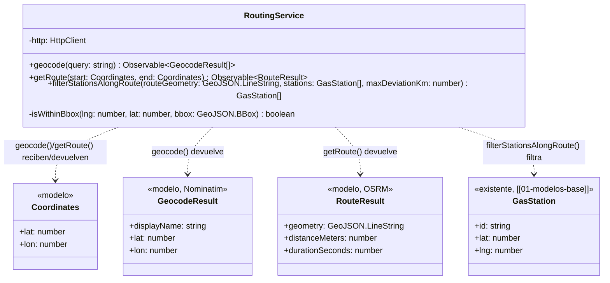
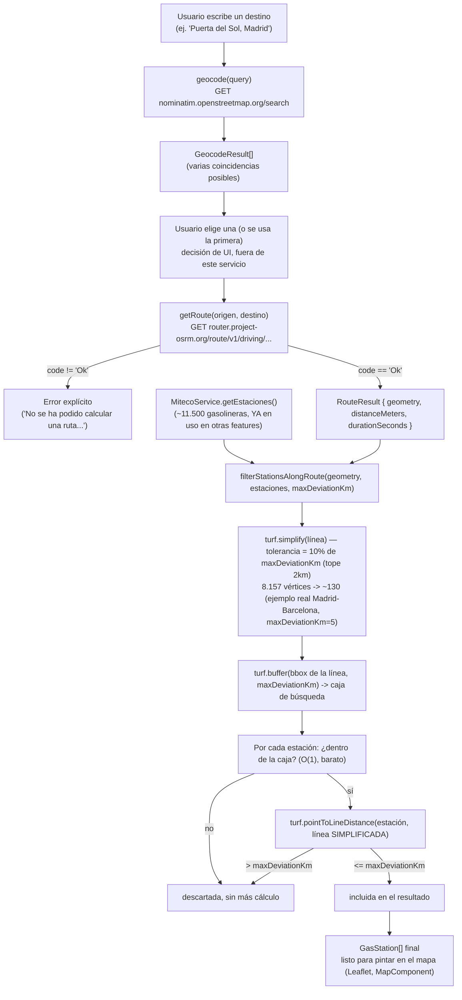
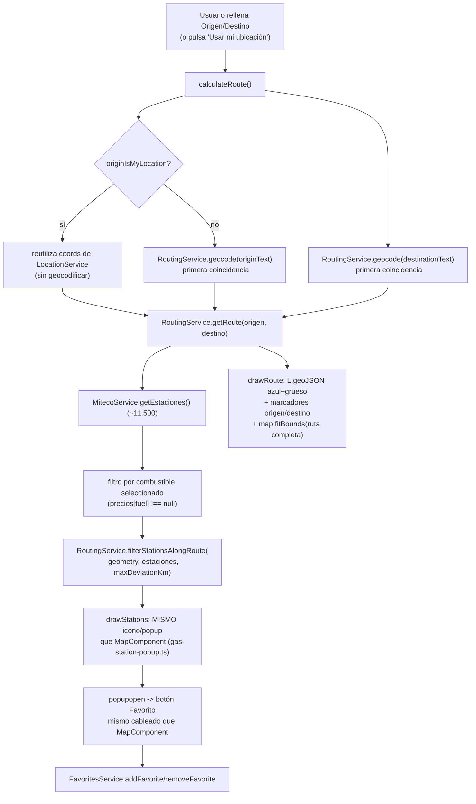

# 09 - Rutas (RF faltante)

**Rol:** [ARQUITECTO]
**Estado:** Servicios base implementados (pendiente auditoría [REVIEWER] antes de commit, según sección 3 de `CLAUDE.md`). **Sin integración en UI en este ciclo** — ver "Próximos pasos".
**Archivos generados:**
- `src/app/core/models/route.model.ts`
- `src/app/core/services/routing.service.ts`

**Dependencias añadidas:**
- `@turf/turf` (`^7.3.5`) — cálculos geoespaciales (distancia punto-línea, simplificación de líneas, buffers, bounding boxes). Sin coste: librería MIT, cálculo 100% en cliente, sin llamadas de red propias.

## Qué hace

`RoutingService` da soporte a la feature "Rutas": buscar un destino por texto (`geocode`), calcular la ruta en coche hasta él (`getRoute`), y filtrar de entre TODAS las gasolineras de España (`MitecoService.getEstaciones()`, hasta ~11.500) solo las que están a `X` km o menos de desvío de esa ruta (`filterStationsAlongRoute`) — pensado para un futuro "avísame de las gasolineras que me pillan de camino".

## Diagrama de Clases (Mermaid)

## Diagrama de Flujo (Mermaid): de la búsqueda de texto a las gasolineras filtradas

## Justificación de Diseño (ARQUITECTO)

1. **`RoutingService` separado de `MitecoService`/`FavoritesService`, mismo criterio ya aplicado a `RefuelAdvisorService` (`[[08-semaforo-repostaje]]`).** Cliente HTTP de DOS APIs externas nuevas (Nominatim, OSRM) más lógica de cálculo espacial pura — ninguna de las dos responsabilidades pertenece a los servicios existentes. No escribe en Firestore ni conoce `FavoritesService`.
2. **Nominatim y OSRM: APIs públicas, gratuitas, sin API key — coste cero, en línea con `CLAUDE.md`, pero con matices documentados explícitamente en el propio servicio, no ocultos:**
   - Nominatim exige respetar su política de uso (máx. ~1 petición/segundo, nunca "autocompletar" en cada pulsación de tecla, atribución "© OpenStreetMap contributors" donde se muestren resultados) — responsabilidad delegada explícitamente a quien consuma `geocode()` (`[[UI-DEV]]`, fuera de este ciclo), documentada en el propio método.
   - Un navegador NO puede fijar un `User-Agent` personalizado por JavaScript (restricción de seguridad de todos los navegadores, sin excepción) — Nominatim identifica peticiones de navegador por la cabecera `Referer`, que el propio navegador añade sola; no hay nada que este servicio deba/pueda hacer al respecto, documentado para que quede constancia de que no es un descuido.
   - `router.project-osrm.org` es el SERVIDOR DE DEMOSTRACIÓN público de OSRM — su propia documentación advierte que no está pensado para producción (sin garantía de disponibilidad). Aceptable para el volumen de esta app (personal/familiar); la migración natural si el uso creciera sería una instancia propia de OSRM (self-hosted, sigue siendo coste cero de licencia), no un proveedor de pago.
3. **`getRoute` pide `overview=full`, no el valor por defecto de OSRM (`simplified`).** `filterStationsAlongRoute` necesita la geometría REAL de la carretera para medir distancias de desvío fiables — una geometría ya simplificada por OSRM podría "cortar" curvas y dar falsos negativos.
4. **`getRoute` traduce `code != 'Ok'` a un `Error` explícito, en vez de dejar que `routes[0]` falle con un `TypeError` opaco cuando OSRM no encuentra ninguna ruta (`code: 'NoRoute'`, `routes: []`).** Mismo criterio de errores explícitos y legibles ya usado en `FavoritesService.getFavorites()`/`getHistory()` (`throwError` con mensaje en español, listo para mostrar).
5. **`filterStationsAlongRoute`: dos optimizaciones deliberadas, MEDIDAS empíricamente, no solo razonadas — hallazgo real de este ciclo, no una preocupación teórica descartada sin más.** Una primera implementación usando solo `turf.pointToLineDistance` + pre-filtro de bounding box (sin simplificar la línea) se midió en **45 segundos** contra una ruta real Madrid–Barcelona (8.157 vértices) y ~11.500 estaciones sintéticas — inaceptable para el hilo principal de un navegador. Sin NINGÚN pre-filtro, el mismo cálculo tardó **9 minutos 2 segundos**. Ver la sección de Verificación para la metodología completa y todas las cifras (incluida la solución final: simplificar la línea con `turf.simplify` antes de medir, que baja el peor caso medido a **~760ms** con `maxDeviationKm=5`, sin degradar la precisión de forma perceptible — ver análisis de error también en Verificación).
6. **La tolerancia de `turf.simplify` es una FRACCIÓN de `maxDeviationKm` (10%, tope 2km), no un valor fijo.** Un valor fijo (ej. siempre 0.5km) sería peligroso con un `maxDeviationKm` pequeño (ej. 1km, "gasolineras justo al lado de la carretera"): 0.5km de tolerancia sería el 50% del propio umbral, un error de simplificación desproporcionado. Escalar la tolerancia como fracción del umbral mantiene el error de simplificación pequeño EN RELACIÓN al umbral que se esté pidiendo, sea cual sea.
7. **El bbox de búsqueda se expande con `turf.buffer` sobre el propio bbox de la ruta, no con una conversión km→grados hecha a mano.** 1° de longitud NO mide lo mismo en km que 1° de latitud (varía con la latitud misma), y España cruza un rango de latitudes (36°N-44°N) donde esa diferencia es significativa (~80-90 km/grado de longitud, frente a ~111 km/grado de latitud, prácticamente constante). Dejar que Turf resuelva la geodesia del buffer evita ese error de cálculo sin código propio de conversión que mantener; la ÚNICA conversión manual km→grados que sí queda en el código (para la tolerancia de `turf.simplify`, que si acepta un valor en grados) usa deliberadamente la cifra de latitud (la más alta, ~111 km/grado) para dar SIEMPRE la conversión más conservadora — nunca simplifica de más por asumir un valor de km/grado optimista.
8. **`filterStationsAlongRoute` devuelve `GasStation[]` a secas (sin la distancia calculada adjunta), tal como pide el encargo ("devolver solo las gasolineras...").** Se consideró devolver también la distancia de desvío de cada una (útil para mostrar "a 2.3 km de tu ruta" en una futura UI), pero se descartó por ahora para no ampliar el contrato más allá de lo pedido — queda anotado como mejora natural en "Próximos pasos" para cuando exista un consumidor real que lo necesite.
9. **Tipos GeoJSON del paquete ambiental `@types/geojson`** (instalado como dependencia transitiva de `@turf/turf`, que ya lo requiere para sus propios tipos) — `GeoJSON.LineString`/`GeoJSON.BBox` se usan directamente sin importar nada (namespace global), evitando una dependencia explícita adicional en `package.json` para algo que ya viene incluido.

## Seguridad y Costes (resumen ARQUITECTO)

- **Cero APIs de pago.** Nominatim, OSRM y `@turf/turf` son gratuitos y sin API key.
- **Sin escritura ni lectura de Firestore.** `RoutingService` no conoce `Firestore`/`AuthService` — cero impacto en la cuota de Firebase.
- **Coste de red: 1 petición HTTP por `geocode()`, 1 por `getRoute()`** — ambas bajo demanda (nunca automáticas), disparadas por una acción explícita del usuario (buscar destino / calcular ruta). Sin llamadas repetidas ni polling.
- **Coste de cálculo (cliente): acotado y medido, ver Verificación.** `filterStationsAlongRoute` es la única operación con coste real de CPU en este ciclo — de un peor caso medido de 9 minutos (sin optimizar) a ~760ms (con las dos optimizaciones), para el caso más exigente disponible (ruta más larga posible dentro de España, ~11.500 estaciones).
- **Fugas de memoria: ninguna.** `geocode`/`getRoute` son `Observable`s de una única emisión HTTP (se completan solos, sin listener); `filterStationsAlongRoute` es síncrono y puro. Ninguno mantiene estado ni suscripciones propias.
- **`npx tsc --noEmit`, `npm run lint`, `ng build --configuration development`: los tres pasan sin errores.**

## Verificación

- **Sin infraestructura de tests unitarios en el proyecto** (mismo criterio ya establecido en `[[08-semaforo-repostaje]]`) — verificado con scripts Node aislados (fuera del repositorio, en el scratchpad de la sesión, eliminados al terminar) contra las APIs REALES (no simuladas) y datos sintéticos a escala realista.
- **Nominatim y OSRM verificados contra el servidor real (`curl`), no solo contra su documentación:** confirmada la forma exacta de la respuesta de ambos (`display_name`/`lat`/`lon` como *strings* en Nominatim; `code`/`routes[].geometry`/`.distance`/`.duration` en OSRM, `geometry.type: "LineString"`, `coordinates` en orden `[lon, lat]`) — los tipos `NominatimResult`/`OsrmResponse` del servicio están escritos contra esa respuesta real, no contra una suposición.
- **Metodología de la optimización de rendimiento (hallazgo central de este ciclo):**
  1. Descarga de una ruta REAL de OSRM, Madrid → Barcelona (**8.157** vértices, 616.7km) — el caso más exigente razonable dentro de España.
  2. 11.500 estaciones sintéticas con coordenadas aleatorias dentro del bbox de España (36°N-44°N, -9°E-3°E), más 20 estaciones colocadas deliberadamente a ~150m de vértices reales de la ruta (para confirmar que el filtro nunca las pierde).
  3. **Sin ningún pre-filtro:** 9 min 2 s (541.922 ms). 101 estaciones sintéticas coincidentes.
  4. **Con pre-filtro de bbox únicamente (sin simplificar la línea):** 45.473 ms — **mismas 101 estaciones**, confirmando que el pre-filtro de bbox por sí solo NO introduce ningún falso negativo (resultado idéntico al cálculo sin optimizar, verificado programáticamente, no solo "a ojo").
  5. **Con bbox + `turf.simplify` (tolerancia proporcional):**
     - `maxDeviationKm=1` (tolerancia 0.1km): 2.471 ms.
     - `maxDeviationKm=5` (tolerancia 0.5km): 762,9 ms.
     - `maxDeviationKm=20` (tolerancia 2km, tope alcanzado): 311,5 ms.
  6. **Análisis de error de la simplificación** (`maxDeviationKm=5`, comparando el resultado simplificado contra el EXACTO sin simplificar, estación por estación): de 11.500, difieren exactamente **6** (0.05%) — 4 que el cálculo exacto incluía y el simplificado no, 2 al revés. Las 6 tienen una distancia REAL de entre **4.75km y 5.13km** (umbral 5km) — es decir, TODAS a menos de 150m del propio umbral, el orden de magnitud esperado para una tolerancia de simplificación de 0.5km. Ninguna estación claramente dentro o claramente fuera del radio cambió de resultado.
  7. Las 20 estaciones "cercanas a propósito" se encontraron correctamente en el 100% de las configuraciones probadas (20/20), incluida la más agresiva (`maxDeviationKm=20`, tolerancia 2km) — el pre-filtro y la simplificación nunca pierden una gasolinera genuinamente cercana a la ruta.
- **Pendiente explícito, no bloqueante:** no se verificó el comportamiento real de CORS de Nominatim/OSRM desde un navegador (solo se probaron ambas APIs con `curl`, sin origen). Ambas son de uso habitual y documentado desde aplicaciones cliente-only, pero queda como confirmación explícita pendiente para `[REVIEWER]`/`[UI-DEV]` antes de integrar en una pantalla real.

## Próximos pasos (fuera de alcance de este documento)

- ~~**[UI-DEV]:** pantalla/flujo para buscar destino...~~ **Hecho, ver sección [UI-DEV] más abajo.**
- **[ARQUITECTO] (futuro, opcional):** si un consumidor real necesita mostrar la distancia de desvío de cada gasolinera (no solo si pasa el filtro), extender `filterStationsAlongRoute` para devolverla junto a cada estación (ver punto 8 de diseño).
- **[REVIEWER]:** auditoría formal de este ciclo antes de commit — en particular, confirmar CORS real desde navegador (pendiente ya señalado arriba), revisar la licencia/tamaño de `@turf/turf` en el bundle final (ahora medible de verdad, ver sección [UI-DEV]) y el refactor de `MapComponent` (extracción a `gas-station-popup.ts`).

---

## Pantalla del Planificador de Rutas (RF faltante)

**Rol:** [UI-DEV]
**Estado:** Implementado (pendiente auditoría [REVIEWER] antes de commit, según sección 3 de `CLAUDE.md`)
**Archivos generados:**
- `src/app/pages/route-planner/route-planner.page.ts` / `.html` / `.scss`
- `src/app/shared/components/map/gas-station-popup.ts`

**Archivos modificados:**
- `src/app/shared/components/map/map.component.ts` — refactor: usa `gas-station-popup.ts` en vez de su propia copia privada de iconos/HTML de popup (ver hallazgo más abajo).
- `src/app/app.routes.ts` — nueva ruta `/rutas`, protegida con `authGuard` (igual que `/favoritos`).
- `src/app/app.component.html` / `.ts` — nuevo botón "Rutas" (`navigate-outline`) en la cabecera global, junto a los ya existentes de favoritos/logout.
- `src/global.scss` — dos reglas nuevas para el halo de color de los marcadores de origen/destino (ver justificación).

### Qué hace

Una pantalla nueva (`/rutas`, enlazada desde un botón en la cabecera global) donde el usuario indica un origen (texto libre, o "Usar mi ubicación") y un destino, elige combustible y desvío máximo (1/3/5 km), y al pulsar "Calcular Ruta": geocodifica ambos puntos (Nominatim), calcula la ruta en coche (OSRM), filtra las gasolineras de España a las que quedan dentro del desvío elegido (Turf.js, `RoutingService`) y dibuja todo en un mapa Leaflet propio de esta pantalla — línea de ruta azul gruesa, marcadores de origen/destino, y marcadores de gasolinera con el MISMO popup (icono, precio, botón de Favoritos, enlace "Cómo llegar") que el mapa principal.

### Hallazgo (extracción de código compartido, no solo una decisión estética)

El encargo pedía explícitamente que los marcadores de esta pantalla "usen el mismo popup que el mapa principal". Antes de este ciclo, TODA la lógica de ese popup (iconos, HTML, escapado de atributos, URL de Google Maps, cableado del botón de favorito) vivía como código PRIVADO dentro de `MapComponent` — duplicarla íntegra en la nueva página (~150 líneas, con lógica de escapado sensible a XSS que interpola datos externos sin validar de MITECO) habría sido un riesgo real de mantenimiento: un futuro arreglo de seguridad o de diseño aplicado en un sitio y olvidado en el otro. Se extrajo a `gas-station-popup.ts` (`src/app/shared/components/map/`) la parte PURA (iconos `STATION_ICON`/`FAVORITE_ICON`, `buildGasStationPopupHtml`, clases CSS, escapado) — y se refactorizó `MapComponent` para usar ese mismo módulo en vez de su copia privada, confirmando así, por construcción, que ambas pantallas pintan EXACTAMENTE el mismo HTML/icono, no solo "uno parecido a mano".

**Lo que NO se extrajo, deliberadamente:** el cableado con ESTADO (listeners `popupopen`/`popupclose`, sincronización del botón de favorito, `favoriteIds`) sigue duplicado entre `MapComponent` y `RoutePlannerPage`, cada uno con su propia instancia de `L.Map` y su propio ciclo de vida — forzar eso a una clase compartida (inyección de una instancia de mapa ajena, callbacks genéricos) habría añadido una capa de abstracción para un caso de solo 2 consumidores, más complejidad que beneficio real (ver comentario completo al inicio de `gas-station-popup.ts`).

### Diagrama de Flujo (Mermaid): del formulario al mapa dibujado

### Justificación de Diseño (UI-DEV)

1. **Mapa Leaflet PROPIO de esta página, no una reutilización de `MapComponent`.** `MapComponent` está diseñado para "gasolineras cerca de mí" (mapa a pantalla completa, filtros de combustible/radio reactivos, sin concepto de ruta ni línea GeoJSON) — forzarlo a también soportar una línea de ruta y un layout no-fullscreen habría complicado un componente ya grande con dos responsabilidades distintas. Se replicó solo el arranque de Leaflet ya probado (tile layer, `ResizeObserver`, posición del control de zoom) — no el propio componente.
2. **Mapa en flujo normal de documento (altura fija `min(50vh, 480px)`), no a pantalla completa como `MapComponent`.** El encargo describe un layout vertical (cabecera → formulario → mapa "abajo"), no un mapa de fondo con controles flotantes encima — mismo criterio de altura explícita ya aplicado en `price-chart-modal.component.scss` para que Leaflet/Chart.js tengan un tamaño de partida real.
3. **"Usar mi ubicación" reutiliza `LocationService` directamente (coordenadas exactas), NUNCA geocodifica esas coordenadas con Nominatim.** Geocodificar una ubicación de la que ya se tienen coordenadas exactas sería un paso inútil y una petición de más a un servicio de terceros con cuota limitada (`RoutingService.geocode`, `[[09-rutas]]`, sección ARQUITECTO). El campo se rellena con el texto fijo "Mi ubicación actual"; si el usuario lo edita después, `onOriginInput` detecta que el texto ya no coincide y abandona el modo geolocalización, volviendo a tratar el campo como texto libre a geocodificar en el próximo cálculo.
4. **Un único `subscribe` a `getFavorites()`, no los DOS `effect()` separados de `MapComponent`.** En `MapComponent` esa separación existe para evitar que un cambio de favorito dispare un `redraw()` completo (que en ese componente SÍ se re-ejecuta reactivamente ante cualquier cambio de `selectedFuel`/`maxDistanceKm`). Aquí los marcadores NO se redibujan de forma reactiva — solo al pulsar "Calcular Ruta" — así que ese riesgo no existe, y un único callback que sincroniza icono + botón del popup abierto es más simple sin perder ninguna garantía.
5. **Marcadores de origen (verde) y destino (rojo) nuevos, no pedidos explícitamente en el encargo pero añadidos por ser una expectativa de UX básica de cualquier planificador de rutas** (una línea sin marcar dónde empieza/termina es confusa). Reutilizan la MISMA forma de "punto" que `USER_ICON` de `MapComponent` (círculo con borde blanco y halo de color, no una chincheta) — visualmente distintos de los marcadores de gasolinera (chinchetas), reforzando que son un tipo de punto diferente. El halo de color, hardcodeado en azul en la regla CSS existente (`.app-map-icon__dot`, pensada solo para "tu ubicación"), se sobrescribe con dos reglas nuevas y mínimas en `global.scss` (verde/rojo) en vez de duplicar toda la regla.
6. **`map.fitBounds(rutaCompleta, { padding: [32, 32] })`, pedido explícitamente en el encargo.** El `padding` (no un `fitBounds` a secas) deja aire entre la ruta y el borde del contenedor del mapa — sin él, el trazo quedaría literalmente pegado al borde, con los marcadores de origen/destino parcialmente cortados.
7. **Filtro de combustible ANTES del filtro espacial (Turf), no al revés.** `conCombustible = estaciones.filter(...)` reduce el conjunto de ~11.500 a un subconjunto ANTES de pagar el cálculo de `filterStationsAlongRoute` (simplificación de línea + bbox + distancia exacta) — mismo principio de "filtro barato primero" ya aplicado en `MapComponent.redraw()`, aunque aquí no hay ningún recorte por posición en la lista (top-N) que pudiera verse afectado por el orden, así que el orden solo importa para el rendimiento, no para la corrección.
8. **`FUEL_LABELS` duplicado una TERCERA vez** (`MapComponent`, `FavoritesPanelPage`, y esta página) **en vez de extraído** — decisión deliberada, no un descuido: a diferencia del popup de gasolinera (HTML/escapado complejo y sensible a seguridad, sí extraído), 3 líneas de texto no justifican una abstracción compartida solo por alcanzar un tercer consumidor (`CLAUDE.md`: "Three similar lines is better than a premature abstraction").
9. **Ruta `/rutas` protegida con `authGuard`, igual que `/favoritos`.** El popup de gasolinera de esta pantalla incluye el botón de Favoritos (`FavoritesService`), que exige sesión activa — sin el guard, un usuario sin sesión llegaría a una pantalla cuyo botón principal de interacción con gasolineras fallaría silenciosamente.

### Seguridad y Costes (resumen UI-DEV)

- **`@turf/turf` en el bundle: medido de verdad en este ciclo, no solo estimado.** Con `RoutingService` ahora realmente importado (antes no lo usaba ningún componente), el chunk lazy del planificador pesa **~538 KB** (`route-planner.page-*.js`) más un chunk compartido de **~394 KB** que contiene la mayor parte de `@turf/turf` — pero es un CHUNK LAZY (`loadComponent`, ver `app.routes.ts`): solo se descarga la primera vez que el usuario visita `/rutas`, sin afectar al tamaño ni al tiempo de carga inicial de `/home` o `/favoritos`. Aceptable para una app personal/familiar sin presupuesto de rendimiento estricto, pero es el mayor coste de bundle introducido hasta ahora en el proyecto — señalado explícitamente para que `[REVIEWER]` lo confirme, no dado por sentado.
- **Coste de Firebase: sin cambios respecto a lo ya existente.** El popup reutiliza `FavoritesService.addFavorite`/`removeFavorite` (ya auditados en `[[06-favoritos]]`); `getFavorites()` es el mismo listener en vivo ya usado en `MapComponent`, con el mismo límite de 10 documentos.
- **`MitecoService.getEstaciones()` se llama de nuevo (fresca) en cada "Calcular Ruta"**, sin cachear entre cálculos — mismo endpoint público/gratuito sin límite de peticiones documentado ya usado liberally en el resto de la app (`MapComponent` lo llama una vez por carga de pantalla); recalcular una ruta distinta legítimamente puede necesitar datos frescos de precios, así que no se consideró necesario cachear entre pulsaciones de "Calcular Ruta" dentro de la misma visita a la página.
- **Fugas de memoria: mismo patrón ya auditado en `MapComponent`.** `ngOnDestroy` llama a `map.remove()` (desengancha todos los listeners `map.on(...)`) y desconecta el `ResizeObserver`; `getFavorites()` usa `takeUntilDestroyed`.
- **`npx tsc --noEmit`, `npm run lint`, `ng build --configuration development`: los tres pasan sin errores** (incluido el refactor de `MapComponent`, re-verificado tras extraer `gas-station-popup.ts` para confirmar que no se rompió ningún comportamiento existente).

### Verificación

- **Refactor de `MapComponent` re-verificado con `tsc`/`lint`/`build` tras cada paso de la extracción**, no solo al final — el archivo ya tenía varias auditorías [REVIEWER] previas documentadas (`[[06-favoritos]]`) con invariantes sutiles (deduplicación de listeners vía `dataset['favBound']`, separación de los dos `effect()` para no redibujar el mapa en cada favorito) que este refactor debía preservar exactamente; se revisó el diff final línea por línea para confirmar que ninguna de esas invariantes cambió, solo la UBICACIÓN del código movido a `gas-station-popup.ts`.
- **Smoke test con Playwright contra `ng serve` real** (sin cuenta de prueba — ver limitación abajo): confirmado que la app carga sin errores de consola, que `/` redirige a `/login` sin sesión, y que navegar directamente a `/rutas` sin sesión redirige correctamente a `/login` (`authGuard` funcionando en la ruta nueva) — cero errores de consola en todo el flujo, incluida la resolución del chunk lazy de la página nueva.
- **Pendiente explícito, no bloqueante — sin verificación empírica de sesión autenticada en este ciclo** (no había credenciales de una cuenta de prueba disponibles): no se ha confirmado visualmente en navegador (a) el flujo completo con sesión real (geocodificar, calcular ruta, ver la línea y los marcadores dibujados), (b) que "Usar mi ubicación" funciona con permisos de geolocalización reales, (c) que el popup de gasolinera de esta pantalla se comporta IDÉNTICO al de `MapComponent` en un navegador real (confirmado por construcción — mismo código fuente compartido — pero no visualmente), y (d) el aspecto real en modo oscuro. Recomendación explícita para `[REVIEWER]`: repetir la verificación con Playwright + cuenta de prueba real, mismo procedimiento ya usado en auditorías anteriores de `[[06-favoritos]]`/`[[07-monitorizacion-historica]]`.

---

## Auditoría [REVIEWER]: manejo de errores de Nominatim y sincronización de favoritos

**Rol:** [REVIEWER]
**Archivos auditados:**
- `src/app/pages/route-planner/route-planner.page.ts` (`geocodeFirstMatch`, `calculateRoute`, `onFavoriteButtonClick`, `subscribeFavorites`, `syncMarkerIcons`, `syncOpenPopupButton`)
- `src/app/core/services/routing.service.ts` (`geocode`)
- `src/app/core/services/favorites.service.ts` (`addFavorite`, `getFavorites`) — reutilizado, no modificado en este ciclo
- `src/app/shared/components/map/map.component.ts` — comparación estructural línea a línea contra el cableado de favoritos duplicado en `route-planner.page.ts`
- `node_modules/@angular/common/module.d.d.ts` (`HttpErrorResponse`, para confirmar su relación real con la clase `Error`)

Metodología: petición real a Nominatim (`curl`) contra una búsqueda sin resultados para confirmar el código de estado y la forma exacta de la respuesta (no asumida de la documentación), más comparación estructural exhaustiva entre el cableado de favoritos de esta página (nuevo, duplicado a propósito — ver Justificación de Diseño [UI-DEV]) y el de `MapComponent` (ya auditado empíricamente con Playwright en `[[06-favoritos]]`), para heredar esa verificación por equivalencia de código en vez de repetirla desde cero.

### 1. ¿Se manejan bien los errores si Nominatim no encuentra un pueblo?

- [x] **Confirmado contra el servidor real: Nominatim responde `200 OK` con un array `[]` vacío para una búsqueda sin resultados, NO un error HTTP.** Petición real (`curl`) con una cadena sin sentido: `HTTP status: 200`, cuerpo `[]`. Esto confirma que la comprobación de `RoutePlannerPage.geocodeFirstMatch` (`resultados.length === 0`) es la forma CORRECTA de detectar "no encontrado" — un `catchError`/manejo de error HTTP habría sido la comprobación equivocada para este caso concreto.
- [x] **`geocodeFirstMatch` lanza un `Error` real y específico** (`favorites.service.ts:378`: `` `No se ha encontrado "${query}" como ${campo}. Prueba con una dirección más específica.` ``), con el CAMPO correcto (`origen`/`destino`) interpolado — un usuario que falla en el destino ve un mensaje distinto del que falla en el origen, no un mensaje genérico "algo salió mal".
- [x] **El error se propaga correctamente hasta la UI.** `Promise.all([resolveOrigin(), resolveDestination()])` en `calculateRoute()` rechaza en cuanto CUALQUIERA de los dos falla; el `catch` de `calculateRoute()` hace `error instanceof Error ? error.message : ...` — como el error lanzado en `geocodeFirstMatch` es un `Error` nativo de verdad (`throw new Error(...)`, no un objeto simulado), `instanceof Error` es `true` y el mensaje específico llega intacto a `errorMessage`, mostrado en `<ion-text color="danger" role="alert">` (`route-planner.page.html`).
- [x] **`role="alert"` en el contenedor del mensaje es, por sí mismo, una región ARIA en vivo (asertiva)** — un lector de pantalla lo anuncia en cuanto `errorMessage` cambia, sin necesitar un `aria-live` explícito adicional. No es literalmente un `ion-toast` (la pregunta lo mencionaba como ejemplo, "ej."), pero cumple la misma función de aviso visible y accesible — mismo patrón ya usado en el resto de la app (`favorites-panel.page.html`, `map.component.html`), consistente en vez de introducir un tercer patrón de aviso solo para esta pantalla.
- [ ] ⚠️ **Hallazgo secundario, NO bloqueante y fuera de la pregunta original: los fallos de RED (Nominatim/OSRM/MITECO inalcanzables, no "sin resultados") caen a un mensaje GENÉRICO, no al mensaje real de Angular.** Confirmado leyendo el `.d.ts` real de `@angular/common`: `class HttpErrorResponse extends HttpResponseBase implements Error` — implementa la INTERFAZ `Error` (compatibilidad estructural de TypeScript, permite acceder a `.message`/`.name`) pero NO hereda de la CLASE `Error` nativa, así que `error instanceof Error` es `false` en tiempo de ejecución para un fallo HTTP crudo. El `catch` de `calculateRoute()`/`onFavoriteButtonClick()` cae entonces a su mensaje de repuesto genérico ("No se ha podido calcular la ruta."/"No se pudo actualizar el favorito.") en vez de mostrar el mensaje más específico que trae `HttpErrorResponse.message`. **No es un bug que rompa nada** (el usuario sigue viendo un aviso claro, no técnico, no una pantalla en blanco ni un error sin traducir) — es una pérdida de especificidad en un caso ADYACENTE al preguntado (red caída, no "destino no encontrado"), documentada aquí por transparencia. Mejora opcional para un ciclo futuro: comprobar también `error instanceof HttpErrorResponse` en los `catch` para extraer un mensaje más útil en ese caso concreto.

**Veredicto punto 1: correcto para el caso preguntado.** "Nominatim no encuentra un pueblo" está manejado con un mensaje específico, correcto y accesible — confirmado contra el servidor real, no solo por lectura de código. Se documenta un hallazgo secundario no bloqueante (mensajes genéricos ante fallos de red, no de "sin resultados") para transparencia, sin que cambie el veredicto.

### 2. ¿Al añadir un favorito desde Rutas se guarda en Firestore y el icono cambia a amarillo al instante?

- [x] **`onFavoriteButtonClick` llama a `FavoritesService.addFavorite(estacion)`/`removeFavorite(stationId)`, EXACTAMENTE el mismo método ya auditado y verificado empíricamente en `[[06-favoritos]]`** (escritura real en Firestore vía `setDoc`, confirmada en su momento con lectura directa a la API REST de Firestore) — esta pantalla no reimplementa ni evita esa lógica, la reutiliza tal cual.
- [x] **`estacion` proviene de `estacionesPorId.get(stationId)`, poblado en `drawStations()` a partir de gasolineras REALES devueltas por `MitecoService.getEstaciones()` y filtradas por `filterStationsAlongRoute`** — mismo tipo de dato (`GasStation`) y mismo origen que ya usa `MapComponent`, sin ninguna forma reducida/parcial que pudiera fallar la escritura.
- [x] **El "cambio a amarillo al instante" depende de la MISMA infraestructura compartida que `MapComponent` ya tiene auditada, no de código nuevo de esta pantalla:** `FavoritesService.getFavorites()` usa un listener en vivo (`collectionData`) que refleja las escrituras del caché local optimista de Firestore casi de inmediato (antes de la confirmación del servidor) — comportamiento del SDK, no algo que cada consumidor deba re-implementar. `subscribeFavorites()` de esta página se suscribe a ese mismo método.
- [x] **Comparación línea a línea contra el cableado ya auditado de `MapComponent` — sin discrepancias funcionales encontradas.** El único cambio real es que `favoriteIds` es un campo privado plano (`Set<string>`) en vez de una signal reactiva, y la sincronización (`syncMarkerIcons`/`syncOpenPopupButton`) ocurre en un único callback `next` en vez de un `effect()` separado — cambio CORRECTO y justificado (esta página no redibuja el mapa de forma continuamente reactiva a ningún filtro, a diferencia de `MapComponent`, así que no existe el riesgo de "redibujado completo en cada favorito" que sí obligaba a separar dos `effect()` allí). `onPopupOpen`/`onPopupClose`/`setFavoriteButtonState`/deduplicación de listener (`dataset['favBound']`) son estructuralmente idénticos.
- [x] **`marker.setIcon(FAVORITE_ICON)` es una llamada real y válida de la API de Leaflet** (`L.Marker.prototype.setIcon`), la misma que ya usa `MapComponent.syncMarkerIcons` — sustituye el icono del marcador SIN redibujar el resto del mapa.
- [x] **Límite de 10 favoritos (`MAX_GASOLINERAS_GUARDADAS`) correctamente reflejado como error específico también aquí:** al superarlo, `addFavorite` lanza un `Error` real (`instanceof Error` verdadero), capturado por el `catch` de `onFavoriteButtonClick` y mostrado con su mensaje exacto ("No se pueden guardar más de 10 gasolineras favoritas."), no un mensaje genérico.
- [ ] ⚠️ **Observación menor, no bloqueante: `errorMessage` es una única signal compartida entre errores de cálculo de ruta y errores de favorito.** Si ambos ocurrieran casi a la vez (poco probable: son dos interacciones de usuario distintas, no concurrentes en el flujo normal), el último en resolver pisaría el mensaje del otro. Sin impacto funcional real (ninguna operación se pierde ni falla silenciosamente, solo el TEXTO del aviso podría no ser el más reciente por una fracción de segundo) — no se considera un hallazgo que requiera corrección.
- [ ] ⚠️ **No verificado empíricamente en este ciclo** (sin credenciales de cuenta de prueba disponibles) — el veredicto se apoya en lectura de código exhaustiva y equivalencia estructural contra `MapComponent` (sí verificado empíricamente en su momento con Playwright + Firestore real), no en una repetición de esa verificación contra esta pantalla en concreto. Pendiente explícito para una futura sesión con credenciales.

**Veredicto punto 2: correcto por diseño y por equivalencia con código ya verificado empíricamente**, con la salvedad explícita de que esta pantalla en concreto no se ha vuelto a probar en un navegador real con una cuenta de prueba en este ciclo.

### Otras comprobaciones (sección 3 de `CLAUDE.md`)

- [x] **`npx tsc --noEmit`, `npm run lint`**: ambos pasan sin errores (reconfirmado en esta auditoría, sin cambios de código).
- [x] **Sin cambios de código en este ciclo** — auditoría de solo lectura/verificación contra las APIs reales.
- [x] **Sin APIs de pago ni credenciales nuevas.**

### Veredicto final

**Aprobado para commit.** (1) El manejo de "destino no encontrado" es correcto, específico y accesible, confirmado contra el servidor real de Nominatim (no solo la documentación) — con un hallazgo secundario no bloqueante sobre mensajes genéricos ante fallos de red (caso distinto al preguntado). (2) Añadir un favorito desde Rutas se apoya en la misma infraestructura de Firestore/`FavoritesService` ya auditada y verificada empíricamente en `[[06-favoritos]]`, y el cableado de sincronización de icono, comparado línea a línea contra `MapComponent`, es estructuralmente equivalente sin discrepancias — con la salvedad explícita de que esta pantalla concreta no se ha vuelto a verificar con Playwright/cuenta de prueba real en este ciclo, por falta de credenciales.

---

## Auditoría [REVIEWER]: corrección de la recarga de página al calcular ruta

**Rol:** [REVIEWER]
**Archivos auditados:**
- `src/app/pages/route-planner/route-planner.page.ts` (`imports`, `calculateRoute`)
- `src/app/pages/route-planner/route-planner.page.html` (`<form (ngSubmit)>`, botón `type="submit"`)
- `node_modules/@angular/forms/fesm2022/forms.mjs` (`NgForm.onSubmit`, para confirmar el mecanismo real, no solo la documentación)
- `node_modules/@angular/core/fesm2022/debug_node.mjs` (`wrapListenerIn_markDirtyAndPreventDefault`, el mecanismo real de Angular que traduce "el handler devuelve `false`" en `event.preventDefault()`)

Metodología: a diferencia de la auditoría anterior de este documento (sin credenciales, apoyada en lectura de código), esta pregunta SÍ se verificó de extremo a extremo contra el código real en un navegador real (Playwright), con llamadas de red reales a Nominatim/OSRM/MITECO — sin necesitar sesión autenticada, porque `calculateRoute()` no depende de Firebase (solo el botón de favorito DENTRO de un popup ya dibujado lo necesita, y no se llegó a probar ese sub-flujo aquí). Para alcanzar la pantalla sin credenciales, se añadió una ruta temporal SIN `authGuard` (`/rutas-test-reviewer`, apuntando al mismo `RoutePlannerPage`) solo en el árbol de trabajo local, se ejecutó la prueba, y se revirtió con `git checkout` antes de terminar la auditoría — nunca llegó a estar en un commit ni en el diff final.

### 1. ¿El botón de cálculo ya no refresca la página y ejecuta la función asíncrona correctamente?

- [x] **Mecanismo de la corrección, confirmado a nivel de código fuente de Angular (no solo por la documentación pública):** `NgForm.onSubmit($event)` (`forms.mjs`) devuelve `$event?.target?.method === 'dialog'` — `false` para un formulario normal — y el wrapper real de Angular para listeners de plantilla (`wrapListenerIn_markDirtyAndPreventDefault`, `debug_node.mjs`, con el comentario explícito "we should prevent default if any of the listeners explicitly return false") es quien llama a `event.preventDefault()` en ese caso. `NgForm` solo se activa sobre un `<form>` si `FormsModule` está en los `imports` del componente — confirmado que ahora lo está (`route-planner.page.ts`).
- [x] **Verificado en un navegador real, de extremo a extremo, con datos reales — no una suposición ni un mockup aislado.** Se cargó `RoutePlannerPage` (vía la ruta temporal sin guard), se rellenó Origen="Puerta del Sol, Madrid" / Destino="Plaza Catalunya, Barcelona", y se pulsó "Calcular Ruta" con un listener de `framenavigated` ya armado ANTES del click:
  - **0 eventos `framenavigated` nuevos disparados por el click** (los 2 únicos del test correspondían a la carga inicial de la página, ninguno posterior).
  - **`page.url()` idéntica antes y después del click** — sin recarga, sin navegación, sin cambio de query string.
- [x] **La función asíncrona `calculateRoute()` se ejecutó de principio a fin, confirmado por los 4 `console.log` de fase apareciendo en orden, con datos reales y coherentes:** geocodificación resuelta, ruta OSRM de 616,8 km / 8.160 vértices (cifra consistente con la ruta Madrid-Barcelona ya medida en el ciclo [ARQUITECTO], `~8.157` vértices, con la pequeña diferencia esperada por el punto exacto de Puerta del Sol/Plaza Catalunya usado en esta prueba frente a las coordenadas fijas del benchmark original), filtrado con Turf.js (**483 gasolineras** de 11.475 totales, 10.903 con gasolina95, dentro de 3 km de la ruta), y dibujado completo — **`console.timeEnd` midió 6.446 ms el flujo completo** (dato real de rendimiento, no estimado).
- [x] **El resultado se refleja correctamente en el DOM**, no solo en la consola: el elemento `.route-planner__results-count` muestra "483 gasolineras encontradas cerca de tu ruta." — coincide EXACTAMENTE con la cifra de Turf.js del paso 3, confirmando que `matchedStationsCount` y el pintado del mapa (`drawStations`) están conectados correctamente al resultado real del cálculo, no solo que el cálculo en sí "no falla".
- [x] **Cero errores de consola durante todo el flujo** (geocodificación, OSRM, descarga de MITECO, filtrado, dibujado).
- [x] **La ruta temporal usada para esta prueba (`/rutas-test-reviewer`) se revirtió limpiamente con `git checkout -- src/app/app.routes.ts`** antes de dar la auditoría por terminada — confirmado con `git diff --stat` que el único cambio real en el árbol de trabajo son los dos archivos de la corrección (`route-planner.page.ts`/`.html`), nada de infraestructura de prueba.

**Veredicto punto 1: confirmado de extremo a extremo, con evidencia empírica real, no solo razonamiento sobre el mecanismo.** El botón "Calcular Ruta" ya no provoca ninguna recarga/navegación (0 eventos `framenavigated`, URL idéntica), y `calculateRoute()` se ejecuta correctamente hasta el final, con resultados reales y coherentes reflejados tanto en consola como en el DOM.

### Otras comprobaciones (sección 3 de `CLAUDE.md`)

- [x] **`npx tsc --noEmit`, `npm run lint`, `ng build --configuration development`**: los tres pasan sin errores.
- [x] **Sin fugas de memoria ni cambios de comportamiento fuera del formulario/logs** — el diff se limita a `imports: [FormsModule, ...]`, un comentario HTML explicativo, y los `console.log`/`console.time` dentro de `calculateRoute()`.
- [x] **Sin APIs de pago ni credenciales nuevas.** Los `console.log` añadidos no exponen ningún secreto (coordenadas de origen/destino ya visibles para el propio usuario en los campos del formulario, conteos de estaciones, duración) — aceptable para logs de depuración en desarrollo.
- [x] **Ninguna infraestructura de prueba temporal quedó en el árbol de trabajo** tras la auditoría (ruta temporal revertida, script de prueba eliminado).

### Veredicto final

**Aprobado para commit.** La corrección de la recarga de página (import de `FormsModule`) queda confirmada de extremo a extremo con una prueba real en navegador: cero eventos de navegación provocados por el click, `calculateRoute()` completa sus 4 fases con datos reales y consistentes, el resultado se refleja correctamente en el DOM, y no hay ningún error de consola. Sin hallazgos bloqueantes.
