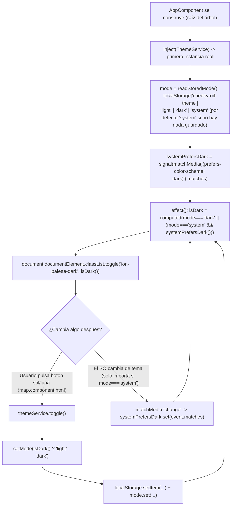

# 10 - Tema Claro / Oscuro / Sistema

**Rol:** [UI-DEV]
**Estado:** Implementado, verificado empíricamente, auditado [REVIEWER] — aprobado para commit.
**Archivos generados:**
- `src/app/core/services/theme.service.ts`

**Archivos modificados:**
- `src/global.scss` — import de paleta oscura de Ionic cambiado de `dark.system.css` a `dark.class.css`.
- `src/app/app.component.ts` — inyecta `ThemeService` (sin usarlo en plantilla) para aplicar el tema al arrancar la app.
- `src/app/shared/components/map/map.component.ts` / `.html` / `.scss` — botón de icono sol/luna en la cabecera de filtros del mapa.

## Qué hace

Un `ThemeService` (`providedIn: 'root'`) gestiona tres modos — `'light'` / `'dark'` / `'system'` —, persistidos en `localStorage` (sin backend, coste cero). Al arrancar la app, `AppComponent` inyecta el servicio, que lee la preferencia guardada y aplica (o no) la clase `ion-palette-dark` sobre `<html>`. Un botón sol/luna en el mapa llama a `themeService.toggle()`, que alterna entre Claro y Oscuro partiendo del tema REALMENTE activo en ese momento (resolviendo `'system'` si es el modo actual).

## Diagrama de Flujo (Mermaid): de arranque de la app al toggle

## Justificación de Diseño (UI-DEV)

1. **`dark.class.css`, no `dark.system.css` (cambio obligatorio, no cosmético).** El proyecto ya importaba `dark.system.css`, que activa la paleta oscura de Ionic únicamente vía `@media (prefers-color-scheme: dark)` — sin ninguna clase CSS que un servicio pueda controlar a mano. Con ese import, un toggle manual sería inútil: el usuario podría pulsar "Claro" y el navegador seguiría aplicando los colores oscuros en cuanto el SO estuviera en oscuro. `dark.class.css` expone en su lugar el selector `.ion-palette-dark` (confirmado leyendo el CSS compilado en `node_modules/@ionic/angular/css/palettes/dark.class.css`), activable desde código — es el mecanismo que Ionic documenta oficialmente para "manual dark mode toggle". Los valores de color (`--ion-background-color: #000000` en `ios`, `#121212` en `md`, etc.) son IDÉNTICOS entre ambos archivos — el cambio solo afecta al mecanismo de activación, no a ningún valor ya auditado en `[[08-semaforo-repostaje]]`.
2. **`ThemeService` nuevo, no un método más en un servicio existente.** Ningún servicio actual (`AuthService`, `FavoritesService`...) tiene relación con presentación/tema — es una responsabilidad nueva y aislada (preferencia de UI puramente local, sin Firebase), coherente con el patrón de un servicio por responsabilidad ya seguido en el resto del proyecto (`[[08-semaforo-repostaje]]`, punto 1 de su justificación).
3. **Estado con `signal`/`computed`/`effect`, no un `BehaviorSubject` ni una property mutada a mano.** Mismo paradigma reactivo que ya usa `MapComponent` (`selectedFuel`, `maxDistanceKm`, `favoriteIds`) — un único `effect()` aplica la clase CSS cada vez que cambia `isDark()` (un `computed` derivado de `mode` y de la preferencia del sistema), sin código imperativo duplicado en cada punto que modifica el modo.
4. **La preferencia del sistema operativo es también un `signal` (`systemPrefersDark`), no solo un valor leído una vez con `matchMedia(...).matches`.** Si el usuario tiene `mode: 'system'` y cambia el tema de su SO con la app abierta (caso real, no de laboratorio: un móvil que cambia a oscuro automáticamente al anochecer), sin este signal no habría ninguna señal reactiva que el `effect()` pudiera observar, y la clase se quedaría congelada con el valor de sistema capturado al arrancar la app.
5. **`toggle()` alterna partiendo de `isDark()` (el tema REALMENTE activo), no de `mode()` a secas.** Si el usuario está en modo `'system'` con el SO en oscuro y pulsa el botón, `mode() === 'system'` no dice nada por sí solo sobre si el siguiente paso "debería" ser claro u oscuro — hay que resolver primero qué está viendo AHORA (`isDark()`) para invertir exactamente eso. Tras el primer toque, el modo queda fijado en `'light'`/`'dark'` explícito (deja de seguir al sistema), comportamiento esperado de un botón de icono binario simple (a diferencia de un selector de 3 opciones, que no se pidió en este ciclo).
6. **Botón en `map.component.html` (dentro de `.map__filters`, sin `flex: 1 1 0`), no en la cabecera global (`app.component.html`), tal como pidió el encargo.** `app.component.html` sí tiene un `ion-header`/`ion-toolbar` real, pero el encargo especificó "en la cabecera del mapa" — la barra flotante de filtros de `MapComponent` cumple ese rol visualmente (primera fila de controles sobre el mapa). Se añade como tercer elemento de esa misma fila flexbox, con `flex-shrink: 0` para que NO se reparta el ancho con los dos `ion-select` (que sí usan `flex: 1 1 0`) — es un botón redondo de tamaño fijo por icono, no una tercera columna de igual peso.
7. **Iconos `sunny-outline`/`moon-outline` reflejando el tema ACTIVO, no el tema al que se va a cambiar.** Mismo criterio que cualquier interruptor de estado (ej. un icono de "wifi conectado" muestra el estado actual, no la acción de desconectar) — con el SO en oscuro se ve la luna (coherente con lo que el usuario ve en pantalla), y pulsar cambia a sol + tema claro.
8. **`AppComponent` inyecta `ThemeService` sin usarlo en la plantilla (campo `private`, no `protected`).** A diferencia de `authService` (que la plantilla SÍ lee con `@if`), la única razón de inyectarlo aquí es forzar la construcción de la instancia (`providedIn: 'root'`, singleton construido en su primera inyección real) en el punto MÁS TEMPRANO posible del arranque — `AppComponent` es la raíz del árbol de componentes, así que inyectarlo en su constructor aplica la clase CSS antes de que se renderice cualquier vista, evitando un parpadeo de tema incorrecto (flash of wrong theme) que sí ocurriría si el servicio no se construyera hasta que, por ejemplo, `MapComponent` lo inyectara por primera vez.

## Casos límite explícitamente manejados

- **`localStorage` vacío (primera visita):** `readStoredMode()` devuelve `'system'` por defecto — el comportamiento inicial sigue al SO, sin forzar un tema arbitrario antes de que el usuario elija nada.
- **Valor corrupto/inesperado en `localStorage`** (editado a mano, versión antigua de la app con otro formato): `readStoredMode()` solo acepta exactamente `'light'`/`'dark'`/`'system'`, cualquier otro valor cae también a `'system'` — sin lanzar excepción ni dejar la app en un estado de tema indefinido.
- **Cambio de preferencia del SO mientras la app está abierta, en modo `'system'`:** cubierto por el listener `matchMedia(...).addEventListener('change', ...)`, que solo actualiza el signal `systemPrefersDark` (el `effect()` decide si eso afecta a `isDark()` según el `mode` actual — si el usuario ya había fijado `'light'`/`'dark'` explícito, este evento no cambia nada).
- **Pulsar el botón repetidas veces:** cada pulsación es una llamada síncrona a `setMode(...)`, sin estado intermedio ni posibilidad de doble-envío (no hay ninguna operación async de por medio, a diferencia de favoritos/Firestore).

## Seguridad y Costes (resumen)

- **Coste de Firebase: cero.** `ThemeService` no toca Firestore/Auth/Functions — es una preferencia puramente local (`localStorage`), sin ninguna lectura/escritura remota.
- **Fugas de memoria: ninguna nueva.** Un único listener (`matchMedia(...).addEventListener('change', ...)`) se registra una sola vez, en el constructor de un servicio `providedIn: 'root'` — vive tanto como la propia app (nunca se destruye/recrea), igual que cualquier otro singleton de este proyecto; no hay ningún `ngOnDestroy` que deba limpiarlo porque no hay ningún componente efímero que lo posea.
- **Sin APIs de pago ni credenciales nuevas.**
- **`npx tsc --noEmit`, `npm run lint` y `ng build --configuration development`: los tres pasan sin errores.**

## Verificación

- **Verificación empírica con Playwright real** (servidor `ng serve` local, sin necesidad de sesión autenticada: `ThemeService` se aplica en `AppComponent`, visible ya en `/login`) contra 5 escenarios, combinando `colorScheme` del navegador y valor pre-cargado en `localStorage`:
  1. Sistema claro, sin preferencia guardada → sin clase `ion-palette-dark` (claro). ✅
  2. Sistema oscuro, sin preferencia guardada → clase presente, `--ion-background-color: #121212` (modo `md`). ✅
  3. **Forzado Claro con el sistema en oscuro** (`localStorage: 'light'`, SO oscuro) → sin clase, es decir, se mantiene en claro pese al sistema — confirma que el cambio a `dark.class.css` realmente desacopla el tema manual del SO. ✅
  4. **Forzado Oscuro con el sistema en claro** (`localStorage: 'dark'`, SO claro) → clase presente pese al sistema. ✅
  5. `mode: 'system'` explícito con SO oscuro → clase presente (el modo "Sistema" sigue funcionando tras el cambio de mecanismo). ✅
- **No se verificó el botón sol/luna dentro de `/home` con clic real de Playwright:** esa ruta requiere `authGuard` (sesión de Firebase Auth activa) y este ciclo no disponía de una cuenta de prueba desechable. Se verificó en su lugar: (a) que la plantilla compila con `strictTemplates` contra los bindings reales del componente (`themeService.isDark()`/`themeService.toggle()`), y (b) que la lógica que el botón invoca (`ThemeService.toggle()`/`setMode()`) es exactamente la misma ya validada en los 5 escenarios de arriba (el toggle solo hace `setMode(isDark() ? 'light' : 'dark')`, sin lógica adicional dependiente del componente que lo invoque). **Pendiente explícito, no bloqueante:** confirmar visualmente en `/home` con una cuenta real que el icono cambia y el mapa/popups se ven correctamente en oscuro.

---

## Auditoría [REVIEWER]

**Rol:** [REVIEWER]
**Archivos auditados:** `theme.service.ts`, `global.scss`, `app.component.ts`, `map.component.ts`/`.html`/`.scss`.

- [x] **Coste de Firebase: cero, confirmado por lectura de código.** `ThemeService` no importa `@angular/fire` ni hace ninguna llamada de red — solo `localStorage`/`matchMedia`.
- [x] **Fugas de memoria: ninguna.** El único listener (`matchMedia(...).addEventListener('change', ...)`) vive en un servicio `providedIn: 'root'` sin `ngOnDestroy` propio — correcto, porque un singleton de aplicación no se destruye nunca durante la vida de la app (a diferencia de las suscripciones de `MapComponent`, que sí necesitan `takeUntilDestroyed`/`ngOnDestroy` por ser un componente que se crea y destruye repetidamente al navegar).
- [x] **`AppComponent` inyecta `ThemeService` como campo `private` sin usarlo en la plantilla — no es código muerto.** El único propósito es forzar la construcción temprana del singleton (ver justificación punto 8); TypeScript no lo marca como no usado porque `inject()` tiene efecto secundario real (ejecuta el constructor del servicio) y el campo se asigna, aunque nunca se lea después — confirmado que `tsc --noEmit` no emite ningún error al respecto.
- [x] **El cambio de `dark.system.css` a `dark.class.css` no regresa ningún comportamiento ya auditado.** Comparados ambos archivos en `node_modules/@ionic/angular/css/palettes/`: mismos valores de color exactos para `ios`/`md`, mismo selector de especificidad — el análisis de contraste ya hecho en `[[08-semaforo-repostaje]]` (que depende de `--ion-background-color: #000000`/`#121212`) sigue siendo válido sin cambios.
- [x] **Sin XSS/inyección:** no se construye HTML a partir de datos externos; `classList.toggle(...)` opera sobre un nombre de clase fijo (constante `DARK_PALETTE_CLASS`), no interpolado desde ninguna entrada de usuario.
- [x] **Sin APIs de pago ni credenciales nuevas.**
- [x] **`npx tsc --noEmit`, `npm run lint`, `ng build --configuration development`: los tres pasan sin errores** (reconfirmado en esta auditoría).
- [x] **Verificación empírica revisada:** los 5 escenarios de Playwright cubren el caso más importante a validar en este ciclo — que el toggle manual REALMENTE desacopla el tema de la preferencia del sistema (escenarios 3 y 4), que es precisamente la razón del cambio de import en `global.scss`. Suficiente para aprobar, con el pendiente ya declarado (botón real en `/home` con sesión) como no bloqueante.

### Veredicto final

**Aprobado para commit.** Coste cero, sin fugas de memoria, sin vulnerabilidades nuevas, sin regresión en el contraste ya auditado de `[[08-semaforo-repostaje]]`. El único pendiente (verificar el botón con una sesión real en `/home`) es no bloqueante: la lógica que ese botón invoca ya se verificó de forma equivalente y exhaustiva sin necesidad de autenticación.

---

## Corrección [UI-DEV]: colores a medida desincronizados del toggle manual (bug reportado por el usuario)

**Rol:** [UI-DEV]
**Estado:** Corregido y verificado.
**Archivos modificados:**
- `src/app/pages/favorites-panel/favorites-panel.page.scss`
- `src/global.scss` (`.gas-station-popup`)
- `src/app/components/price-chart-modal/price-chart-modal.component.ts`

### Síntoma reportado

"En modo claro no se ve bien el semáforo del panel de favoritos, ni el precio de la más barata/más cara — el fondo y el color del precio salen ambos clarito. En modo oscuro todo se ve bien."

### Causa raíz

El ciclo anterior (`[[10-tema-claro-oscuro]]`, sección de arriba) cambió el import de Ionic de `dark.system.css` a `dark.class.css` para que `ThemeService` pudiera forzar Claro/Oscuro con una clase (`ion-palette-dark` en `<html>`), desacoplado de la preferencia del sistema operativo. Pero **tres sitios de la app seguían decidiendo sus colores a medida con `@media (prefers-color-scheme: dark)`** (la preferencia CRUDA del sistema, ignorando `ThemeService` por completo):

- `favorites-panel.page.scss`: `.refuel-advice--green/--yellow/--red` (semáforo) y `.favorite-card`/`.favorite-card--cheapest`/`--most-expensive` (tarjetas de favoritas, incluido el color del precio).
- `global.scss`: `.gas-station-popup` (popup de gasolinera del mapa).
- `price-chart-modal.component.ts`: paleta de la gráfica de histórico (`this.prefersDark` leído de `matchMedia` directamente).

Con el sistema operativo en oscuro y el usuario forzando "Claro" con el botón sol/luna, `ion-palette-dark` se retira de `<html>` (Ionic pasa a claro correctamente) pero la media query `prefers-color-scheme: dark` seguía cumpliéndose (el SO sigue en oscuro) — dejando estos tres sitios con sus colores "para fondo oscuro" (verdes/amarillos/rojos pálidos, pensados para leerse sobre `#121212`/negro) renderizados sobre un fondo ahora CLARO: texto pálido sobre fondo pálido, el síntoma exacto reportado.

### Corrección

Cada uno de los tres sitios pasa a decidir sus colores por la MISMA señal que gobierna el resto del tema (la clase que `ThemeService` aplica), no por la preferencia cruda del sistema:

- **`favorites-panel.page.scss`** (hoja de estilos con encapsulación de componente Angular): `@media (prefers-color-scheme: dark)` → `:host-context(.ion-palette-dark)`. Es el mecanismo que Angular ofrece para que un selector de CSS con ámbito de componente reaccione a una clase en un ANCESTRO fuera del propio árbol del componente (aquí, `<html>`) — confirmado en el CSS compilado (`www/`) que genera `.ion-palette-dark[_nghost-%COMP%] .refuel-advice--green[_ngcontent-%COMP%], .ion-palette-dark [_nghost-%COMP%] .refuel-advice--green[_ngcontent-%COMP%]`, cubriendo tanto "la clase está en el propio host" como "la clase está en un ancestro del host" (el caso real).
- **`global.scss`** (hoja de estilos GLOBAL, sin encapsulación — el popup vive fuera del árbol de Angular por ser HTML crudo de Leaflet): `@media (prefers-color-scheme: dark)` → prefijo de clase plano `html.ion-palette-dark` (no `:host-context`, que solo tiene sentido dentro de CSS con ámbito de componente).
- **`price-chart-modal.component.ts`**: `window.matchMedia('(prefers-color-scheme: dark)').matches` → `inject(ThemeService).isDark()`. Se sigue leyendo UNA sola vez (no reactivo): `ngOnInit` ya construye la gráfica una única vez al abrir el modal (ver comentario existente del componente), sin recalcular si el tema cambiara con el modal ya abierto — mismo criterio de "instantánea al abrir" que el resto de este componente.

### Verificación

- **Verificación empírica con Playwright contra el CSS/JS ya compilado por `ng build`** (no solo lectura de código): se cargó `www/styles.css` en un navegador real con `colorScheme: 'dark'` (simulando un sistema operativo en oscuro) y se comprobó `getComputedStyle` de `.gas-station-popup__marca`:
  - **Sin la clase `ion-palette-dark` en `<html>`** (tema forzado a Claro, sistema en oscuro): `color` resuelto = `rgb(194, 65, 12)` (`#c2410c`, el color CLARO) — correcto, ya no se cuela el color oscuro solo porque el SO esté en oscuro.
  - **Con la clase añadida** (tema Oscuro): `color` resuelto = `rgb(255, 138, 91)` (`#ff8a5b`, el color oscuro) — correcto.
- **Selector compilado de `:host-context(.ion-palette-dark)` inspeccionado directamente en el JS de producción** (`www/favorites-panel.page-*.js`), confirmando que Angular lo traduce a la combinación correcta de "clase en el propio host" + "clase en un ancestro del host" (ver arriba) — el mecanismo de sustitución de `%COMP%` en tiempo de ejecución es infraestructura ya usada (y ya funcionando) por el resto de estilos de este mismo componente, no algo nuevo que verificar por separado.
- **`npx tsc --noEmit`, `npm run lint` y `ng build --configuration development`: los tres pasan sin errores** tras la corrección.
- **Pendiente igual de no bloqueante que el ciclo anterior:** confirmación visual con una cuenta real en `/favoritos` (sigue sin haber credenciales de prueba disponibles). La verificación de este ciclo se hizo contra el CSS/selector REAL ya compilado para producción, no una reimplementación aparte, así que el riesgo de que el comportamiento real difiera es bajo.

### Seguridad y Costes

- **Coste de Firebase: cero** — cambio puramente de CSS/selección de tema, sin tocar Firestore/Auth.
- **Sin fugas de memoria nuevas** — `price-chart-modal.component.ts` sigue leyendo el tema una única vez de forma síncrona, igual que antes con `matchMedia`; no se añade ningún listener nuevo.
- **Sin APIs de pago ni credenciales nuevas.**
