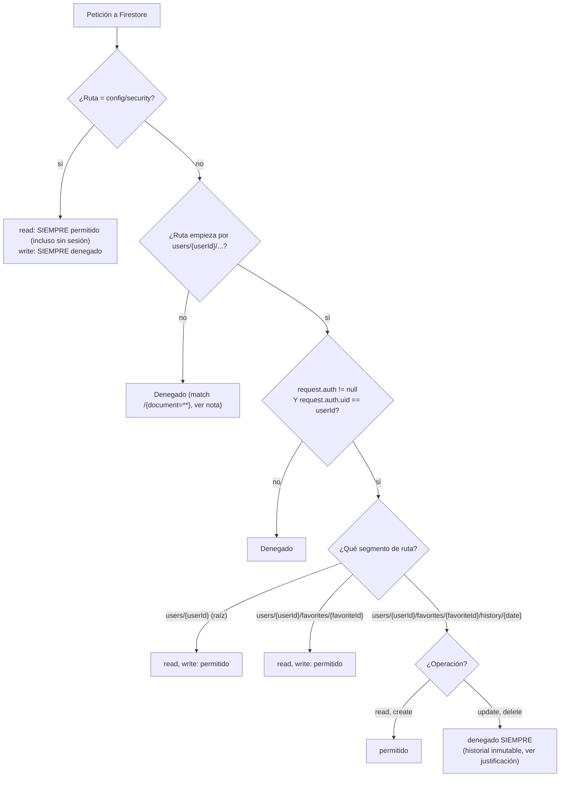

# 11 - Firestore Security Rules (fortificación pre-producción, RNF-07)

**Rol:** [ARQUITECTO]
**Estado:** Escrito, revisado manualmente, **pendiente de despliegue real** (ver "Verificación" — no se pudo validar contra el emulador ni desplegar desde este entorno).
**Archivos generados:**
- `firestore.rules`
- `firebase.json`

## Qué hace

Hasta este ciclo, el proyecto **no tenía ningún `firestore.rules` en el repositorio** — la base de datos dependía enteramente de lo que hubiera configurado a mano en la consola de Firebase (previsiblemente el modo de prueba por defecto, con una regla temporal `allow read, write: if true;` caducada por fecha). Sin control de versiones, sin revisión de código, y sin ninguna garantía real de aislamiento entre usuarios. Este ciclo añade un `firestore.rules` estricto, basado en propiedad por `uid`, y actualiza `firebase.json` para que apunte a él.

## Diagrama Entidad-Relación (Mermaid): estructura protegida

```mermaid
erDiagram
    CONFIG_SECURITY {
        string familyCode "Código Familiar, RNF-08"
    }

    USER {
        string uid PK "= request.auth.uid"
        string email "Firebase Auth, no en Firestore"
    }

    FAVORITE {
        string id PK "= GasStation.id (IDEESS)"
        string marca
        string direccion
        string municipio
        number lat
        number lng
        number guardadoEn
    }

    PRICE_HISTORY_DOC {
        string date PK "YYYY-MM-DD, id del documento"
        map prices "Partial~Record~FuelType, number~~"
    }

    USER ||--o{ FAVORITE : "users/{uid}/favorites/{favoriteId}"
    FAVORITE ||--o{ PRICE_HISTORY_DOC : "favorites/{favoriteId}/history/{date}"
```

*(`CONFIG_SECURITY` no tiene relación con `USER`: es un documento singleton fuera del árbol `users/`, leído sin sesión durante el registro.)*

## Diagrama de Flujo (Mermaid): evaluación de una petición



## Justificación de Diseño (ARQUITECTO)

1. **Propiedad verificada SOLO por la ruta (`userId` del path == `request.auth.uid`), nunca por un campo dentro del documento.** Ninguno de los documentos (`Favorite`, `PriceHistoryDoc`) guarda un campo `ownerId`/`uid` propio — no hace falta, porque ya viven exclusivamente bajo `users/{uid}/...`. Este diseño tiene una ventaja concreta sobre "verificar un campo `resource.data.uid`": las reglas basadas en ruta cubren automáticamente tanto `get` (un documento) como `list`/consultas de agregación (`getCountFromServer`, usado por el límite de favoritos) SIN condición adicional — una regla basada en `resource.data.uid` NO protegería un `list` sin que la propia consulta filtrara explícitamente por ese campo (algo que el cliente podría "olvidar" hacer). Verificar la ruta hace la protección independiente de qué consulta decida escribir el cliente.
2. **`config/security` con lectura pública explícita, no un descuido.** `AuthService.register()` lee este documento ANTES de crear la cuenta (`request.auth` es `null` en ese momento) — sin esta regla, con el resto del ruleset en denegado-por-defecto, el registro de nuevos usuarios se rompería en cuanto se desplegaran estas reglas. Es el ÚNICO documento con lectura pública en todo el ruleset, y su escritura queda denegada para cualquier cliente (se gestiona a mano desde la consola/Admin SDK) — mismo criterio ya documentado en `[[05b-registro-seguro]]` sobre que el código familiar es "público por diseño, no el límite real de acceso".
3. **`users/{userId}` (documento raíz) protegido igual que el resto, aunque hoy no lo use ningún código real.** `AppUser`/`gasolinerasGuardadasIds` (`user.model.ts`) no tiene ningún `setDoc`/`getDoc` real en el proyecto (confirmado por búsqueda en todo `src/`) — parece un diseño previo sustituido por la subcolección `favorites` actual. Se protege de todas formas con la misma regla de propiedad: coste cero (no añade lecturas/escrituras, solo una regla más), y evita dejar un hueco abierto si un ciclo futuro llega a escribir ahí sin recordar añadir esta regla primero.
4. **`history/{date}`: `create`+`read` permitidos, `update`/`delete` denegados SIEMPRE — más estricto que `favorites`, a propósito.** El propio `FavoritesService.recordTodayHistory()` ya documenta y depende de que un día una vez registrado nunca se reescribe (comprueba `getDoc` antes de cada `setDoc`); esta regla convierte esa suposición del CÓDIGO en una garantía real de la BASE DE DATOS — ni un bug futuro en el cliente ni alguien con acceso a su propia cuenta modificando peticiones a mano podría corromper o borrar historial ya escrito. `favorites/{favoriteId}` sí necesita `update`/`delete` reales (`removeFavorite` usa `deleteDoc`; guardar de nuevo la misma gasolinera hace `setDoc` idempotente sobre el mismo id), así que ahí se deja `read, write` completo.
5. **`match /{document=**} { allow read, write: if false; }` final, aunque Firestore ya deniega por defecto lo no cubierto.** No añade ninguna restricción nueva (Firestore concede acceso si CUALQUIER bloque que coincide lo permite, no "el más específico gana") — se incluye como documentación explícita del límite del ruleset, útil para que un futuro [REVIEWER] vea a simple vista dónde termina la superficie protegida, sin tener que inferir el comportamiento por defecto.
6. **Límite de 10 favoritos (`MAX_GASOLINERAS_GUARDADAS`) NO impuesto en estas reglas — pendiente explícito, no bloqueante.** Firestore Rules no puede contar los documentos de una colección sin leerlos todos (no hay un `count()` nativo sobre una colección arbitraria dentro de una regla) — imponerlo de verdad requeriría un contador denormalizado mantenido por una Cloud Function en cada alta/baja, un cambio de arquitectura mayor fuera del alcance de esta fortificación puntual (que se pidió como "reglas de acceso por propiedad", no como validación de negocio). Se documenta aquí explícitamente para que quede constancia — el propio `FavoritesService.addFavorite()` ya avisaba de esto en su comentario ("comprobación de UX en el cliente, no el límite real").
7. **`firebase.json` mínimo, solo con la clave `firestore`.** El proyecto no usa Firebase Hosting ni Cloud Functions todavía (sin carpeta `functions/`, sin dependencia de `firebase-tools` en `package.json`) — añadir esas claves habría sido configuración especulativa para servicios que esta app no usa hoy. Tampoco se referencia un `firestore.indexes.json`: las únicas consultas del proyecto (`getHistory`, con `where(documentId(), '>=', cutoff)` + `orderBy(documentId())`, ambos sobre el MISMO campo) son de campo único, que Firestore indexa automáticamente sin necesitar un índice compuesto declarado.

## Seguridad y Costes

- **Coste de Firebase: cero.** Las reglas de seguridad no consumen lecturas/escrituras por sí mismas — se evalúan gratis en cada petición. Ninguna regla añade una llamada `get()`/`exists()` adicional (que sí tendría coste): la condición de todas se resuelve solo con `request.auth`/la propia ruta.
- **Reducción de riesgo, no aumento:** este cambio es estrictamente una restricción de lo que ya existía (probablemente sin reglas explícitas o con la regla temporal de prueba) — no puede romper ninguna operación legítima ya usada por la app, siempre que el usuario esté autenticado y opere sobre sus propios datos (ver Verificación de rutas cubiertas, abajo).
- **Sin APIs de pago ni credenciales nuevas.**

## Verificación

- **Revisión manual exhaustiva de sintaxis** (`rules_version = '2'`, anidamiento de `match`, combinaciones `allow read, write`/`allow read, create` + `allow update, delete: if false` en el mismo bloque) — sintaxis estándar de Firestore Rules v2, sin construcciones no soportadas.
- **Trazado de TODAS las rutas de Firestore que el código realmente usa hoy** (búsqueda exhaustiva en `src/`), confirmando que cada una queda cubierta por una regla que permite la operación real que el código ejecuta:
  - `config/security` → `getDoc` sin sesión (`AuthService.register`) → cubierto (`allow read: if true`).
  - `users/{uid}/favorites` → `setDoc`/`deleteDoc`/`collectionData` (list)/`getCountFromServer` (`FavoritesService`) → cubierto.
  - `users/{uid}/favorites/{ideess}/history` → `getDoc`+`setDoc` (`recordTodayHistory`, solo `create` real: siempre comprueba inexistencia antes) / `query`+`getDocs` (`getHistory`) → cubierto (`read, create`).
  - **Ninguna ruta usada por el código actual requiere `update`/`delete` sobre `history`** — confirmado leyendo `FavoritesService` completo: no existe ningún `updateDoc`/`deleteDoc` sobre esa subcolección en todo el proyecto. Denegarlos no rompe ninguna funcionalidad existente.
- **⚠️ NO se pudo validar contra el emulador de Firestore** (que habría confirmado la sintaxis ejecutándola de verdad, no solo por lectura): `firebase-tools` v15 exige JDK 21+ para el emulador, y este entorno solo tiene JDK 17 instalado. Se intentó `firebase emulators:exec --only firestore` y falló explícitamente por esa razón, sin llegar a arrancar.
- **⚠️ NO se pudo desplegar ni validar contra el proyecto real `cheeky-oil`:** la sesión de `firebase-tools` de este entorno está autenticada como `carlos.garcia@evenbytes.com`, con acceso confirmado (`firebase projects:list`) SOLO a `autenticacion-pruebas` e `inicio-sesion-pruebas` — ningún proyecto llamado `cheeky-oil`. No hay forma de desplegar ni de pedirle a Firebase que valide el ruleset (`firebase deploy --only firestore:rules` valida sintaxis en el servidor antes de activar) desde esta sesión.
- **Pendiente explícito y BLOQUEANTE para producción real:** desplegar estas reglas al proyecto `cheeky-oil` real (`firebase deploy --only firestore:rules`, desde una sesión con acceso a ese proyecto) y, idealmente, probar en la app real tras el despliegue que: (a) un usuario autenticado sigue viendo sus propios favoritos/historial con normalidad, y (b) el registro (`config/security`) sigue funcionando. Sin este paso, el archivo existe en el repositorio pero la base de datos en producción sigue sin protección real.

---

## Auditoría [REVIEWER]

**Rol:** [REVIEWER]
**Archivos auditados:** `firestore.rules`, `firebase.json`.

- [x] **Ninguna regla temporal/basada en fecha ni `allow ... if true` genérico sobre datos de usuario** — el único `if true` es `config/security` en LECTURA, justificado (necesario para el registro sin sesión) y con su escritura denegada.
- [x] **Aislamiento por `uid` confirmado en los tres niveles pedidos** (`users/{userId}`, `favorites/{favoriteId}`, `history/{date}`) — los tres exigen `request.auth != null && request.auth.uid == userId`.
- [x] **`history` con `update`/`delete` denegados no rompe ninguna funcionalidad real** — confirmado por búsqueda exhaustiva de `updateDoc`/`deleteDoc` sobre esa ruta en todo `src/` (ninguna).
- [x] **Sin lecturas adicionales de coste**: ninguna condición usa `get()`/`exists()` (que sí consumirían una lectura extra por evaluación) — todas resuelven contra `request.auth`/la ruta, gratis.
- [x] **`firebase.json` no expone superficie no usada** (sin `hosting`/`functions` especulativos).
- ⚠️ **Hallazgo no bloqueante, ya documentado por el propio [ARQUITECTO] arriba:** el límite de 10 favoritos por usuario no se aplica a nivel de reglas — solo en el cliente. No es una regresión de este ciclo (ya era así antes), pero sigue siendo una superficie donde un usuario con conocimientos técnicos podría guardar más de 10 favoritos saltándose la UI. Aceptable para una app personal/familiar de bajo riesgo (`CLAUDE.md`), pendiente para un ciclo futuro si el coste real (lecturas de Firestore por favoritos excedentes) llegara a preocupar.
- 🛑 **BLOQUEANTE, distinto de los ciclos anteriores de este proyecto:** este cambio NO se ha podido verificar en ejecución real (ni emulador, ni despliegue) por las dos limitaciones de entorno ya descritas (JDK < 21, sesión de `firebase-tools` sin acceso al proyecto `cheeky-oil`). A diferencia de un bug de UI (donde "aprobado con verificación pendiente" es razonable), unas Security Rules mal desplegadas pueden dejar la base de datos MÁS insegura de lo esperado (ej. un error de sintaxis no detectado) o romper la app en producción (ej. el registro dejando de funcionar) — se recomienda EXPLÍCITAMENTE no considerar este ciclo "cerrado" hasta que alguien con acceso al proyecto real ejecute `firebase deploy --only firestore:rules` y confirme en la app real que login/registro/favoritos/historial siguen funcionando.

### Veredicto final

**Aprobado el CONTENIDO de las reglas** (diseño correcto, cubre exactamente lo pedido más los refinamientos justificados de `history` inmutable y `config/security`). **NO aprobado para dar por "en producción"** hasta el despliegue real y su verificación en la app — ver pendientes bloqueantes arriba.
