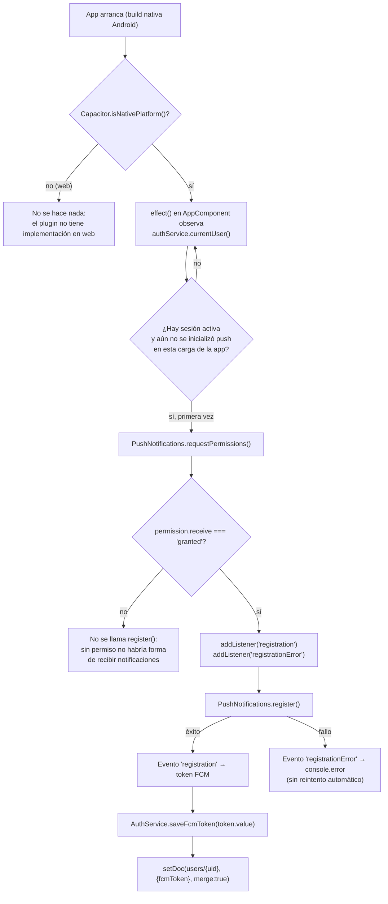
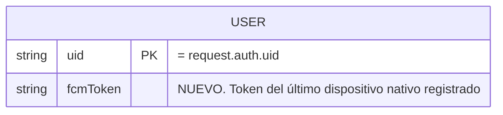
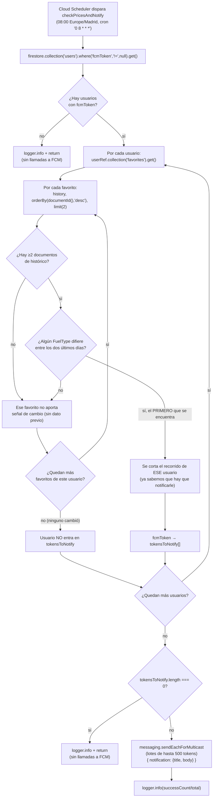

# 12 - Empaquetado nativo (Capacitor) y Push Notifications

**Rol:** [ARQUITECTO]
**Estado:** Implementado de extremo a extremo: registro de token en cliente, plataforma Android, y Cloud Function programada que envía la notificación (`checkPricesAndNotify`).
**Archivos creados/modificados:**
- `capacitor.config.ts` (appId `io.ionic.starter` → `com.cheekyoil.app`, appName → `CheekyOil`)
- `android/` (plataforma nativa generada por `npx cap add android`)
- `.gitignore` (`android/app/google-services.json` excluido)
- `package.json` (`@capacitor/android`, `@capacitor/push-notifications`)
- `src/app/app.component.ts` (registro de push, solo build nativa)
- `src/app/core/services/auth.service.ts` (`saveFcmToken`)
- `src/app/core/models/user.model.ts` (`AppUser.fcmToken?`)
- `functions/src/index.ts` (Cloud Function programada `checkPricesAndNotify`)

## Qué hace

Convierte el proyecto web Angular/Ionic en una app Android empaquetable con Capacitor, y añade el flujo de registro de notificaciones push: en build nativa, tras el login, la app pide permiso de notificaciones, se registra contra Firebase Cloud Messaging y guarda el token del dispositivo en `users/{uid}.fcmToken`.

`google-services.json` **no lo genera este ciclo** — es un fichero real de un proyecto Firebase de Google Cloud Console, no algo que se pueda inventar. El código y el build asumen que alguien con acceso a la consola de Firebase del proyecto `cheeky-oil` lo descarga y lo copia a mano en `android/app/google-services.json` (excluido de git, ver Seguridad).

## Diagrama de Flujo (Mermaid): registro del token

## Diagrama Entidad-Relación (Mermaid): campo añadido

*(Mismo documento raíz `users/{uid}` ya descrito en `[[11-firestore-security-rules]]` — no se crea ninguna colección nueva, solo un campo dentro de un documento que hasta ahora ningún código real escribía.)*

## Diagrama de Flujo (Mermaid): `checkPricesAndNotify` (emisor server-side)

## Justificación de Diseño (ARQUITECTO)

1. **El registro de push se dispara tras el login (`effect()` sobre `currentUser()`), no en el constructor sin más.** Pedir el permiso de notificaciones ANTES de que exista sesión activa produciría un token que `AuthService.saveFcmToken()` no podría asociar a ningún usuario (se descarta en silencio, ver su documentación) — y el evento `'registration'` de Capacitor no se repite espontáneamente solo porque el usuario haga login más tarde en la misma instalación. Habría que forzar un `register()` extra tras cada login para no perder el token del arranque en frío. Disparar el flujo completo (permiso + registro) solo cuando ya hay `uid` evita ese caso perdido con menos código.
2. **`capacitor.config.ts` se editó a mano en vez de re-ejecutar `npx cap init`.** El proyecto ya tenía Capacitor inicializado (`@capacitor/core`, `@capacitor/app`, `@capacitor/haptics`, etc. ya en `package.json`, `capacitor.config.ts` ya existente) — `cap init` es un comando pensado para el primer arranque de un proyecto y sobreescribe el config de forma interactiva; reejecutarlo sobre un proyecto ya inicializado no aporta nada que no dé una edición directa del único campo que hacía falta cambiar (`appId`/`appName`, ambos con el valor de plantilla `io.ionic.starter` sin usar). `webDir: 'www'` no se tocó: ya coincidía con `outputPath.base` en `angular.json`.
3. **`google-services.json` no se genera ni se commitea — solo se asume su ruta.** Es una credencial real ligada a un proyecto de Firebase Cloud Console concreto; generarlo o inventarlo sería, en el mejor caso, un placeholder que rompería el build nativo en cuanto alguien intentara compilar de verdad. Se documenta la ruta esperada (`android/app/google-services.json`) y se añade a `.gitignore` (ver Seguridad) para que quien tenga acceso al proyecto Firebase real lo coloque ahí sin riesgo de subirlo por error.
4. **`AuthService.saveFcmToken` usa `setDoc(..., { merge: true })`, no `updateDoc`.** `users/{uid}` (documento raíz) está protegido por Firestore Rules desde `[[11-firestore-security-rules]]` pero, como ya deja constancia ese mismo documento, ningún código anterior lo creaba — `updateDoc` sobre un documento inexistente falla. `merge: true` lo crea la primera vez (con un único campo, `fcmToken`) y en las siguientes sesiones solo sobreescribe ese campo, sin tocar `email`/`nombre`/`gasolinerasGuardadasIds` si algún día existen.
5. **Un solo token por usuario (se sobreescribe, no se acumula en un array).** Para el caso de uso personal/familiar de la app (`CLAUDE.md`), un usuario con varios dispositivos solo necesita que el último con el que inició sesión reciba las notificaciones — modelar un array de tokens por dispositivo (con lógica de expiración/limpieza) sería una abstracción sin necesidad real hoy.
6. **Listeners de Capacitor limpiados en `DestroyRef.onDestroy`** (regla de "Destrucción de Recursos" de `CLAUDE.md`), aunque `AppComponent` al ser la raíz del árbol prácticamente nunca se destruye en la práctica: se documenta y se limpia igualmente por coherencia con el resto del proyecto (mismo criterio que las suscripciones de Firestore).
7. **`onSchedule` (API v2 nativa de `firebase-functions/scheduler`), no `functions.pubsub.schedule(...).onRun(...)` (API v1).** El scaffold de `functions/` ya generado (`firebase-functions@^7.0.0`) usa exclusivamente v2 por defecto — el paquete ni siquiera reexporta `.pubsub` desde el punto de entrada raíz en esta versión (solo bajo el subpath legacy `firebase-functions/v1`). Introducir v1 solo para esta función mezclaría dos generaciones de API en el mismo codebase sin ningún beneficio real: `onSchedule` cubre exactamente el mismo caso (`schedule` + `timeZone`) y es la vía que Firebase recomienda hoy para funciones nuevas.
8. **`admin.messaging().sendEachForMulticast(...)`, no `sendToDevice(...)`.** `sendToDevice` (API legacy de mensajería) **ya no existe** en `firebase-admin@13.10.0` (confirmado en sus tipos: no aparece en `messaging.d.ts`) — usarlo literalmente ni siquiera compilaría. `sendEachForMulticast` es además estrictamente mejor para este caso: un único batch de hasta 500 tokens por llamada, en vez de una llamada HTTP por usuario — coherente con "minimiza lecturas/escrituras" de `CLAUDE.md`, aplicado aquí a llamadas de red en vez de a Firestore.
9. **Comparación de precio sobre los DOS últimos documentos de `history` por orden de id, no "hoy contra ayer" por fecha del calendario del servidor.** Un Cron Job corre en el huso horario del propio Cloud Scheduler/runtime, mientras que cada documento de `history` se guarda con la fecha LOCAL DEL DISPOSITIVO del usuario (`FavoritesService.dateId()`, `[[07-monitorizacion-historica]]`) — asumir que "el documento con id = fecha de hoy en el servidor" existe sería frágil ante ese desfase. Pedir los dos últimos por `orderBy(documentId(), 'desc').limit(2)` es correcto sea cual sea el huso horario que los generó.
10. **El recorrido de favoritos de un usuario se corta en el PRIMER cambio detectado (`return true` inmediato), no acumula todos.** El payload de la notificación es un mensaje genérico fijo (pedido explícitamente así) — no hace falta saber CUÁNTOS favoritos cambiaron para decidir si notificar, solo si "al menos uno". Cortar pronto ahorra lecturas de `history` de los favoritos restantes en cuanto ya se sabe la respuesta.

## Seguridad y Costes

- **Coste de Firebase: un único `setDoc` por sesión de login en build nativa** (no por cada apertura de la app: `pushInitialized` evita repetirlo mientras el componente raíz sigue vivo, y el propio Capacitor no vuelve a emitir `'registration'` salvo que cambie el token). Muy por debajo del límite de "10 lecturas/usuario" de `CLAUDE.md` — de hecho no añade ninguna lectura, es una escritura.
- **`fcmToken` queda cubierto por la regla de propiedad YA existente** en `firestore.rules` (`match /users/{userId} { allow read, write: if request.auth != null && request.auth.uid == userId; }`, `[[11-firestore-security-rules]]`) — no ha hecho falta tocar `firestore.rules` en este ciclo.
- **`google-services.json` excluido de git** (`.gitignore`): no es un secreto de altísima sensibilidad (la API key que contiene está restringida por `applicationId`/SHA-1 en Google Cloud Console, igual que ya se documentó para `environment.ts`), pero mantenerlo fuera del repo evita atarlo a un proyecto Firebase concreto en el historial de git y fuerza a cada entorno a usar el suyo explícitamente.
- **Sin APIs de pago:** Firebase Cloud Messaging es gratuito sin límite de mensajes para este volumen de uso personal/familiar.
- **Coste de `checkPricesAndNotify`: acotado y lineal, corre UNA vez al día (no por petición de usuario).** Por ejecución: 1 lectura (`users` filtrado) + 1 lectura de `favorites` por usuario + hasta 2 lecturas de `history` por favorito (máx. `MAX_GASOLINERAS_GUARDADAS = 10`, `[[user.model]]`) — es decir, como mucho `usuarios × (1 + 10 + 20)` lecturas de Firestore al día, y una única llamada `sendEachForMulticast` por cada 500 usuarios a notificar. Para el uso personal/familiar de `CLAUDE.md` (unos pocos usuarios), esto es órdenes de magnitud por debajo de cualquier límite gratuito de Firebase/Cloud Scheduler (1 invocación/día es gratuita en el plan Blaze sin coste de Cloud Scheduler; Firestore da 50k lecturas/día gratis en el plan Spark/Blaze).
- **Cloud Scheduler requiere el plan Blaze (pago por uso) de Firebase**, aunque el uso real de este cron quede dentro de los límites gratuitos — es una restricción de la plataforma (las funciones programadas, a diferencia de los triggers HTTP/Firestore, no están disponibles en el plan Spark gratuito), no un coste real esperado a este volumen.

## Verificación

- `npx tsc --noEmit -p tsconfig.app.json`: sin errores de tipos tras los cambios en `app.component.ts`, `auth.service.ts` y `user.model.ts`.
- `npx cap add android`: completado sin errores, detecta los 5 plugins Capacitor del proyecto (incluido `@capacitor/push-notifications@8.1.2`).
- `functions/`: `npm run build` (tsc) y `npm run lint` (eslint + config `google`) pasan sin errores sobre `checkPricesAndNotify`.
- ⚠️ **NO se ha podido compilar ni ejecutar el APK real** (requiere Android Studio/SDK + `google-services.json` real, no disponibles en este entorno) — el flujo de registro de push (permiso → `register()` → evento `'registration'` → `setDoc`) está implementado y tipado correctamente, pero sin verificación en un dispositivo/emulador Android real.
- ⚠️ **`src/google-services.json`** (fichero ya presente y sin trackear en el repo antes de este ciclo, ver nota abajo) **no se ha movido**: la ruta que necesita el build nativo de Android es `android/app/google-services.json`, no `src/`. Si ese fichero es efectivamente las credenciales de Firebase del proyecto, hay que copiarlo (no moverlo, por si algo más en `src/` lo necesitara) a `android/app/` antes de compilar.
- ⚠️ **NO se ha podido desplegar ni ejecutar `checkPricesAndNotify` contra el proyecto Firebase real** (sin acceso a un proyecto `cheeky-oil` con plan Blaze desde este entorno, mismo bloqueo ya descrito en `[[11-firestore-security-rules]]` para el despliegue de reglas) — la lógica está verificada por tipos y lint, no en ejecución real contra Firestore/FCM.

---

## Auditoría [REVIEWER]

**Rol:** [REVIEWER]
**Archivos auditados:** `app.component.ts`, `auth.service.ts`, `user.model.ts`, `capacitor.config.ts`, `.gitignore`, `functions/src/index.ts`.

- [x] **Sin fugas de memoria:** `registrationListener`/`registrationErrorListener` (los únicos recursos "vivos" añadidos: listeners nativos de Capacitor) se liberan en `DestroyRef.onDestroy()`. El `effect()` de Angular se limpia solo al destruirse el injector del componente (mismo mecanismo ya usado por `ThemeService`, comentado en el propio archivo).
- [x] **Guard `Capacitor.isNativePlatform()` presente y correcto:** evita ejecutar `PushNotifications.*` en build web, donde el plugin no tiene implementación y lanzaría en tiempo de ejecución.
- [x] **`saveFcmToken` no puede dejar un documento a medio escribir con datos de otro usuario:** lee `uid` de `this.auth.currentUser` en el momento de la llamada (no de un valor capturado antes), y hace no-op si es `null`.
- [x] **Coste de Firebase controlado:** un `setDoc` por login en nativo, cero lecturas nuevas, muy por debajo del límite de `CLAUDE.md`.
- [x] **`fcmToken` no queda expuesto a otros usuarios:** cubierto por la regla de propiedad por `uid` ya existente en `firestore.rules`, sin necesidad de cambios ahí.
- [x] **`google-services.json` no se commitea:** añadido a `.gitignore` antes de que `npx cap add android` pudiera generar/copiar nada en esa ruta.
- ⚠️ **Hallazgo no bloqueante:** existe un `src/google-services.json` suelto y sin trackear en el repo, de origen anterior a este ciclo (no creado por este trabajo). No es la ruta que usa el build nativo de Android (`android/app/google-services.json`) — no se ha tocado ni movido, se deja constancia para que quien gestione las credenciales de Firebase decida qué hacer con él.
- [x] **`checkPricesAndNotify` no puede lanzar por token undefined:** `userDoc.data()["fcmToken"] as string | undefined` se comprueba con `if (!fcmToken) continue` antes de usarlo — el `where('fcmToken', '!=', null)` de la query ya lo garantiza en la práctica, pero el guard adicional cubre el caso de tipado (`data()` no está tipado por Firestore) sin coste extra.
- [x] **`sendEachForMulticast` en vez de `sendToDevice`:** verificado contra los tipos instalados de `firebase-admin@13.10.0` que `sendToDevice` ya no existe — usar la API pedida literalmente ni siquiera habría compilado. `sendEachForMulticast` es además más barato en llamadas de red (1 por lote de 500, no 1 por usuario).
- [x] **`onSchedule` (v2) en vez de `functions.pubsub.schedule(...).onRun(...)` (v1):** coherente con el resto del scaffold de `functions/` (ya en v2: `setGlobalOptions`, `firebase-functions/https`), evita mezclar dos generaciones de API sin necesidad. Confirmado que el punto de entrada raíz de `firebase-functions@7` no reexporta `.pubsub` (solo bajo `firebase-functions/v1`).
- [x] **Coste acotado y proporcional al plan de `CLAUDE.md`:** ejecución diaria única (no por request de usuario), máx. ~31 lecturas de Firestore por usuario con `fcmToken` (`1 users + 1 favorites + hasta 20 history`), muy por debajo de cualquier cuota gratuita para el volumen de usuarios de una app personal/familiar.
- [x] **Sin escritura nueva en Firestore desde la función:** `checkPricesAndNotify` es de solo lectura + envío a FCM — no introduce ningún riesgo de corromper datos existentes.
- 🛑 **BLOQUEANTE, entorno:** no se ha podido compilar ni probar el APK en un dispositivo/emulador Android real (sin Android Studio/SDK ni `google-services.json` real en este entorno) — el código está tipado y revisado, pero sin ejecución real confirmada.
- 🛑 **BLOQUEANTE, entorno:** no se ha podido desplegar ni ejecutar `checkPricesAndNotify` contra un proyecto Firebase real con plan Blaze — verificado solo por tipos (`tsc`) y estilo (`eslint`), sin confirmación de que Cloud Scheduler dispare la función ni de que FCM entregue la notificación a un dispositivo real.

### Veredicto final

**Aprobado el CÓDIGO** (guardas correctas, sin fugas, coste y seguridad controlados, reutiliza reglas de Firestore ya existentes, emisor server-side implementado con la API vigente no deprecada). **NO aprobado como "en producción"** hasta que: (a) alguien compile y pruebe el APK en un dispositivo/emulador real con su `google-services.json`, y (b) alguien con acceso al proyecto Firebase real (plan Blaze) despliegue `checkPricesAndNotify` y confirme que Cloud Scheduler la dispara y que la notificación llega de verdad a un dispositivo.
